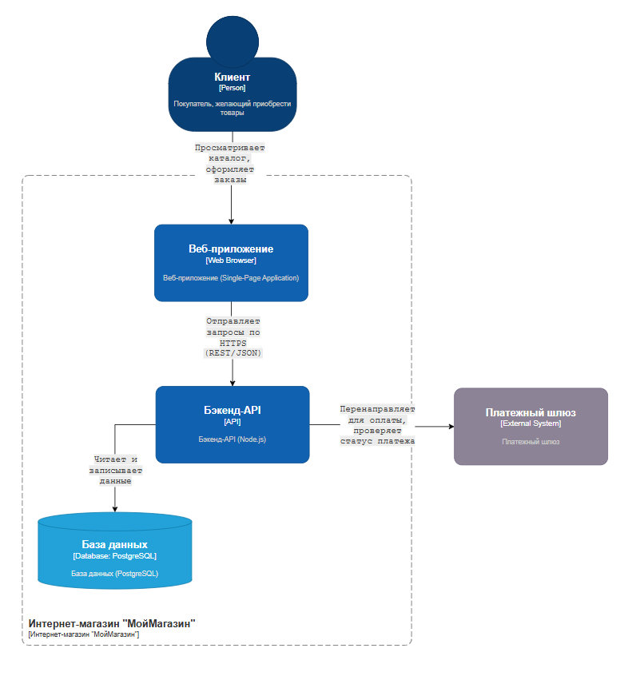

import SwaggerApiExplorer from '@site/src/components/SwaggerApiExplorer.jsx';
import DocumentationArchitecturePlay from '@site/src/components/DocumentationArchitecturePlay.jsx';

# Виды документации

<div class="article-tags">
  <span class="tag tag-required">ОБЯЗАТЕЛЬНО</span>
  <span class="tag tag-beginner">ДЛЯ НОВИЧКОВ</span>
</div>

<span class="complexity-badge">Руководителю</span>
<span class="complexity-badge">Аналитику</span>
<span class="complexity-badge">Техническому писателю</span>

---

## Виды документации

Ниже — частые виды артефактов в IT: от API и SDK до runbook и комплектов ЕСПД. Полная карта формальных документов — в [навигаторе по ГОСТ](22.md); базовые определения "документ / документация" — в [отдельной главе](1001.md).

В мире существует очень, **ОЧЕНЬ** много видов документов. Вы даже себе не представляете, насколько. Поэтому, даже если вы научитесь работать с ними всеми, кто-то придумает свой шаблон и формат, вид, поэтому не старайтесь охватить всё. Главное много работать и тренироваться, а навыки и знания разных документов придут со временем.

Давайте выделим самые частые и нужные.

Чтобы не утонуть в объеме, используй эту статью как карту:

- если нужно документировать интеграцию - смотри блоки про API и SDK;
- если нужно описать внутреннее устройство - смотри технические описания и архитектурные решения;
- если нужно регулировать повторяемые процессы - смотри регламенты и стандарты;
- если нужно обучить конечного пользователя - смотри пользовательскую документацию;
- если нужно пройти аудит или приемку - смотри проектные, тестовые и нормативные документы.

---

### API-документация

**API (Application Programming Interface)** — это правила и протоколы, по которым программы обмениваются данными. 

API-документация — это руководство пользователя для разработчиков, которое объясняет, как подключиться к API, какие запросы отправлять, что ожидать в ответ и как обрабатывать ошибки.

---

#### REST

**REST** (Representational State Transfer) — архитектурный стиль для веб-API, основанный на HTTP. Соответственно, REST API-документация касается этого стиля.

REST API используют стандартные HTTP-методы и ресурсно-ориентированную структуру URL.

Метод определяет действие, которое выполняется с ресурсом:
	- GET - получить данные;
	- POST - создать новый ресурс;
	- PUT/PATCH - обновить существующий ресурс;
	- DELETE - удалить ресурс.

Эндпоинт (Endpoint) это URL-адрес, по которому доступен API-метод. При этом указывается базовый URL, версия API и параметры пути. Как правило, в документации не обязательно указывать именно `https://ссылканасервис`, а добавляется именно то, что касается API, к примеру, `/api/users/`

Параметры запроса - это дополнительные данные, передаваемые в URL после ? и документируются они как таблица.

Тело запроса включает в себя данные, отправялемые в формате JSON (или ином).

И конечно же в API указываются примеры запросов и ответов.

<SwaggerApiExplorer />

Пример:


Метод: **POST**

Описание: создаёт нового пользователя в системе.

Эндпоинт: `/api/v1/users`

Тело запроса (JSON):

| Поле | Тип | Обязательный | Описание |
|------|-----|--------------|----------|
| name | string | Да | Имя пользователя |
| email | string | Да | Адрес электронной почты |

Пример запроса:
```http
POST /api/v1/users HTTP/1.1
Host: api.example.com
Authorization: Bearer abc123xyz
Content-Type: application/json

{
  "name": "Иван Сидоров",
  "email": "ivan@example.com"
}
```

Пример ответа:

```json
{
  "id": 123,
  "name": "Иван Сидоров",
  "email": "ivan@example.com",
  "created_at": "2025-04-05T12:00:00Z"
}
```

Для **списка** пользователей обычно используют **GET** с query-параметрами:

Метод: **GET** · Эндпоинт: `/api/v1/users`

| Параметр | Тип | Обязательный | Описание |
|----------|-----|--------------|----------|
| limit | integer | Нет | Количество записей (по умолчанию 20) |
| status | string | Нет | Фильтр: `active`, `blocked` |

Другой пример - как это выглядит на практике:


Также документируются заголовки HTTP-запроса и коды состояния. Примеры - это 200 OK, 201 Created, 400 Bad Request, 401 Unauthorized, 403 Forbidden, 404 Not Found, 500 Internal Server Error.

Также важно указывать и авторизацию. В части безопасности определяется - как получить токен (OAuth, API Key, JWT), где передавать (в заголовке, в теле), срок действия токена, ограничения.


---

#### GraphQL API-документация

**GraphQL** — альтернатива REST, разработанная Facebook. Позволяет клиенту запрашивать ровно те данные, которые ему нужны, в одном запросе.
В отличие от REST, у GraphQL обычно один URL (например, /graphql), но сложная структура запросов. 

Типы запросов - Query, Mutation, Subscription (соответственно - получение данных, изменение и подписка на поток данных). 

Здесь добавляется схема, ведь GraphQL строится вокруг типов и полей. Схема описывает, какие данные доступны. В документации приводится полная схема (часто с интерактивным браузером, указанием типов, полей, аргументов и обязательности).

В документации приводится пример для каждого типа операции, описание аргументов и ожидаемый ответ.


**Что можно выделить общего для API-документации?**

	- Во-первых, должна быть структура с разделами - Введение, Авторизация, Эндпоинты, Примеры, Ошибки, FAQ.
	- Во-вторых, интерактивность. Для удобства лучше добавлять API-песочницу, которая позволяла бы тестировать запросы - допустим, Swagger UI, Postman, Stoplight.
	- В-третьих, такая документация обязательно должна быть актуальной, по крайней мере в момент настроек или интеграции, а ежели общедоступна - всегда.

Также в случаях, когда что-то пошло не так, нужно объяснить, почему так произошло и как это исправлять.

---

### SDK-руководства

На практике можно встретить что угодно - справку могут назвать SDK, API могут назвать руководством и так далее. Но технически, SDK - нечто шире.

**SDK (Software Development Kit)** — это комплексный набор инструментов, позволяющий разработчикам легко интегрировать сторонний сервис, платформу или технологию в своё приложение.

Сюда включаются:
	- библиотеки (код на конкретном языке);
	- документация (руководства, примеры);
	- примеры кода (готовые проекты, модули, пакеты);
	- инструменты (CLI, отладчики, эмуляторы);
	- API-обёртки (упрощённый доступ к API);
	- средства авторизации и обработки ошибок.

Хорошее SDK-руководство — это дорожная карта для разработчика. Оно должно позволить начать использовать SDK за 5–10 минут.
Обычно можно встретить Quick Start (Быстрый старт), раздел с установкой, инициализацией и ссылками.

Установка и настройка сопровождается подробными инструкциями для разных платформ и окружений, описывает требования к версиям, среде, настройкам переменных окружения, конфигурации клиента.

И конечно, включается описание ключевых возможностей SDK - как вызывать API-методы, какие объекты возвращаются, как работать с коллекциями, пагинацией и так далее.

---

### Технические описания

**Техническое описание** — это документ, в котором детально излагается структура, принципы работы, состав и взаимодействие компонентов технической системы: программного обеспечения, базы данных, серверной инфраструктуры и т.д.

Оно предназначено для специалистов, которым нужно понять архитектуру, вносить изменения, диагностировать проблемы, проектировать интеграции, поддерживать систему в долгосрочной перспективе. В отличие от пользовательской документации, техническое описание не решает задачу пользователя, а объясняет устройство машины.

**Модуль** — это логически завершённая часть системы, отвечающая за определённую функциональность. Может быть файлом, пакетом, библиотекой или микросервисом.

В описание модуля входит:
	- Наименование и свойства;
	- Назначение и цели;
	- Входные и выходные данные (что принимает, что возвращает);
	- Зависимости (от других модулей);
	- Интерфейсы (функции, API, события);
	- Принципы работы;
	- Конфигурация (какие настройки требуются);
	- Ошибки и логирование;
	- Примеры использования.

**Подсистема** — это крупный функциональный блок системы, состоящий из нескольких модулей, сервисов или компонентов. К примеру, подсистема аутентификации или подсистема аналитики.

В описание подсистемы входит:
	- Границы подсистемы: что входит, что нет;
	- Цель и бизнес-логика;
	- Компоненты (модули/сервисы);
	- Входы и выходы (с какими подсистемами взаимодействует);
	- Диаграммы (UML, к примеру);
	- Протоколы обмена (REST, gRPC, сообщения);
	- Требования к производительности, отказоустойчивости, безопасности;
	- Режимы работы - тестовый, продакшн, деградированный.

Часто такая документация оформляется как архитектурное решение (ADR) или часть архитектурной документации.

**Описание базы данных** - это документ, объясняющий структуру, логику и использование базы данных — реляционной или NoSQL. Сюда включается:
	- Общая информация (назначение, тип СУБД, версия и окружение);
	- Схема данных (ER-диаграмма, ключи, индексы);
	- Описание таблиц/коллекций (названия, назначение, поля, примеры);
	- Важные запросы (в идеале - частые запросы и пояснение логики);
	- Производительность и индексы, узкие места и рекомендации по оптимизации;
	- Резервное копирование и восстановление (расписание и методика бэкапов, кто отвечает);
	- Безопасность - шифрование, доступ, аудит.


**Описание инфраструктуры** - документ, который описывает физическую и логическую архитектуру среды, где работает система: серверы, сети, облака, контейнеры.

Сюда входит:
	- Топология системы - диаграмма (серверы, сети, базы), обозначение окружений (dev, test, prod), география (датацентры и регионы);
	- Компоненты - серверы, облачные сервисы, контейнеры, устройства;
	- Сеть - IP-адресация, подсети, правила доступа, порты;
	- Хранение - типы дисков, объёмы, системы хранения;
	- Автоматизация - инфраструктура, CI/CD, мониторинг;
	- Безопасность - шифрование, доступ, логирование и аудит;
	- Производительность - масштабируемость, нагрузка;
	- Резервирование и отказоустойчивость - репликация, кластеры, восстановление.

**Описание алгоритма** включает в себя назначение, входные/выходные данные, шаги алгоритма (псевдокод, блок-схема), ограничения и сложность.

**Описание формата данных** включает в себя, к примеру, структуру, обязательные поля, примеры JSON, XML, CSV, Protobuf, а также схемы вроде XSD или JSON Schema.

**Описание технического процесса** может быть, к примеру, алгоритмом развёртывания, миграции БД или обновления версии, пошагово - кто, что, когда, зачем.

**Описание архитектурного решения** (ADR) определяет проблему, варианты решения, обоснование выбранного варианта и последствия.

Словом, техническое описание может касаться чего угодно, но должно придерживаться точности, структурности, иметь визуализацию и актуальность.

---

### Регламенты и стандарты

В корпорациях, государственных структурах, банках, медицинских учреждениях и IT-компаниях высокой ответственности (например, авиация, энергетика) нельзя полагаться на память, интуицию или "как получится". Ошибки стоят дорого — в деньгах, времени, репутации, безопасности.

Поэтому всё, что важно, повторяется или несёт риски, переводится в разряд регламентированных процессов.

**Регламент** — это официальный документ, устанавливающий порядок, правила и процедуры выполнения определённого процесса или действия в организации.

Он отвечает на вопросы "Кто должен это сделать?", "Что нужно сделать?", "Когда и в какой последовательности?", "Какие документы оформляются?", "Какие риски нужно учитывать?", "Куда сообщать при отклонениях?".

Всё это - с целью устранить неопределённость, обеспечить единообразие, контроль и воспроизводимость.

Примеры - регламент развёртывания ПО, обработки персональных данных, реагирования на инциденты ИБ, или именования сущностей.

**Регламентированность** — это степень, в которой процессы в организации описаны, стандартизированы и подлежат контролю. Чем выше регламентированность, тем меньше простора для интерпретации, проще обучать новых сотрудников, выше предсказуемость и легче аудит и соответствие требованиям. Высокую регламентированность можно встретить в государственных органах, банках и финансовых институтах, авиации, энергетике, ядерных объектах, крупных корпорациях с критической инфраструктурой.

Зачем фиксируют правила в регламенте?

1. Преемственность. Если сотрудник уволился, то процесс сохраняется - новый сотрудник будет понимать, что и как делать.
2. Контроль и аудит. Можно проверить, кто, что и когда сделал, особенно при разборе проблем, инцидентов.
3. Снижение рисков. Ошибки в развёртывании, доступе или резервном копировании могут практически уничтожить бизнес, а регламент снизит шансы.
4. Масштабирование. Одно дело, когда в команде 10-15 человек, и можно договориться на словах. Но когда их сотни? Тогда на устные договорённости надежды уже нет.
5. Соответствие законам. Многие отрасли требуют документирование процессов или устанавливают какие-то особые условия, к примеру, обработка персональных данных.

Разработчики сразу столкнутся с регламентами разработки. К примеру, там может быть стандарт кода, обязательное код-ревью и чек-лист по нему, требования к коммитам (сообщениям в них).

Пользователи же работают с регламентами для конкретных субъектов, которые устанавливают, как пользователи взаимодействуют с платформой, какие у них права, что запрещено.

Сначала выполняется анализ процесса (как, кто, что делает), потом формализация (описание по шагам), обязательно согласование и утверждение, а внесение изменений порой требует повторного цикла. Согласовывать причём порой нужно с руководством, юристами, безопасниками и прочими специалистами.

Храниться они могут как на внутренних вики, так и в виде физически подписанных документов - но "бумажные" подписи уже прошлый век, так что скорее всего, столкнётесь именно с продвинутыми механизмами.

**Стандарт** — это документированная норма, правило или спецификация, принятая для обеспечения единообразия, совместимости, безопасности и качества в определённой области деятельности. Он отвечает на вопросы "Как что-то должно быть устроено?", "Как это должно называться?", "Как это должно работать?" и "Как это должно выглядеть?".

Это может быть стандарт оформления отчёта, стандарт написания кода, крепления розетки в стене или передачи данных по HTTP.
Словом, это не закон, но часто становится обязательным к исполнению, если где-то закреплено его соблюдение, допустим в регламенте или техническом задании.

**Стандартизация** — это процесс разработки, принятия, внедрения и поддержки стандартов с целью устранения дублирования, повышения качества, обеспечения совместимости, снижения затрат, упрощения взаимодействия. Цель - сделать сложный мир предсказуемым и управляемым.
 Без стандартизации каждый производитель делал бы свои собственные дизайны, программист бы писал на своём диалекте, а города бы измеряли расстояния в своих единицах. Это цивилизационный инструмент.

Стандарты бывают разного уровня, происхождения и назначения.

**Государственные стандарты** принимаются на уровне страны, обязательны или рекомендованы для применения в государственных и коммерческих структурах. В Российской Федерации это ГОСТ, в Германии DIN, в Британии BS, в Японии JIS. Везде свои.

**Международные стандарты** разрабатываются независимыми организациями и используются в десятках стран. К примеру, это ISO, IEC, IEEE, ITU. Они используются в первую очередь в инженерии и менеджменте.

**Корпоративные стандарты** - это внутренние нормы, принимаемые компанией для единообразия в разработке, документации, дизайне и процессах. К примеру, стиль кода в Google, дизайн-система Яндекс, формат README в Netflix или шаблоны документации в Amazon. Часто такие стандарты позже становятся открытыми (open source) и используются другими.

**Отраслевые (индустриальные) стандарты** принимаются в рамках одной отрасли - IT, авиация, медицина, финансы. К примеру, PCI DSS для безопасности при работе с платёжными данными, а DO-178C разработка ПО для авиации. Такие стандарты часто обязательны для выхода на рынок.

**Технические стандарты** являются неофициальными, но общепринятыми на практике, зачастую это решения, ставшие стандартом благодаря массовому использованию. Это как раз JSON, REST, Markdown или Git. Такие стандарты никем не утверждаются, но становятся общественно принятыми.

Существуют также **обычаи** и культурные стандарты - это неформальные нормы, принятые в определённой среде или культуре. К примеру, в письмах это "Уважаемый(ая)". Стандарты такие вроде бы не обязательны, но нарушения могут восприниматься "не по-людски". Сюда же можно отнести этикетные и поведенческие стандарты, вроде правил вежливости, общения, этики. Это может быть кодекс поведения в команде, стандарт ответа на письма или формат названия тикетов в Jira. В IT такие стандарты особенно важны в распределённых и международных командах.

**Общепринятая норма** - это нечто не зафиксированное в документе, но считающееся правильным в профессиональной среде.

---

### Архитектурные решения

**Архитектурное решение (АР)** — это обоснованный выбор структуры, принципов и компонентов при проектировании сложной системы. Этот термин можно встретить в строительстве (архитектура здания), машиностроении (компоновка двигателя) или как раз IT (архитектура ПО).

**Архитектурно-конструкторские решения (АКР)** — устаревший термин из советской инженерной традиции, применяется в ЕСКД (Единая система конструкторской документации), и охватывает компоновку узлов, выбор материалов, принципы сборки, взаимодействия деталей. ГОСТ 2.101–68 (ЕСКД. Виды изделий) и ГОСТ 2.114–95 (ЕСКД. Технические условия) частично регулируют оформление таких решений. В IT термин АКР почти не используется — слишком "тяжёлый", бюрократизированный, ориентированный на чертежи и бумажные документы.

**Архитектурное решение (в IT)** — это обоснованный выбор ключевых технологий, подходов, структур и принципов, определяющий основу системы и влияющий на её масштабируемость, надёжность, безопасность, поддерживаемость, стоимость разработки и эксплуатации. К примеру, это может быть решение о выборе микросервисов вместо монолита, Kafka вместо RabbitMQ, REST вместо GraphQL. Это стратегическое решение, которое затрагивает всю команду и на годы определяет развитие продукта.

Такие решения надо документировать, ведь иначе через год никто не вспомнит, почему отказались от альтернативы, а при смене архитектора может начаться переписывание истории. Следственно, возникает и технический долг из-за непонятных или устаревших решений.

Давайте изучим основные форматы документирования архитектурных решений.

1. **ADR (Architecture Decision Record)**, архитектурная запись решения. Это краткий, структурированный документ, фиксирующий одно ключевое решение, принятое в процессе разработки. Термин популяризирован Майклом Найбургом (Michael Nygard) в 2011 году и стал стандартом в Agile-командах, особенно в микросервисных архитектурах.

Пример структуры ADR можно взять по шаблону Nygard:
```
# 001. Use PostgreSQL as primary database

## Status
Accepted

## Context
We need a reliable, ACID-compliant database for user and order data. 
We considered MongoDB (for flexibility) and MySQL (familiarity), 
but PostgreSQL offers better JSON support and extensibility.

## Decision
We will use PostgreSQL 14 as the primary database for core services.

## Consequences
- ✅ Strong consistency and reliability.
- ✅ Good JSON and full-text search support.
- ⚠️ Requires more operational effort than serverless options.
- ❌ Learning curve for developers used to NoSQL.
```

Ключевые элементы ADR - ясное и конкретное название, статус, контекст (что привело к решению), само решение и последствия. Хранится часто такое в /docs/adr/ в репозитории, в формате Markdown, и каждый ADR - отдельный файл с номером. Этот подход простой, версионный, легко читается и поддерживает работу с Git.

2. **RFC (Request for Comments)**, запрос на комментарии - формальный процесс обсуждения и согласования архитектурного или технического решения до его принятия. С 1969 года IETF (Internet Engineering Task Force) публикует RFC — документы, описывающие протоколы (например, HTTP, TCP/IP, SMTP).

Архитектор или инженер пишет RFC, команда обсуждает, собираются комментарии, документ дорабатывается, принимается или отклоняется. Структура такого документа включает в себя заголовок, автора, аннотацию, проблему, цели, варианты решения, рекомендации и план внедрения.

В отличие от ADR, RFC - обсуждение до фиксации.

3. **Design Document** (технический проект, technical specification) — более объёмный документ с деталями реализации новой функции, системы или изменения. Используется перед разработкой сложного функционала: новый сервис, миграция БД, интеграция с внешней системой. Включает цель, область, требования, архитектуру, API, БД, безопасность, мониторинг, план внедрения, риски и сроки.

Лучший вариант - создание раздела в Confluence, где и определяются подразделы в зависимости от соответствующего материала.

Архитектурное решение формируется из выявления проблемы, сбора контекста, поиска вариантов, оценки, обсуждения, принятия решения и фиксации. Потом уже останется лишь реализовать.

В советской и постсоветской традиции архитектурные решения оформлялись в рамках ЕСПД — Единой системы программной документации. К примеру, ГОСТ 19. Эти стандарты предполагают формальные, многостраничные документы, утверждённые приказом, с титулами, подписями, согласованиями.

В отличие от ADR/RFC, документы по ГОСТ являются утверждёнными, как минимум DOCX/PDF файлами. Разумеется, это устаревший подход, но как уж есть.

Крупные госкорпорации (РЖД, Сбер, Росатом) — всё ещё используют ГОСТы, особенно в отчётности, компании помоложе переходят на новые стандарты "живых" документов. Можно встретить и гибриды, когда актуальные версии в ADR в Git, но отчётность идёт по ГОСТу, для проверяющих.

---

### Пользовательская документация

**Пользовательская документация** — это совокупность документов и материалов, предназначенных для конечных пользователей продукта, чтобы они могли эффективно, безопасно и самостоятельно его использовать.

**Конечный пользователь продукта** - это физическое или юридическое лицо, которое непосредственно использует продукт, услугу или технологию после его приобретения или получения.

**Цель пользовательской документации** - обучить пользователя, снизить порог входа, ускорить освоение (adoption), минимизировать обращения в поддержку, повысить удовлетворённость и лояльность. Поэтому и аудитория здесь - обычные пользователи, администраторы, операторы, менеджеры, клиенты, партнеры и новички. Фокус теперь на решении задач.

1. **Инструкция** - краткий, пошаговый документ, объясняющий, как выполнить одну конкретную задачу. Как сменить пароль, как добавить пользователя в группу, как распечатать чек. Она имеет чёткую последовательность, пункт за пунктом, и конечно минимум теории. Часто шаги нумеруются и сопровождаются скриншотами. Как рецепт - сначала кладём муку, потом яйца, и так далее.
2. **Руководство** (мануал, user manual) - полный документ, охватывающий все возможности продукта. Часто структурирован по разделам: установка, настройка, использование, устранение неполадок. К примеру, руководство пользователя смартфона, инструкция по эксплуатации CRM-системы. Содержит оглавление, глоссарий, указатель. Может быть бумажным или в PDF, и подходит для глубокого изучения. Можно сравнить с энциклопедией или учебником.
3. **Туториал** (tutorial) - это обучающий сценарий, который ведёт пользователя от нуля до первого результата. Часто включает контекст, пояснения и практику. К примеру, как настроить интеграцию с Telegram. В отличие от инструкции, обучение идёт через действие, часто даже интерактивно (в браузере). Может включать видео, задания, обратную связь. Это как мастер-класс.
4. **Quick Start** (быстрый старт) - короткий путь к первому результату. Основная цель - показать ценность продукта за 5 минут, поэтому акцент всегда на простоте и скорости. Встретить можно на главных страницах проектов, в документации Firebase, к примеру, или в README файлах. Здесь смысл в первом впечатлении, если оно неудачное, то пользователь уйдёт.
5. **FAQ** (ЧаВо — часто задаваемые вопросы) - список вопросов и ответов на типичные проблемы и сомнения пользователей. К примеру, как восстановить пароль, почему не приходит письмо, можно ли экспортировать данные. Пишется на языке пользователя, часто появляется на основе запросов в поддержку, легко находимый.
6. **Раздел помощи** (Help Center, Support) - централизованная платформа, которая объединяет всю пользовательскую документацию - руководства, туториалы, FAQ, какие-то статьи и формы обращения в поддержку. Часто там встречается поисковая строка, разделение на категории и возможность оценить полезность статьи.
7. **Справка** (help, справочная система) - встроенная в приложение подсказка, может быть как через всплывающие подсказки (tooltips) или иную контекстную помощь в интерфейсе, так и через кнопку ? или переход по ссылке. К примеру, наведя на иконку - получим сообщение "Этот режим включает двухфакторную аутентификацию". Это помощь в моменте, когда пользователь застрял.
8. **Гайд** (guide) - более свободный термин, часто означает практическое руководство по решению задачи в определённом контексте. Очень тонкая грань между руководством, туториалом и инструкцией, но это больше совет от опытного пользователя - может включать советы, лучшие практики, рекомендации. Здесь не столько пошаговая инструкция, сколько именно рекомендации.

К пользовательской документации можно отнести ещё ряд служебных и сопроводительных документов.

**README** - дословно "ПРОЧТИ МЕНЯ". Это первое что увидят пользователи в репозитории GitHub, и содержит такой файл описание, установку, Quick Start, примеры, может быть даже лицензию. Это можно встретить почти в каждом open-source проекте. Почему так - потому что зачастую в простых открытых проектах нет денег на технических писателей или сил на создание хорошего оформления. Поэтому просто создаётся краткий такой файл, в который "запихивают" всё что нужно для первого запуска. В основном он пишется в формате .md, то есть Markdown, но можно встретить и в txt.

**CHANGELOG**, или патч-ноуты (release notes), это подобные файлы или статьи, но описывают список изменений в новой версии. К примеру, что в новой версии удалили такую-то кнопку, и добавили такой-то раздел. Рассчитан в первую очередь на администраторов, а также пользователей. Структура обычно включает версию, дату, новые функции и исправления. 

Пример в Markdown:
```markdown
## v2.1.0 (2025-04-05)
### New
- Добавлена двухфакторная аутентификация
- Экспорт в PDF

### Fixed
- Исправлен сбой при загрузке файлов >100 МБ
```

Swagger / OpenAPI UI тоже можно отнести к интерактивной документации API. Она позволяет попробовать запрос прямо в браузере, часто включает примеры, описания, авторизацию. Это туториал+справка+среда для тестирования в одном.

Как сделать пользовательскую документацию эффективной?

Ну, начнём с того, что как правило её или не читают, или бегло читают. А приходят к ней, если что-то не получилось. Поэтому нужно всегда показывать, как выглядит интерфейс и помогать найти нужные элементы - кнопки, поле, меню, словом, визуально отображать на скриншотах и иллюстрациях.

Второй вариант - видео и анимации. К примеру, для веб-руководств можно использовать анимации GIF, добавлять краткие видео или ссылки на гайды. Важно демонстрировать процесс в движении, что становится удобным для сложных сценариев (настройка, импорт данных), и при таком подходе можно заменить сотню скриншотов одним 60-секундным видео, что уменьшит размер инструкции.

Третий вариант - интерактивные примеры. Это сложно реализовать, но крайне эффективно - это песочницы (CodePen, JSFiddle), интерактивные туры (WalkMe, Appcues), или CLI-примеры с возможностью копирования. Если слишком сложно, можно просто прятать под спойлеры примеры, которые можно скопировать нажатием всего одной кнопки.

Главное правило - простота изложения. Предложения покороче, и формулировка легче, к примеру "Нажмите кнопку" вместо "Кнопка должна быть нажата". Жаргон, особенно технический, лучше не использовать. Если без терминов никак, то лучше их объяснять.

Текст лучше дробить на абзацы и списки. Обычно по документации судят так - если пользователь не понял с первого раза, значит она недостаточно ясна. Нужно предвосхищать вопросы (понять, какие они будут, и ответить на них сразу), и превращать сложное в простое.

---

### Проектная документация

**Проектная документация** — это совокупность документов, создаваемых на этапе проектирования изделия, системы, программного обеспечения или сооружения. Она фиксирует цели проекта, технические требования, архитектурные решения, планы реализации, критерии проверки.

**Цель проектной документации** - обеспечить единообразие понимания между заказчиком, разработчиком, конструктором, испытателем, служить основой для разработки, производства и контроля и конечно же быть юридическим и техническим аргументом при сдаче, проверках и аудитах.

В отличие от пользовательской или эксплуатационной, проектная документация предшествует созданию продукта. Она отвечает на вопрос: "Что мы будем делать и как?".

Основу формирования проектной документации в России составляют две Единые системы:
	- **ЕСКД** — Единая система конструкторской документации. ГОСТ 2.001–2013 и более 200 смежных стандартов. Применяется в машиностроении, приборостроении, строительстве.
	- **ЕСПД** — Единая система программной документации. ГОСТ 19.001–77 и серия.  Применяется в разработке ПО, автоматизированных системах.

Эти системы обязательны для применения в государственных закупках, оборонной промышленности, энергетике, транспорте, IT-проектах с госучастием. Даже в частных IT-компаниях многие документы (например, ТЗ, спецификации) оформляются по ГОСТ-подобным шаблонам, адаптированным под Agile. И порой вроде бы по ГОСТу, а вроде бы и нет, но всё же вдохновление чувствуется.

Проектная документация охватывает весь жизненный цикл проектирования — от идеи до готового решения.

Проектная документация разделяется по стадиям:
1. Предпроектная документация - включает концепцию, бизнес-требования, обоснование.
2. Эскизное проектирование - эскизный проект, пояснительная записка, схемы.
3. Техническое проектирование - технический проект, ТЗ, спецификации, ПМИ.
4. Разработка рабочей документации - чертежи, инструкции, руководства.
5. Испытания и сдача - акты, отчёты, формуляры.


**Пояснительная записка** (ГОСТ 19.104–78 (ЕСПД), ГОСТ 2.105–2019 (ЕСК)), это основной текстовый документ проекта, в котором объясняется суть разработки, приводятся обоснования, расчёты, ссылки на нормативы. Обычно начинается проект именно с ПЗ.

Там есть введение, анализ аналогов, описание решения, расчёты, заключение. Объём варьируется от 10 до 100+ страниц, словно дипломная работа проекта.

**Техническое задание** (ТЗ), можно встретить в ГОСТ 19.201–78 (ЕСПД), ГОСТ Р 15.207–2000 (управление разработкой), это основной документ, утверждаемый заказчиком, в котором сформулированы цели проекта, функциональные и нефункциональные требования, сроки, состав работ, критерии приёмки.

ТЗ создаёт заказчик совместно с исполнителем, и утверждает также совместно. Согласно ГОСТ, у него есть структура:
	- Введение (наименование, область применения);
	- Назначение разработки;
	- Требования к программе;
	- Требования к надёжности;
	- Условия эксплуатации;
	- Требования к составу и параметрам технических средств;
	- Стадии и этапы разработки;
	- Порядок контроля и приёмки;
	- Технико-экономические показатели.

Обычно ТЗ является приложением к договору между заказчиком и исполнителем, и без него договор не заключается.

**Технические условия** (ТУ, ГОСТ 2.114–2016 (ЕСКД)) - это документ, устанавливающий технические требования к изделию, если оно не имеет ГОСТа. Часто применяется для уникальных или серийных изделий. Если ТЗ актуально лишь на этапе проектирования, то ТУ могут действовать после выпуска как нормативный документ. Содержат ТУ назначение, требования к конструкции, методы контроля, условия хранения и транспортировки.

**Функционально-технические требования** (ФТТ) - это детализированный перечень функций системы и их технических параметров. Часто — часть ТЗ или отдельный приложение. К примеру, "Система должна обрабатывать до 1000 запросов в секунду" или ""Время отклика — не более 500 мс".

**Бизнес-требования** (БТ) - высокоуровневые цели заказчика, выраженные в бизнес-терминах. Цели там другие - "Сократить время обработки заявок на 30%", к примеру. БТ отвечает на вопрос "Зачем?", а ФТТ - "Как?".

**Показатели эффективности** (ПМТ, показатели моделирования и тестирования), это количественные метрики, по которым оценивается успешность проекта. К примеру, время отклика, нагрузка на сервер, количество ошибок и процент покрытия тестами. Их тоже добавляют в ТЗ, но в основном они в отчётах или программах испытаний.

**Анализы и заключения** тоже бывают как отдельные документы. К примеру, анализ технических решений сравнивает варианты с оценкой по критериям, анализ рисков содержит перечень потенциальных проблем и способы их минимизации.

**Заключение** может быть экспертным, научным или техническим - это официальная оценка возможности реализации проекта, безопасности, соответствия нормам.

**Эскизный проект** (ГОСТ 2.118–2014 (ЕСКД)), это первый этап проектирования, он содержит общие принципы построения системы, варианты архитектуры, эскизы, схемы, макеты, оценку трудоёмкости. Цель здесь в выборе направления и получения предварительного согласования. Своего рода "презентация идей".

**Технический проект** (ГОСТ 2.119–2013 (ЕСКД)), это более детализированный проект, включающий окончательную архитектуру, полные чертежи, спецификации, расчёты, планы испытаний. Цель - получить окончательное утверждение перед началом производства или разработки. Это уже рабочий план.

**Спецификации** - это документы, перечисляющие состав компонентов, их параметры и характеристики. Правила оформления спецификаций определяются в ЕСКД, ГОСТ 2.106–2019. Но там скорее конструкторские спецификации, а так есть ещё программные спецификации (со списком модулей) и конечно API-спецификации, к примеру, OpenAPI, WSDL.

**Программа и методика испытаний** (ПМИ, ПиМИ, ГОСТ 19.301–78 (ЕСПД)) это документ, описывающий - что будет испытываться, какие методы применяются, какие средства используются, какие критерии успешности. К примеру, тестирование производительности. А методика - это пошаговое описание каждого теста. Можно сравнить этот документ с неким сценарием проверки, чтобы все тестировали одинаково.
Также в числе проектной документации можно встретить информационные отчёты, концепции и акты.

**Концепция** - это документ, который описывает общую идею проекта, его цели, архитектуру, преимущества. Часто бывает на этапе предпроектной подготовки.

**Информационный отчёт** - промежуточный или итоговый отчёт о ходе работ, результатах исследований, испытаний.

**Акт** - документ, фиксирующий факт выполнения работ, приёмку, проверку. Допустим, акт приёмки ПО, акт испытаний.

Все эти документы оформляются по установленным формам и имеют юридическую силу.

---

### Требования


**Требование** — это формализованное утверждение о том, что должно быть достигнуто, реализовано или обеспечено в рамках проекта, продукта или системы. Оно служит мостом между потребностью (часто неявной, эмоциональной, стратегической) и её технической реализацией. Требование — обязательство, которое должно быть измеримым, проверяемым и, по возможности, трассируемым.

В философском смысле, требование — это перевод из мира "зачем" в мир "что". Оно отвечает на вопрос "что именно мы должны получить в результате?". При этом требование не определяет как — это уже задача проектирования и реализации.

Требования могут появляться в самых разных формах, и это важно понимать, потому что форма влияет на их точность, устойчивость и восприятие.

На ранних стадиях проекта требования часто возникают в неформализованном виде - устное обсуждение на встрече с аналитиком, письмо или переписка в мессенджере, заметка в блокноте, выписка из регуляторного акта, протокол совещания, слайд презентации.

Это всё — источники требований, но не сами требования. Они содержат зародыш требования, но не являются им. Только после анализа, структурирования, уточнения и формализации такой фрагмент может стать полноценным требованием.

**Формализованное требование** — это утверждение, которое имеет уникальный идентификатор, содержит однозначное описание, указывает на критерий приёмки (как проверить выполнение), может быть привязано к источнику (откуда пришло), имеет приоритет, статус и возможно, владельца. Такое требование уже можно включать в документацию и использовать как основу для проектирования.

Процесс трансформации требований можно представить как последовательную цепочку, в которой каждый этап добавляет уровень детализации и переходит от стратегического к операционному.

---

#### Бизнес-требования (Business Requirements). 

На самом верхнем уровне находятся бизнес-требования. Они отражают стратегические цели организации: зачем вообще создавать систему? Что она должна дать бизнесу? Увеличить выручку? Снизить издержки? Соответствовать законодательству? Повысить лояльность клиентов? "Необходимо сократить время обработки заявок клиентов с 48 часов до 4 часов, чтобы повысить удовлетворённость клиентов и снизить нагрузку на службу поддержки".

Бизнес-требования формулируются на языке бизнеса. Они задают направление, контекст и ожидаемый результат. Часто они фиксируются в Business Requirements Document (BRD) — документе, который собирает все ключевые цели, ограничения, заинтересованные стороны, риски и метрики успеха. BRD — это не технический документ. Он адресован заказчику, спонсору проекта, руководству. Его цель — договориться о что и зачем, а не о как.

---

#### Функциональные требования (Functional Requirements)

Когда бизнес-требования одобрены, начинается работа аналитика. Он "переводит" стратегические цели в функциональные требования — конкретные возможности системы, которые позволяют реализовать бизнес-цель.

Функциональное требование описывает, что система должна делать в ответ на определённое действие или условие. Оно описывает поведение: вход, процесс, выход. "Система должна автоматически направлять уведомление менеджеру в мессенджер при поступлении новой заявки от клиента".

Функциональные требования часто собираются в Functional Requirements Specification (FRS) — документ, в котором систематизированы все функции системы, сценарии использования, потоки данных, роли пользователей и бизнес-правила. FRS — это уже документ для команды разработки, но не для кода. Он отвечает на вопрос: "Что система должна уметь делать?"

---

#### Функционально-технические требования (ФТТ)

Здесь начинается путаница, потому что термин функционально-технические требования (ФТТ) используется по-разному в разных компаниях. Суть в том, что ФТТ — это гибрид: они содержат и функциональные аспекты (что система должна делать), и технические (в каких условиях, с какими ограничениями, на каких платформах, с какими интеграциями). "Система должна обрабатывать до 1000 заявок в минуту с задержкой не более 500 мс, используя микросервисную архитектуру на базе Kubernetes и Kafka для асинхронной обработки". 

ФТТ — это результат углубления функциональных требований с учётом технических ограничений: производительности, масштабируемости, безопасности, совместимости, интеграций. В некоторых компаниях ФТТ — это просто расширенная версия FRS. В других — отдельный документ, который готовит системный архитектор или технический аналитик. В третьих — его вообще не выделяют, и технические детали просто добавляются в FRS.

---

#### Технические требования (Non-Functional Requirements)

Параллельно с функциональными существуют нефункциональные требования — требования к качеству системы. Они описывают, как система работает. Включают производительность, надёжность, безопасность, масштабируемость, доступность, удобство использования, поддерживаемость. "Система должна быть доступна 99,9% времени в течение года". "Все пароли должны храниться в хэшированном виде с использованием алгоритма bcrypt".

Эти требования часто называют нефункциональными требованиями, или NFR (Non-Functional Requirements) и выделяют в отдельный раздел или документ. В западной практике они включаются в Software Requirements Specification (SRS) — наиболее полный и формализованный документ, описывающий и функциональные, и нефункциональные требования. SRS — это, по сути, технический паспорт системы. Он используется в строгих методологиях (например, по стандарту IEEE 830) и часто обязателен в регулируемых отраслях: финансы, здравоохранение, оборона.

Software Requirements Specification (SRS) — это, пожалуй, самый полный и структурированный формат документации требований. Он включает цель системы, область применения, ссылки на стандарты, определения и сокращения, обзор архитетуры, функциональные требования по модулям, нефункциональные требования, диаграммы и критерии приёмки.

Таким образом, можно сделать некую последовательность требований:
1. Идея/проблема.
2. Бизнес-требование (BRD).
3. Функциональное требование (FRS).
4. Функционально-техническое требование (ФТТ).
5. ТЗ/спецификация (SRS или аналог).
6. Реализация и тестирование.

На каждом этапе происходит фильтрация, уточнение и адаптация. Бизнес-требование может породить десять функциональных, каждое из которых может породить несколько технических и нефункциональных требований.

**Не путайте уровень абстракции**. Разработчик не должен читать BRD. Аналитик — не должен писать SRS без согласования с архитектором.

**Требования должны быть трассируемыми**. Каждое техническое требование должно ссылаться на функциональное, а то — на бизнес-требование. Это позволяет отвечать на вопрос: "А зачем мы это сделали?" даже через год.

**Формат зависит от контекста**. В стартапе достаточно user stories в Jira. В банке — полный SRS с аудитом. Главное — ясность и согласие.

**Требования — живой документ**. Они меняются. Важно фиксировать версии, изменения и причины изменений. Особенно в Agile.

**Плохое требование — не требование**. "Система должна быть удобной" — это не требование. "90% пользователей должны выполнять основную задачу за 3 клика" — уже ближе к норме.

---

### Диаграммы, схемы и модели

Документами проектными также считают макеты, схемы и диаграммы.

Макеты представляют собой физические или цифровые модели (3D, прототипы интерфейсов), которые демонстрируют внешний вид и логику.

Собственно, если нарисовать прототип страницы, отобразив на нём расположение кнопок, полей и прочих элементов, можно сильно помочь пониманию разработчика, и избежать ошибок в дальнейшем. Это как макет здания или прототип устройства.

Схемы отображают сущности и связи. 

ГОСТ 2.701-2008 выделяет виды схем:
	- Электрическая принципиальная - показывает электрические соединения;
	- Структурная - общая структура системы (блоки и связи);
	- Функциональная - логика работы, преобразование сигналов;
	- Алгоритмическая - блок-схема алгоритма;
	- Схема данных (ERD) - структура базы данных.

Собственно, схематичность подразумевает визуализацию процессов или состояний, когда каждая сущность изображается соответствующим элементом - системы, подсистемы, модули, клиенты, пользователи и прочие. Словом, всё визуализируется. Именно так проще всего корректно и наглядно изобразить связи и структуру.

Диаграммы чуть проще - это UML, C4 Model, BPMN.
	- UML используется для диаграмм классов, последовательностей, состояний;
	- C4 Model - контекст, контейнеры, компоненты;
	- BPMN - бизнес-процессы.

**Диаграмма классов** показывает статическую структуру системы — классы, их атрибуты, методы и отношения между ними (ассоциация, агрегация, композиция, наследование, реализация интерфейса). К примеру, модель заказа в интернет-магазине: `Order` связан с `OrderLine`, позиция — с `Product`; композиция уместна, если строка заказа не существует без заказа. Символы видимости и типы линий — в [шпаргалке по UML Class Diagram](/encyclopedia/7-project/7-04-analitika/124#uml-class-diagram).


**Диаграмма последовательностей** (Sequence Diagram) показывает динамику взаимодействия объектов во времени, обмен сообщениями между ними. К примеру, процесс оформления заказа.

Проще всего рисовать такие модели в **Draw.io** или **Mermaid**.

Модель C4 описывает архитектуру программных систем, отражая ее с разных точек зрения, объясняющих декомпозицию системы на контейнеры и компоненты, а также связи между этими элементами и, там где это уместно, связи между ее пользователями.

Диаграммы организованы в соответствии с их иерархическим уровнем:
	- Диаграммы контекста (уровень 1): показывают систему в масштабе ее взаимодействия с пользователями и другими системами;
	- Диаграммы контейнеров (уровень 2): разбивают систему на взаимосвязанные контейнеры. Контейнер - это исполняемая и развертываемая подсистема;
	- Диаграммы компонентов (уровень 3): разделяют контейнеры на взаимосвязанные компоненты и отражают связи компонент с другими контейнерами или другими системами;
	- Диаграммы кода (уровень 4): предоставляют дополнительные сведения о дизайне архитектурных элементов, которые могут быть сопоставлены с программным кодом. Модель C4 на этом уровне опирается на существующие нотации, такие как UML, диаграммы отношений сущностей (ERD) или диаграммы, созданные интегрированными средами разработки (IDE).

Пример модели C4 - клиент использует веб-приложение, которое обращается к бэкенду. Бэкенд - к БД и к внешней системе - платёжному шлюзу.



<DocumentationArchitecturePlay />

---

### Эксплуатационная документация


**Эксплуатация** — это процесс использования, обслуживания, поддержки и управления системой (или изделием) в течение всего срока её жизненного цикла после ввода в работу. Это активное, непрерывное взаимодействие между системой и её пользователями, администраторами, службами поддержки и инфраструктурой.

Эксплуатация начинается с момента ввода в действие и длится до снятия с эксплуатации (вывода из использования, утилизации, замены). В IT-среде это может быть запуск сервиса в продакшн, а в промышленности — ввод оборудования в работу на заводе.

В зависимости от стадии жизненного цикла и цели она делится на несколько типов:

---

#### Опытная (пилотная) эксплуатация

Это тестовый запуск в реальных условиях, но на ограниченной группе пользователей или в одном регионе. Цель — проверить, как система ведёт себя в "бою", выявить скрытые проблемы, оценить нагрузку, обучить первых пользователей. К примеру, запускается пилотный проект в одном филиале, перед тем как масштабировать на всю сеть. При этом собирается обратная связь, оценивается производительность, проверяется интеграция, отлаживаются процессы поддержки.

---

#### Промышленная (штатная) эксплуатация

Это полноценное использование системы в рабочем режиме, с полной нагрузкой, всеми пользователями и в соответствии с регламентами. С этого момента система считается "в работе", и за её стабильность отвечает служба эксплуатации (или SRE, DevOps, поддержка — в зависимости от контекста).

Промышленная эксплуатация требует непрерывного мониторинга, регламентных работ (обновления, бэкапы), планов восстановления после сбоев, документации для администраторов и пользователей.

---

#### Сервисная эксплуатация

Иногда выделяют отдельно — это поддержка после продажи: ремонт, обновление, модернизация. Особенно актуально для аппаратных систем, но в IT это может быть поддержка SaaS-сервиса, включая SLA, тикеты, патчи.

**Эксплуатационная документация** — это совокупность документов, предназначенных для обеспечения безопасного, эффективного и правильного использования системы на всех этапах её жизненного цикла. Она адресована конечным пользователям, администраторам, техническим специалистам, службам поддержки. Её цель — дать ответы на вопросы "Как пользоваться системой?", "Как её настроить?", "Что делать при сбое?", "Как обновить?", "Какие у неё характеристики?", "Какие есть ограничения?".

В традиционной инженерной практике (особенно в машиностроении, энергетике, оборонке) эксплуатационная документация — это часть конструкторской документации, регламентированная стандартами, такими как ГОСТ 2.601–2019 ("Единая система конструкторской документации. Эксплуатационные документы").

Согласно ГОСТ, к эксплуатационной документации относятся несколько видов.
1. Паспорт изделия. Краткий документ, содержащий основные сведения об изделии: наименование, модель, серийный номер, технические характеристики, дата выпуска, гарантийные обязательства, реквизиты изготовителя.
2. Руководство по эксплуатации. Это основной документ, который содержит назначение и область применения, описание работы, инструкции по запуску, настройке, использованию, меры безопасности, диагностику и устранение неисправностей, условия хранения и транспортировки.
3. Инструкция по техническому обслуживанию определяет, как проводить профилактику, замену компонентов, диагностику.
4. Формуляр - это документ, в который вносятся данные о приёмке, ремонтах, модификациях.
5. Ведомость эксплуатационных документов - список всех документов, входящих в комплект.
6. Этикетка - краткая маркировка на изделии - модель, напряжение, сертификаты.
7. Каталог запасных частей - перечень компонентов, которые можно заменить.
8. Нормы расхода материалов - сколько топлива, масла, энергии потребляет устройство.

Как можно определить - документация больше рассчитана на "устройства". В IT мир немного иной. Нет болтов и шестерёнок, но есть серверы, API, конфигурации, микросервисы. Однако логика та же: система должна быть понятна, безопасна и поддерживаема.

И аналоги вполне существуют - паспорт системы, руководство, инструкции, формуляр (история изменений), а вместо запасных частей - модули и библиотеки.

Фактически, к эксплуатационной документации можно было бы отнести также базы знаний, гайды, планы восстановления после катастроф, конфигурации и API документацию.

---

### Тестовая документация

**Тестовая документация** — это совокупность документов, описывающих процесс, планы, сценарии, результаты и артефакты тестирования программного обеспечения. Её цель — обеспечить прозрачность, воспроизводимость и контролируемость процесса проверки качества системы.

Такая документация нужна, чтобы согласовать что и как будет тестироваться, зафиксировать, что было протестировано, найденные дефекты, подтвердить соответствие требованиям и обеспечить трассируемость от требования к исправлению.

---

#### План тестирования (Test Plan)

**План тестирования** — это стратегический документ, описывающий общий подход к тестированию в рамках проекта, релиза или итерации. Он отвечает на вопросы "Какие уровни тестирования будут использоваться (модульное, интеграционное, системное, приёмочное)?", "Какие виды тестирования проводятся (функциональное, нагрузочное, безопасность, UX)?", "Какие ресурсы задействованы (люди, инструменты, среды)?", "Какие риски идентифицированы?", "Какие критерии входа и выхода из тестирования?", "Какие сроки и этапы?". 

Формат может быть как развёрнутый (в Waterfall), так и лаконичный (в Agile — например, в виде вики-страницы). В основном они фигурируют в Confluence.

---

#### Тест-кейс (Test Case)

Тест-кейс — это детальное описание одного сценария проверки: что проверяется, какие действия выполняются, какие данные вводятся, какой ожидается результат.

Структура типичного кейса выглядит так:
	- ID;
	- Название;
	- Описание / цель;
	- Предусловия;
	- Шаги;
	- Ожидаемый результат;
	- Приоритет;
	- Метка (например, "регистрация", "API");
	- Ссылка на требование.

Тест-кейсы — основа регрессионного тестирования и автоматизации. Самое главное - показать наглядность, какие шаги были выполнены, какой ожидаемый результат и фактический.

---

#### Чек-лист (Checklist)

Чек-лист — это упрощённая форма тест-кейса. Он перечисляет ключевые пункты, которые нужно проверить. 

Используется, когда нужно быстро проверить функциональность (например, перед релизом). Сценарии здесь более очевидные, а время зачастую ограничено. 


Пример:
☐ Проверить вход по email и паролю
☐ Проверить вход через Google
☐ Проверить восстановление пароля
☐ Проверить валидацию поля email


---

#### Баг-репорт (Defect Report / Bug Report)

Баг-репорт — документ, фиксирующий обнаруженный дефект. Его задача — максимально точно описать проблему, чтобы разработчик мог её воспроизвести и исправить. 

Такой отчёт об ошибках содержит:
	- Уникальный ID;
	- Заголовок;
	- Описание;
	- Шаги воспроизведения;
	- Фактический результат;
	- Ожидаемый результат;
	- Окружение (браузер, ОС, версия);
	- Приоритет и серьёзность (severity, priority);
	- Скриншоты, логи, видео;
	- Ссылку на тест-кейс или требование.

---

#### Отчёт о тестировании (Test Summary Report)

Отчёт о тестировании — итоговый документ, подводящий результаты тестирования. Он готовится после завершения цикла (итерации, релиза) и адресован заинтересованным сторонам: менеджерам, заказчику, руководству. Содержит объём выполненных тестов (сколько тестов пройдено/упало/пропущено), количество найденных и закрытых дефектов (по статусам, приоритетам), оценку каычества системы, риски и рекомендации.

Это уже документ о принятии решений, с выводом - готова ли система к релизу.

---

#### Инструкция по тестированию

Инструкция — это руководство для тестировщика: как проводить определённый тип тестирования, как настроить среду, какие инструменты использовать.

Основной — ГОСТ Р 57469-2017 "Информационная технология. Руководящие указания по тестированию программного обеспечения", а также ГОСТ 19.ххх-78 — устаревшая, но иногда ещё встречающаяся серия стандартов на документацию. Согласно ГОСТ, к тестовой документации относятся:
1. Планы испытаний (ПМИ) — Программа и методика испытаний (ранее мы уже её рассмотрели). Можно сказать, это формальные аналоги тест-планов.
2. Описание испытаний (ОИ) - документ, в котором фиксируются ход и результаты каждого испытания.
3. Протокол испытаний - формальный отчёт о проведённых испытаниях. Подписывается комиссией и содержит перечень выполненных тестов, выявленные несоответствия, заключения о пригодности системы. Это официальный документ, который может прилагаться к акту ввода в эксплуатацию.
4. Ведомость доказательной базы. Используется в критических системах: показывает, что каждое требование проверено, и есть доказательство (например, ссылка на протокол).

---

### Нормативка

Не допускается применять обороты разговорной речи, техницизмы, профессионализмы, применять для одного и того же понятия различные научно-технические термины, близкие по смыслу (синонимы), а также иностранные слова и термины при наличии равнозначных слов и терминов в русском языке, применять произвольные словообразования, применять сокращения слов, сокращать обозначения единиц, если они употребляются без цифр.

Разумеется, учитывая юридическую значимость документации, важно следить за словами, избежать излишней фиксации. Лично я сталкивался с разными ситуациями - в одних случаях документации было очень много, она была невероятно полезная и толковая, структурированная - рабочая. Но хуже бывало, когда акцент был не на самой используемости документации, а стремлении "зафиксировать" как можно больше всего и подписаться под каждым пунктом. Это часто заметно как профдеформация у государственных служащих, когда они привыкают к требованиям, нормативности происходящего, и стараются как можно больше написать, как можно больше регламентировать. Так и появляются эти тысячи не особо-то и полезных приказов, регламентов, и тому подобное.

Важно - пользователи используют инструкции, а не регламенты. Нормативку, подписанную и утверждённую, пользователи бегло пробегут и забудут. Да и она из-за своих бюрократических особенностей будет лишь разово подписываться, а её обновление и актуализация будет требовать постоянных согласований. Инструкции и базы знаний же позволят легко и гибко изменять документы, а пользователи будут получать информацию просто и в удобном виде.

---

#### Почему я разделяю пользовательскую и нормативную документацию?

Если ты написал инструкцию, которую никто не читает, ты потратил время зря. Если ты написал регламент, который подписали один раз и забыли — тоже.

Нормативная документация, или юридическая, составляется с целью обеспечить соответствие законодательству, закрепить ответственность, создать правовую основу. Аудитория здесь - юристы, руководители, госслужащие. Примеры - приказы, регламенты, положения. Можно сюда отнести и договоры, акты, технические задания. В нормативке много формальностей, язык юридический, всё подписывается, утверждается, требует согласования при каждом изменении, из-за чего редко обновляется. Это нужно для отчётов, соответствия требованиям, проверок, страховки от претензий.

Пользовательская, или информационная документация призвана помочь людям выполнить задачу, объяснить процесс, обучить, рассчитана на операторов, администраторов и сотрудников, пользователей. Это инструкции, руководства, FAQ, статьи в базах знаний. Пользовательская документация имеет простой язык, фокусируется на действиях, не требует утверждения, часто обновляется и зачастую доступна онлайн.

Пример - нам нужно описать, как добавить нового пользователя в систему электронного документооборота.


---

### Как раскрывать перечисления, чтобы текст не был сухим

Частая ошибка в документации - список без контекста. Например:

1. "Есть test plan, test case, bug report".

Это правильно по факту, но бесполезно для новичка. Лучше разворачивать каждый пункт по формуле:

- что это;
- когда использовать;
- кто отвечает;
- что будет, если пропустить.

Мини-пример для тест-кейса:

- Что это: пошаговая проверка одного сценария.
- Когда использовать: регресс перед релизом, ручная проверка критичных функций.
- Кто отвечает: QA, иногда разработчик при локальной проверке.
- Риск пропуска: дефект повторится, а команда не поймет, что именно сломалось.

Такой формат делает текст длиннее, но он становится рабочим, а не "для галочки". Дополнительно можно опираться на статьи:
- [Технический писатель](1003.md)
- [Качество документации](1004.md)
- [Архитектура документации](1005.md)

---
