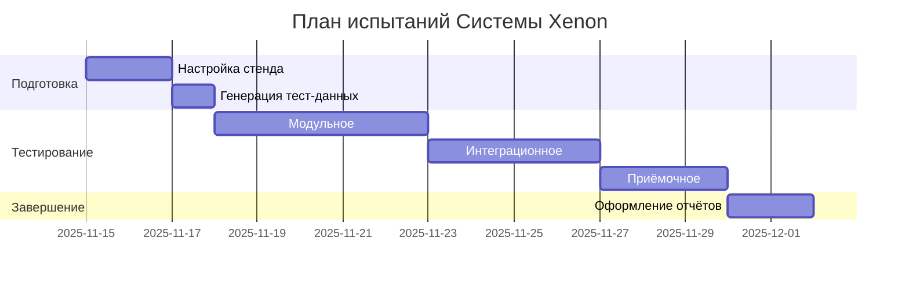

# ПМИ по ГОСТ 19.301-79

<div class="article-tags">
  <span class="tag tag-required">ОБЯЗАТЕЛЬНО</span>
  <span class="tag tag-beginner">ДЛЯ НОВИЧКОВ</span>
</div>

<span class="complexity-badge">Руководителю</span>
<span class="complexity-badge">Аналитику</span>
<span class="complexity-badge">Техническому писателю</span>

## Программа и методика испытаний

**ПМИ (ГОСТ 19.301)** описывает, *как* доказывают соответствие ТЗ: сценарии, среда, критерии, протоколы. Каждый важный пункт ТЗ должен иметь проверку в ПМИ (таблица трассировки) — иначе при сдаче спорят о формулировках, а не о фактах.

<div class="callout callout--tip">
  <div class="callout-title">ГОСТ</div>
  Основано на ГОСТ 19.301-79.
</div>

ПМИ - это документ, в котором написано, как будут проверять, работает ли программа так, как надо.

Что-то вроде инструкции для экзаменатора, который принимает у программистов экзамен перед сдачей заказчику.

Нужна, чтобы:
- испытания были честными и воспроизводимыми;
- заказчик и исполнитель говорили на одном языке;
- в суде и перед проверяющими было что предъявить.

---

## 1. Краткий обзор стандарта ГОСТ 19.301-79

### 1.1. Официальное название  
**ГОСТ 19.301-79**  
*Единая система программной документации*  
**Программа и методика испытаний**

---

### 1.2. Назначение документа  

Программа и методика испытаний (ПМИ) — это **нормативно-технический документ**, определяющий:  
- цели, задачи и объекты испытаний;  
- условия и порядок проведения испытаний;  
- методы, средства и критерии оценки результатов;  
- состав и порядок оформления отчётности.

> 📌 **Ключевое отличие от «тест-плана»** (IEEE 829, ISTQB):  
> ПМИ — **юридически значимый документ**, используемый в приёмке ПО в госсекторе, ОПК, АСУ ТП. Он регламентирует *«как тестировать»* и *«как доказать соответствие требованиям»* перед заказчиком/надзорным органом.

---

### 1.3. Область применения  

Стандарт применяется при разработке программных средств, включённых в состав:  
- автоматизированных систем управления (АСУ);  
- систем документооборота;  
- встраиваемых систем (в т.ч. критичных к безопасности);  
- программ для государственных информационных систем (ГИС), ЕГАИС, ЕГРН и пр.

> ✅ **Современный контекст:**  
> Даже в коммерческих IT-проектах ПМИ может требоваться, если:  
> - продукт сертифицируется (ФСТЭК, ФСБ, Минцифры);  
> - заключается госконтракт (44-ФЗ, 223-ФЗ);  
> - используется в инфраструктуре критически важных объектов (КВО).

---

### 1.4. Структура документа по ГОСТ 19.301-79  

| № | Наименование раздела | Обязательность |
|---|------------------------|----------------|
| 1 | Введение | ✓ (рекомендуется) |
| 2 | Основание для разработки | ✓ |
| 3 | Назначение разработки | ✓ |
| 4 | Требования к программе (объекту испытаний) | ✓ |
| 5 | Требования к программной документации | ✓ |
| 6 | Технические требования | ✓ |
| 7 | Требования к технологичности | ✓ |
| 8 | Требования к программе испытаний | ✓ |
| 9 | Условия испытаний | ✓ |
|10 | Методы и средства испытаний | ✓ |
|11 | Состав и порядок выполнения испытаний | ✓ |
|12 | Документация по результатам испытаний | ✓ |
|13 | Технико-экономические показатели | × (рекомендуется) |
|14 | Стадии и этапы испытаний | ✓ (часто объединяется с п.11) |
|15 | Порядок контроля и приёмки | ✓ |

> ⚠ **Важно:**  
> - Разделы **2–12 и 14–15** — **обязательные** согласно п. 2.1 ГОСТ.  
> - Раздел **13** — необязательный, но часто включается в госзаказах.  
> - Пункты могут группироваться (например, «Технические требования» = совокупность требований из ТЗ, СТО, ГОСТ).

---

## 2. Пошаговое руководство по составлению ПМИ  

Ниже — **практическая последовательность действий**, рекомендованная для подготовки документа, совместимого с ГОСТ 19.301 и пригодного для аудита.

---

### Шаг 1. Подготовка исходных материалов  

Перед началом написания ПМИ необходимо собрать:

| Документ | Зачем нужен |
|---------|-------------|
| Техническое задание (ТЗ) по ГОСТ 19.201 | Источник требований к функциональности и ограничениям |
| Спецификация программного обеспечения (СП) по ГОСТ 19.202 | Детализация архитектуры, интерфейсов, данных |
| Описание применения (ОП) по ГОСТ 19.502 | Сценарии использования — основа для тестовых кейсов |
| Документы по стандартизации (ГОСТ, ОСТ, СТО, ТУ) | Источник требований к надёжности, безопасности и т.п. |
| План качества (QA Plan) | Для согласования метрик дефектов, покрытия, SLA |

> 🔍 **Совет:** Используйте **traceability matrix** (таблицу трассировки требований), чтобы не упустить ни одного пункта из ТЗ.

---

### Шаг 2. Формирование структуры документа  

Создайте каркас документа по приведённой выше таблице. Рекомендуется использовать шаблон в Confluence / Word с автоматической нумерацией и стилями.

> 🛠 **Инструментарий:**  
> - Docusaurus + `remark-gfm` — для Markdown-публикаций (как в IT Universe);  
> - Sphinx + `sphinxcontrib-gost` — для официальных сборок в PDF;  
> - PlantUML / Mermaid — для диаграмм этапов испытаний;  
> - ReqIF / Polarion — для управления требованиями (если проект крупный).

---

### Шаг 3. Заполнение обязательных разделов  

#### ✅ Раздел 2. *Основание для разработки*  

Укажите:  
- номер и дату договора/заказа;  
- ссылки на распоряжения, приказы, протоколы;  
- наименование заказчика и разработчика.

> 📝 Пример:  
> *«Разработка ПМИ производится в соответствии с договором № 45-П/2025 от 05.03.2025 между АО „Информтех“ (заказчик) и ООО „60 имён“ (исполнитель), на основании технического задания ТЗ-2025-ИТ-018.»*

---

#### ✅ Раздел 3. *Назначение разработки*  

Кратко опишите:  
- для чего создаётся ПО;  
- какие задачи решает;  
- кто является конечным пользователем.

> 📝 Пример:  
> *«Система „Xenon“ предназначена для автоматизации учёта лабораторных исследований в клинических центрах. Целевая аудитория — лаборанты, врачи-исследователи, администраторы ЛИС.»*

---

#### ✅ Раздел 4–6. *Требования к программе и документации*  

Сведите в таблицы:

| ID требования (из ТЗ) | Категория | Текст требования | Источник | Проверяемость |
|------------------------|-----------|------------------|----------|----------------|
| F-101 | Функциональное | Система должна позволять вводить результаты анализа крови в течение ≤ 2 с | ТЗ, п. 4.2.1 | Да (time-tracking) |
| SEC-07 | Безопасность | Все данные передаются по TLS 1.3+; аутентификация по ГОСТ Р 34.10-2012 | ТЗ, п. 8.3; СТО-12-2024 | Да (Wireshark + сертификаты) |

> 🔒 **Важно:**  
> Требования должны быть **SMART**:  
> - **S**pecific — конкретные, без «взаимодействует с другими системами» → «осуществляет обмен по REST API (POST /v1/results) в формате JSON, совместимом со схемой XSD-2024»;  
> - **M**easurable — измеримые (время, объём, частота);  
> - **A**chievable — достижимые при имеющихся ресурсах;  
> - **R**elevant — привязанные к бизнес-цели;  
> - **T**estable — проверяемые без субъективных интерпретаций.

---

#### ✅ Раздел 8. *Требования к программе испытаний*  

Определяет **критерии допуска к испытаниям** и **критерии завершения**:

| Критерий | Условие | Ответственный |
|----------|---------|----------------|
| Допуск к этапу «Приёмочные испытания» | - Пройдены все модульные и интеграционные тесты (покрытие ≥ 85%) - Устранены все блокирующие (Blocker) и критические (Critical) дефекты - Утверждена документация пользователю | Техлид / QA-менеджер |
| Завершение испытаний | - Выполнены 100% тестовых сценариев - Не выявлено дефектов Severity ≥ Major - Подписан акт приёмки | Заказчик + Представитель НИИ |

---

#### ✅ Раздел 9. *Условия испытаний*  

Опишите:

- **Аппаратные требования**:  
  ```text
  - Сервер: 4 ядра CPU (Intel Xeon E-2334), 32 ГБ RAM, 500 ГБ SSD (RAID-1)
  - Клиент: Windows 10/11, Chrome ≥ v115, разрешение ≥ 1920×1080
  ```
- **Программные требования**:  
  ```text
  - ОС: Ubuntu 22.04 LTS (сервер), Windows 10 21H2 (клиент)
  - СУБД: PostgreSQL 14.5 + PostGIS 3.3
  - Среда: .NET 6.0, Node.js 18.x LTS
  ```
- **Окружение**:  
  - Стенд должен быть изолирован от Интернета (кроме доступа к ГИС через шлюз);
  - Используется тестовая БД, идентичная prod-схеме (без персональных данных);
  - Наличие лицензий: BPM-система, Keycloak (Open Source).

> 🌐 **Современный подход:**  
> Для CI/CD используйте `docker-compose.yml` как неотъемлемую часть ПМИ — это обеспечивает воспроизводимость.

Пример фрагмента:
```yaml
# docker-compose.test.yml
version: '3.8'
services:
  db:
    image: postgres:14.5
    environment:
      POSTGRES_DB: xenon_test
      POSTGRES_USER: tester
      POSTGRES_PASSWORD: securepass
    volumes:
      - ./init.sql:/docker-entrypoint-initdb.d/init.sql
  app:
    build: .
    depends_on: [db]
    environment:
      DB_CONN: "Host=db;Database=xenon_test;..."
    ports: ["8080:8080"]
```

---

#### ✅ Раздел 10. *Методы и средства испытаний*  

Классифицируйте по типам:

| Тип испытания | Метод | Средство | Автоматизация |
|---------------|-------|----------|----------------|
| Функциональное | Чёрный ящик (use-case testing) | Postman + Newman, Selenium | ✅ (70% сценариев) |
| Нагрузочное | Стресс-тестирование (step-up) | k6, Grafana + Prometheus | ✅ |
| Безопасность | Статический анализ + fuzzing | SonarQube, OWASP ZAP | ✅ (частично) |
| Юзабилити | Оценка по ISO 9241-11 | Наблюдение + опросник SUS | ❌ |
| Совместимость | Кросс-платформенное тестирование | BrowserStack, Sauce Labs | ✅ (mobile) |

> 📊 **Метрики качества** (включить в ПМИ):  
> - Покрытие кода (line/branch): ≥ 80% (unit), ≥ 60% (E2E);  
> - Время отклика: ≤ 1.5 с (95-й перцентиль);  
> - MTBF ≥ 500 ч;  
> - Количество дефектов на KLOC ≤ 0.5.

---

#### ✅ Раздел 11. *Состав и порядок выполнения испытаний*  

Представьте как **поэтапный план**:

| Этап | Наименование | Длительность | Участники | Результат |
|------|---------------|--------------|-----------|-----------|
| I | Подготовка стенда | 2 дня | DevOps, QA | Утверждённый `docker-compose.test.yml`, тестовые данные |
| II | Модульное тестирование | 5 дней | Разработчики | Отчёт `unit-report.html`, покрытие ≥ 85% |
| III | Интеграционное тестирование | 4 дня | QA, Backend | Отчёт `int-test.log`, API-контракты валидированы |
| IV | Приёмочное тестирование | 3 дня | Заказчик, Тестировщики | Акт приёмки (форма ПМИ-Акт-01) |
| V | Испытания на совместимость | 2 дня | QA, Внешние эксперты | Протокол совместимости с ЛИС «Арго» |

> 💡 **Совет:** Используйте диаграмму Ганта (в Mermaid):



---

#### ✅ Раздел 12. *Документация по результатам испытаний*  

Перечень форм:  
- **Форма ПМИ-Отч-01** — Протокол испытаний (на каждый этап);  
- **Форма ПМИ-Акт-01** — Акт приёмки (по ГОСТ 19.104);  
- **Форма ПМИ-Деф-01** — Журнал дефектов (с кодом, severity, статусом);  
- **Форма ПМИ-Метр-01** — Сводная таблица метрик качества.

> 📁 **Структура архива отчётов** (рекомендуется):  
> ```
> /xenon_pmi_results/
> ├── 01_setup/
> │   ├── docker-compose.test.yml
> │   └── test_data_sample.csv
> ├── 02_unit/
> │   ├── coverage.xml
> │   └── unit-report.html
> ├── 03_integration/
> │   ├── api-contract-validation.json
> │   └── postman_collection_run.json
> └── final/
>     ├── PMI_AKT_01_signed.pdf
>     └── defects_log_20251130.xlsx
> ```

---

### Шаг 4. Согласование и утверждение  
- ПМИ проходит **внутреннюю экспертизу** (тест-менеджер, архитектор, юрист по compliance);  
- Затем — **внешнее согласование** с заказчиком (часто — по форме рецензии);  
- Утверждается **приказом руководителя** или **протоколом приёмочной комиссии**.

> ⚖️ **Юридический нюанс:**  
> В госконтрактах ПМИ является **неотъемлемым приложением к ТЗ**. Изменение ПМИ после утверждения требует дополнительного соглашения.

---

## 3. Типичные ошибки и как их избежать  

| Ошибка | Последствия | Как избежать |
|--------|-------------|--------------|
| ❌ Неуказание критериев прохождения тест-кейса («должно работать») | Споры при приёмке, «договорняки» | Каждый тест-кейс — с **ожидаемым результатом в цифрах**: «время ≤ 1.2 с», «ошибка 500 — не допускается» |
| ❌ Отсутствие traceability к ТЗ | Невозможно доказать соответствие | Используйте **ID-теги** (`REQ-AUTH-04`) и таблицу трассировки |
| ❌ Описание методов без указания версий средств («тестировали в Postman») | Невоспроизводимость | Указывайте: `Postman v10.18.5 (Desktop), Newman v6.2.1, node v18.17.1` |
| ❌ Игнорирование нефункциональных требований | Риск отказа на приёмке (особенно в госсекторе) | Выделите отдельные подразделы: Надёжность, Безопасность, Эргономика — и привяжите к ГОСТ (напр., ГОСТ Р ИСО/МЭК 25010) |
| ❌ ПМИ составлена после начала разработки | Риск непроверяемых требований | **ПМИ должна быть готова до старта coding phase** — это часть плана качества (QA Plan) |
| ❌ Использование «плавающих» сроков («примерно 3 дня») | Нарушение графика, штрафы | Указывайте даты с привязкой к календарю и резервом на ретест (±20%) |

> 🛑 **Красный флаг в аудите:**  
> Фраза *«тестирование будет проведено в соответствии с утверждённым планом»* **без приложения самого плана** — грубое нарушение ГОСТ 19.301, п. 2.3.

---

## 4. Пример: вымышленная система *«Xenon — Лабораторная Информационная Система»*  

> Система предназначена для автоматизации учёта биоматериалов, назначений и результатов анализов в сети клиник «МедСтандарт».  
> Технологический стек: **BPM**, **PostgreSQL 15**, **React + TypeScript**, **Keycloak** для SSO.

Ниже — фрагменты **реального ПМИ-документа** (заполненный пример). Полный документ занимал бы ~40 страниц — здесь приведены ключевые части.

---

### 📄 Раздел 2. Основание для разработки  

> Разработка Программы и методики испытаний системы «Xenon» осуществляется в соответствии с:  
> - Договором № МС-2025/ИТ-44 от 10.10.2025 между ООО «МедСтандарт» (заказчик) и ООО «60 имён» (исполнитель);  
> - Техническим заданием ТЗ-ЛИС-2025-Р1, утверждённым протоколом № 7 от 12.10.2025;  
> - Требованиями к информационной безопасности, установленными СТО МС-001-2024.

---

### 📄 Раздел 4. Требования к программе (фрагмент таблицы)

| ID | Требование | Категория | Проверяемость |
|----|------------|-----------|----------------|
| F-203 | Система должна генерировать PDF-отчёт по результатам анализа с логотипом клиники, ФИО врача и электронной подписью (ЭП) в формате CAdES-BES по ГОСТ Р 34.10-2012 | Функциональное | Автоматизированный тест: сравнение хэша PDF с эталоном (SHA-256), проверка наличия подписи через КриптоПро CSP |
| NFR-SEC-11 | Время блокировки аккаунта после 3 неудачных попыток входа — не более 15 секунд | Безопасность | Замер через `curl` + таймер; логи Keycloak (`events.log`) |
| NFR-PERF-05 | Среднее время формирования отчёта по 100 пробиркам — ≤ 3.0 с (на стенде Spec-B) | Производительность | k6-скрипт: `xenon_perf_report.js`; метрика: `p(95) < 3.0s` |

---

### 📄 Раздел 10. Методы и средства испытаний (фрагмент)

#### 10.1. Функциональное тестирование  
- **Метод**: Сценарное тестирование на основе use-case из Описания применения (ОП-ЛИС-01).  
- **Средства**:  
  - Postman Collection v3.2 (с переменными окружения `{{env}} = test`);  
  - Newman CLI v6.2.1 + `--reporters cli,junit`;  
  - Test Runner (встроенный в платформу).  
- **Критерий прохождения**:  
  > *100% тест-кейсов в коллекции «Xenon_Functional_v4.postman_collection.json» завершились со статусом 2xx и валидным JSON-ответом (schema validation via AJV).*

#### 10.2. Тестирование ЭП (электронной подписи)  
- **Метод**: White-box + black-box; сравнение с эталонной подписью, сгенерированной КриптоПро CSP 5.0.  
- **Средства**:  
  - КриптоПро CSP 5.0 R5 (лицензия № CP-7788-2025);  
  - Утилита `cpverify.exe` для валидации CAdES;  
  - Python-скрипт `ep_validator.py` (см. Приложение Б).  
- **Образец кода валидации**:
  ```python
  # ep_validator.py
  import subprocess
  import hashlib

  def verify_cades(pdf_path: str, expected_hash: str) -> bool:
      # Извлекаем подпись из PDF (BPM embedded)
      sig_data = extract_signature_from_pdf(pdf_path)
      # Сохраняем во временный .sig
      with open("temp.sig", "wb") as f:
          f.write(sig_data)
      # Проверяем через КриптоПро
      result = subprocess.run(
          ["cpverify", "-verify", "temp.sig", "-content", pdf_path],
          capture_output=True, text=True
      )
      return "Verified successfully" in result.stdout and \
             hashlib.sha256(open(pdf_path, 'rb').read()).hexdigest() == expected_hash
  ```

---

### 📄 Раздел 11. Порядок выполнения испытаний (фрагмент протокола)

| № | Наименование испытания | Дата | Результат | Подпись |
|---|-------------------------|------|-----------|---------|
| 3.7 | Формирование PDF-отчёта с ЭП (сценарий F-203) | 2025-11-28 | ✅ Пройден: хэш совпадает (SHA256: a1b2…f9), подпись валидна (cpverify OK) | Тагиров Т.В. |
| 3.8 | Блокировка аккаунта после 3х попыток (NFR-SEC-11) | 2025-11-28 | ⚠ Частично: время блокировки — 16.2 с (требуется ≤15.0 с). Дефект DEF-2025-SEC-45 заведён. | Петров А.С. |

---

### 📄 Раздел 12. Акт приёмки (фрагмент формы ПМИ-Акт-01)

> **Акт приёмки результатов испытаний**  
> Система: *Xenon v1.2.0*  
> Дата испытаний: *15–28 ноября 2025 г.*  
> Стенд: *Тестовый стенд Spec-B (см. Приложение А)*  
>   
> **Комиссия установила:**  
> - Выполнено 142 из 145 функциональных тест-кейсов;  
> - 3 дефекта категории *Major* устранены в течение 48 ч;  
> - Все нефункциональные требования выполнены (см. Приложение В — метрики);  
> - Документация соответствует ТЗ и ГОСТ 19.100–19.521.  
>   
> **Решение комиссии:**  
> Система *Xenon* **рекомендована к приёмке**.  
>   
> Председатель комиссии: ___________ / Иванов И.И. /  
> Представитель заказчика: ___________ / Сидорова О.В. /  
> Представитель разработчика: ___________ / Тагиров Т.В. /

---

## 6. После испытаний: сертификация и приёмка

ПМИ описывает **как** проверить продукт. **Приёмка** — организационный и юридический финал: комиссия, протоколы, акт; в ряде отраслей — **сертификация** по регламенту (ФСТЭК, медицина, ОПК).

| Этап | Что фиксируется |
|------|-----------------|
| Испытания по ПМИ | Протоколы, дефекты, метрики NFR |
| Удостоверение качества | Отчёты, traceability к ТЗ, [ISO/IEC 25010](/encyclopedia/7-project/7-13-ekonomika-proizvodstva-po/2) |
| Приёмка | Акт комиссии, решение заказчика |
| Сертификация (при необходимости) | Независимая оценка → сертификат |

Подробный разбор отличий «испытания / удостоверение / сертификация», CMMI, ISO 9001 и образца акта — [Сертификация и приёмка заказных продуктов](/encyclopedia/7-project/7-13-ekonomika-proizvodstva-po/6). Версии ПМИ, стендов и скриптов на приёмке — [управление конфигурацией](/encyclopedia/7-project/7-13-ekonomika-proizvodstva-po/3).

---

## 5. Проверочный чек-лист по заполнению ПМИ  

> ✅ Используйте этот список **до отправки на согласование**.

| № | Пункт проверки | Да/Нет | Комментарий |
|---|----------------|--------|-------------|
| 1 | Все разделы 2–12, 14–15 присутствуют? | ☐ | |
| 2 | Каждое требование из ТЗ имеет уникальный ID и отражено в ПМИ? | ☐ | Проверьте traceability matrix |
| 3 | Для каждого испытания указаны: метод, средство, критерий прохождения? | ☐ | Должно быть измеримо! |
| 4 | Указаны точные версии ПО/ОС/средств тестирования? | ☐ | `Postman v10.18.5`, не «Postman» |
| 5 | Есть ссылки на приложения (стенд, скрипты, схемы)? | ☐ | Приложения — часть документа |
| 6 | Критерии допуска и завершения сформулированы однозначно? | ☐ | Нет «и т.д.», «по усмотрению» |
| 7 | Указаны ответственные за каждый этап? | ☐ | ФИО + должность/роль |
| 8 | Есть дата утверждения и подпись руководителя? | ☐ | Без неё — не документ |
| 9 | Все формы (акты, протоколы) соответствуют приложениям ГОСТ? | ☐ | Сверьтесь с Приложением 1 ГОСТ 19.301 |
|10 | Документ прошёл внутреннюю экспертизу (QA, Безопасность, Compliance)? | ☐ | Обязательно до заказчика |

> 🟢 **Если все пункты — «Да»**, документ готов к согласованию.

---
