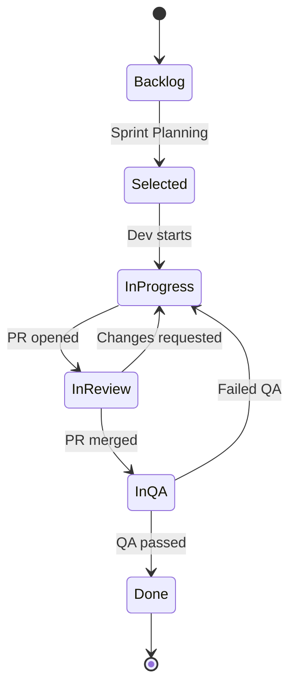

# Jira, YouTrack и настройка трекера

<div class="article-tags">
  <span class="tag tag-required">ОБЯЗАТЕЛЬНО</span>
  <span class="tag tag-beginner">ДЛЯ НОВИЧКОВ</span>
</div>

<div class="callout callout--info">
  <div class="callout-title">Связь с другими статьями</div>
  <div class="callout-body">
  Теория задач — <a href="./2">статья 2</a>.
  Scrum — <a href="/encyclopedia/7-project/7-14-scrum/intro">7-14</a>.
  Kanban — <a href="/encyclopedia/7-project/7-18-kanban/intro">7-18</a>.
  Git workflow — <a href="/encyclopedia/4-code-dev/4-13-osnovy-raboty-s-git/112">4-13/112</a>.
  Запуск проекта — <a href="/encyclopedia/7-project/7-17-nachalo-raboty-na-proekte/4">7-17/4</a>.
  </div>
</div>

---

## Связь с общей теорией задач

Что такое задача, приоритет, дедлайн и планирование — в [Системах управления задачами](./2). Здесь — **практика** двух распространённых систем и принципы настройки под [Scrum](/encyclopedia/7-project/7-14-scrum/intro) или [Kanban](/encyclopedia/7-project/7-18-kanban/intro).

**Таск-трекер** (task tracker) — программа, где команда ведёт список работ: Jira, YouTrack, Linear, GitHub Issues, Redmine, Azure DevOps.

Правило многих команд:

> **Если задачи нет в трекере, её нет в учёте проекта.**

Исключения — hotfix по [инцидентам](/encyclopedia/7-project/7-21-incidenty-i-ekspluatatsiya/1) с оформлением тикета post-factum в оговорённый срок (например, 24 часа).

---

## Почему важна осознанная настройка

Плохая настройка приводит к:

- 15 обязательных полей, которые никто не заполняет;
- статусам, не отражающим реальность ("In Progress" месяцами);
- невозможности построить отчёт для PO и PMO;
- разрыву между Git и учётом работы.

Хорошая настройка:

- отражает **реальный workflow** команды;
- связана с **Git** и [DoR/DoD](/encyclopedia/7-project/7-25-dostavka-i-gotovnost/intro);
- даёт **метрики** без ручного Excel.

---

## Jira (Atlassian)

Часто встречается в **enterprise**, **банках**, **госконтрактах**, крупном аутстаффе.

### Создание проекта — минимальный чек-лист

| Шаг | Действие |
|-----|----------|
| 1 | Выбрать шаблон: Scrum, Kanban или Team-managed |
| 2 | Задать **Project key** (например `PORTAL`) — префикс тикетов и веток |
| 3 | Настроить **issue types**: Epic, Story, Task, Bug, Sub-task |
| 4 | Создать **workflow** под путь: Backlog → In Progress → Review → QA → Done |
| 5 | Подключить **board** (Scrum или Kanban) |
| 6 | Интеграция **GitHub/GitLab/Bitbucket** |
| 7 | Связь с **Confluence** (опционально) |

### Project key и именование

**Project key** — короткий префикс в ID задачи: `PORTAL-123`.

Рекомендации:

- 2–6 символов, латиница;
- совпадает с префиксом веток Git: `PORTAL-123-add-login`;
- один key на продукт/модуль, не на каждого разработчика.

### Issue types — типовая схема

| Тип | Когда использовать |
|-----|-------------------|
| **Epic** | Крупная цель на несколько спринтов |
| **Story** | Ценность для пользователя, AC |
| **Task** | Техническая работа без прямой user story |
| **Bug** | Дефект |
| **Sub-task** | Декомposition story (осторожно — не злоупотреблять) |

<div class="callout callout--tip">
  <div class="callout-title">Epic vs Story</div>
  <div class="callout-body">
  <strong>Story</strong> должна быть выполнима за один спринт (или меньше). Если больше — разбейте или оформите как Epic с несколькими Story.
  </div>
</div>

### Workflow — пример для Scrum-команды



**Статусы должны отражать реальность:**

- **In Review** — PR открыт, ждёт review;
- **In QA** — на stage, проверяет QA;
- не держите **Done** задачи в **In Progress** "для удобства".

### Поля — минимальный набор

| Поле | Обязательность | Назначение |
|------|----------------|-------|
| Summary | Да | Заголовок |
| Description + AC | Да | Что сделать |
| Assignee | На In Progress | Кто делает |
| Story Points / Estimate | На planning | Планирование |
| Sprint | Scrum | Привязка к итерации |
| Priority | Да | P1–P4 или Highest–Lowest |
| Labels / Components | Опционально | Фильтры, отчёты |
| Fix Version | На релиз | Что войдёт в версию |

**Антипаттерн** — 15 обязательных custom fields при создании бага.

### Automation в Jira

Примеры правил:

| Триггер | Действие |
|---------|----------|
| PR merged в `main` | Перевести в Done (если policy команды) |
| Создан Bug с Priority Highest | Уведомить on-call в Slack |
| Story Points пустые при переходе в Sprint | Блокировать (soft warning) |

Осторожно с auto-Done при merge — иногда QA ещё не прошёл; лучше переход в **In QA**.

### Интеграции Jira

- **Git** — smart commits, ссылки PR ↔ issue;
- **Confluence** — requirements, retrospectives;
- **Slack/Teams** — уведомления;
- **CI** (Bamboo, GitHub Actions) — статус билда в тикете.

---

## YouTrack (JetBrains)

Популярен в **продуктовых**, **.NET/Java**-командах, стартапах JetBrains-экосистемы.

### Сильные стороны

- гибкие **состояния** и **поля** без тяжёлого админ-UI;
- встроенная связь с **IDE** (опционально);
- **Agile board** с WIP-лимитами;
- мощный **язык запросов** для отчётов;
- часто быстрее старт для команды до 30 человек.

### Создание проекта YouTrack

| Шаг | Действие |
|-----|----------|
| 1 | New Project → выбрать template (Scrum/Kanban) |
| 2 | Short name как project key (`SHOP`) |
| 3 | Настроить **States** под workflow |
| 4 | **Agile board**: columns = states, WIP limits |
| 5 | Поля: Type, Priority, Story points, Assignee |
| 6 | VCS integration: GitHub/GitLab |

### Язык запросов — примеры

```text
project: SHOP State: {In Progress} Assignee: me
project: SHOP Type: Bug Priority: Critical created: today
project: SHOP Sprint: {Sprint 42} State: -Done
```

Отчёты сохраняются как **saved search** — удобно для тимлида.

### Workflow YouTrack для Kanban

| Колонка | WIP | Статусы |
|---------|-----|---------|
| Backlog | — | Open, Reopened |
| Ready | 5 | Ready for Dev |
| In Progress | 3 | In Progress |
| Review | 2 | In Review |
| QA | 2 | Testing |
| Done | — | Done, Won't fix |

---

## Сравнение Jira и YouTrack

| Критерий | Jira | YouTrack |
|----------|------|----------|
| Крупный enterprise, PMO | Сильная сторона | Возможен, реже |
| Быстрый старт малой команды | Тяжелее | Проще |
| Госконтракт, привычка заказчика | Часто Jira | Реже |
| Отчёты и dashboard | Да, Marketplace apps | Saved queries, agile charts |
| Стоимость | Зависит от tier | Зависит от tier |
| Кастомизация workflow | Мощно, сложно | Гибко, проще |

Для **стартапа** подойдут Linear, GitHub Issues, Redmine — **принципы** (workflow, Git, DoR/DoD) те же.

---

## Настройка workflow под Scrum

### Церемонии и артефакты в трекере

| Церемония | Что в Jira/YouTrack |
|-----------|---------------------|
| Backlog refinement | Приоритет, оценка, DoR checklist |
| Sprint planning | Перенос в Sprint, commitment |
| Daily | Board, фильтр In Progress |
| Review | Filter Done за спринт |
| Retro | Confluence / отдельный doc, не обязательно тикеты |

### DoR в описании Story

Шаблон в description:

```markdown
## Acceptance Criteria
- [ ] ...
- [ ] ...

## Definition of Ready
- [ ] AC согласованы с PO
- [ ] Макеты / API spec приложены
- [ ] Оценка story points
- [ ] Нет блокеров
```

### Velocity и sprint goal

- **Sprint goal** — одно предложение в поле Sprint или wiki;
- **Velocity** — сумма story points Done за спринт; не KPI для наказания, а прогноз.

---

## Настройка workflow под Kanban

| Практика | Настройка |
|----------|-----------|
| WIP limits | На колонки board |
| Classes of service | Swimlanes: Expedite, Standard, Fixed date |
| Pull policy | Из Ready только если WIP позволяет |
| Aging | Подсветка тикетов > N дней в колонке |

См. [Kanban — о разделе](/encyclopedia/7-project/7-18-kanban/intro), [Scrumban](/encyclopedia/7-project/7-18-kanban/5).

---

## Интеграция с Git

Связь трекера и репозитория — основа traceability и отчётности.

### Именование веток

```text
PORTAL-123-short-description
PORTAL-456-fix-login-timeout
```

Правила:

- **обязательный** номер тикета в начале (кроме оформленного hotfix);
- короткое описание латиницей;
- без пробелов.

### Заголовок Pull Request / Merge Request

```text
[PORTAL-123] Добавить валидацию email при регистрации
```

В description — `Closes PORTAL-123` или `Fixes PORTAL-123` для автозакрытия (если policy).

### Smart commits (Jira)

В сообщении коммита:

```text
PORTAL-123 #comment Добавлены unit-тесты #time 2h
PORTAL-123 #resolve
```

YouTrack — аналог через `#issue-id` в commit message при настроенной интеграции.

### Политика команды

| Правило | Назначение |
|---------|-------|
| Merge в `main` без номера тикета → reject | Учёт работы |
| Один PR — одна story/task (где возможно) | Review, rollback |
| Squash merge с сохранением `PORTAL-123` в title | Чистая история |

Подробнее — [Git workflow](/encyclopedia/4-code-dev/4-13-osnovy-raboty-s-git/112).

### Диаграмма потока Git ↔ Tracker


---

## Отчёты для тимлида и PO

| Вопрос | Где смотреть | Инструмент |
|--------|--------------|------------|
| Что сейчас в работе? | Board + WIP | Filter In Progress |
| Когда будет готово? | Cycle time (Kanban) | Control chart |
| Скорость команды? | Velocity (Scrum) | Sprint report |
| Где узкое место? | Cumulative flow | CFD diagram |
| Старые тикеты? | Aging report | > 7 days in column |
| Качество | Bug trend | Bugs created vs resolved |
| Escaped defects | Prod bugs | Label `production` |

### Cumulative Flow Diagram (CFD)

Растущий "хвост" между In Progress и Done — **узкое место** (review или QA). Растущий Backlog — не успеваете брать работу.

### Burndown / Burnup (Scrum)

- **Burndown** — остаток work в спринте по дням;
- flat line 3 дня — блокер или WIP без завершения.

---

## Запуск трекера на новом проекте

Порядок при [старте проекта](/encyclopedia/7-project/7-17-nachalo-raboty-na-proekte/4):

1. Создать проект, key, репозиторий с тем же префиксом.
2. Минимальный workflow (не идеальный — **рабочий**).
3. Импорт или создание первых epics/stories с PO.
4. Подключить Git integration, проверить на тестовом PR.
5. DoR/DoD в wiki — ссылка из шаблона description.
6. Через 2 спринта — retrospective по процессу трекера, упростить поля.

<div class="callout callout--warning">
  <div class="callout-title">Не откладывайте трекер</div>
  <div class="callout-body">
  "Потом перенесём из Excel" — через месяц потеряете историю и метрики. С первого дня: каждый PR → тикет.
  </div>
</div>

---

## Пример: настройка за один день (команда 5 человек, YouTrack)

**Утро**

- Проект `SHOP`, типы: Feature, Bug, Tech debt.
- Board: Backlog | Ready | In Progress (WIP 3) | Review (WIP 2) | QA | Done.
- GitLab integration.

**День**

- PO завёл 10 stories в Backlog.
- Planning: 8 SP в Ready.
- Dev создал ветки `SHOP-1-...`, PR линкуются автоматически.

**Вечер**

- Retro: поле "Environment" лишнее — удалить.

---

## FAQ

**Jira Cloud или Server?**

Зависит от политики компании и заказчика. Cloud — меньше ops; Server/Data Center — контроль данных on-premise.

**Нужны ли sub-task на каждую story?**

Не обязательно. Sub-task полезны для параллельной работы backend/frontend; иначе — checklist в description.

**Как мигрировать с Excel?**

Импорт CSV, один раз проставить priorities, закрыть legacy "вне трекера" правилом с даты X.

**Story points и часы?**

Scrum — points для velocity; T&M интеграторы иногда списывают часы в Tempo/Jira Worklog.

**Can we use GitHub Issues only?**

Да для малой команды; при росте — labels, milestones, projects v2; при enterprise — часто миграция в Jira.

---

## См. также

- [Задачи — теория](./2)
- [Wiki и Confluence](./22)
- [Онбординг-пакет](./24)
- [DoR и DoD](/encyclopedia/7-project/7-25-dostavka-i-gotovnost/intro)
- [Scrum](/encyclopedia/7-project/7-14-scrum/intro)

---
