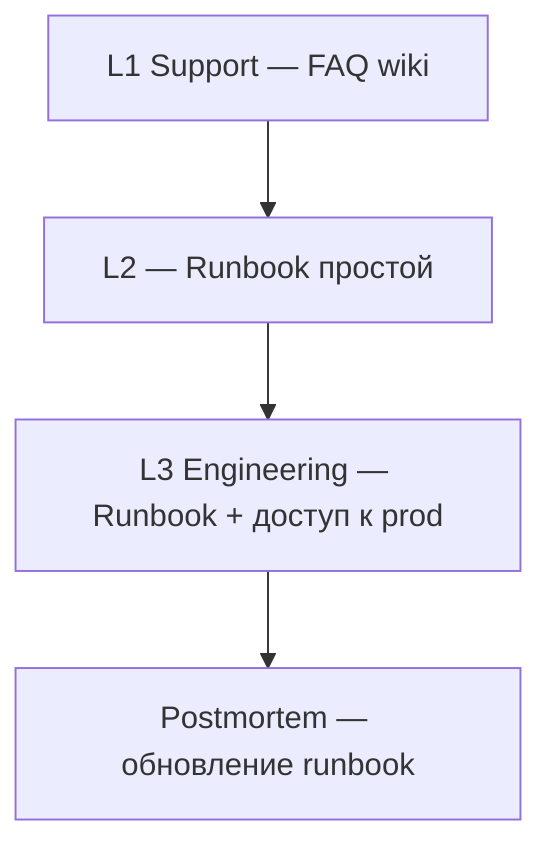

# Wiki, Confluence и структура базы знаний

<div class="article-tags">
  <span class="tag tag-required">ОБЯЗАТЕЛЬНО</span>
  <span class="tag tag-beginner">ДЛЯ НОВИЧКОВ</span>
</div>

<div class="callout callout--info">
  <div class="callout-title">Связь с другими статьями</div>
  <div class="callout-body">
  Общая теория — <a href="./1">Базы знаний в IT</a>, углубление — <a href="./11">Организация внутренней Wiki</a>.
  ADR и docs-as-code — <a href="./23">следующая статья</a>.
  Онбординг — <a href="./24">онбординг-пакет</a>.
  Jira — <a href="./21">Jira/YouTrack</a>.
  </div>
</div>

---

## Wiki и README в Git

В зрелой команде документация живёт в **двух местах** — и это нормально.

| | Wiki (Confluence, Notion, Wiki.js) | Git (README, docs/) |
|---|-----------------------------------|---------------------|
| **Аудитория** | Вся компания, support, PM, HR | Разработчики, DevOps |
| **Жизнь** | Регламенты, встречи, процессы | Версионируется с кодом |
| **Ревью** | Редакторское, права по space | Pull Request |
| **Скорость правок** | Быстро, без релиза | Через CI, с review |
| **Примеры** | Runbook L1, онбординг HR | ADR, OpenAPI, README |

**Оба нужны** с перекрёстными ссылками: wiki → "архитектурные решения см. `docs/adr/` в репо"; README → "процесс спринта см. Confluence /Process/Scrum".

<div class="callout callout--tip">
  <div class="callout-title">Правило перетока</div>
  <div class="callout-body">
  <strong>Решение</strong> из обсуждения в wiki перетекает в ADR или runbook в Git. <strong>Черновик</strong> и протокол встречи остаются в wiki.
  </div>
</div>

---

## Структура разделов

Рекомендуемое **дерево** внутренней базы знаний (адаптируйте под размер компании):

```
📁 00 — Добро пожаловать / Онбординг
📁 01 — Процессы (Scrum, Kanban, DoR/DoD, релизы)
📁 02 — Команды и контакты
📁 03 — Архитектура (обзор, ссылка на ADR в Git)
📁 04 — Среды (dev, stage, prod) и деплой
📁 05 — Runbooks (инциденты, алерты)
📁 06 — FAQ Support / L1
📁 07 — Безопасность и доступы
📁 08 — Встречи (протоколы; решения — в ADR)
📁 09 — HR и админ (отпуска, оборудование)
```

### Принципы структуры

| Принцип | Пояснение |
|---------|-----------|
| **Один вход** | Страница "Добро пожаловать" со ссылками на всё критичное |
| **Не глубже 3–4 кликов** | От главной до runbook P1 |
| **Владелец раздела** | Имя в шапке space или parent page |
| **Единые шаблоны** | Runbook, How-to, Meeting notes |
| **Нумерация опциональна** | `05-Runbooks` помогает сортировке |

### Что не класть в wiki

- секреты и пароли (vault, password manager);
- полные копии OpenAPI — только ссылка на репо;
- устаревшие решения без banner "deprecated".

---

## Confluence — практика

**Confluence** (Atlassian) — частый выбор рядом с Jira.

### Space types

| Тип space | Для чего |
|-----------|----------|
| **Team space** | Одна продуктовая команда |
| **Project space** | Заказной проект с заказчиком (осторожно с доступами) |
| **Company space** | HR, IT, общие регламенты |
| **Knowledge base** | FAQ для support |

### Связь Confluence ↔ Jira

- макрос **Jira Issues** на странице релиза;
- requirements page linked to Epic;
- retrospective template с action items → tasks in Jira.

### Права доступа

| Уровень | Кто |
|---------|-----|
| View all | Вся компания |
| Edit | Команда + tech writers |
| Admin space | Тимлид, PM |

Заказчик на аутсорсе — отдельный space или экспорт PDF, не полный internal wiki.

---

## Шаблоны страниц

### Runbook (операционная инструкция)

Runbook — пошаговая инструкция для **дежурного** или **support L2** при известном классе проблем.

**Структура:**

```markdown
# Runbook: [Краткое название]

| Поле | Значение |
|------|----------|
| Владелец | @team-backend |
| Последний review | 2026-03-01 |
| Статус | Актуально |
| Severity | P1 / P2 |
| Связанные алерты | Prometheus: HighErrorRate |

## Симптомы
- Пользователи не могут войти
- Алерт LoginFailureRate > 5%

## Быстрая проверка (5 мин)
1. Статус pod auth-service: `kubectl get pods -n prod`
2. Grafana dashboard: Auth → Login errors

## Диагностика
1. Логи: `...`
2. Зависимость: Redis, PostgreSQL

## Исправление
1. Restart deployment (если ...)
2. Rollback релиза: см. Runbook Rollback

## Эскалация
- Нет улучшения за 30 мин → @on-call-lead
- Данные пользователей → @security

## Post-incident
- Создать тикет на постмортем
- Обновить этот runbook
```

### How-to (как сделать X)

```markdown
# How-to: Локальный запуск сервиса orders

## Цель
Запустить orders-api на localhost:8080

## Предусловия
- Docker, Node 20, доступ к VPN

## Шаги
1. `git clone ...`
2. `cp .env.example .env`
3. `docker compose up -d postgres`
4. `npm install && npm run dev`

## Проверка
curl http://localhost:8080/health → 200

## Частые ошибки
| Ошибка | Решение |
|--------|---------|
| ECONNREFUSED postgres | docker compose up |
```

### RFC / архитектурное решение

Краткая страница в wiki со **ссылкой на ADR** в Git:

```markdown
# RFC: Переход на PostgreSQL 16

Статус: Принято
ADR: https://github.com/org/repo/blob/main/docs/adr/0002-postgresql-16.md
Автор: @ivan
Дата обсуждения: 2026-02-15
```

Подробный формат ADR — [раздел 7.20](/encyclopedia/7-project/7-20-adr-i-arhitekturnaya-pamyat/1), [docs-as-code](./23).

### Meeting notes (протокол)

```markdown
# Retro Sprint 42 — 2026-03-10

Участники: ...
Facilitator: ...

## Что хорошо
- ...

## Что улучшить
- ...

## Action items
| Действие | Владелец | Срок |
|----------|----------|------|
| Упростить поля Jira | @lead | 2026-03-17 |
```

**Решения**, меняющие архитектуру — дублировать в ADR, не только в протоколе.

---

## Runbooks — углубление

### Когда нужен runbook

| Ситуация | Runbook |
|----------|---------|
| Повторяющийся алерт | Да |
| Ручной деплой в prod | Да |
| On-call rotation | Пакет runbooks + эскалация |
| Одноразовый фикс | How-to или комментарий в тикете |

### Уровни runbook



### Quarterly review runbook

В календаре команды — **раз в квартал**:

- прогнать fire drill по P1 runbook на stage;
- обновить устаревшие команды и ссылки;
- проверить владельца (не уволился ли "Петя").

**Bus factor** — знание не только "в голове у одного человека" ([FAQ](./998)).

---

## Актуальность документации

### Banner "устарело"

```markdown
> ⚠️ **УСТАРЕЛО** с 2026-01-01. Актуальная версия: [Deploy v2](./deploy-v2)
```

### Метаданные в шапке каждой страницы

| Поле | Назначение |
|------|-------|
| Owner | К кому идти с правками |
| Last reviewed | Триггер для review |
| Status | Draft / Active / Deprecated |
| Related ADR | Связь с Git |

### Definition of Done для документации

При изменении поведения системы:

- [ ] Обновлён README или runbook (если затронут on-call);
- [ ] ADR — если архитектурное решение;
- [ ] FAQ support — если типовой вопрос пользователей.

---

## Confluence и Docusaurus

| Тип документа | Где жить |
|---------------|----------|
| Публичная документация API продукта | **Docusaurus**, MkDocs, Read the Docs |
| Внутренние регламенты | **Confluence** |
| ADR, OpenAPI source | **Git** |

Публичная документация продукта может жить в **Docusaurus** ([пример 111](./111)); внутренние регламенты — в Confluence.

**Не дублируйте** без синхронизации: один source of truth. Если API doc генерируется из OpenAPI в Git — в wiki только ссылка.

---

## Notion и альтернatives

| Инструмент | Плюсы | Минусы |
|------------|-------|--------|
| **Confluence** | Jira, enterprise | Тяжёлый UI |
| **Notion** | Быстрый старт, гибкость | Права, export |
| **Wiki.js** | Markdown, self-hosted | Нужен admin |
| **BookStack** | Простая структура книг | Меньше интеграций |

Принципы структуры одинаковы независимо от инструмента.

---

## Связь с техподдержкой


L1 читает wiki; пробелы в FAQ → тикеты в разработку или tech writer.

См. [техподдержка](/encyclopedia/2-system-network/2-07-tehnicheskaya-podderzhka/intro), [ITSM](/encyclopedia/7-project/7-16-itsm-i-it-uslugi/intro).

---

## Пример: минимальная wiki за неделю

**День 1–2**

- Space "Product X", страница Welcome + онбординг ([24](./24)).
- Раздел Process: ссылка на Scrum, DoR/DoD.

**День 3–4**

- Runbook: деплой, rollback, типовой P2.
- Контакты: PO, on-call, IT helpdesk.

**День 5**

- FAQ support: 10 частых вопросов от beta-тестеров.
- Review с QA и support lead.

---

## Поиск и discoverability

| Проблема | Решение |
|----------|---------|
| "Не нашёл в wiki" | Единая страница-маяк, хорошие заголовки |
| Дубликаты | Merge + redirect |
| Поиск не индексирует | Labels, keywords в начале страницы |
| Слишком длинные страницы | Разбить на child pages |

В Confluence — labels `runbook`, `onboarding`, `deprecated`.

---

## FAQ

**Wiki или всё в Git?**

Git для версионируемого рядом с кодом; wiki для живых процессов и support. См. [docs-as-code](./23).

**Кто пишет документацию?**

Вся команда; tech writer или тимлид держит структуру. Runbook — автор фичи или on-call.

**Как мотивировать обновлять wiki?**

DoD: "изменение затрагивает деплой → обновить runbook". Review раз в спринт одной устаревшей страницы.

**Confluence для заказчика?**

Отдельный space или экспорт; NDA, без internal runbook.

**Сколько runbook достаточно на старте?**

Минимум: deploy, rollback, top-3 алерта, доступы и контакты on-call.

---

## См. также

- [ADR и docs-as-code](./23)
- [Онбординг-пакет](./24)
- [Jira/YouTrack](./21)
- [ADR и архитектурная память](/encyclopedia/7-project/7-20-adr-i-arhitekturnaya-pamyat/intro)
- [Техническое письмо](/encyclopedia/7-project/7-08-tehnicheskoe-pismo/intro)

---
