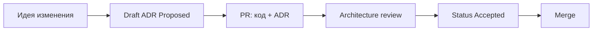
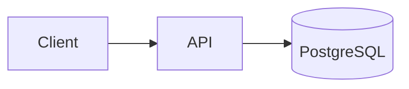
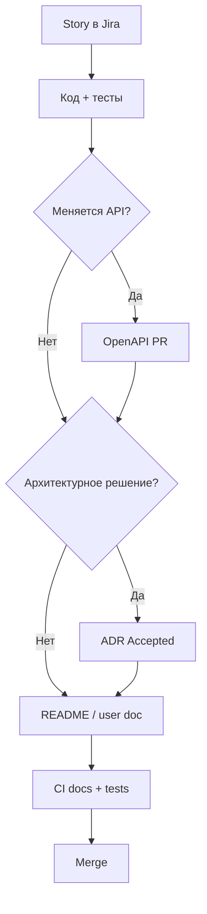

# ADR и docs-as-code

<div class="article-tags">
  <span class="tag tag-required">ОБЯЗАТЕЛЬНО</span>
  <span class="tag tag-beginner">ДЛЯ НОВИЧКОВ</span>
</div>

<div class="callout callout--info">
  <div class="callout-title">Связь с другими статьями</div>
  <div class="callout-body">
  Wiki и runbook — <a href="./22">предыдущая статья</a>.
  ADR подробно — <a href="/encyclopedia/7-project/7-20-adr-i-arhitekturnaya-pamyat/1">раздел 7-20</a>.
  Техписьмо — <a href="/encyclopedia/7-project/7-08-tehnicheskoe-pismo/intro">7-08</a>.
  Swagger/OpenAPI — <a href="/encyclopedia/7-project/7-08-tehnicheskoe-pismo/3">7-08/3</a>.
  </div>
</div>

---

## Принцип docs-as-code

**Docs-as-code** — документация обрабатывается **так же**, как исходный код:

| Принцип | На практике |
|---------|-------------|
| Хранение в **Git** | `docs/`, `README.md`, `openapi.yaml` |
| Изменения через **PR** | Review от коллег |
| Сборка в **CI** | Сайт, PDF, проверка ссылок |
| **Версионирование** с релизом | Tag v2.0 → doc v2.0 |
| История изменений | `git blame`, кто и зачем |

Как исходники: изменения видны в истории, а не теряются в wiki без владельца. Подробнее в [экосистеме техписьма](/encyclopedia/7-project/7-08-tehnicheskoe-pismo/1006).

### Docs-as-code и wiki

| Тип контента | Где |
|--------------|-----|
| ADR, OpenAPI, README | Git |
| Runbook on-call (часто) | Git или wiki со ссылкой |
| Протоколы встреч, HR | Wiki |
| Публичная doc сайта | Git → CI → Docusaurus |

Правило из [wiki-статьи](./22): **решение** перетекает в ADR или runbook; **обсуждение** остаётся в wiki.

---

## ADR в репозитории

**ADR** (Architecture Decision Record) — короткая запись: **какое** архитектурное решение приняли, **почему**, **какие** альтернативы отвергли.

### Структура каталога

```
docs/
  adr/
    0001-record-architecture-decisions.md
    0002-use-postgresql.md
    0003-event-bus-kafka.md
    README.md          # оглавление со статусами
```

Или в корне:

```
adr/
  0001-...
```

Единообразие важнее точного пути — зафиксируйте в README репозитория.

### Формат ADR (шаблон)

```markdown
# 0002. Использование PostgreSQL

Date: 2026-02-10
Status: Accepted

## Context
Нужна relational БД для транзакций заказов, команда знает SQL.

## Decision
PostgreSQL 16, один primary + replica для read.

## Consequences
+ ACID, экосистема инструментов
- Операционная нагрузка на DBA/managed service

## Alternatives considered
- MySQL — отклонено: ...
- MongoDB — отклонено для core orders
```

Статусы: **Proposed**, **Accepted**, **Deprecated**, **Superseded by ADR-0005**.

Формат и смысл — [раздел 7.20](/encyclopedia/7-project/7-20-adr-i-arhitekturnaya-pamyat/1).

### adr-tools

CLI **adr-tools** генерирует номера и оглавление:

```bash
adr new "Use PostgreSQL for orders database"
adr list
adr generate toc > docs/adr/README.md
```

Не обязателен — можно вести вручную в малой команде.

### ADR в процессе PR



В PR на архитектурное изменение: **код + ADR** в одном или **связанном** PR (ADR merge первым).

<div class="callout callout--warning">
  <div class="callout-title">Без ADR</div>
  <div class="callout-body">
  Через год никто не помнит, почему выбрали Kafka, а не RabbitMQ. Новый разработчик предложит "переписать" — и команда повторит обсуждение.
  </div>
</div>

---

## OpenAPI и AsyncAPI

**OpenAPI** (бывший Swagger) — машиночитаемое описание **REST API** в YAML или JSON.

### OpenAPI в репозитории — польза

| Польза | Описание |
|--------|----------|
| Single source of truth | Не Word на шаре |
| Swagger UI в CI | Preview на каждый PR |
| Генерация клиентов | openapi-generator |
| Контрактные тесты | Schemathesis, Dredd |
| Review | Diff в PR виден |

### Пример фрагмента openapi.yaml

```yaml
openapi: 3.0.3
info:
  title: Orders API
  version: 1.2.0
paths:
  /orders:
    post:
      summary: Create order
      requestBody:
        required: true
        content:
          application/json:
            schema:
              $ref: '#/components/schemas/CreateOrderRequest'
      responses:
        '201':
          description: Created
components:
  schemas:
    CreateOrderRequest:
      type: object
      required: [productId, quantity]
      properties:
        productId:
          type: string
          format: uuid
        quantity:
          type: integer
          minimum: 1
```

**AsyncAPI** — аналог для событий (Kafka, MQTT). Храните рядом: `asyncapi/orders-events.yaml`.

См. [Swagger](/encyclopedia/7-project/7-08-tehnicheskoe-pismo/3).

### Интеграция OpenAPI в CI

```yaml
# фрагмент GitHub Actions
- name: Validate OpenAPI
  run: npx @redocly/cli lint openapi/openapi.yaml
- name: Build docs
  run: npx redoc-cli bundle openapi/openapi.yaml -o public/api.html
```

---

## MkDocs, Docusaurus, VitePress

**Статический генератор** превращает markdown в сайт документации.

| Инструмент | Стек | Пример |
|------------|------|--------|
| **MkDocs** | Python, Material theme | Внутренние lib |
| **Docusaurus** | React, MDX | Эта энциклопедия |
| **VitePress** | Vue | Лёгкие dev docs |
| **mdBook** | Rust | Rust projects |

### Структура Docusaurus (как в encyclopedia)

```
docs/
  intro.md
  guide/
    setup.md
sidebars.js
docusaurus.config.js
```

### Структура MkDocs

```
docs/
  index.md
  api.md
mkdocs.yml
```

```yaml
# mkdocs.yml
site_name: Orders Service
nav:
  - Home: index.md
  - API: api.md
  - ADR: adr/README.md
theme:
  name: material
```

### Публикация

- **merge в main** → CI deploy на GitHub Pages, S3, internal nginx;
- **PR** → preview URL (Netlify, Cloudflare Pages);
- **versioning** — Docusaurus docs versioning для v1/v2 API.

---

## Что оставить в Confluence

| Контент | Место |
|---------|-------|
| Живые обсуждения, комментарии | Confluence |
| Бизнес-регламенты без версий | Confluence |
| Протоколы без стабильной структуры | Confluence |
| ADR, API spec, README деплоя | **Git** |

См. [Wiki и Confluence](./22).

---

## CI для документации

Pipeline документации — часть [DevOps CI/CD](/encyclopedia/8-infra-security/8-04-devops-ci-cd/intro).

### Типовые шаги

| Шаг | Инструмент |
|-----|------------|
| Lint markdown | markdownlint |
| Битые ссылки | lychee, markdown-link-check |
| OpenAPI lint | Redocly, Spectral |
| Spellcheck | cspell (опционально) |
| Build site | mkdocs build, npm run build |
| Deploy preview | Netlify PR comment |

### Пример проверки ссылок

```yaml
- name: Link check
  uses: lycheeverse/lychee-action@v1
  with:
    args: '--verbose --no-progress docs/**/*.md'
```

### Definition of Done для doc PR

- [ ] Ссылки работают локально / в CI
- [ ] OpenAPI валиден (если менялся API)
- [ ] ADR status обновлён (если архитектурное решение)
- [ ] Changelog или release notes (для публичной doc)

---

## README как точка входа

Каждый репозиторий — **README.md** минимум:

```markdown
# orders-service

Микросервис заказов.

## Quick start
...

## Documentation
- [Architecture ADR](./docs/adr/)
- [API OpenAPI](./openapi/openapi.yaml)
- [Runbook deploy](./docs/runbook-deploy.md)

## Contributing
PR → review → CI green
```

---

## Diagrams as code

Диаграммы в Git — **Mermaid**, **PlantUML**, **Structurizr DSL**:

````markdown

````

Плюсы: diff в PR, не потерянные PNG на шаре. См. [архитектурная документация](/encyclopedia/7-project/7-08-tehnicheskoe-pismo/intro).

---

## Workflow: новая фича с документацией



---

## Пример: monorepo layout

```
/
├── README.md
├── docs/
│   ├── adr/
│   ├── runbooks/
│   └── developer-guide.md
├── openapi/
│   └── orders-api.yaml
├── mkdocs.yml
├── src/
│   └── ...
└── .github/workflows/docs.yml
```

---

## Антипаттерны docs-as-code

| Антипаттерн | Проблема |
|-------------|----------|
| Doc только в wiki | Нет версии с релизом |
| OpenAPI генерят вручную раз в год | Drift от кода |
| ADR пишут после merge | Потерян context |
| 500 страниц без навигации | Никто не читает |
| Секреты в markdown | Утечка |

---

## FAQ

**ADR на каждый PR?**

Нет. ADR — значимые решения: выбор БД, брокера, паттерна интеграции. Мелкий refactor — не ADR.

**OpenAPI first или code first?**

Design-first для публичного API; code-first с генерацией — для internal, если дисциплина CI.

**MkDocs или Docusaurus?**

MkDocs проще для pure markdown; Docusaurus — если нужен MDX, blog, i18n (как encyclopedia).

**Кто апрувит ADR?**

Tech lead, architect, или guild — зафиксируйте в CONTRIBUTING.md.

**Как не устаревает doc?**

DoD: API change → OpenAPI in same PR. Quarterly review ADR index.

---

## См. также

- [Организация Wiki](./11)
- [Wiki и Confluence](./22)
- [ADR и архитектурная память](/encyclopedia/7-project/7-20-adr-i-arhitekturnaya-pamyat/intro)
- [Техническое письмо](/encyclopedia/7-project/7-08-tehnicheskoe-pismo/intro)
- [DevOps CI/CD](/encyclopedia/8-infra-security/8-04-devops-ci-cd/intro)

---
