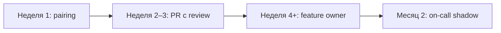

# Онбординг-пакет в базе знаний

<div class="article-tags">
  <span class="tag tag-required">ОБЯЗАТЕЛЬНО</span>
  <span class="tag tag-beginner">ДЛЯ НОВИЧКОВ</span>
</div>

<div class="callout callout--info">
  <div class="callout-title">Связь с другими статьями</div>
  <div class="callout-body">
  Полный маршрут входа в проект — <a href="/encyclopedia/7-project/7-17-nachalo-raboty-na-proekte/7">7.17/7</a>.
  Wiki — <a href="./22">структура базы знаний</a>.
  Jira — <a href="./21">настройка трекера</a>.
  QA onboarding — <a href="/encyclopedia/7-project/7-05-testirovanie/100">добро пожаловать в тестирование</a>.
  </div>
</div>

---

## Что такое онбординг-пакет

**Онбординг-пакет** — одна страница-**маяк** (landing page) в wiki или Confluence со ссылками и чек-листами на **первый день, первую неделю, первый месяц**.

Фраза "читай wiki" на 500 страниц **без маршрута** онбордингом не является. Новый человек тратит недели на поиск "как подключиться к VPN" вместо первого PR.

### Цели онбординг-пакета

| Цель | Метрика |
|------|---------|
| Безопасность и доступы | 100% 2FA, нет секретов в личке |
| Первый PR | ≤ 3–5 рабочих дней |
| Понимание процесса | Знает DoR/DoD, трекер, review |
| Самостоятельность | Первая фича без постоянного pairing — 4–8 недель (junior) |
| Удержание | Опрос 30 дней: что не хватило |

### Кто отвечает

| Роль | Задача |
|------|--------|
| **HR / IT** | Учётка, ноутбук, VPN |
| **Buddy** | Первый контакт, вопросы "куда кликнуть" |
| **Тимлид** | Задачи, ожидания, 1-on-1 |
| **Tech writer / lead** | Актуальность wiki-страницы |

---

## Структура страницы "Добро пожаловать"

Рекомендуемая структура одной страницы:

```markdown
# Добро пожаловать в [Project / Team]

Ты: [роль] | Buddy: @name | Тимлид: @lead | Старт: YYYY-MM-DD

## Быстрые ссылки
- Git: ...
- Jira: ...
- Wiki: ...
- Chat: ...

## День 1
[чек-лист]

## Неделя 1
[чек-лист]

## Месяц 1
[чек-лист]

## По ролям
[таблица доп. материалов]
```

---

## День 1

Первый день — **доступы, контекст, локальный запуск**. Не ожидайте production-кода.

### Чек-лист дня 1

- [ ] **Учётная запись** корпоративная, email работает
- [ ] **VPN** и **2FA** настроены (Git, wiki, облако)
- [ ] **Git** — доступ к нужным репозиториям, SSH key или token
- [ ] **Трекер** (Jira/YouTrack) — добавлен в проект, просмотрен board
- [ ] **Wiki** — bookmark на эту страницу онбординга
- [ ] **Чат** (Slack/Teams/Telegram work) — в каналах команды
- [ ] **Buddy**: **ФИО**, контакт, слот intro-call 30–60 мин
- [ ] [Культура кода](/encyclopedia/7-project/7-10-kultura-koda/1) — прочитать 30 мин
- [ ] **README** главного репо — прочитать
- [ ] **Локальный запуск** по README — **доказательство** (скриншот `/health` или лог "Server started")
- [ ] Календарь: daily, 1-on-1 с тимлидом на неделе 1

<div class="callout callout--tip">
  <div class="callout-title">Доказательство setup</div>
  <div class="callout-body">
  Попросите скрин или paste лога в тикет ONBOARD-1 или в чат buddy. Так видно, где README устарел — обновите wiki для следующих.
  </div>
</div>

### Типичные блокеры дня 1

| Блокер | Куда идти |
|--------|-----------|
| Нет доступа к Git | IT + тимлид |
| VPN не пускает | IT helpdesk |
| README не работает на Windows/Mac | Buddy + fix README PR |
| Непонятно, кто PO | Тимлид |

### Intro-call с buddy (agenda 45 мин)

1. Карта команды: кто за что (5 мин).
2. Демо продукта руками (10 мин).
3. Screen share: clone, install, run (20 мин).
4. Где задавать вопросы, когда не стесняться (5 мин).
5. Задача на завтра: тикет "good first issue" (5 мин).

---

## Неделя 1

Неделя 1 — **процесс, первый PR, архитектурный обзор**.

### Чек-лист недели 1

- [ ] **Процесс**: [Scrum](/encyclopedia/7-project/7-14-scrum/intro) или [Kanban](/encyclopedia/7-project/7-18-kanban/intro) — прочитать wiki 1 стр
- [ ] **DoR/DoD** ([7.25](/encyclopedia/7-project/7-25-dostavka-i-gotovnost/intro)) — знать, когда задача готова к review
- [ ] Участие в **daily** (слушать, задавать 1–2 вопроса)
- [ ] **Первый PR** с code review (doc fix, мелкий bug, test — нормально)
- [ ] **Диаграмма архитектуры** — просмотр с buddy или тимлидом 30 мин
- [ ] [ADR](/encyclopedia/7-project/7-20-adr-i-arhitekturnaya-pamyat/intro) — прочитать 2–3 последних решения
- [ ] **Среды**: dev, stage, prod — что где деплоится ([7.17/3](/encyclopedia/7-project/7-17-nachalo-raboty-na-proekte/3))
- [ ] Завести **один** тикет самостоятельно (draft → review у buddy)

### Первая задача — критерии хорошего "first ticket"

| Хорошо | Плохо |
|--------|-------|
| Чёткие AC | "Разберись с модулем X" |
| Изолированный модуль | Критичный payments без ментора |
| Есть пример похожего PR | Нет контекста |
| Оценка ≤ 1–2 дня | Epic на неделю |

### Git и review в неделю 1

- ветка `PROJ-123-...` ([21](./21));
- PR с описанием: что, зачем, как проверить;
- ответ на комментарии review в тот же день, если возможно.

---

## Месяц 1

Месяц 1 — **самостоятельная поставка, инциденты, обратная связь**.

### Чек-лист месяца 1

- [ ] **Самостоятельная** фича или баг **средней** сложности (от grooming до Done)
- [ ] Участие в **инциденте** или учебном **fire-drill** ([7.21](/encyclopedia/7-project/7-21-incidenty-i-ekspluatatsiya/1))
- [ ] Прочитать **1 runbook** on-call ([22](./22))
- [ ] **Обратная связь 1-on-1** с тимлидом ([7.02/142](/encyclopedia/7-project/7-02-komanda-i-upravlenie/142))
- [ ] **Retro** — высказать одно улучшение процесса (можно мелочь)
- [ ] Обновить wiki: **FAQ setup** — если нашли ошибку в README, PR в doc
- [ ] Опрос онбординга (форма 5 вопросов)

### Уровни самостоятельности



### Fire-drill без real P1

Учебный сценарий на stage:

1. Тимлид симулирует алерт в чате.
2. Новый сотрудник открывает runbook, выполняет шаги 1–3 с buddy.
3. Debrief 15 мин: что непонятно в wiki.

---

## По ролям

Базовый пакет один; **дополнительные** ссылки по роли:

| Роль | Доп. материалы | Первая цель |
|------|----------------|-------------|
| **Backend** | [Git workflow](/encyclopedia/4-code-dev/4-13-osnovy-raboty-s-git/112), ADR, OpenAPI | API endpoint + test |
| **Frontend** | Стайлгайд UI, Storybook, Figma ссылка | Страница / компонент |
| **QA** | [Добро пожаловать в тестирование](/encyclopedia/7-project/7-05-testirovanie/100) | Первый баг-репорт |
| **BA / Analytic** | [Аналитика intro](/encyclopedia/7-project/7-04-analitika/intro), AC | Уточнение 1 story |
| **DevOps** | [CI/CD intro](/encyclopedia/8-infra-security/8-04-devops-ci-cd/intro), runbooks | PR в pipeline |
| **Mobile** | Сборка iOS/Android, TestFlight / internal track | Smoke на device |

---

## Шаблоны страниц в wiki

Дополните онбординг-пакет **дочерними** страницами:

### Карта репозиториев

| Репозиторий | Назначение | Stack |
|-------------|------------|-------|
| `org/orders-api` | Backend заказов | Go |
| `org/web-app` | SPA | React |
| `org/infra` | Terraform | — |

### Контакты

| Роль | Имя | Когда беспокоить |
|------|-----|------------------|
| PO | ... | Приоритеты, AC |
| Тимлид | ... | Блокеры, карьера |
| On-call | ... | P1 (см. runbook) |
| IT helpdesk | ... | Доступы, VPN |

### Глоссарий домена

10–30 терминов: **заказ**, **корзина**, **merchant**, **settlement** — с ссылкой на аналитику.

### FAQ setup

| Проблема | Решение |
|----------|---------|
| `npm ERR!` node version | nvm use 20 |
| Docker out of disk | prune, wiki link |

Обновляет **последний** прошедший онбординг — правило boy scout.

---

## Метрики онбординга

| Метрика | Цель | Как мерить |
|---------|------|------------|
| Time to **first PR** | ≤ 3–5 дней | Jira/Git first commit |
| Time to **productive** | 4–8 нед (junior) | Первая story Done solo |
| Time to **first incident** participation | ≤ 6 нед | Shadow on-call |
| **30-day survey** score | ≥ 4/5 | Google Form |
| Wiki gaps reported | → fixed ≤ 2 нед | Tickets labeled `onboarding` |

<div class="callout callout--warning">
  <div class="callout-title">Не KPI для наказания</div>
  <div class="callout-body">
  Метрики онбординга — для улучшения пакета. Если все junior > 10 дней до PR — проблема в README или доступах, не в людях.
  </div>
</div>

### Опрос через 30 дней (пример)

1. Что было самым полезным в онбординг-пакете?
2. Чего не хватило?
3. README локального запуска актуален? (1–5)
4. Buddy был доступен? (1–5)
5. Понятны процесс и ожидания? (1–5)

---

## Удалённый онбординг

| Практика | Детали |
|----------|--------|
| **Overlap часов** | 4 ч общего рабочего окна с buddy |
| **Запись** intro-сессий | В internal wiki, с согласия |
| **Async чек-листы** | Тикет ONBOARD с subtasks |
| **Pairing** | VS Code Live Share, Code With Me |
| **Камера на intro** | По желанию, не принуждать |
| **Доставка оборудования** | За 3–5 дней до start date |

См. [удалённая команда](/encyclopedia/7-project/7-23-udalennaya-komanda/1).

---

## Онбординг для аутстафф / смены проекта

Если человек **опытный**, но новый **проект клиента**:

- сократите день 1 до доступов + политики клиента;
- неделя 1 — их Jira workflow, coding standards клиента;
- buddy со стороны **клиента**, не только employer.

---

## Пример: онбординг-пакет (фрагмент)

```markdown
# Добро пожаловать в Team Payments

Buddy: @maria | TL: @alex | PO: @dmitry

## День 1
- [ ] VPN + GitLab group `payments`
- [ ] Clone payments-api, run `./dev-up.sh`
- [ ] Скрин localhost:8080/health → коммент в PAY-ONB-1

## Неделя 1
- [ ] Прочитать DoD (ссылка)
- [ ] PR: fix typo in README (PAY-102)

## Месяц 1
- [ ] Story PAY-200: webhook retry logic
- [ ] Shadow on-call пятница 2026-04-04
```

---

## FAQ

**Кто обновляет онбординг-пакет?**

Владелец — тимлид или rotating developer каждый квартал.

**Нужен ли отдельный пакет на каждый microservice?**

Один пакет на **команду**; карта репозиториев внутри.

**Junior vs Middle onboarding?**

Middle — сжатый день 1, больше ownership с недели 2; структура та же.

**Онбординг в Confluence или Git?**

Landing в Confluence для HR ссылок; техническая часть дублирует README + ссылка на [docs-as-code](./23).

---

## Месяц 2 и дальше

После первого месяца онборинг не заканчивается — меняется фокус.

### Чек-лист месяца 2

- [ ] Участие в **planning** с собственной оценкой (с review тимлида)
- [ ] **On-call shadow** или дежурство по runbook (если принято в команде)
- [ ] Презентация 5 мин на **tech sync**: "что я изучил в модуле X"
- [ ] Менторство следующего новичка (если вы уже не самый новый)
- [ ] Обновление **одной** wiki-страницы по итогам вашего опыта setup

### Признаки успешного онбординга

| Признак | Описание |
|---------|----------|
| Автономность | Берёте task из Ready без "куда кликнуть" |
| Качество PR | Меньше round-trip на review |
| Процесс | Сами переводите тикеты по workflow |
| Коммуникация | Эскалируете блокеры до daily |
| Домен | Объясняете фичу новому коллеге |

---

## См. также

- [Jira/YouTrack](./21)
- [Wiki/Confluence](./22)
- [Запуск проекта](/encyclopedia/7-project/7-17-nachalo-raboty-na-proekte/intro)
- [Культура команды](/encyclopedia/7-project/7-02-komanda-i-upravlenie/2)
- [Добро пожаловать в тестирование](/encyclopedia/7-project/7-05-testirovanie/100)

---
