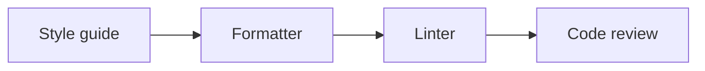

import NamingConventionPlay from '@site/src/components/NamingConventionPlay.jsx';
import CodeStylePlay from '@site/src/components/CodeStylePlay.jsx';

# Культура написания и поддержки кода

<div class="article-tags">
  <span class="tag tag-required">ОБЯЗАТЕЛЬНО</span>
  <span class="tag tag-beginner">ДЛЯ НОВИЧКОВ</span>
</div>

<span class="complexity-badge">Разработчику</span>
<span class="complexity-badge">Архитектору</span>

Код пишут люди, а читают его — те же люди через неделю, месяц или после отпуска коллеги. **Культура кода** помогает снизить цену этих чтений: единые имена, автоматическое форматирование, комментарии там, где без контекста не обойтись, и ревью, в котором обсуждают смысл, а не "мне не нравится стиль".

Синтаксис языка вы уже учите в разделах про языки программирования. Здесь — **как оформлять и сопровождать** код в команде, чтобы он оставался понятным без устных легенд.

Подробнее про метрику "запутанности" функций — в статье [Цикломатическая сложность и читаемость кода](./2). Правило сопоставления кода с предметной областью (MAPPER) — в [отдельной статье](./5); по симптому в коде — [справочник тем](./13).

<div class="callout callout--tip">
  <div class="callout-title">Стандарты и «разбитые окна»</div>

  <div class="callout-body">
  Единый стиль (форматтер, линтер, код на английском в идентификаторах) снимает споры в PR. Правило бойскаутов: оставить файл чище, чем нашли. См. также <a href="./13">справочник тем</a>.
  </div>
</div>

---

## Соглашения об именовании

★ **Соглашения об именовании** — правила, которые определяют, как называть переменные, методы, классы, поля и другие элементы кода. Они делают код предсказуемым: открыв файл на C# или Python, вы уже знаете, чего ждать от `UserAccount` и `user_account`.

**Основные стили именования:**

<NamingConventionPlay />

<CodeStylePlay />

| Стиль | Вид | Обычно применяют |
|-------|-----|------------------|
| **camelCase** | `firstName` | переменные, параметры, методы (в JS, Java, C# для полей) |
| **PascalCase** | `FirstName` | классы, методы (C#), типы |
| **snake_case** | `first_name` | переменные и функции в Python, константы в Rust |
| **UPPER_SNAKE_CASE** | `MAX_AGE` | константы времени компиляции, env-подобные значения |
| **kebab-case** | `main-header` | URL, CSS-классы, имена файлов в вебе |

---

### Примеры по стилям

**camelCase** — первое слово с маленькой буквы, каждое следующее с заглавной:

```csharp
int age;
string firstName;
double totalAmount;
```

**PascalCase** — каждое слово с заглавной (классы, в C# — методы и свойства):

```csharp
class UserAccount { }

void CalculateTotal() { }

string FullName { get; set; }
```

**snake_case** — слова в нижнем регистре через `_` (типично для Python):

```python
user_age = 25
full_name = "John Doe"

def calculate_total():
    pass
```

**UPPER_SNAKE_CASE** — константы:

```javascript
const MAX_AGE = 100;
const DEFAULT_NAME = "Unknown";
```

**kebab-case** — в CSS и разметке:

```css
.main-header {
    color: red;
}
```

---

## Соглашения в разных языках

Один проект — один стиль. Ниже — **типичные** соглашения; у вашей команды может быть свой style guide — он важнее таблицы.

---

### C#

| Элемент | Стиль |
|---------|--------|
| Классы | PascalCase |
| Методы, свойства | PascalCase |
| Параметры, локальные переменные | camelCase |
| Приватные поля | `_` + camelCase (`_lastName`) |
| Константы | PascalCase (`MaxAge`) или UPPER_SNAKE для внешних/legacy API |

```csharp
class UserAccount { }

void CalculateTotal() { }

int age;
string firstName;

private string _lastName;

const int MaxAge = 100;
```

---

### Java

| Элемент | Стиль |
|---------|--------|
| Классы | PascalCase |
| Методы, поля | camelCase |
| Константы (`static final`) | UPPER_SNAKE_CASE |

```java
class UserAccount { }

void calculateTotal() { }

int age;
String firstName;

private String lastName;

final int MAX_AGE = 100;
```

---

### Python

| Элемент | Стиль |
|---------|--------|
| Классы | PascalCase |
| Функции, переменные | snake_case |
| "Приватные" поля | `_` + snake_case (соглашение, не строгая изоляция) |
| Константы модуля | UPPER_SNAKE_CASE |

```python
class UserAccount:
    pass

def calculate_total():
    pass

user_age = 25

class User:
    def __init__(self):
        self._private_field = "secret"

MAX_AGE = 100
```

---

### JavaScript / TypeScript

| Элемент | Стиль |
|---------|--------|
| Классы | PascalCase |
| Функции, переменные | camelCase |
| Приватные поля (ES2022+) | `#fieldName` |
| Константы | UPPER_SNAKE_CASE или camelCase по гайду проекта |

```javascript
class UserAccount {}

let userAge = 25;
function calculateTotal() {}

class User {
    #secret = "value";           // настоящее private-поле
    _legacyPrivate = "convention"; // только соглашение, не защита
}

const MAX_AGE = 100;
```

---

## Осмысленные имена

Имя — мини-документация. Хорошее имя отвечает хотя бы на два вопроса: **что хранится** и **в каком контексте** (единицы, роль в домене).

| Слабо | Лучше | Почему |
|-------|-------|--------|
| `data`, `info` | `activeUsers`, `invoiceLineItems` | Видна предметная область |
| `addrLn` | `addressLine` | Не нужно расшифровывать аббревиатуру |
| `Versi(...)` | `isFeatureEnabled(...)` | Понятно при поиске и в стеке вызовов |
| `uEmailAddressForUserLogin123` | `loginEmail` | Длина без смысла мешает читать |

**Короткие имена** (`i`, `j`, `n`) нормальны, когда область видимости маленькая — классический цикл:

```csharp
for (var i = 0; i < orders.Count; i++)
{
    Process(orders[i]);
}
```

В глобальной области, в публичном API и в методах на 200 строк `i` и `tmp` — уже нет.

**Аббревиатуры** оставляйте, если они приняты в проекте (`id`, `url`, `http`) или есть в глоссарии заказчика. Всё остальное лучше писать словами.

Роберт Мартин и Стив Макконнелл в книгах о коде сходятся: имя должно объяснять **намерение**, а не деталь реализации, которая завтра сменится.

Проверку стиля имен удобно отдать **линтеру** (eslint, pylint, StyleCop) — тогда в ревью не спорят о регистре букв.

---

## Дополнительные соглашения

**Булевы переменные** — префиксы `is`, `has`, `can`, `should`:

```csharp
bool isActive;
bool hasPermission;
bool canEdit;
```

**Интерфейсы** в C# и Java часто с префиксом `I` (в Java тренд смещается к имени роли без `I` — смотрите гайд проекта):

```csharp
interface IUserRepository { }
```

**События** — прошедшее время или `On` + имя:

```csharp
event EventHandler Clicked;
void OnSaveClicked() { }
```

**Файлы** обычно совпадают с главным типом: `UserAccount.cs`, `user_account.py`.

---

## Форматирование и стиль

Форматирование — про **пробелы, отступы, переносы строк**. Оно не меняет логику, но сильно влияет на скорость чтения и на то, как выглядит diff в ревью.

В Python опираются на [PEP 8](https://peps.python.org/pep-0008/) (4 пробела, разумная длина строки). В JavaScript/TypeScript часто берут [Google JS Style Guide](https://google.github.io/styleguide/jsguide.html) или правила команды.

---

### Три слоя единообразия



1. **Style guide** — текстовые правила ("как мы пишем").
2. **Formatter** — автоматически правит отступы и переносы (Prettier, Black, `dotnet format`).

```bash
dotnet format
```
3. **Linter** — ищет потенциальные ошибки и спорные места (ESLint, Pylint, Checkstyle).
4. **Review** — то, что машина не поймала: архитектура, имена, бизнес-логика.

| Инструмент | Роль | Заметка |
|------------|------|---------|
| Prettier | Форматтер JS/TS/CSS/JSON | Мало настроек — зато нет вечных споров |
| Black | Форматтер Python | "Один стиль для всех" |
| ESLint | Линтер JS/TS | Может включать правила стиля, но ядро — качество кода |
| Checkstyle | Линтер Java | Имена, сложность, импорты |

**EditorConfig** (`.editorconfig`) в корне репозитория задаёт базу: кодировка, концы строк, размер отступа — до запуска любого форматтера.

---

### `#region` в C#

Директивы `#region` / `#endregion` только сворачивают блоки в IDE; на выполнение не влияют.

```csharp
#region Поля и свойства
private string name;
public string Name { get; set; }
#endregion

#region Методы
public void PrintName() => Console.WriteLine(name);
#endregion
```

Во многих командах регионы **не приветствуют**: лучше разбить класс на несколько файлов или типов, чем прятать "простыню" за сворачиваемыми блоками. Если используете — короткие понятные названия, без глубокой вложенности.

---

## Комментарии

**Самодокументируемый код** — когда структура и имена объясняют *что происходит*. Комментарий нужен, когда в коде не видно *почему* так сделано: ограничение API, требование регулятора, временный workaround с номером задачи.

| Плохо | Лучше |
|-------|--------|
| `// увеличиваем счётчик` над `count++` | Убрать комментарий, переименовать в `incrementActiveUserCount()` |
| `// цикл по пользователям` | Убрать; имя коллекции `users` уже достаточно |
| Без комментария при `status == 3` | `// В legacy-БД 3 = архив, не "удалён" (см. TASK-1204)` |

```python
# Плохо: дублирует код
for user in users:  # перебираем пользователей
    send_reminder(user)

# Лучше — контекст, которого нет в типах
# Напоминания только по будням — требование SLA договора 2023-14
for user in users:
    send_reminder(user)
```

**Устаревший комментарий** вводит в заблуждение сильнее, чем его отсутствие. Правило простое: меняете поведение — в том же PR обновляете или удаляете комментарий. На ревью это так же важно, как тесты.

Аннотации (`@Override`, `@Deprecated`) и структурированная документация (см. ниже) — отдельный слой: они для IDE и генерации справки, не вместо ясных имён.

---

## XML-документация и аналоги в других языках

**Обычный комментарий** — для людей в файле. **XML-doc / JSDoc / docstring** — для подсказок IDE, генерации HTML-справки и контракта публичного API.

---

### C# (XML)

Комментарии с `///` и тегами `<summary>`, `<param>`, `<returns>`:

```csharp
/// <summary>
/// Модель пользователя в системе.
/// </summary>
public class User
{
    /// <summary>
    /// Создаёт пользователя с указанным именем и возрастом.
    /// </summary>
    /// <param name="name">Отображаемое имя.</param>
    /// <param name="age">Возраст в полных годах.</param>
    public User(string name, int age)
    {
        Name = name;
        Age = age;
    }

    /// <summary>
    /// Проверяет, достиг ли пользователь 18 лет.
    /// </summary>
    /// <returns><c>true</c>, если возраст ≥ 18.</returns>
    public bool IsAdult() => Age >= 18;

    public string Name { get; set; }
    public int Age { get; private set; }
}
```

Частые теги:

| Тег | Назначение |
|-----|-----------|
| `<summary>` | Краткое описание (IntelliSense) |
| `<param name="...">` | Параметр метода |
| `<returns>` | Возвращаемое значение |
| `<exception cref="...">` | Какие исключения возможны |
| `<example>` | Пример вызова |

В `.csproj` для генерации XML при сборке:

```xml
<PropertyGroup>
  <GenerateDocumentationFile>true</GenerateDocumentationFile>
</PropertyGroup>
```

Документацию собирают DocFX, Sandcastle или встроенные средства Visual Studio.

---

### JavaScript (JSDoc)

```javascript
/**
 * Пользователь системы.
 * @param {string} name
 * @param {number} age
 */
function User(name, age) {
    this.name = name;
    this.age = age;
}

/**
 * @returns {boolean}
 */
User.prototype.isAdult = function () {
    return this.age >= 18;
};
```

---

### Java (Javadoc)

```java
/**
 * Пользователь системы.
 */
public class User {
    /**
     * @param name имя пользователя
     * @param age возраст в годах
     */
    public User(String name, int age) { /* ... */ }

    /**
     * @return true, если возраст ≥ 18
     */
    public boolean isAdult() { return age >= 18; }
}
```

---

### Python (docstring)

```python
class User:
    """Пользователь системы."""

    def __init__(self, name: str, age: int):
        """
        :param name: отображаемое имя
        :param age: возраст в полных годах
        """
        self.name = name
        self.age = age

    def is_adult(self) -> bool:
        """True, если возраст ≥ 18."""
        return self.age >= 18
```

Стили docstring (Google, NumPy, Sphinx) выбирает проект; главное — единообразие.

---

### Go (godoc)

Комментарий **непосредственно перед** объявлением, без спецтегов:

```go
// User — пользователь системы.
type User struct {
    Name string
    Age  int
}

// IsAdult сообщает, достиг ли пользователь 18 лет.
func (u User) IsAdult() bool {
    return u.Age >= 18
}
```

---

## IntelliSense и навигация в IDE

**IntelliSense** (в Visual Studio) — общее имя для подсказок при вводе: автодополнение, сигнатура метода, тип под курсором, переход к определению. В JetBrains это Smart Completion, в VS Code — Language Server (Pylance, TypeScript и т.д.).

Зачем писать `///` и JSDoc: при вызове `user.IsAdult()` IDE покажет ваш `<summary>` / описание — не нужно открывать файл реализации для каждой мелочи.

**Go to Definition** (Ctrl+клик / F12) — переход к объявлению. **Peek Definition** — просмотр кода во всплывающем окне без смены файла.


Под капотом: парсер строит **AST**, language service добавляет типы и ошибки (Roslyn, TypeScript Language Service, Pyright). Документация в комментариях подхватывается тем же анализом.

Современные IDE и плагины (Copilot и аналоги) дополняют, но не отменяют договорённости команды: сгенерированный код тоже нужно именовать и форматировать по правилам проекта.

---

## Принципы, которые поддерживают читаемость

Кратко — с примерами. Подробнее про ООП и паттерны — в соответствующих разделах энциклопедии.

---

### KISS — делай проще

Выбирайте решение, которое закрывает **текущую** задачу без лишних слоёв. Расшифровка "Keep It Simple" иногда дополняют словом *Straightforward* — суть та же: не усложнять "на вырост".

---

### DRY — не повторяй знание

```typescript
// Плохо: одна и та же проверка email в пяти формах
if (!value.includes("@")) throw new Error("...");

// Лучше
function isValidEmail(value: string): boolean {
  return /^[^\s@]+@[^\s@]+\.[^\s@]+$/.test(value);
}
```

DRY про **логику и правила**, не про побайтовое совпадение двух строк, которые случайно похожи.

---

### YAGNI — не пиши "на будущее" без запроса

Фабрики, абстракции и параметры "на всякий случай" увеличивают объём кода, который придётся читать и тестировать, даже если фича не понадобится.

---

### SRP — одна ответственность у модуля

```csharp
// Плохо: валидация, расчёт и отправка письма в одном методе
void ProcessOrder(Order o) { /* 200 строк */ }

// Лучше: отдельные шаги с говорящими именами
void ProcessOrder(Order o)
{
    Validate(o);
    var total = CalculateTotal(o);
    NotifyCustomer(o, total);
}
```

---

### Закон Деметры — меньше цепочек

```csharp
// Хрупко: знание внутренней структуры заказа
var city = order.Customer.Address.City;

// Лучше: спросить у доменного объекта
var city = order.GetDeliveryCity();
```

---

### CQS — команда или запрос

Метод либо **меняет состояние** (команда), либо **возвращает данные** (запрос), но не оба сразу без явной причины. Так проще рассуждать о побочных эффектах.

---

### SOLID

Набор из пяти принципов ООП-проектирования (единственная ответственность, открытость/закрытость, подстановка Лисков, разделение интерфейсов, инверсия зависимостей). Они помогают держать модули узкими и заменяемыми — см. [чек-лист](./4), вопросы 9–13.

---

### TDD — красный → зелёный → рефакторинг

1. Написать падающий тест на поведение.
2. Минимальный код, чтобы тест прошёл.
3. Улучшить структуру, тесты остаются зелёными.

TDD не обязателен везде, но полезен, когда логика легко ломается при правках.

---

## Культура в команде — ревью и тон

**Просмотр кода** (code review, рецензирование, инспекция кода) — систематическая проверка изменений **до** слияния в общую ветку. Цели двойные: найти дефекты, уязвимости и несоответствие требованиям **и** поднять общий уровень команды (обмен знаниями, единый стиль).

На ревью смотрят не только «работает ли», но и:

- соответствие [соглашениям именования и форматированию](#соглашения-об-именовании) (часть снимает CI и линтер);
- рост [цикломатической сложности](./2) и [запахов кода](/encyclopedia/4-code-dev/4-02-chto-takoe-kod-i-kak-on-rabotaet/612);
- тесты на новое поведение и регрессию;
- границы модулей, безопасность (утечки, гонки, переполнения буфера там, где это уместно для стека).

В **экстремальном программировании** обычное «один проверяет код другого» доведено до **парного программирования** — непрерывный совместный просмотр в момент написания. Для распределённых команд тот же смысл даёт обязательный review в Git (GitHub, GitLab) плюс статический анализ.

| Категория | Практика | Пример |
|-----------|----------|--------|
| Именование | Описательные имена в публичном API | `totalUsers` вместо `tu` |
| Стиль | Соглашения языка + форматтер | Prettier / Black в pre-commit |
| Комментарии | "Зачем", не "что" | Ссылка на задачу для workaround |
| Сложность | Обсуждать рост ветвлений | См. [статью 2](./2) |
| Ревью | Небольшие PR, вопросы без ярлыков | "Рассмотрите вынос валидации" |
| Безопасность обсуждений | Ошибка — повод улучшить процесс | Нормы ревью в README или wiki |

Размер pull request **200–400 строк** (ориентир) — способ сохранить внимание ревьюера. Огромный diff лучше дробить по смыслу; крупный рефакторинг отделяют от фичи, чтобы ревьюеры видели **либо** поведение, **либо** структуру.

**Психологическая безопасность** — когда можно спросить "не понял этот кусок" без страха насмешки. Её поддерживают явные правила ревью: комментарий к коду, не к человеку; критерии "approve"; эскалация споров к тимлиду, а не к чату "кто виноват".

Автоматизация (форматтеры, линтеры, статический анализ) снимает рутину; **AI-помощники** ускоряют черновик, но финальную ответственность за имена, границы модулей и тесты несёт автор PR.

---

## Краткая шпаргалка

1. Имена и формат — по гайду проекта; спорные места ловит tooling.
2. Комментарий — про контекст, который не выразить именем.
3. Публичный API — XML-doc / JSDoc / docstring.
4. Функция разрастается — смотрите [цикломатическую сложность](./2) и дробите по смыслу.
5. Перед merge — [чек-лист](./4) и зелёные тесты/линтер локально.

Дальше: [Цикломатическая сложность](./2) → [MAPPER](./5) → [Итоги](./3). По симптому в коде — [справочник тем](./13).

---
