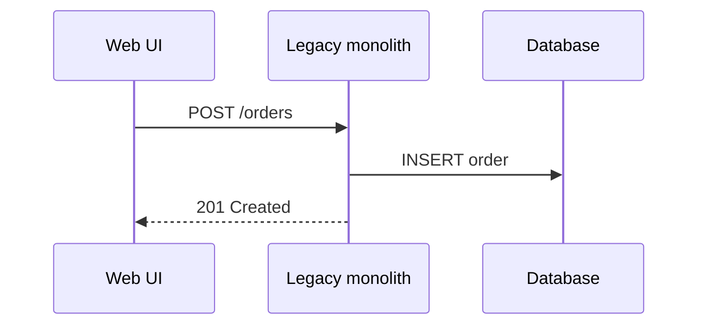

import ExternalPlayEmbed from '@site/src/components/ExternalPlayEmbed';

# Понимание легаси-системы

  ОБЯЗАТЕЛЬНО
  ДЛЯ НОВИЧКОВ

Разработчику
Архитектору

  
Теория данных (раздел 3)

  

  Миграция схем и CDC — [Пакетная работа](/encyclopedia/3-data-markup/3-11-analiz-dannyh/433), [опорные темы БД](/encyclopedia/3-data-markup/3-05-osnovy-baz-dannyh/12). Сверка — [SQL для тестировщика](/encyclopedia/7-project/7-05-testirovanie/129).
  

Прежде чем менять легаси, нужно **снизить неопределённость**: что система делает, от чего зависит, какие "странности" — баги, а какие — контракт с бизнесом или законом. Эта статья — про исследование, рефакторинг — в [следующей](./3).

Назад: [определения и признаки](./1). Дальше: [безопасные изменения](./3).

---

## Реверс-инжиниринг

**Реверс-инжиниринг** (обратная разработка) — анализ продукта, чтобы восстановить **поведение и структуру**, когда документации нет или она не совпадает с реальностью. Исходники могут быть, но настолько запутаны, что проще читать систему как "чёрный ящик" снаружи.

Цель в легаси — перейти от "не понимаю" к **управляемой модели**: диаграммы, список API, бизнес-правила, карта зависимостей.

---

### Этапы

1. **Сбор артефактов** — исходники, бинарники, конфиги, логи, скриншоты UI, мануалы пользователей, экспорт API из шлюза; история изменений — [Основы Git — о разделе](/encyclopedia/4-code-dev/4-13-osnovy-raboty-s-git/intro).
2. **Статический анализ** — без запуска: AST, граф вызовов, поиск дубликатов, декомпиляция байткода ([Выполнение кода — о разделе](/encyclopedia/4-code-dev/4-03-vypolnenie-koda/intro)).
3. **Динамический анализ** — запуск в песочнице: профилирование, перехват syscalls, запись HTTP-трафика ([Разработка и отладка — о разделе](/encyclopedia/4-code-dev/4-14-razrabotka-i-otladka/intro)).
4. **Формализация** — [UML/C4](/encyclopedia/7-project/7-04-analitika/1231), OpenAPI, описание правил ("скидка VIP = 10% с округлением вниз").
5. **Проверка гипотез** — маленькая правка или тестовый сценарий + наблюдение (см. [тесты](./3)).

---

### Инструменты (ориентир)

| Область | Примеры |
|---------|---------|
| Бинарники (натив) | Ghidra, IDA Pro, Radare2, Binary Ninja |
| .NET / JVM | dotPeek, ILSpy, JD-GUI, CFR |
| Веб/API | Burp Suite, mitmproxy, Fiddler, Wireshark |
| Графы и зависимости | Understand, CodeQL, Sourcegraph, OpenGrok |
| ОС (динамика) | strace, ltrace, Process Monitor, Frida |

Инструменты **ускоряют** понимание, но не заменяют вопросы к бизнесу и к коллегам.

---

## Восстановление контекста

Код связан с историей: строка когда-то закрывала **конкретный инцидент**, дедлайн или ограничение платформы. Без контекста "лишний" `if` удаляют — и ломают отчёт для регулятора.

---

### Git и история изменений

Даже урезанная история полезна: `git log`, `git blame`, поиск по сообщению задачи (`JIRA-1234`). Иногда старый репозиторий лежит в бэкапе или на машине бывшего сотрудника — стоит спросить до переписывания.

<ExternalPlayEmbed example="about/git-emulator" title="Git Emulator" minHeight={420} />

**На что смотреть в истории:**

- когда появился "странный" блок и в каком тикете;
- кто последний трогал критичный модуль;
- были ли откаты (`revert`) — признак хрупкого места.

---

### Люди, логи, регламенты

- **Интервью** с бывшими разработчиками, аналитиками, поддержкой — даже фрагменты памяти сужают поиск.
- **Логи и аудит** — корреляция инцидентов с версией деплоя.
- **Закон и стандарты** — округление денег, хранение ПДн, отраслевые форматы.
- **Документация пользователей и тикеты** — "так и задумано" часто описано только там.

Результат — **записанное понимание** (Markdown в репо, ADR, wiki), а не только в голове одного человека.

---

## Диаграммы по коду

Текст репозитория на сотни тысяч строк не читается линейно. Диаграммы — сжатая карта для онбординга и планирования рефакторинга.

| Тип | Зачем |
|-----|--------|
| **Граф зависимостей** | циклы, "божественные" модули, куда бить первым |
| **Sequence** | сценарий "создание заказа" по логам или трейсу |
| **C4** (система → контейнер → компонент) | отделить монолит от БД и интеграций |
| **Call graph** | глубокие цепочки в процедурном коде |

Инструменты: Structurizr, PlantUML, Mermaid, Code2Flow для flowchart функции.

**Практика:** хранить диаграммы **рядом с кодом** (`docs/architecture/`), обновлять при смене границ модулей — иначе через год они станут второй "врущей" документацией.

Пример фрагмента Mermaid для интеграции:

---

## Анализ скомпилированных бинарников

Иногда исходников нет: поставщик дал только `.dll`, прошивка MCU, старый exe на сервере.

---

### Статика и динамика

- **Статика** — `objdump`, `readelf`, Ghidra: строки, импорты/экспорты, псевдокод.
- **Динамика** — запуск в изолированной среде + strace / Process Monitor / Frida.

Для **.NET, Java, Kotlin на JVM** байткод с метаданными часто декомпилируется почти в исходник с именами типов. Для **C/C++** — псевдокод и догадки; важны сигнатуры и точки интеграции для обёрток.

---

### Легаси-код - работа с чужой и старой базой

Даже без полного реверса нужно понять:

- какие функции вызывать из обёртки;
- форматы структур на границе;
- побочные эффекты (файлы, реестр, сеть).

Дальше пишут **адаптер** с тестами на границе — см. [безопасные изменения](./3) и [Anti-Corruption Layer](./4).

---

## Что зафиксировать перед первой правкой

Краткий чек-лист исследования:

1. Критичный сценарий для бизнеса (один end-to-end путь).
2. Входы/выходы модуля, внешние системы.
3. Известные "аномалии" и подтверждённые бизнесом правила.
4. Карта зависимостей хотя бы на 1–2 уровня вглубь.
5. Где можно поставить лог/метрику без релиза "всего мира".

С этим набором можно переходить к тестам и рефакторингу — [статья 3](./3).

---
