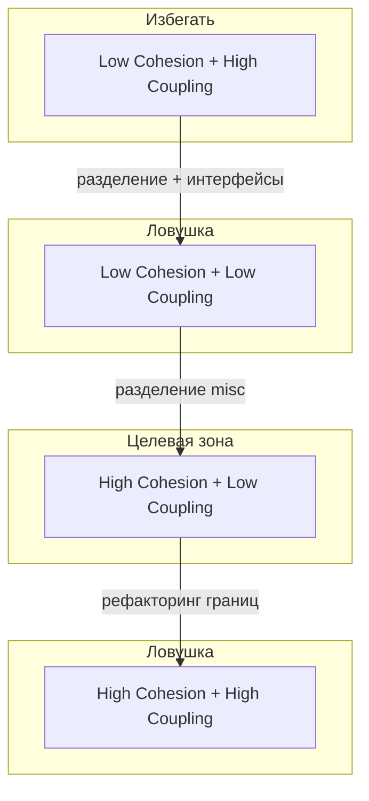

# Связность и сцепление модулей

<div class="article-tags">
  <span class="tag tag-required">ОБЯЗАТЕЛЬНО</span>
  <span class="tag tag-beginner">ДЛЯ НОВИЧКОВ</span>
</div>

<span class="complexity-badge">Разработчику</span>
<span class="complexity-badge">Архитектору</span>

---

## Связность и сцепление — зачем это новичку

Два модуля "работают" — но через полгода любая правка тянет десять файлов, тесты падают неожиданно, а новый человек в команде боится трогать `utils`. Часто причина в **границах модулей**: слишком слабая **связность** внутри и слишком сильное **сцепление** снаружи.

Представьте **шкаф с инструментами**:

- **Высокая связность** — в ящике "электрика" только отвёртки и изолента, всё по одной теме.
- **Низкое сцепление** — ящик "электрика" можно вынуть и отнести на объект, не перетаскивая весь гараж.
- **Низкая связность** — в одном ящике лежат гвозди, суп и USB-кабель — непонятно, зачем они вместе.
- **Высокое сцепление** — чтобы поменить лампочку, нужно разобрать полку с краской, потому что провода проложены "как получилось".

В коде цель та же: **внутри модуля — одна задача; между модулями — тонкий, понятный контракт.**

На курсах по конструированию ПО эти термины идут парой:

- **Связность (cohesion)** — насколько элементы *внутри* модуля относятся к одной задаче.
- **Сцепление (coupling)** — насколько модули *зависят* друг от друга.

**Цель инженера:** **высокая связность внутри, низкое сцепление между модулями.** Это критерий для любого масштаба — от функции до сервиса.

<div class="callout callout--info">
  <div class="callout-title">Терминология</div>

  <div class="callout-body">
  В русскоязычной литературе встречаются "связность" и "сцепление"

  в GRASP — *High Cohesion* и *Low Coupling* ([паттерны GRASP](/encyclopedia/7-project/7-06-proektirovanie-i-arhitektura/115)). Смысл один

  не путайте **связность** (cohesion, внутри) со **связанностью** (coupling, между).
</div>
  </div>


Подробнее про SOLID и принципы уровня класса — в [Принципах проектирования](/encyclopedia/7-project/7-06-proektirovanie-i-arhitektura/design/1112). Здесь — **классическая типология модулей**, как в учебниках Myers–Constantine и на экзаменах.

---

## Модульность

**Модуль** — логически завершённая часть системы с явным интерфейсом: пакет, namespace, библиотека, микросервис, файл с классом.

**Модульность** — свойство системы, при котором:

- функциональность **разделена** на части;
- части взаимодействуют через **ограниченные интерфейсы**;
- часть можно **понять, протестировать и заменить** с минимальным риском для остальных.

Модульность не равна "много мелких файлов". Можно иметь сотню файлов и один "комок грязи", если все импортируют всех. И наоборот — монолит с чёткими [модульными границами](/encyclopedia/7-project/7-06-proektirovanie-i-arhitektura/design/2126) может быть вполне здоровым.

---

### Зачем дробить — аргумент Майера

Г. Майерс формулирует интуицию «разделяй и властвуй» через сложность задач. Пусть **C(x)** — сложность решения проблемы **x**, **T(x)** — время на её решение. Если **C(p₁) > C(p₂)**, то и **T(p₁) > T(p₂)**.

Из практики следует неравенство:

**C(p₁ + p₂) > C(p₁) + C(p₂)**

Следовательно **T(p₁ + p₂) > T(p₁) + T(p₂)** — монолит «всё сразу» дороже, чем две отдельные части. Это обоснование **декомпозиции на модули**.

Но у модульности есть **цена интерфейсов**: чем больше модулей (и чем они мельче), тем выше затраты на согласование границ. Существует **оптимальное число модулей Opt**, при котором суммарная стоимость (код модулей + интерфейсы) минимальна. Точное Opt на практике не предсказывают, но опираются на два эвристических критерия **хорошего модуля**:

- **снаружи проще, чем внутри** — клиент видит узкий контракт, а не всю реализацию;
- **проще использовать, чем построить** — выгоднее вызвать готовый модуль, чем переписывать его логику у себя.

---

### Информационная закрытость

**Принцип информационной закрытости** (information hiding): содержимое модуля (данные и процедуры) **скрыто** от тех, кому оно не нужно. Модуль — «чёрный ящик» с ограниченным числом «органов управления» на интерфейсе.

| Следствие | Практический смысл |
|-----------|-------------------|
| Модули обмениваются только **необходимой** информацией | Меньше «протекания» деталей реализации |
| Доступ к внутренностям **ограничен** | Ошибка в одном модуле реже ломает соседей |
| Независимые команды могут вести разные модули | Параллельная разработка и сопровождение |

Идеальный модуль удобен клиенту, его легко **развивать и чинить** без перекройки половины системы — это прямое следствие высокой связности и низкого сцепления.

---

## Связность (cohesion)

**Связность модуля** — степень, в которой элементы модуля (классы, функции, данные) **собраны вокруг одной ответственности** и работают для одной цели.

---

### Шкала типов связности (от лучшего к худшему)

| Тип | Суть | Пример |
|-----|------|--------|
| **Функциональная** | Все элементы выполняют **одну** чётко определённую задачу | Модуль `PasswordHasher`: только хеширование и проверка паролей |
| **Последовательная** | Выход одной части — вход для следующей в **одной цепочке** | Парсер → валидатор → нормализатор одного формата сообщения |
| **Коммуникационная** | Элементы работают с **одними и теми же данными**, но разные операции | Модуль `CustomerProfile`: чтение, обновление, маскирование PII одного агрегата |
| **Процедурная** | Элементы вызываются в **фиксированном порядке** шагов одного сценария | `ImportPipeline`: load → transform → save (один бизнес-процесс) |
| **Временная** | Элементы объединены потому, что **выполняются в одно время** (инициализация, shutdown) | `ApplicationBootstrap`: старт БД, кэша, логгера при запуске |
| **Логическая** | В модуле "однотипные" функции **без общей задачи** | `StringUtils`, `MathUtils` — удобно, но слабая семантическая связь |
| **Случайная (coincidental)** | Элементы попали вместе **без причины** | `misc.py` с форматированием дат, HTTP-клиентом и константами цветов |

**На экзамене** часто просят расставить типы по "силе" или привести пример. Запомните: **функциональная — идеал для бизнес-модуля**; **логическая — допустима для утилит**; **случайная — признак рефакторинга**.

В ряде учебников по конструированию типы кодируют **силой связности (СС)** — чем выше число, тем лучше:

| Тип связности | СС | Роль модуля (образ) |
|---------------|-----|---------------------|
| По совпадению (coincidental) | 0 | «Мусорный» ящик |
| Логическая | 1 | Каталог однотипных функций |
| Временная | 3 | Всё, что нужно «при старте» |
| Процедурная | 5 | Сценарий по шагам |
| Коммуникационная | 7 | Операции над одними данными |
| Информационная (последовательная) | 9 | Конвейер: выход → вход |
| Функциональная | 10 | «Чёрный ящик», одна задача |

Типы **1–3** — следствие **ошибок планирования** архитектуры; тип **4** — **небрежного** планирования. Функциональная связность даёт **лучшую сопровождаемость**.

---

### Алгоритм определения типа связности

Если на экзамене дают описание модуля — пройдите по шагам:

1. Модуль решает **одну** проблемно-ориентированную функцию? → **функциональная** (конец).
2. Действия внутри **связаны**? Если нет → шаг 6.
3. Связаны **данными**? → шаг 4. Связаны **потоком управления**? → шаг 5.
4. **Порядок** действий важен? Да → **информационная**. Нет → **коммуникативная**.
5. **Порядок** важен? Да → **процедурная**. Нет → **временная**.
6. Действия из **одной категории**? Да → **логическая**. Нет → **по совпадению**.

Если в модуле **смешаны** уровни связности:

- **Правило параллельной цепи** — все действия имеют несколько уровней → берут **самый сильный** (оптимистично).
- **Правило последовательной цепи** — разные уровни у разных действий → берут **самый слабый** (консервативно, для оценки качества модуля).

*Пример:* часть процедурная, часть «по совпадению» → по последовательной цепи модуль в целом **по совпадению**.

---

### Разбор типов связности простыми словами

| Тип | Объяснение "на пальцах" |
|-----|-------------------------|
| **Функциональная** | Модуль делает **одну** понятную работу: "считает цену", "шлёт SMS" |
| **Последовательная** | Конвейер: выход шага 1 = вход шага 2, все шаги про **один** документ |
| **Коммуникационная** | Разные операции над **одними данными** (профиль клиента: читать, маскировать, обновлять) |
| **Процедурная** | Один сценарий "импорт файла": шаги идут по порядку, но это **разные** операции |
| **Временная** | Всё, что нужно **при старте** приложения, собрано в `Bootstrap` |
| **Логическая** | "Всё про строки" в `StringUtils` — удобно, но нет одной бизнес-задачи |
| **Случайная** | Папка `misc` — признак, что границы не продумали |

**Cohesion (связность)** всегда про **внутри** одного модуля. Не путайте с **coupling (сцеплением)** — это про **соседей**.

---

### Пример — низкая и высокая связность

**Низкая связность** — один класс "обо всём":

```python
class OrderService:
    def calculate_total(self, order): ...
    def send_invoice_email(self, order): ...
    def write_audit_log(self, order): ...
    def render_pdf(self, order): ...
```

Четыре **разные причины для изменения** (цены, шаблон письма, аудит, вёрстка PDF). Это нарушение SRP и **случайная/логическая** связность "всё про заказ".

**Высокая связность** — разделение по ответственности:

```python
class OrderCalculator:
    def total(self, order): ...

class InvoiceNotifier:
    def send(self, order): ...

class AuditLogger:
    def record_order_event(self, event): ...
```

Каждый модуль можно тестировать и менять отдельно.

---

## Сцепление (coupling)

**Сцепление** — мера **зависимости** между модулями: насколько изменение в одном модуле заставляет менять другой.

---

### Шкала типов сцепления (от лучшего к худшему)

| Тип | Суть | Пример |
|-----|------|--------|
| **По данным** | Модули обмениваются **простыми структурами** через параметры; внутренняя реализация скрыта | `create_order(dto: OrderCreateDto) -> OrderId` |
| **По метке (stamp)** | Передаётся **структура целиком**, модуль использует только часть полей | Передача всего `User` в функцию, которой нужен только `email` |
| **По управлению** | Один модуль **диктует другому**, что делать (флаги, ветвления) | `process(order, mode="FAST" | "FULL")` с switch внутри callee |
| **Общая область (common)** | Модули делят **глобальные данные** | Глобальный singleton `AppConfig`, мutable shared state |
| **По содержимому (content)** | Один модуль **лезет во внутренности** другого | Прямой доступ к приватным полям, SQL другого сервиса |
| **Внешнее** | Зависимость от **внешней системы**, протокола, формата | Жёсткая привязка к конкретному SDK без адаптера |

**Цель:** **сцепление по данным** через стабильные контракты (DTO, интерфейсы, события). **Избегать** общих изменяемых глобальных переменных и "проброса" внутренних типов домена наружу.

Типы сцепления в той же традиции кодируют **степенью сцепления (СЦ)** — чем **меньше** число, тем лучше:

| Тип сцепления | СЦ | Суть |
|---------------|-----|------|
| По данным | 1 | Простые параметры на вход/выход |
| По образцу (stamp) | 3 | Передаётся структура целиком |
| По управлению | 4 | Флаги, режимы, «как выполнять» |
| По внешним ссылкам | 5 | Общая глобальная переменная |
| По общей области (common) | 7 | Общая изменяемая структура данных |
| По содержимому (content) | 9 | Прямой доступ во внутренности модуля |

**Сцепление (Coupling)** — мера **взаимозависимости модулей по данным**; это **внешняя** характеристика, её **уменьшают**.

---

### Разбор типов сцепления для новичка

| Тип | Что происходит | Аналогия |
|-----|----------------|----------|
| **По данным** | Передали `OrderDto` с полями — внутренности модуля скрыты | Заказали блюдо по меню, не заходя на кухню |
| **По метке (stamp)** | Передали весь объект `User`, нужен только `email` | Принесли весь шкаф, чтобы взять одну отвёртку |
| **По управлению** | Один модуль говорит другому *как* работать флагами `mode=FAST` | Микроменеджмент |
| **Общая область** | Все читают/пишут один глобальный `config` | Общая тетрадь на весь офис |
| **По содержимому** | Лезем в приватные поля и SQL чужого модуля | Вскрыли двигатель чужой машины |
| **Внешнее** | Жёсткая привязка к SDK вендора без адаптера | Только одна марка картриджа |

---

### Пример — высокое и низкое сцепление

**Высокое сцепление:**

```csharp
// Модуль A знает внутренний класс модуля B
var conn = DatabaseConnectionPool.InternalConnection;
conn.ExecuteRaw(sqlBuiltInModuleA);
```

**Низкое сцепление:**

```csharp
public interface IOrderRepository {
    Task SaveAsync(Order order);
}
// Модуль A зависит от интерфейса; B меняет PostgreSQL на Mongo — контракт тот же
```

Паттерны **Dependency Inversion**, **Adapter**, **Facade** — инструменты снижения сцепления ([1112.md](/encyclopedia/7-project/7-06-proektirovanie-i-arhitektura/design/1112)).

---

## Связность и сцепление вместе

Два измерения независимы: модуль может быть **сильно связан внутри**, но при этом **жёстко привязан** к десяти соседям. Оценивайте оба.

| Связность ↓ / Сцепление → | **Низкое** (хорошо) | **Высокое** (плохо) |
|---------------------------|---------------------|---------------------|
| **Высокая** (хорошо) | **Идеал:** понятные модули, легко тестировать и менять | Модули "правильные внутри", но **больно трогать** из-за зависимостей |
| **Низкая** (плохо) | Много мелочи, **дублирование**, неясные границы | **Big Ball of Mud** — худший случай |



---

### Разбор на примере — "сервис заказов"

**Плохо (низкая связность + высокое сцепление):** один класс `OrderHelper` считает скидки, шлёт SMS, пишет в Kafka и знает SQL-схему склада. Любая смена тарифа или провайдера SMS ломает "заказы".

**Лучше:** `OrderPricing` (функциональная связность), `NotificationPort` (интерфейс), `OrderRepository` (сцепление по данным через DTO). SMS и Kafka — **адаптеры** за интерфейсом; склад не видит деталей биллинга.

**Признак прогресса:** при изменении одной бизнес-правилы вы правите **один модуль** и перезапускаете **его** тесты, а не половину репозитория.

На уровне **компонентов** (NuGet, npm) те же идеи в REP/CCP/CRP — [компонентная архитектура](/encyclopedia/7-project/7-06-proektirovanie-i-arhitektura/103).

---

## Сложность программной системы

Сложность — не только "много строк кода". На конструировании смотрят на несколько слоёв:

---

### 1. Сложность отдельного модуля (локальная)

- **Цикломатическая сложность** (McCabe) — число независимых путей в управляющем графе модуля:

  **V(G) = E − N + 2**

  где **E** — число рёбер (дуг), **N** — число вершин графа потока управления. Связь с минимальным числом тестов — [статья с практикой](/encyclopedia/7-project/7-10-kultura-koda/2).

- **Метрики Холстеда** (Halstead) — по операторам и операндам модуля:
  - **n₁** — число **различных** операторов, **n₂** — число **различных** операндов;
  - длина **N ≈ n₁ log₂(n₁) + n₂ log₂(n₂)**;
  - объём **V = N × log₂(n₁ + n₂)** — «размер» текста в информационном смысле.

  Halstead полезен для **сравнения** модулей и оценки трудоёмкости; McCabe — для **ветвлений** и покрытия тестами.

- **Глубина вложенности**, длина методов, когнитивная нагрузка при чтении.

---

### 2. Сложность структуры (глобальная)

- **Число зависимостей** между пакетами; **циклы** в графе модулей.
- **Распространение изменений** — сколько модулей перекомпилируется/перетестируется при правке одного.
- **Метрики нестабильности** (stable dependencies principle) — в [103.md](/encyclopedia/7-project/7-06-proektirovanie-i-arhitektura/103).

---

### 3. Сложность предметной области

- Много правил, исключений, интеграций — DDD и bounded contexts ([доменная модель](/encyclopedia/7-project/7-06-proektirovanie-i-arhitektura/114), [типы классов в DDD](/encyclopedia/7-project/7-06-proektirovanie-i-arhitektura/1141)).

Метрики **не заменяют** ревью. Цикломатическая "10" в чужом коде может быть оправдана; "3" в запутанном switch — нет. Используйте метрики как **сигнал**, не как KPI ради KPI.

**Комплексная оценка** сложности программной системы складывается из трёх слоёв:

1. сложность **отдельных** модулей (Halstead, McCabe);
2. сложность **внешних** связей → **сцепление** между модулями;
3. сложность **внутренних** связей → **связность** внутри модулей.

---

## Connascence — "скрытое" сцепление

В современной литературе (Meilir Page-Jones, *What Every Programmer Should Know About Object-Orientation*) **connascence** описывает **степень согласованности** между частями кода: если меняете одно — что ещё **обязаны** поменять?

| Вид | Суть | Пример |
|-----|------|--------|
| **Connascence of Name** | Имена должны совпадать | Поле `userId` в JSON и в классе |
| **Connascence of Type** | Типы должны совпадать | `int` vs `long` в протоколе |
| **Connascence of Algorithm** | Один алгоритм в двух местах | Дублирование формулы скидки в API и в отчёте |
| **Connascence of Position** | Порядок аргументов важен | `(amount, currency)` vs `(currency, amount)` |

**Правило:** чем **сильнее** connascence, тем **ближе** связанные элементы должны жить в коде (в одном модуле). Слабые формы (имя, тип) допустимы на **границах** через контракты; сильные (алгоритм, позиция) — повод для **рефакторинга**.

---

## Практические приёмы на стадии конструирования

1. **Один модуль — одна причина для изменения** (SRP, функциональная связность).
2. **Интерфейсы на границах** — DTO на вход API, не "entity наружу".
3. **Запрет циклических import'ов** — архитектурные тесты (ArchUnit, NetArchTest, dependency-cruiser для JS).
4. **Code review с вопросами:** "Этот класс точно про одно?", "Зачем модуль B знает структуру C?"
5. **Рефакторинг `misc` и `helpers`** — первый кандидат на разбор по смыслу.
6. **Метрики как сигнал:** рост afferent/efferent coupling по пакету — повод нарисовать граф зависимостей до следующего инкремента.

---

### Мини-сценарий рефакторинга

**До:** модуль `Reports` импортирует `UserEntity` из `Auth` и напрямую читает таблицу `orders`.

**Шаги:**
1. Ввести `OrderSummaryDto` — сцепление по данным вместо по содержимому.
2. Вынести запросы в `IOrderReadModel` — Auth не знает про отчёты.
3. Разделить "генерацию PDF" и "агрегацию цифр" — две функциональные связности вместо случайной.

**После:** отчёт меняется без правок в JWT-middleware; тест отчёта — на фake-репозитории.

---

## Частые вопросы на экзамене

**Чем связность отличается от сцепления?**  
Связность — *внутри* модуля; сцепление — *между* модулями.

**Что лучше: высокая или низкая связность?**  
**Высокая** (элементы модуля про одно). Путаница: "низкая связанность модулей" в быту иногда имеют в виду **low coupling** — это хорошо *между* модулями.

**Может ли модуль иметь логическую связность и быть нормальным?**  
Да, для **утилитных** библиотека. Для **доменной** логики стремитесь к функциональной.

---

## Куда дальше

- [Конструирование: понятие и ЖЦ](./1)
- [Модели жизненного цикла](./3)
- [GRASP: High Cohesion, Low Coupling](/encyclopedia/7-project/7-06-proektirovanie-i-arhitektura/115)
- [Цикломатическая сложность](/encyclopedia/7-project/7-10-kultura-koda/2)
- [Связанность и запахи в коде](/encyclopedia/7-project/7-10-kultura-koda/9) (Shotgun Surgery, Feature Envy, Singleton)
- [Чек-лист раздела](./999)

---
