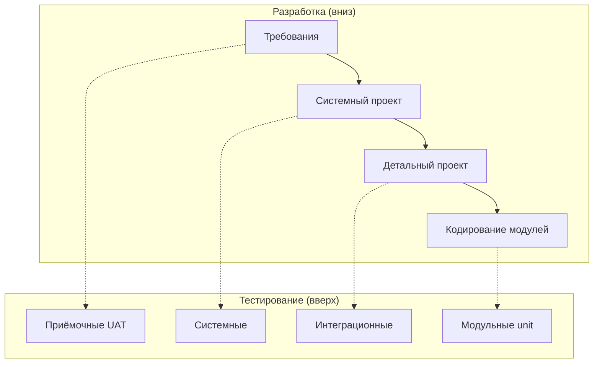
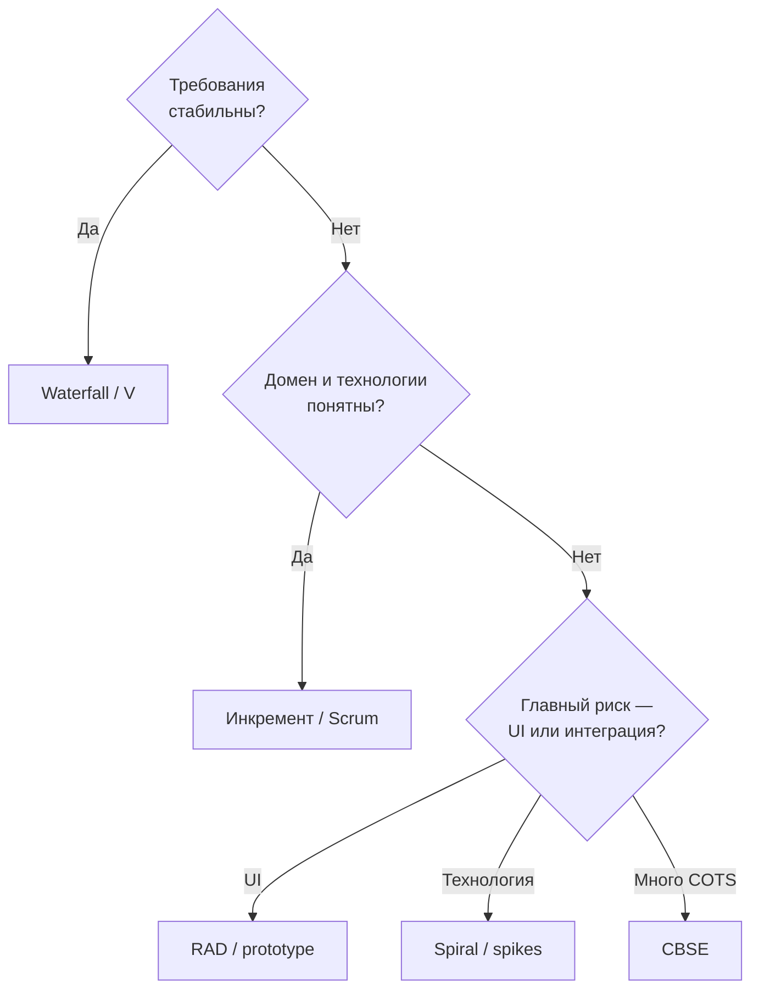

# Модели жизненного цикла для конструирования

<div class="article-tags">
  <span class="tag tag-required">ОБЯЗАТЕЛЬНО</span>
  <span class="tag tag-beginner">ДЛЯ НОВИЧКОВ</span>
</div>

<span class="complexity-badge">Руководителю</span>
<span class="complexity-badge">Разработчику</span>

## Модели жизненного цикла — Waterfall, Agile и гибриды

От **модели жизненного цикла (ЖЦ)** зависит **когда** вы пишете код, **сколько** его переписываете и **какие** документы требуют до первой строки. На экзамене по конструированию часто спрашивают **Waterfall, инкремент, RAD, спираль, CBSE** — как они задают ритм **реализации**.

### С чего начать новичку

**Модель ЖЦ** отвечает на вопрос: *в каком порядке и крупными или мелкими кусками* мы проходим планирование → проект → код → тест → внедрение.

**Методология** (Scrum, Kanban) отвечает: *как команда организует работу внутри* спринта или потока задач. Можно вести **инкрементный** ЖЦ **по Scrum** — это нормальная пара.

| Слово | Запомнить одной фразой |
|-------|-------------------------|
| **Waterfall (каскад)** | Сначала всё спроектировали, потом долго пишем код, потом тестируем |
| **Инкремент** | Каждый релиз добавляет **новую функцию** для пользователя |
| **Итерация** | Повторяем цикл "спроектировали → закодировали → проверили"; функция может не расти, но качество растёт |
| **RAD** | Быстро показать экран заказчику, много готовых UI-компонентов |
| **Спираль** | На каждом витке снимаем **риски** прототипом, потом пишем prod-код |
| **CBSE** | Система = покупные и готовые **компоненты** + наш "клей" |

<div class="callout callout--info">
  <div class="callout-title">Модель ЖЦ ≠ методология</div>
  <p><strong>Модель жизненного цикла</strong> — *как распределены фазы* (линейно, витками, порциями). <strong>Scrum/Kanban</strong> — *как команда работает внутри* итераций. Один и тот же инкрементный ЖЦ можно вести по Scrum или без него.</p>
</div>

Общая карта SDLC — в [7-03/1](/encyclopedia/7-project/7-03-metodologiya-i-zhiznennyy-tsikl-po/1). Здесь — **угол конструирования**: что меняется в объёме кода, в рефакторинге и в тестах.

---

## Сводная таблица моделей

| Модель | Ритм конструирования | Когда уместна | Главный риск для кода |
|--------|----------------------|---------------|------------------------|
| **Waterfall / V** | Один большой блок после проекта | Стабильное ТЗ, регуляторика | "Замороженный" дизайн устарел к концу кодирования |
| **Инкремент / итерация** | Порции + наращивание | Продукт, эволюция | Техдолг между инкрементами без рефакторинга |
| **RAD** | Быстрые прототипы → prod | UI-критичные MVP, CRUD | Прототип без архитектуры в production |
| **Спiral (Boehm)** | Прототип на рисках → prod-код | Высокая неопределённость, Р&D | Бесконечные витки "ещё один POC" |
| **CBSE** | Интеграция + доработка компонент | Много COTS, ERP, интеграции | Версионный ад и "склеивание" API |
| **Прототипирование** | Throwaway или эволюционный код | Неясные требования | Путаница прототипа и финальной системы |

---

## Классический (каскадный) Waterfall

**Идея:** фазы **последовательно** — требования → проект → **кодирование** → тест → внедрение. Выход одной фазы — вход следующей; возврат "назад" формален и дорог.


| Для конструирования | Следствие |
|---------------------|-----------|
| Код **после** детального проекта | Меньше "переписывания архитектуры в коде", больше следования spec |
| Изменения дороги | ТЗ и проект должны быть **согласованы до старта** кодирования |
| Большой объём кода **разом** | Нужны coding standards, review, статический анализ **до** merge |
| Длинный цикл без релиза | Интеграция "Big Bang" — первые баги всплывают поздно |

**Где встречается:** госконтракты, embedded, медтехника (IEC 62304), авионика — там, где нужна **traceability** требование → модуль → тест.

**Для разработчика:** конструирование — "исполнение чертежа". Отклонение от проекта — через change request (заявку на изменение требований), а не тихий рефакторинг в пятницу.

<div class="callout callout--info">
  <div class="callout-title">Жизненный пример Waterfall</div>
  <p>Госконтракт на АСУ: год пишут ТЗ и проект, полгода — код без релиза пользователям, потом три месяца приёмочных тестов. Плюс: всё прослеживается от пункта ТЗ до модуля. Минус: если за год рынок изменился, часть кода устарела ещё до первого запуска — правки дороги.</p>
</div>

---

## V-модель и конструирование

**V-модель** — **надстройка**: каждому уровню **разработки** соответствует уровень **тестирования**.



| Уровень разработки | Парный тест | Кто на конструировании |
|--------------------|-------------|-------------------------|
| Модули / unit design | **Unit-тесты** | Разработчик пишет **вместе с кодом** |
| Интеграция модулей | Integration | Dev + QA после сборки |
| Система | System | QA по сценариям из ТЗ |
| Приёмка | UAT | Заказчик / пользователи |

**Практический смысл:** тест-план и кейсы для модульного уровня **закладывают при проектировании интерфейса**, а не "когда всё закодировали". Подробнее — [130](/encyclopedia/7-project/7-05-testirovanie/130), [119](/encyclopedia/7-project/7-05-testirovanie/119).

---

## Инкрементная и итерационная модель

**Инкремент** — продукт **растёт функционально**: каждый кусок добавляет **новую возможность** для пользователя.

**Итерация** — **повторение цикла** "спроектировали → закодировали → проверили" над одной областью или всем продуктом; функциональность может **не расти**, но **качество и полнота** растут.

```
Инкремент 1: auth + профиль     → релиз 0.1 (можно войти)
Инкремент 2: каталог            → релиз 0.2 (можно смотреть товары)
Инкремент 3: корзина + оплата   → релиз 1.0 (можно купить)

Итерация внутри инкремента 2:
  Sprint A — API каталога
  Sprint B — фильтры + пагинация
  Sprint C — hardening, NFR
```

| Аспект | Для конструирования |
|--------|---------------------|
| Короткие волны кода | Меньше "длинных веток", чаще merge в main |
| Рефакторинг между инкрементами | [Модульность](./2) критична — иначе каждый инкремент ломает предыдущий |
| CI обязателен | Каждый инкремент — **потенциально поставляемый** артефакт |
| Definition of Done | Код + тесты + review + документация API |

**Scrum** — частный случай **итераций** фиксированной длины (спринт) с инкрементом на выходе. **Kanban** — непрерывный поток без жёсткого "конца спринта", но конструирование всё равно **порциями** по карточкам.

<div class="callout callout--info">
  <div class="callout-title">Жизненный пример инкремента</div>
  <p>Маркетплейс: в **0.1** пользователь только регистрируется; в **0.2** смотрит каталог без покупки; в **1.0** платит. Каждый инкремент — **рабочий** релиз на staging/prod. Код каталога пишут, когда auth уже в main — иначе некому "войти и посмотреть товар".</p>
</div>

<div class="callout callout--tip">
  <div class="callout-title">Экзаменная формулировка</div>
  <p><strong>Инкремент</strong> отвечает на "<em>что нового в продукте</em>"; <strong>итерация</strong> — "<em>какой очередной цикл работы</em>". Один инкремент часто занимает несколько итераций.</p>
</div>

---

## RAD (Rapid Application Development)

**Идея:** сжать время до **видимого результата** за счёт прототипов, генераторов, готовых UI-kit и **параллельных** мини-команд (users + developers together).

### Фазы RAD (классическая схема)

| Фаза | Содержание | Конструирование |
|------|------------|-----------------|
| **Business modeling** | Потоки данных, роли | Минимум кода |
| **Data modeling** | ERD, сущности | Миграции, ORM-модели |
| **Process modeling** | Сценарии, экраны | Прототип UI |
| **Application generation** | Сборка из компонент | CRUD, low-code, scaffolding |
| **Testing & turnover** | Обратная связь пользователей | Доработка + "закалка" |

| Плюс | Риск |
|------|------|
| Заказчик **видит** UI через недели, а не месяцы | "Прототип в prod" без слоя домена |
| Reuse UI-kit, ORM, admin-панелей | Техдолг, если нет **явного** этапа refactor |
| Параллельные команды по модулям | Несогласованные контракты между командами |

RAD в **COCOMO II — Application Composition** — отдельный режим оценки (много готовых частей, мало "с нуля"). См. [7-13/1](/encyclopedia/7-project/7-13-ekonomika-proizvodstva-po/1).

**Когда уместен:** внутренние админки, MVP с типовым CRUD, пилоты с жёстким дедлайном. **Когда опасен:** ядро домена с регуляторикой без проектирования границ.

---

## Спиральная модель (Barry Boehm)

**Идея:** каждый **виток** спирали — мини-проект: цели → риски → разработка/прототип → план следующего витка. Риски **снимают до** массового кодирования.


### Что кодируют на разных витках

| Виток | Тип кода | Пример |
|-------|----------|--------|
| Ранний | **Throwaway prototype** | UI на макетах, spike на новом протоколе |
| Средний | **Пилотные модули** | Интеграция с внешней системой-риском |
| Поздний | **Production code** | Полное покрытие тестами, NFR, hardening |

**Хорошо для:** заказных систем с высокой неопределённостью (новый домен, жёсткие NFR, много внешних интеграций). **Плохо без дисциплины:** бесконечные POC без решения "выбрали архитектуру — пишем prod".

**Связь с Agile:** спринтовый "spike" — родственник **риск-ориентированного** витка; разница в том, что спираль **явно** ставит анализ рисков **перед** объёмным кодом.

---

## Прототипирование (throwaway и evolutionary)

| Тип | Суть | Конструирование |
|-----|------|-----------------|
| **Throwaway (быстрый)** | Прототип **выбрасывают** после уточнения требований | Код "на коленке", без тестов — **не** в prod |
| **Evolutionary (эволюционный)** | Прототип **дорастают** до системы | Нужны тесты и рефакторинг с первых витков |

**Типичная ошибка:** throwaway-прототип "вдруг" попал в production, потому что "и так работает". На экзамене просят **различить** типы и назвать **критерий** (выбрасываем vs эволюционируем).

---

## Компонентно-ориентированная модель (CBSE)

**Идея:** система = **сборка** готовых (COTS) и заказных **компонентов** с опубликованными интерфейсами. Конструирование смещается от "писать всё" к **интегрировать и адаптировать**.

### Жизненный цикл CBSE (упрощённо)


| Этап | Работа конструктора |
|------|---------------------|
| **Поиск COTS** | Оценка лицензий, SLA, roadmap вендора |
| **Адаптация** | Adapter/Facade, маппинг DTO, версионирование API |
| **Разработка недостающего** | Только "дыры" в функциональности — по контракту |
| **Сборка** | Интеграционные и контрактные тесты ([121](/encyclopedia/7-project/7-05-testirovanie/121)) |

**CBSE как модель ЖЦ** ≠ **компонентная архитектура** (REP/CCP/CRP в [103](/encyclopedia/7-project/7-06-proektirovanie-i-arhitektura/103)): первое — *процесс поставки*; второе — *принципы упаковки* модулей в репозитории.

**Экономика:** reuse снижает **Size** в COCOMO (множитель **RUSE**), но добавляет **интеграционные** риски и зависимость от чужих релизов.

---

## Стратегии выбора модели (для экзамена и практики)

| Контекст | Частый выбор | Почему для конструирования |
|----------|--------------|----------------------------|
| Госконтракт, жёсткое ТЗ | Waterfall + V | Traceability, формальная приёмка |
| Продукт, меняющиеся требования | Инкремент / Scrum | Короткие циклы кода + feedback |
| Неясный UI, много UX-рисков | RAD / throwaway prototype | Быстрая проверка гипотез |
| Новая технология, Р&D, интеграции | Spiral / spikes | Риски до массового кодирования |
| ERP, CRM, много SaaS | CBSE + Agile внутри | Меньше "с нуля", больше glue-кода |
| Сжатые сроки MVP | RAD с **явным** refactor-sprint | Не оставлять прототип навсегда |

Гибрид **"Agile внутри, Waterfall снаружи"** для ГИС — [7-03/2](/encyclopedia/7-project/7-03-metodologiya-i-zhiznennyy-tsikl-po/2): команда работает спринтами, а заказчик принимает **версии** по регламенту.



---

## Типичные ошибки

1. **Назвать Scrum "моделью ЖЦ"** — это фреймворк; под ним может быть инкремент, спираль или гибрид.
2. **Путать инкремент и итерацию** — см. таблицу выше.
3. **Спiral без выхода** — бесконечные прототипы вместо prod-кода.
4. **CBSE = "скачать библиотеку"** — без квалификации, версий и контрактных тестов интеграция ломается на каждом апдейте.

---

## Частые вопросы на экзамене

**Чем Waterfall отличается от V-модели?**  
Waterfall — порядок фаз; V — **парность** уровней разработки и тестирования.

**Когда RAD не подходит?**  
Когда доменная логика сложна, регуляторика жёсткая, а "быстрый UI" не снимает риски ядра системы.

**Что такое один виток спирали?**  
Цели → анализ рисков (часто прототип) → разработка и тест витка → план следующего витка.

---

## Куда читать дальше

| Тема | Материал |
|------|----------|
| Планирование сроков | [Планирование конструирования](./4) |
| Стандарты стадии | [Конструирование, 12207](./1) |
| Модульность при инкрементах | [Связность и сцепление](./2) |
| Экономика | [COCOMO II](/encyclopedia/7-project/7-13-ekonomika-proizvodstva-po/1) |
| Scrum, Kanban, XP | [7-03/1](/encyclopedia/7-project/7-03-metodologiya-i-zhiznennyy-tsikl-po/1) |

---
