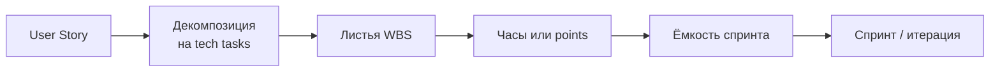

# Планирование конструирования: PERT, CPM, оценки

<div class="article-tags">
  <span class="tag tag-required">ОБЯЗАТЕЛЬНО</span>
  <span class="tag tag-beginner">ДЛЯ НОВИЧКОВ</span>
</div>

<span class="complexity-badge">Руководителю</span>
<span class="complexity-badge">Разработчику</span>
<span class="complexity-badge">Аналитику</span>

## Планирование — не «нарисовать Gantt и забыть»

На стадии конструирования план отвечает на четыре вопроса:

1. **Что** кодировать — декомпозиция до модулей и задач (WBS).
2. **В каком порядке** — зависимости между API, миграциями, интеграциями.
3. **Сколько времени** — оценки с учётом неопределённости.
4. **Где узкое место** — критический путь и буфер на баги/review.

Базовые оценки времени — [112](/encyclopedia/7-project/7-02-komanda-i-upravlenie/112); параметрические (COCOMO, Function Points) — [7-13/1](/encyclopedia/7-project/7-13-ekonomika-proizvodstva-po/1). Здесь — **сетевое планирование** и связь с Agile-оценками.

<div class="callout callout--info">
  <div class="callout-title">Календарь ≠ человеко-часы</div>
  <p>Три разработчика по 40 часов параллельно дают <strong>120 человеко-часов</strong>, но только <strong>40 календарных</strong> при полной загрузке. Gantt показывает календарь; WBS-сумма — трудозатраты.</p>
</div>

---

## WBS: от проекта к задачам кодирования

**Work Breakdown Structure** — иерархия работ «сверху вниз»: продукт → подсистемы → модули → **листовые задачи**, которые можно оценить и назначить.

```
Интернет-магазин (релиз 1.0)
├── Модуль Auth
│   ├── API login / refresh
│   ├── JWT middleware
│   ├── Миграция users
│   └── Unit-тесты auth
├── Модуль Catalog
│   ├── CRUD товаров
│   ├── Поиск и фильтры
│   └── Integration с Auth
├── Модуль Billing
│   ├── Платёжный адаптер
│   └── Webhook обработка
└── Инфраструктура
    ├── CI pipeline
    └── Staging deploy
```

**Правила хорошего WBS:**

| Правило | Зачем |
|---------|--------|
| Лист **оцениваем** (часы, points) | Иначе план — декорация |
| У задачи **один ответственный** | Нет «все и никто» |
| Лист **≤ 1–2 недели** работы одного человека | Иначе скрытые риски |
| Имена **глагольные** («Реализовать…», «Покрыть тестами…») | Понятен результат |

На конструировании листья WBS часто совпадают с **модулями** из [§2](./2): граница задачи ≈ граница merge request.

---

## Диаграмма Ганта

**Диаграмма Ганта** — календарная шкала: горизонтальные полоски = длительность задач; стрелки = зависимости «B после A».

| Элемент | Смысл |
|---------|--------|
| Полоска | Длительность задачи в **календарных** днях |
| Параллельные полоски | Ресурсы работают одновременно |
| Milestone (ромб) | «Alpha-сборка», «Заморозка API», «Code freeze» |
| Baseline | Зафиксированный план для сравнения с фактом |

**Инструменты:** MS Project, GanttProject, Jira Advanced Roadmaps, YouTrack, Notion timeline, GitLab milestones.

**Ограничение Gantt:** хорошо показывает **когда**, но слабо — **логику зависимостей** на больших графах. Для поиска критического пути используют **сетевую диаграмму** (CPM/PERT).

---

## CPM — метод критического пути

**Critical Path Method (CPM)** строит **ориентированный граф** задач и находит **самую длинную цепочку** без резерва времени.

- **Критический путь** — последовательность, задержка **любой** задачи на которой сдвигает **дедлайн проекта**.
- **Резерв (float, slack)** — сколько можно задержать **некритическую** задачу без вреда для финиша.

### Мини-пример с расчётом

Задачи (дни): **A(3)** → **B(4)** → **D(2)** и параллельно **A(3)** → **C(5)** → **D(2)**.

```
        B(4)
       ↗     ↘
Start → A(3)     → D(2) → Finish
       ↘     ↗
        C(5)
```

| Путь | Сумма | Критический? |
|------|-------|--------------|
| A → B → D | 3 + 4 + 2 = **9** | **Да** |
| A → C → D | 3 + 5 + 2 = **10** | **Да** (длиннее!) |

Критический путь: **A → C → D (10 дней)**. У **B** есть float = 10 − 9 = **1 день** (можно начать на день позже или растянуть на день).

### Forward / backward pass (для экзамена)

| Обозначение | Смысл |
|-------------|--------|
| **ES** (Early Start) | Раньшее начало |
| **EF** (Early Finish) | ES + длительность |
| **LS** (Late Start) | Позднее начало без сдвига проекта |
| **LF** (Late Finish) | Позднее окончание |
| **Float** | LS − ES (или LF − EF) |

**Для конструирования:** критический путь часто проходит через **ядро домена**, **интеграцию** и **миграции данных** — их недооценка срывает релиз, даже если «мелочь по UI» готова раньше.

---

## PERT — три оценки длительности

**Program Evaluation and Review Technique** — когда длительность **неизвестна точно** (новая технология, внешний API, сложный refactor).

| Оценка | Смысл |
|--------|--------|
| **O** (optimistic) | Минимум при удачном стечении |
| **M** (most likely) | Наиболее вероятная |
| **P** (pessimistic) | Максимум при проблемах |

**Ожидаемая длительность (бета-распределение):**

**TE = (O + 4M + P) / 6**

**Стандартное отклонение:**

**σ = (P − O) / 6**

### Числовой пример

Задача «Интеграция с платёжным шлюзом»:

| O | M | P |
|---|---|---|
| 3 дня | 5 дней | 12 дней |

**TE = (3 + 4×5 + 12) / 6 = 35/6 ≈ 5,8 дня**

**σ = (12 − 3) / 6 = 1,5 дня**

Та же формула — **метод трёх точек** в [112](/encyclopedia/7-project/7-02-komanda-i-upravlenie/112). PERT добавляет **сетевой контекст**: TE подставляют в узлы графа, затем ищут критический путь уже по **ожидаемым**, а не только детерминированным длительностям.

<div class="callout callout--tip">
  <div class="callout-title">Когда PERT, когда одна цифра</div>
  <p><strong>PERT</strong> — задача с высокой неопределённостью (первый раз с технологией). <strong>Одна оценка M</strong> — типовой CRUD по шаблону. <strong>Planning Poker</strong> — относительная сложность в Agile, потом перевод в часы через velocity.</p>
</div>

---

## Стратегии планирования конструирования

| Стратегия | Суть | Когда |
|-----------|------|--------|
| **Top-down** | Срок фиксирован → режем scope / добавляем людей (осторожно: [закон Брукса](https://en.wikipedia.org/wiki/Brooks%27s_law)) | Контракт с дедлайном |
| **Bottom-up** | Сумма оценок WBS → календарь + параллелизм | Внутренний продукт |
| **Critical chain** | Буфер на **цепочку**, а не на каждую задачу | Много зависимостей |
| **Rolling wave** | Детально планируем ближайшие 2–4 недели, дальше — грубо | Agile, неясный хвост релиза |
| **Milestone-driven** | Жёсткие точки: «API freeze», «feature complete» | Инкременты + V-модель |

На практике **гибрид:** rolling wave внутри спринта + milestone на релиз + CPM для **интеграционной** недели.

---

## Planning Poker и конструирование

**Planning Poker** — командная оценка **относительной** сложности (story points), не календарных дней. Связка с конструированием:



| Шаг | Действие |
|-----|----------|
| 1 | Story оценили в points (Poker) |
| 2 | Разработчик раскладывает на **технические подзадачи** (API, миграция, тесты) |
| 3 | Подзадачи суммируются в **часы** и сверяются с **velocity** команды |
| 4 | Если не влезает — режем story или выносим spike |

**Spike** (исследование) — отдельная задача с **time-box**, часто с PERT-оценкой (широкий разброс O/P).

**Отличие от PERT:** Poker сравнивает **сложность** («эта story как прошлая X»); PERT — **время** одной задачи с разбросом.

---

## Планирование тестирования параллельно (V-модель)

Тест-план **не после** кода — иначе V-модель только на бумаге.

| Фаза конструирования | Параллельно в QA |
|----------------------|------------------|
| Детальный проект модуля | Черновик **модульных** кейсов |
| Написание unit-тестов (dev) | Review сценариев на «дыры» |
| Сборка инкремента / alpha | **Integration**, smoke, regression |
| Feature freeze | System, нагрузка, security |
| Release candidate | UAT, приёмка |

См. [тест-план](/encyclopedia/7-project/7-05-testirovanie/119), [ПМИ](/encyclopedia/7-project/7-08-tehnicheskoe-pismo/14), [пирамиду тестов](/encyclopedia/7-project/7-05-testirovanie/120).

---

## Разбор: релиз интернет-магазина за 8 недель

Команда: 2 backend, 1 frontend, 1 QA. **Billing** — интеграция с банком (PERT: O=5, M=8, P=15 → TE≈9 дней) и **критический путь**.

| Неделя | Конструирование | Тест / QA | Риск |
|--------|-----------------|-----------|------|
| 1 | Каркас CI, Auth API | Test plan Auth | — |
| 2 | Auth frontend, JWT | Unit + smoke Auth | — |
| 3–4 | Catalog API + UI | Integration catalog | Параллельно с Auth hardening |
| 5 | **Billing** (критический путь) | Regression 1–4 | Задержка здесь = срыв всего |
| 6 | NFR: кэш, логи, rate limit | Load smoke | — |
| 7 | Документация API, tag release | UAT сценарии | — |
| 8 | **Буфер** / hotfix | Приёмка | Без буфера неделя 8 = 0 |

**Урок:** если Billing сдвинулся на +1 неделю, без **недели 8 как буфера** срывается приёмка. Float у некритичных задач (например, «улучшить фильтры») можно **жертвовать**, чтобы подтянуть Billing.

---

## Связь с управлением конфигурацией и релизом

План конструирования включает **точки заморозки**:

- **API freeze** — контракты не меняются без versioning.
- **Code freeze** — только bugfix в релизную ветку.
- **SCM tag** — воспроизводимая сборка.

Подробнее — [7-13/3](/encyclopedia/7-project/7-13-ekonomika-proizvodstva-po/3) (SCM, релизы).

---

## Типичные ошибки

1. **Нет критического пути** — оптимизируют некритичные задачи (иконки), пока горит интеграция.
2. **100% загрузка людей** — нет буфера на review, баги, sick leave.
3. **Тест «в конце»** — regression за два дня перед prod.
4. **Один Gantt на год без обновления** — план расходится с реальностью после первого change request.
5. **Points без декомпозиции** — story «8 points» без tech tasks; в спринте внезапно «не успели миграцию».

---

## Частые вопросы на экзамене

**Чем CPM отличается от Gantt?**  
Gantt — **календарное** представление; CPM — **логика зависимостей** и поиск критического пути (часто оба используют вместе).

**Что такое float?**  
Запас времени у **некритической** задачи; у критической float = 0.

**Зачем Planning Poker, если есть PERT?**  
Poker — **относительная** оценка в команде Agile; PERT — **абсолютное время** с разбросом для отдельных рискованных задач.

---

## Куда читать дальше

| Тема | Материал |
|------|----------|
| Модели ЖЦ | [3](./3) |
| COCOMO, PM | [7-13/1](/encyclopedia/7-project/7-13-ekonomika-proizvodstva-po/1) |
| SCM, релизы | [7-13/3](/encyclopedia/7-project/7-13-ekonomika-proizvodstva-po/3) |
| Оценка в команде | [112](/encyclopedia/7-project/7-02-komanda-i-upravlenie/112) |

---
