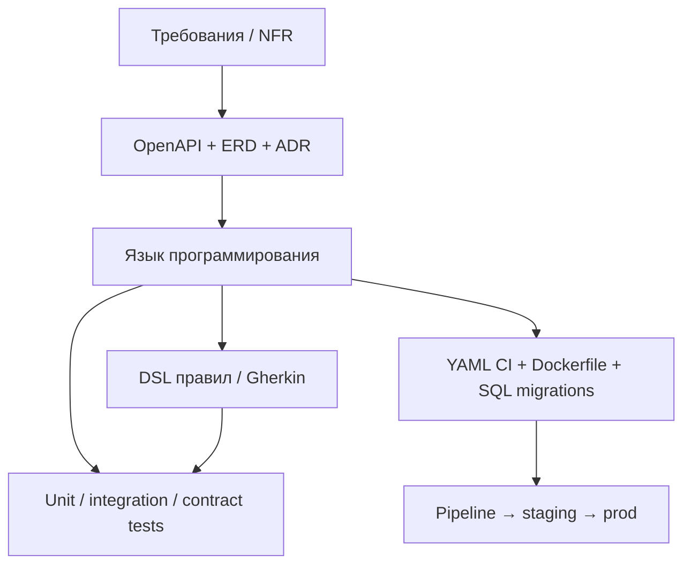

# Языки конструирования программных систем

<div class="article-tags">
  <span class="tag tag-required">ОБЯЗАТЕЛЬНО</span>
  <span class="tag tag-beginner">ДЛЯ НОВИЧКОВ</span>
</div>

<span class="complexity-badge">Разработчику</span>
<span class="complexity-badge">Архитектору</span>
<span class="complexity-badge">Аналитику</span>

---

## "Язык" шире, чем Java или Python

На курсе "конструирование ПО" слово **язык** часто путают только с **языком программирования**. В SWEBOK и на практике под **языками конструирования** понимают **все нотации**, в которых вы **выражаете и собираете** решение: код, схемы, контракты API, конфиги CI.

---

### Если вы только начинаете

| Вы думаете | На самом деле |
|------------|---------------|
| "Язык = Python" | Python — **язык программирования**; рядом почти всегда SQL, YAML, OpenAPI |
| "Диаграмма — для отчёта" | UML/C4 — **язык проектирования**; чертёж для команды |
| "OpenAPI — документация потом" | OpenAPI — **язык спецификации**; по нему пишут тесты и mocks **до** кода |
| `docker-compose.yml` | **Язык конфигурации** — часть конструирования, без него код не доедет до staging |

Представьте релиз одной фичи "оплата заказа". За неделю команда трогает:

- **TypeScript** — handler и доменная логика;
- **OpenAPI** — контракт `POST /orders/{id}/pay`;
- **SQL** — миграция таблицы `payments`;
- **YAML** — job в CI и переменные staging;
- **Mermaid / C4** — схема потока в ADR.

Всё это — **языки конструирования**: разные нотации, одна стадия SDLC — **выражение и сборка решения**. Учебники выделяют несколько классов; в индустрии они **переплетены** в одном репозитории и одном pull request.

| Класс | Вопрос, на который отвечает | Исполняется? |
|-------|-----------------------------|--------------|
| Программирования | *Как* алгоритм работает на машине | Да (компилятор/интерпретатор) |
| Проектирования | *Из чего* состоит система | Нет (чертёж для людей) |
| Спецификации / контрактов | *Что* обязан делать интерфейс | Частично (валидация, codegen) |
| Конфигурации / сборки | *Как* собрать и развернуть | Да (оркестратор, CI) |
| DSL | *Как* описать узкую предметную задачу | Зависит от DSL |

В учебниках по конструированию выделяют ещё два «простых» класса:

| Класс | Суть | Примеры |
|-------|------|---------|
| **Конфигурационный** | Параметры выполнения системы | `appsettings.json`, переменные CI, feature flags |
| **Инструментальный (toolkit)** | Сборка из переиспользуемых элементов, часто сценарный | Shell, Gradle Kotlin DSL, скрипты миграций |

**Язык программирования** — самый гибкий тип, но требует больше всего усилий на освоение; конфигурационный и инструментальный снижают порог для узких операций (деплой, glue-код).

Подробнее про артефакты стадии — [§1](./1).

---

## Языки программирования

**Назначение:** алгоритмы, бизнес-логика, драйверы, скрипты автоматизации.

---

### Критерии выбора (не "модный стек")

| Критерий | Вопрос |
|----------|--------|
| **Домен** | Web, embedded, data science, mobile, games |
| **Экосистема** | Библиотеки, IDE, hiring, community |
| **NFR** | Latency, memory, realtime, offline ([ISO 25010](/encyclopedia/7-project/7-13-ekonomika-proizvodstva-po/2)) |
| **Регуляторика** | "Только из реестра", LTS-версия, сертифицированный компилятор |
| **Команда** | Навыки сильнее "идеального" языка |

Энциклопедия по языкам — [раздел 5](/encyclopedia/5-languages/intro). На заказном проекте язык часто **задан ТЗ** или **архитектурным решением** (ADR).

**COCOMO II** учитывает язык через **Language Level** — продуктивность (эффективных строк на function point): высокоуровневый язык → меньше объём кода при той же функциональности.

---

### Уровни абстракции (для экзамена)

| Уровень | Примеры | Роль на конструировании |
|---------|---------|-------------------------|
| **Машинный / ассемблер** | x86 asm | Драйверы, hot path, embedded |
| **Низкий** | C, Rust, Zig | Системное ПО, предсказуемая память |
| **Средний** | Java, C#, Go, Kotlin | Корпоративные сервисы |
| **Высокий** | Python, Ruby, JavaScript | Бизнес-логика, прототипы, скрипты |
| **Декларативный** | SQL, HTML/CSS, Rego | Запросы, разметка, policy |

Один продукт часто **мультипарадигменный**: Go для сервиса, Python для ETL, SQL для отчётов — это нормальная **стратегия конструирования**, не "зоопарк ради зоопарка".

---

### Три вида нотаций языков программирования

| Нотация | Особенность | Плюсы / минусы |
|---------|-------------|----------------|
| **Лингвистическая** | Текст, ключевые слова, синтаксис как «предложения» | Интуитивна (Java, Python); риск неоднозначности |
| **Формальная** | Строгие математические определения | Максимальная однозначность; сложнее читать (формальные методы, TLA+) |
| **Визуальная** | Логика через расположение элементов на диаграмме | Сильна для UI и простых потоков; слаба для сложных выражений |

Современные **MDA/UML**, **BPMN**, **BPEL** и корпоративные **DSL** стремятся к **двусторонней** связи: диаграмма ↔ генерируемый код. На конструировании это проявляется как codegen из `.proto`, OpenAPI, Helm charts — формальная или полуформальная нотация **исполняется** toolchain'ом.

---

## Языки проектирования

**Назначение:** описать **структуру и поведение** без деталей реализации — "чертёж" для конструктора.

| Нотация | Для чего | Кто ведёт |
|---------|----------|-----------|
| **UML** (class, sequence, component) | Модули, вызовы, деплой | SA, lead dev |
| **C4** (Context, Container, Component, Code) | Архитектура на разных zoom | Архитектор |
| **ERD** | Модель данных | SA + DBA |
| **BPMN** | Бизнес-процессы | BA (SA читает) |
| **Wireframes / Figma** | UX до вёрстки | UX + frontend |

Конструктор **читает диаграммы как контракт**: отклонение = change request, ADR или согласование с архитектором. Диаграмма в Confluence **без связи с репозиторием** устаревает за спринт — зрелые команды хранят C4/Mermaid **рядом с кодом** в `docs/`.

См. [проектирование](/encyclopedia/7-project/7-06-proektirovanie-i-arhitektura/intro), [API design](/encyclopedia/7-project/7-06-proektirovanie-i-arhitektura/design/117).

---

## Языки спецификации и контрактов

**Назначение:** **проверяемое** описание интерфейса — до или вместе с кодом.

| Язык / формат | Область | На конструировании |
|---------------|---------|-------------------|
| **OpenAPI / Swagger** | REST HTTP | Контракт → mock → реализация → contract tests |
| **AsyncAPI** | События, Kafka, MQTT | Схема топиков и payload |
| **JSON Schema** | JSON-документы | Валидация запросов/ответов |
| **Protocol Buffers, Avro** | Бинарные RPC, события | `.proto` → codegen клиента/сервера |
| **GraphQL schema** | API с гибкими запросами | Типы + resolvers |
| **Design by Contract** | Preconditions/postconditions | Assert, контракты в коде (Eiffel, некоторые библиотеки) |

**Порядок работ (contract-first):**

1. Аналитик и backend согласовали **OpenAPI** (`POST /orders/{id}/pay`, поля, коды ошибок).
2. Frontend генерирует клиент или пишет против **mock-сервера** по этой схеме.
3. QA готовит контрактные тесты: "если `amount < 0` → 400".
4. Backend реализует handler; CI сравнивает ответ с контрактом.
5. Новое поле в ответе — только через **версию** API (`/v2`) или обратно совместимое добавление.

Контрактное тестирование — [121](/encyclopedia/7-project/7-05-testirovanie/121).

---

### Пример — один endpoint в разных "языках"

```yaml
# openapi fragment — язык спецификации
paths:
  /orders/{id}/pay:
    post:
      responses:
        '200':
          description: OK
```

```typescript
// TypeScript — язык программирования
async function payOrder(id: string, body: PayRequest): Promise<PayResult> { ... }
```

```sql
-- SQL — язык данных
ALTER TABLE payments ADD COLUMN status VARCHAR(32) NOT NULL;
```

Три файла — один инкремент; все версионируются в git вместе.

---

### Формальные методы (кратко)

В критичных доменах (авионика, платежи, ядро протокола) используют **формальные спецификации**: Z, B-Method, **TLA+**, Alloy. Они **не заменяют** код, но позволяют **доказать** свойства модели до массового конструирования. Для базового курса достаточно знать: *существует класс языков строже UML*, применяется точечно.

---

## DSL — предметно-ориентированные языки

**DSL** — язык **узкой** задачи: правила скидок, маршруты ETL, политики доступа, сценарии CI.

| Плюс | Минус |
|------|-------|
| Бизнес ближе к исполняемому правилу | Нужна поддержка парсера, IDE, тестов |
| Меньше boilerplate в основном коде | Риск "языка на коленке" без версионирования |
| Эксперты читают правила без C++ | Дублирование семантики с основным кодом |

**Примеры в индустрии:**

| DSL | Задача |
|-----|--------|
| **Terraform HCL**, **Pulumi** | Инфраструктура |
| **Gradle Kotlin DSL**, **Makefile** | Сборка |
| **Rego** (OPA) | Policy as code |
| **Liquid**, **Handlebars** | Шаблоны CMS |
| **Gherkin** | BDD-сценарии (исполняются через runner) |
| **Cron syntax**, **GitHub Actions expressions** | Расписание и условия CI |

**Когда DSL избыточен:** одно правило, которое меняется раз в год — достаточно функции в основном языке.

---

## Языки конфигурации и сборки

Конфигурация — **часть конструирования**: без неё код не собирается и не доезжает до staging.

| Язык / формат | Роль |
|---------------|------|
| **YAML, TOML, JSON** | K8s manifests, GitHub Actions, `appsettings` |
| **Dockerfile**, **Compose** | Образ и локальный стенд |
| **Helm charts**, **Kustomize** | Параметризация деплоя |
| **SQL (DDL/DML)** | Миграции схемы (Flyway, Liquibase) |
| **Make, npm/pnpm scripts, MSBuild, Cargo** | Локальная и CI-сборка |
| **.env.example** | Документирование переменных без секретов |

Версионируются **вместе с кодом** в SCM — см. [7-13/3](/encyclopedia/7-project/7-13-ekonomika-proizvodstva-po/3). Секреты **не** в git: Vault, sealed secrets, CI variables.

DevOps-контекст — [8-04](/encyclopedia/8-infra-security/8-04-devops-ci-cd/intro).

---

## Как языки связаны в одном инкременте



**Пример traceability:** требование REQ-042 "скидка 10% для VIP" → строка в Gherkin → тест → функция в домене → поле в OpenAPI `discountPercent` → миграция не нужна (вычисляемое) → запись в changelog.

---

## Выбор и согласованность языков

| Ошибка | Последствие | Приём |
|--------|-------------|--------|
| Код без OpenAPI | Интеграция "на глаз", ломаются клиенты | Contract-first |
| Диаграммы только в Wiki | Чертёж ≠ код | Docs as code |
| Конфиг только на prod | Невоспроизводимые баги | IaC + parity staging |
| Смена языка mid-project | Пересчёт сроков ([COCOMO](/encyclopedia/7-project/7-13-ekonomika-proizvodstva-po/1)) | ADR + миграционный план |
| DSL без тестов | "Правило в проде" без проверки | Fixture-тесты на DSL |

---

## TDD, XP и языки

В **Extreme Programming** конструирование идёт через **TDD**: тест (язык xUnit) → минимальный код → рефакторинг. Тест — тоже **язык** (выражение ожидания). Связь с [7-03/1](/encyclopedia/7-project/7-03-metodologiya-i-zhiznennyy-tsikl-po/1) (XP) и [unit-тестами](/encyclopedia/7-project/7-05-testirovanie/120).

---

## Частые вопросы на экзамене

**Назовите четыре класса языков конструирования.**  
Программирования, проектирования, спецификации/контрактов, конфигурации (DSL часто выделяют пятым).

**Зачем OpenAPI до кода?**  
Contract-first: параллельная работа frontend/mobile, mocks, contract tests.

**Чем DSL отличается от библиотеки?**  
DSL — **синтаксис предметной области**; библиотека — API на общем языке.

---

## Куда читать дальше

| Тема | Материал |
|------|----------|
| Модульность и границы | [2](./2) |
| Модели ЖЦ и RAD | [3](./3) |
| API design | [117](/encyclopedia/7-project/7-06-proektirovanie-i-arhitektura/design/117) |
| Языки программирования | [5-languages](/encyclopedia/5-languages/intro) |
| DevOps конфиг | [8-04](/encyclopedia/8-infra-security/8-04-devops-ci-cd/intro) |

---
