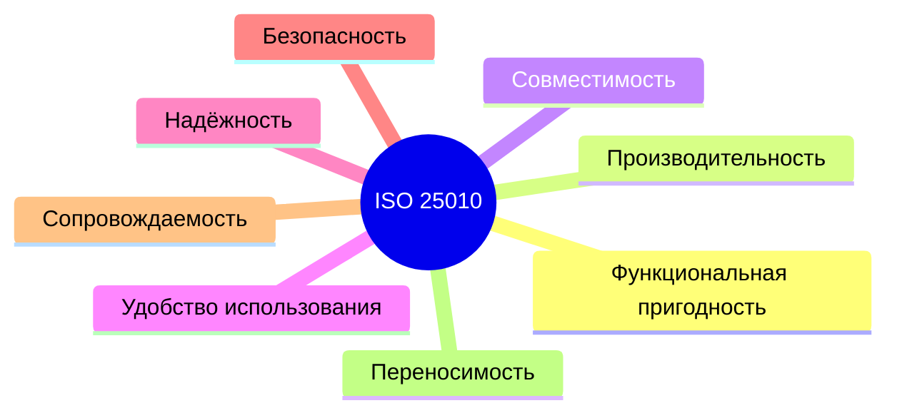

# Модель качества ISO/IEC 25010

  ОБЯЗАТЕЛЬНО
  ДЛЯ НОВИЧКОВ

Аналитику
Архитектору
Тестировщику
Руководителю

## Модель качества ПО - метрики и затраты

«Сделайте качественно» — фраза, после которой команда и заказчик **понимают разное**. Разработчик думает о чистом коде, бизнес — о скорости отклика, регулятор — о журналах аудита. Без общего словаря приёмка превращается в спор «на вкус».

**ISO/IEC 25010** (в России — **ГОСТ Р ИСО/МЭК 25010-2015**) задаёт **каталог характеристик качества** программного продукта. Это **рамка**: какие аспекты качества существуют и как их формулировать **измеримо**.

  
Где в курсе

  
Глава 1.4 «Требования к качеству и допустимым рискам» и глава 2.8 «Удостоверение качества». Связь с NFR — в <a href="/encyclopedia/7-project/7-06-proektirovanie-i-arhitektura/design/1116">проектировании под NFR</a>.

---

## Продуктовое качество и качество в использовании

Стандарт различает:

| Понятие | Вопрос | Пример |
|---------|--------|--------|
| **Качество продукта** | Какие свойства **встроены** в ПО? | Надёжность, безопасность, сопровождаемость |
| **Качество в использовании** | Достигает ли пользователь **цели**? | Эффективность, удовлетворённость, отсутствие риска для здоровья |

Для заказной разработки в ТЗ и ПМИ обычно фиксируют **характеристики продукта**; на приёмочных испытаниях проверяют **результат в контексте эксплуатации**.

---

## Восемь характеристик качества продукта

Ниже — смысл каждой группы **простыми словами** и типичные **измеримые формулировки** для ТЗ.

### 1. Функциональная пригодность (Functional suitability)

Насколько функции **подходят** для задачи и **полны**.

| Подхарактеристика | Смысл | Пример NFR |
|-------------------|--------|------------|
| **Functional completeness** | Все нужные функции есть | «Все сценарии из п. 4 ТЗ реализованы» |
| **Functional correctness** | Результат верный | «Сумма заказа = Σ строк ± 0,01 ₽» |
| **Functional appropriateness** | Функции уместны | «Нет лишних шагов для оператора АРМ» |

> Это то, что чаще всего проверяют **функциональными тестами** и приёмкой по сценариям.

### 2. Производительность (Performance efficiency)

| Подхарактеристика | Смысл | Пример |
|-------------------|--------|--------|
| **Time behaviour** | Время отклика | p95 ≤ 800 мс при 500 RPS |
| **Resource utilisation** | CPU, RAM, диск | ≤ 4 GB RAM на инстанс |
| **Capacity** | Предел нагрузки | 10 000 одновременных сессий |

См. [нагрузочное тестирование](/encyclopedia/7-project/7-05-testirovanie/122).

### 3. Совместимость (Compatibility)

| Подхарактеристика | Смысл |
|-------------------|--------|
| **Co-existence** | Работа рядом с другим ПО без конфликтов |
| **Interoperability** | Обмен данными по контракту (API, форматы) |

Важно для **комплексов программ** и интеграций с legacy.

### 4. Удобство использования (Usability)

Не «красиво», а **может ли пользователь достичь цели** с приемлемыми усилиями: обучаемость, защита от ошибок, доступность (a11y).

### 5. Надёжность (Reliability)

| Подхарактеристика | Смысл |
|-------------------|--------|
| **Maturity** | Низкая частота сбоев |
| **Availability** | Uptime, SLA |
| **Fault tolerance** | Деградация без потери данных |
| **Recoverability** | RTO/RPO после сбоя |

### 6. Безопасность (Security)

Конфиденциальность, целостность, неотказуемость, подотчётность, аутентичность. Пересекается с [тестированием ИБ](/encyclopedia/7-project/7-05-testirovanie/123) и Secure SDLC.

### 7. Сопровождаемость (Maintainability)

Критична для **заказного ПО** с многолетним контрактом:

| Подхарактеристика | Смысл |
|-------------------|--------|
| **Modularity** | Изолированные модули |
| **Reusability** | Повторное использование компонентов |
| **Analysability** | Легко найти причину дефекта |
| **Modifiability** | Дешёвые изменения |
| **Testability** | Можно автоматически проверить |

Связь с [сопровождением ПО](./4) и [легаси](/encyclopedia/7-project/7-11-legasi-kod/intro).

### 8. Переносимость (Portability)

Перенос на другую ОС, СУБД, облако; **installability**, **adaptability**.

---

## Как перевести 25010 в требования и тесты

**Шаг 1.** Выберите **3–6** характеристик, критичных для проекта (не все восемь сразу).

**Шаг 2.** Для каждой — **измеримый** NFR в ТЗ.

**Шаг 3.** Постройте **матрицу трассировки**: характеристика → требование → тест / метрика.

**Шаг 4.** В ПМИ укажите **метод** проверки и **критерий** «сдал / не сдал».

### Мини-разбор: модуль «Оформление заказа»

| 25010 | Требование | Проверка |
|-------|------------|----------|
| Functional correctness | Итог = сумма позиций | Unit + API-тест |
| Performance | p95 создания заказа ≤ 1 с | Нагрузочный сценарий |
| Security | Только авторизованный пользователь | Негативные API-тесты |
| Maintainability | Покрытие unit ≥ 80% на модуль billing | CI, отчёт coverage |

---

## Качество и риски (глава 1.4)

**Допустимый риск** — осознанное решение: «принимаем availability 99,5%, не 99,99% — экономим на кластере». В 25010 это не отдельная графа, но риски **мапятся** на характеристики:

| Риск | Характеристика | Митигация |
|------|------------------|-----------|
| Утечка данных | Security | Пентест, шифрование |
| Простой в пик | Reliability, Performance | Резерв, autoscaling |
| Невозможность доработки | Maintainability | Модульность, документация |

[Риск-ориентированный тест-дизайн](/encyclopedia/7-project/7-05-testirovanie/127) использует ту же логику приоритетов.

---

## Связь с другими стандартами

| Стандарт | Связь |
|----------|--------|
| **ISO/IEC 12207** | Процессы обеспечения качества на ЖЦ |
| **ISO/IEC 29119** | Процессы тестирования |
| **CMMI** | Зрелость процессов, не замена 25010 |
| **ГОСТ 34, ЕСПД** | Структура ТЗ и ПМИ в РФ |

---

## Типичные ошибки

1. **«Качество = нет багов»** — игнорируются performance, security, maintainability.
2. **Список из 40 NFR без приоритетов** — ничего не успевают проверить.
3. **Нефункциональные требования без метрик** — «быстро», «надёжно», «удобно».
4. **25010 только в ТЗ, не в тестах** — приёмка снова субъективна.

---

## Куда читать дальше

| Тема | Материал |
|------|----------|
| NFR в архитектуре | [1116](/encyclopedia/7-project/7-06-proektirovanie-i-arhitektura/design/1116) |
| Trade-off по качеству | [2141](/encyclopedia/7-project/7-06-proektirovanie-i-arhitektura/design/2141) |
| ПМИ и приёмка | [ПМИ по ГОСТ](/encyclopedia/7-project/7-08-tehnicheskoe-pismo/14) |
| Оценка стоимости качества | [COCOMO II](./1) |

---
