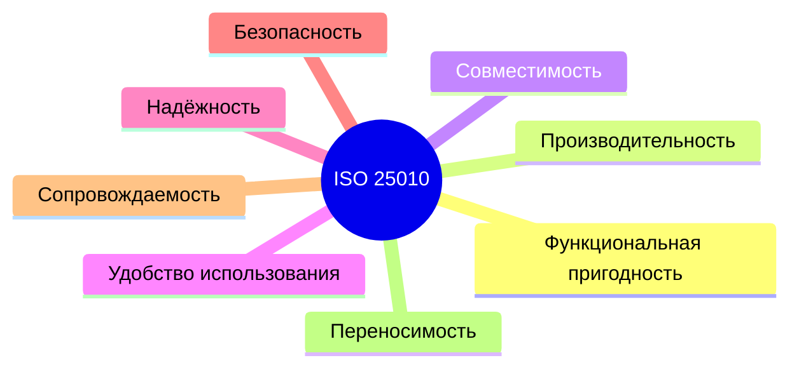

# Модель качества ISO/IEC 25010

  ОБЯЗАТЕЛЬНО
  ДЛЯ НОВИЧКОВ

Аналитику
Архитектору
Тестировщику
Руководителю

  
Теория данных (раздел 3)

  

  Качество данных — [Data Governance](/encyclopedia/3-data-markup/3-05-osnovy-baz-dannyh/111), [роль БД](/encyclopedia/3-data-markup/3-05-osnovy-baz-dannyh/6).
  

---

## Зачем нужен общий словарь качества

"Сделайте качественно" — фраза, после которой команда и заказчик часто **понимают разное**. Разработчик думает о читаемом коде, бизнес — о скорости отклика, регулятор — о журналах аудита. Без общего словаря приёмка превращается в спор "на вкус".

**ISO/IEC 25010** (в России — **ГОСТ Р ИСО/МЭК 25010-2015**) задаёт **каталог характеристик качества** программного продукта. Это **рамка**: какие аспекты качества существуют и как их формулировать **измеримо**, а не "удобно" и "надёжно".

  
Где в курсе

  

  Глава 1.4 "Требования к качеству и допустимым рискам" и глава 2.8 "Удостоверение качества".

  Связь с NFR — в [проектировании под NFR](/encyclopedia/7-project/7-06-proektirovanie-i-arhitektura/design/1116).

  

---

### Что такое NFR и чем он отличается от "функции"

| | **Функциональное требование (FR)** | **Нефункциональное (NFR)** |
|---|-----------------------------------|----------------------------|
| Вопрос | **Что** система делает? | **Как хорошо** она это делает? |
| Пример | "Пользователь может оформить заказ" | "Оформление заказа: p95 ≤ 1 с при 500 RPS" |
| Проверка | Сценарии, unit/API-тесты | Нагрузка, ИБ, аудит кода, метрики |

25010 помогает **разложить NFR по полочкам**, чтобы в ТЗ не осталось одной строки "система должна быть быстрой".

---

## Продуктовое качество и качество в использовании

Стандарт различает два уровня:

| Понятие | Вопрос | Пример |
|---------|--------|--------|
| **Качество продукта** | Какие свойства **встроены** в ПО? | Надёжность, безопасность, сопровождаемость |
| **Качество в использовании** | Достигает ли человек **цели** с этим ПО? | Эффективность работы оператора, удовлетворённость, риск ошибки |

Для заказной разработки в ТЗ и ПМИ обычно фиксируют **характеристики продукта** (их можно проверить по метрикам и тестам). На **приёмочных испытаниях** дополнительно смотрят **результат в контексте эксплуатации**: успевает ли оператор обработать 100 заявок за смену, понятны ли сообщения об ошибках.

---

## Восемь характеристик качества продукта — обзор

Ниже — смысл **простыми словами**, подхарактеристики и **как писать в ТЗ**, чтобы новичок мог сразу применить.

---

### 1. Функциональная пригодность (Functional suitability)

**Вопрос:** правильные ли функции и **все ли нужные** есть?

| Подхарактеристика | По-русски | Смысл | Пример NFR / критерия |
|-------------------|-----------|--------|------------------------|
| **Functional completeness** | Полнота | Реализованы все сценарии из ТЗ | "100% сценариев п. 4.2 — pass на приёмке" |
| **Functional correctness** | Корректность | Результат **верный** | "Сумма заказа = Σ строк ± 0,01 ₽" |
| **Functional appropriateness** | Уместность | Функции помогают задаче, без лишнего | "Оформление заказа — не более 5 шагов для роли "оператор"" |

Это то, что чаще всего проверяют **функциональными** и **приёмочными** тестами.

---

### 2. Производительность (Performance efficiency)

**Вопрос:** хватает ли **скорости** и **ресурсов** при нужной нагрузке?

| Подхарактеристика | Смысл | Пример формулировки |
|-------------------|--------|---------------------|
| **Time behaviour** | Время отклика | "p95 API `/orders` ≤ 800 мс при 500 RPS" |
| **Resource utilisation** | Потребление CPU, RAM, диск | "≤ 4 GB RAM на инстанс при номинальной нагрузке" |
| **Capacity** | Предел масштаба | "10 000 одновременных сессий без деградации p95 > 2×" |

**p95** — 95% запросов быстрее этого порога; "в среднем 200 мс" без процентилей в ТЗ слабая формулировка.

Подробнее о проверке — [нагрузочное тестирование](/encyclopedia/7-project/7-05-testirovanie/122).

---

### 3. Совместимость (Compatibility)

**Вопрос:** живёт ли система **рядом** с другими и **обменивается** данными по правилам?

| Подхарактеристика | Смысл | Пример |
|-------------------|--------|--------|
| **Co-existence** | Сосуществование | "Не конфликтует с агентом DLP на рабочей станции" |
| **Interoperability** | Взаимодействие | "Обмен с ЕСИА по протоколу X, версия API 2.1" |

Критично для **комплексов программ** и интеграций с legacy.

---

### 4. Удобство использования (Usability)

**Вопрос:** может ли **человек** достичь цели с приемлемыми усилиями?

Это **не** "красивый дизайн", а измеримые аспекты:

| Подхарактеристика | Смысл | Пример |
|-------------------|--------|--------|
| **Learnability** | Обучаемость | "Новый оператор выполняет сценарий "выдача справки" за ≤ 30 мин обучения" |
| **Operability** | Управляемость | "Отмена операции — не более 2 кликов" |
| **User error protection** | Защита от ошибок | "Удаление записи — только после подтверждения" |
| **Accessibility** | Доступность (a11y) | "Контраст и навигация с клавиатуры по ГОСТ …" |

---

### 5. Надёжность (Reliability)

**Вопрос:** как часто ломается и **как быстро** восстанавливается?

| Подхарактеристика | Смысл | Пример |
|-------------------|--------|--------|
| **Maturity** | Зрелость | "Не более 1 инцидента P1 на 10 000 транзакций в месяц" (после стабилизации) |
| **Availability** | Доступность | "Uptime ≥ 99,9% в месяц" |
| **Fault tolerance** | Отказоустойчивость | "При падении узла кластера — переключение ≤ 30 с без потери данных" |
| **Recoverability** | Восстанавливаемость | "RTO ≤ 4 ч, RPO ≤ 15 мин" |

---

### 6. Безопасность (Security)

**Вопрос:** защищены ли **конфиденциальность**, **целостность**, **подотчётность** данных и действий?

Типичные подаспекты в 25010:

- **Конфиденциальность** — нет утечки чужим;
- **Целостность** — данные не подменены незаметно;
- **Подотчётность (accountability)** — видно, кто что сделал (аудит);
- **Аутентичность** — вы уверены, что общаетесь с тем, кем думаете.

Пересекается с [тестированием ИБ](/encyclopedia/7-project/7-05-testirovanie/123) и Secure SDLC.

---

### 7. Сопровождаемость (Maintainability)

**Вопрос:** насколько **дешёво и безопасно** менять систему годами?

Критична для **заказного ПО** с многолетним контрактом:

| Подхарактеристика | Смысл | Как проявляется в проекте |
|-------------------|--------|---------------------------|
| **Modularity** | Модульность | Слабая связность сервисов |
| **Reusability** | Повторное использование | Общие библиотеки, не копипаст |
| **Analysability** | Анализируемость | Логи, трассировка, понятный стек ошибок |
| **Modifiability** | Изменяемость | Правка в одном модуле без "взрыва" всего |
| **Testability** | Тестируемость | Автотесты, CI, покрытие на критичном коде |

Связь с [сопровождением](./4) и [легаси](/encyclopedia/7-project/7-11-legasi-kod/intro): плохая сопровождаемость **удваивает** счёт на поддержку.

---

### 8. Переносимость (Portability)

**Вопрос:** можно ли **перенести** на другую платформу?

| Подхарактеристика | Смысл | Пример |
|-------------------|--------|--------|
| **Adaptability** | Адаптируемость | "Работа на PostgreSQL 14 и 16" |
| **Installability** | Устанавливаемость | "Развёртывание по инструкции ≤ 4 ч" |
| **Replaceability** | Заменяемость компонента | "Смена СУБД без переписывания бизнес-логики" |

---

## Как перевести 25010 в требования и тесты — пошагово

**Шаг 1.** С заказчиком выберите **3–6** характеристик, критичных для **этого** проекта. Для внутреннего CRUD важны functional suitability и maintainability; для ГИС — security и availability; для РВ — performance и reliability.

**Шаг 2.** Для каждой характеристики — **одна измеримая** формулировка в ТЗ (число, процент, срок, лимит).

**Шаг 3.** Постройте **матрицу трассировки**:

| ID требования | 25010 | Тест / метрика | Ответственный |
|---------------|-------|-----------------|---------------|
| NFR-Perf-01 | Performance / time | Нагрузочный сценарий NL-03 | QA |

**Шаг 4.** В **ПМИ** укажите метод проверки и критерий **pass / fail** — без этого приёмка снова субъективна.

---

### Мини-разбор — модуль "Оформление заказа"

| 25010 | Требование в ТЗ | Как проверяют |
|-------|-----------------|---------------|
| Functional correctness | Итог = сумма позиций ± 0,01 ₽ | Unit + API-тест |
| Performance | p95 создания заказа ≤ 1 с | Нагрузочный сценарий |
| Security | Только авторизованный пользователь | Негативные API-тесты, 401/403 |
| Maintainability | Покрытие unit ≥ 80% модуля billing | Отчёт CI, порог в pipeline |

---

## Качество, риски и экономика (глава 1.4)

**Допустимый риск** — осознанное решение — "принимаем availability 99,5%, а не 99,99% — экономим на втором дата-центре". В 25010 отдельной графы "риск" нет, но риски **мапятся** на характеристики:

| Риск | Характеристика | Митигация |
|------|----------------|-----------|
| Утечка ПДн | Security | Шифрование, пентест, разграничение доступа |
| Простой в пик | Reliability, Performance | Резерв, autoscaling |
| Невозможность доработки | Maintainability | Модульность, документация, тесты |

[Риск-ориентированный тест-дизайн](/encyclopedia/7-project/7-05-testirovanie/127) использует ту же логику: сначала то, что дороже всего при провале.

**Стоимость качества:** каждый уровень NFR стоит денег (железо, время QA, аудит). В [COCOMO](./1) это отражается в множителях **RELY**, **DOCU**, **CPLX**.

---

## Связь с другими стандартами

| Стандарт | Связь |
|----------|--------|
| **ISO/IEC 12207** | **Процессы** ЖЦ (кто и когда обеспечивает качество) |
| **ISO/IEC 29119** | **Процессы тестирования** |
| **CMMI** | **Зрелость процессов** организации; дополняет 25010, не заменяет |
| **ГОСТ 34, ЕСПД** | Структура ТЗ и ПМИ в РФ |

25010 отвечает на "**что** измеряем у продукта"; 12207 — "**как** организуем работу".

---

## Типичные ошибки

1. **"Качество = нет багов"** — игнорируются performance, security, maintainability.
2. **40 NFR без приоритетов** — на приёмке проверяют только happy path.
3. **Слова без цифр** — "быстро", "надёжно", "удобно" в ТЗ.
4. **25010 только в ТЗ** — в ПМИ нет сценариев и метрик; приёмка снова "на глаз".
5. **Все 8 характеристик с максимумом** — бюджет и срок срываются; нужен осознанный trade-off ([архитектура NFR](/encyclopedia/7-project/7-06-proektirovanie-i-arhitektura/design/2141)).

---

## Рекомендую читать дальше

| Тема | Материал |
|------|----------|
| NFR в архитектуре | [Проектирование под нефункциональные требования](/encyclopedia/7-project/7-06-proektirovanie-i-arhitektura/design/1116) |
| Trade-off по качеству | [Оценка архитектурных альтернатив](/encyclopedia/7-project/7-06-proektirovanie-i-arhitektura/design/2141) |
| ПМИ и приёмка | [ПМИ по ГОСТ](/encyclopedia/7-project/7-08-tehnicheskoe-pismo/14) |
| Оценка стоимости качества | [COCOMO II](./1) |
| Сопровождение | [Сопровождение ПО](./4) |

---
