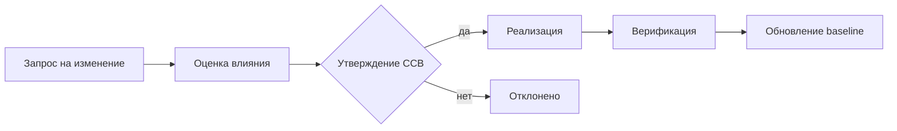

# Управление конфигурацией программных комплексов

  ОБЯЗАТЕЛЬНО
  ДЛЯ НОВИЧКОВ

Руководителю
Разработчику
Аналитику

## Что такое SCM и чем оно шире Git

**Управление конфигурацией** (Software Configuration Management, **SCM**) — дисциплина, которая отвечает на вопросы:

- **Что** входит в состав конкретной версии продукта?
- **Кто** и **почему** изменил артефакт?
- **Можно ли** через полгода собрать **ту же** версию, что сдали заказчику?
- **Согласованы** ли код, документация и среда эксплуатации?

**Git** хранит историю файлов и помогает команде работать параллельно. **SCM** добавляет **правила**: что считается **конфигурационной единицей**, когда фиксируется **baseline** (базовая линия), кто утверждает **change request**, как связываются код, ТЗ и ПМИ.

  
Аналогия

  
<strong>Git</strong> — журнал изменений ингредиентов на кухне. 
  <strong>SCM</strong> — рецепт, список допустимых замен, подпись шефа на выпуске партии "обед от 12.03.2026" и акт "эта партия соответствует рецепту v3".

В учебниках по производству ПО (гл. 2.7) SCM стоит рядом с документированием: формуляр, руководства и **исходники** должны соответствовать друг другу в момент **сдачи заказчику**.

### Мини-глоссарий

| Термин | Простыми словами |
|--------|------------------|
| **CI (Configuration Item)** | Элемент, который версионируют **отдельно** (сервис, ТЗ, образ Docker) |
| **Baseline** | Утверждённый "снимок" набора версий CI |
| **Change request (CR)** | Формальная заявка на изменение с оценкой влияния |
| **CCB** | Change Control Board — кто **разрешает** менять baseline |
| **Аудит конфигурации** | Проверка: факт = учёт = договор |

---

## Процессы SCM по ISO/IEC 12207

Стандарт жизненного цикла выделяет пять процессов — в Agile они **те же по смыслу**, другие названия:

| Процесс | Смысл | Как это выглядит в Scrum-команде |
|---------|--------|-----------------------------------|
| **Идентификация конфигурации** | Решить, **что** входит в "изделие" | Список репозиториев, сервисов, документов в Confluence/Git |
| **Управление конфигурацией** | Версии, ветки, метки, baseline | `main`, tag `v2.3.1`, lock-файлы |
| **Контроль изменений** | Заявка → анализ → утверждение → внесение | PR + code review + approval PO/архитектора |
| **Учёт состояния** | Отчёты: что в какой версии | Changelog, release notes, dashboard версий |
| **Аудит конфигурации** | Соответствие факта и учёта | Сверка поставки с ведомостью, SBOM |

---

## Конфигурационная единица (CI)

**Configuration Item** — элемент, который **версионируют и контролируют** отдельно, потому что от него зависит состав релиза или ответственность.

Примеры для заказного **комплекса программ**:

| CI | Примеры | Почему отдельно |
|----|---------|----------------|
| Исходный код | Сервис `billing`, библиотека `common-auth` | Разные команды, разный цикл релизов |
| Сборка | Docker-образ `app:2.3.1`, NuGet-пакет | Поставка заказчику — **артефакт**, не "коммит" |
| Документация | ТЗ v1.4, ПМИ v2.0, руководство оператора | Приёмка по **документам** |
| Конфигурация | Helm chart, `appsettings.Production.json` | Меняется без перекомпиляции кода |
| Данные | Миграции Flyway, справочники | Влияют на поведение после деплоя |
| Среда | Terraform/Ansible описание staging | "У нас работало" = код + среда |

:::tip Мини-разбор
**Монолит** в одном репозитории — часто **одна CI** "приложение". **Микросервисы** — несколько CI; SCM сложнее, зато границы ответственности яснее. Общий **release train** (одна дата релиза всех сервисов) или независимые версии — решение архитектора и контракта.
:::

---

## Baseline — "снимок, с которым работаем"

**Baseline** (базовая линия) — **утверждённая** версия **набора** CI в точке времени. После утверждения изменения идут только через **контроль изменений**.

| Тип baseline | Когда фиксируют | Пример |
|--------------|-----------------|--------|
| **Functional** | Согласованы требования | ТЗ v1.0 подписано |
| **Allocated** | Требования распределены по модулям | Матрица "требование → сервис" |
| **Product** | Готовый релиз для эксплуатации | Поставка 2.3.1 заказчику |

**В Git** product baseline ≈ **tag** `v2.3.1` + **lock-файлы** (`package-lock.json`, `poetry.lock`) + **образ в registry** с тем же тегом или digest `sha256:…`.

**Зачем заказчику:** он принимает **конкретный baseline**, а не "что-то из main вчера вечером". Спор "что сдавали" решается тегом и актом, а не памятью разработчика.

---

## Контроль изменений (Change Control)

Типовой цикл для госсектора и критичных систем:

**CCB** (Change Control Board) — совет по изменениям: заказчик, архитектор, QA, иногда ИБ.

| Контекст | Кто играет роль CCB |
|----------|---------------------|
| Продуктовая Scrum-команда | PO + tech lead на refinement |
| Госконтракт (44-ФЗ) | Комиссия, протокол, допсоглашение |
| Сопровождение | Отдельный регламент на патчи vs доработки |

**Оценка влияния** отвечает на вопросы: какие CI затронуты? нужен ли регресс? меняется ли ТЗ/ПМИ? сколько **человеко-дней** ([COCOMO](./1), change request)?

---

## Связь SCM с трассировкой требований

Для заказного ПО недостаточно "закоммитили фикс". Нужна цепочка для аудита и приёмки:

**Требование ТЗ → задача → коммит → тест → версия в релизе**

| Звено | Зачем |
|-------|--------|
| ТЗ п. 4.2.1 | Что обещали |
| Jira `PROJ-123` | Кто и зачем делал |
| Commit `PROJ-123 fix VAT` | Что изменили в коде |
| Тест TC-045 в ПМИ | Как доказали |
| Tag `v2.3.1` | Что попало к заказчику |

Инструменты: Jira + Git (smart commits), GitLab links, Azure DevOps work items, [матрица трассировки](/encyclopedia/7-project/7-04-analitika/116).

---

## SCM и CI/CD — как pipeline поддерживает дисциплину

| Этап pipeline | Роль SCM |
|---------------|----------|
| **Commit** | Идентификация автора, ссылка на задачу |
| **Build** | Воспроизводимая сборка из **зафиксированного** commit + lock |
| **Test** | Проверка артефакта против требований baseline |
| **Deploy** | Промotion **того же** digest/sha, не "похожей" сборки |
| **Rollback** | Возврат к **известному** baseline |

Подробнее — [DevOps](/encyclopedia/8-infra-security/8-04-devops-ci-cd/intro).

:::info Воспроизводимость
Заказчик через год спросит: "Соберите 2.3.1 для расследования инцидента". Без tag, lock-файлов и сохранённого образа в registry это **невозможно** или дорого — отсюда требования к SCM в госконтрактах.
:::

---

## Документирование и SCM

По ГОСТ **версия документа** должна соответствовать **версии ПО** в поставке.

Практика:

- ТЗ, ПМИ, руководства — в Git или ECM с историей версий;
- на титуле: "Для версии ПО 2.3.1";
- при change request обновляют **и** код, **и** затронутые документы **в одном релизе**.

См. [техническое письмо](/encyclopedia/7-project/7-08-tehnicheskoe-pismo/intro).

---

## Аудит конфигурации

| Вид аудита | Вопрос | Кто проводит |
|------------|--------|--------------|
| **Функциональный** | Сделали то, что в ТЗ? | Испытания по ПМИ |
| **Физический** | В поставке те файлы и версии, что в ведомости? | Комиссия, checksum, SBOM |

**SBOM** (Software Bill of Materials) — "составная ведомость" зависимостей и версий; всё чаще требуют при поставке в регулируемых отраслях.

Для сертификации и госконтрактов **физический** аудит обязателен: расхождение версии в акте и в registry — основание для отказа в приёмке.

---

## Типичные ошибки

1. **Только Git, без baseline релиза** — нельзя воспроизвести поставку.
2. **Конфиг только у админа** — не CI, не под контролем, при увольнении — катастрофа.
3. **Документы в Word без версий** — ТЗ описывает 2.0, в prod — 2.3.1.
4. **Hotfix мимо процесса** — "потом оформим" → провал аудита и спор с заказчиком.
5. **Tag без артефакта** — тег на коммите есть, образ в registry перезаписан.

---

## Куда читать дальше

| Тема | Материал |
|------|----------|
| Жизненный цикл, 12207 | [Конструирование, стандарты](/encyclopedia/7-project/7-12-konstruirovanie-po/1) |
| Приёмка и акты | [Сертификация и приёмка](./6) |
| Сопровождение после сдачи | [Сопровождение ПО](./4) |
| Квалификация команды | [Квалификация команды](./7) |

---
