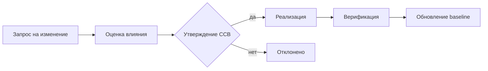

# Управление конфигурацией программных комплексов

  ОБЯЗАТЕЛЬНО
  ДЛЯ НОВИЧКОВ

Руководителю
Разработчику
Аналитику

## Что такое SCM и чем оно не является

**Управление конфигурацией** (Software Configuration Management, SCM) — это **дисциплина**, а не «просто Git». Она отвечает на вопросы:

- **Что** входит в состав конкретной версии продукта?
- **Кто** и **почему** изменил артефакт?
- **Можно ли** воспроизвести сборку релиза 2.3.1 через полгода?
- **Согласованы** ли код, документация и среда эксплуатации?

В учебниках по производству ПО (гл. 2.7) SCM стоит рядом с документированием: формуляр, руководства и **исходники** должны соответствовать друг другу на момент **сдачи заказчику**.

  
Git — инструмент, SCM — процесс

  
Git хранит историю файлов. SCM добавляет <strong>правила</strong>: что считается конфигурационной единицей, когда фиксируется baseline, кто утверждает change request, как связываются код, ТЗ и ПМИ.

---

## Процессы SCM по ISO/IEC 12207

| Процесс | Смысл |
|---------|--------|
| **Идентификация конфигурации** | Решить, что входит в «изделие»: репозитории, модули, документы, схемы БД |
| **Управление конфигурацией** | Версии, ветки, метки, baseline |
| **Контроль изменений** | Заявка → анализ → утверждение → внесение |
| **Учёт состояния** | Отчёты: что в какой версии, что изменилось |
| **Аудит конфигурации** | Проверка соответствия факта и учёта |

В Agile те же идеи выглядят как: **PR + code review + merge в main + tag релиза + changelog** — но формально это те же функции.

---

## Конфигурационная единица (CI)

**Configuration Item (CI)** — элемент, который **версионируют и контролируют** отдельно.

Примеры для заказного комплекса программ:

| CI | Примеры |
|----|---------|
| Исходный код | Сервис `billing`, библиотека `common-auth` |
| Сборка | Docker-образ `app:2.3.1`, NuGet-пакет |
| Документация | ТЗ v1.4, ПМИ v2.0, руководство оператора |
| Конфигурация | Helm chart, `appsettings.Production.json` |
| Данные | Схема миграций Flyway, справочники |
| Среда | Описание staging (IaC) |

:::tip Мини-разбор
Монолит из одного репозитория — **одна CI** «приложение». Микросервисы — **несколько CI** с **общим** release train или независимыми версиями; SCM усложняется, но границы яснее.
:::

---

## Baseline — «снимок, с которым работаем»

**Baseline** (базовая линия) — **утверждённая** версия набора CI в точке времени.

| Тип | Когда |
|-----|--------|
| **Functional baseline** | Согласованные требования (ТЗ) |
| **Allocated baseline** | Распределение по модулям |
| **Product baseline** | Готовый релиз для эксплуатации |

В Git baseline ≈ **tag** `v2.3.1` + **lock-файлы** + **артефакты в registry** с тем же тегом.

**Зачем:** заказчик принимает **конкретный baseline**, а не «что-то из main вчера вечером».

---

## Контроль изменений (Change Control)

Типовой цикл для госсектора и критичных систем:

**CCB** (Change Control Board) — совет по изменениям: представители заказчика, архитектор, QA, иногда ИБ.

В продуктовой команде роль CCB часто играет **product owner + tech lead** на refinement; в **44-ФЗ** — формальный протокол и допсоглашение.

---

## Связь SCM с трассировкой требований

Для заказного ПО недостаточно «закоммитили фикс». Нужна цепочка:

**Требование ТЗ → задача → коммит → тест → версия в релизе**

Инструменты: Jira + Git (smart commits), GitLab links, Azure DevOps work items, или таблица в [матрице трассировки](/encyclopedia/7-project/7-04-analitika/116).

---

## SCM и CI/CD

| Этап pipeline | Роль SCM |
|---------------|----------|
| Commit | Идентификация автора, связь с задачей |
| Build | Воспроизводимая сборка из зафиксированного commit |
| Test | Проверка CI против baseline требований |
| Deploy | Промotion артефакта с тем же digest/sha |
| Rollback | Возврат к известному baseline |

Подробнее — [DevOps](/encyclopedia/8-infra-security/8-04-devops-ci-cd/intro).

---

## Документирование и SCM

По ГОСТ **версия документа** должна соответствовать **версии ПО** в поставке. Практика:

- ТЗ, ПМИ, руководства хранят в Git или ECM с версиями;
- на титуле: «Для версии ПО 2.3.1»;
- при change request обновляют **и** код, **и** затронутые документы.

См. [техническое письмо](/encyclopedia/7-project/7-08-tehnicheskoe-pismo/intro).

---

## Аудит конфигурации

**Функциональный аудит** — «сделали то, что в ТЗ?» (испытания по ПМИ).

**Физический аудит** — «в поставке те файлы и версии, что в ведомости?» (checksum, SBOM, акт приёмки).

Для сертификации и госконтрактов физический аудит обязателен.

---

## Типичные ошибки

1. **Только Git, без baseline релиза** — невозможно воспроизвести поставку.
2. **Конфиг в голове админа** — не CI, не под контролем.
3. **Документы в Word на SharePoint без версий** — расхождение с кодом.
4. **Hotfix мимо процесса** — «потом оформим» → audit fail.

---

## Куда читать дальше

| Тема | Материал |
|------|----------|
| Жизненный цикл, 12207 | [Конструирование, стандарты](/encyclopedia/7-project/7-12-konstruirovanie-po/1) |
| Приёмка и акты | [Сертификация и приёмка](./6) |
| Сопровождение после сдачи | [Сопровождение ПО](./4) |

---
