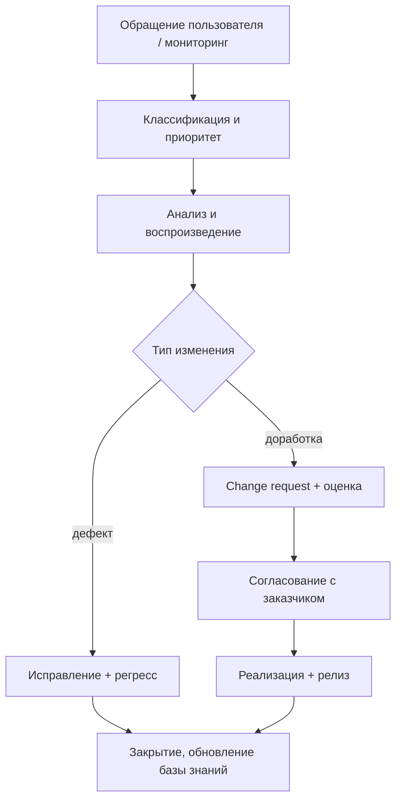

# Сопровождение программных комплексов

  ОБЯЗАТЕЛЬНО
  ДЛЯ НОВИЧКОВ

Руководителю
Разработчику
Аналитику

## Сопровождение начинается не «после сдачи»

Многие думают: проект закончился на акте приёмки. На деле **большая часть стоимости** сложного заказного ПО часто приходится на **годы эксплуатации** — исправления, адаптация к новым законам, интеграции, мелкие доработки. В учебниках это глава 2.6; в SDLC — фаза **«эксплуатация и поддержка»** ([7-03/1](/encyclopedia/7-project/7-03-metodologiya-i-zhiznennyy-tsikl-po/1)).

**Сопровождение** (software maintenance) — совокупность процессов, которые **сохраняют продукт пригодным** к использованию после передачи заказчику.

  
Связь с легаси

  
Любое сопровождаемое через годы ПО становится «наследием». Подходы к безопасным изменениям — в разделе <a href="/encyclopedia/7-project/7-11-legasi-kod/intro">Легаси-код</a>.

---

## Четыре вида сопровождения (классика IEEE)

| Вид | Суть | Пример |
|-----|------|--------|
| **Corrective** | Исправление дефектов | Баг в расчёте НДС |
| **Adaptive** | Адаптация к среде | Новая версия ОС, смена API банка |
| **Perfective** | Улучшение без смены spec | Ускорение отчёта |
| **Preventive** | Снижение будущих рисков | Рефакторинг, обновление зависимостей |

На практике тикет в поддержке может быть **смешанным**: «не работает после обновления Windows» — adaptive + corrective.

---

## Этапы и процедуры

Типовой цикл обращения (ITIL-подобный, упрощённо):

**Ключевые артефакты:** журнал инцидентов, SLA, release notes, обновлённая документация, запись в [SCM](./3).

---

## Ресурсы для сопровождения

| Ресурс | Назначение |
|--------|------------|
| **Команда L2/L3** | Анализ, код, релизы |
| **База знаний** | Типовые решения, runbook |
| **Среды** | Dev/test, копия prod для воспроизведения |
| **Мониторинг и логи** | Раннее обнаружение сбоев |
| **Контракт / SLA** | Время реакции и восстановления |
| **Бюджет** | Часто 15–25% от стоимости разработки **в год** (ориентир, сильно зависит от домена) |

Для госконтрактов сопровождение выносится **отдельным этапом** или **отдельным контрактом** с регламентом и штатным расписанием.

---

## Экономика сопровождения

Почему это тема курса «экономика производства»:

1. **Стоимость изменения** растёт без [сопровождаемости](/encyclopedia/7-project/7-13-ekonomika-proizvodstva-po/2) (ISO 25010).
2. **Техдолг** на этапе разработки — это **счёт** на сопровождение.
3. **COCOMO** учитывает зрелость продукта и стабильность требований; после сдачи PCON часто падает не сразу, но adaptive-работы растут.

Решение «переписать с нуля» vs «чинить дальше» — TCO на 5 лет; см. [легаси, TCO](/encyclopedia/7-project/7-11-legasi-kod/6).

---

## Организационные модели

| Модель | Плюсы | Минусы |
|--------|-------|--------|
| **Команда разработки остаётся** | Знание системы | Дорого, текучка |
| **Выделенная поддержка** | Фокус на SLA | Разрыв с архитектурой |
| **Аутсорс сопровождения** | Гибкий бюджет | Потеря экспертизы |
| **DevOps / «you build it you run it»** | Быстрые фиксы | Нагрузка на разработчиков |

---

## Связь с документированием

При каждом релизе сопровождения обновляют:

- руководство пользователя / оператора;
- release notes;
- при изменении поведения — **фрагмент ТЗ** или приложение к контракту;
- ПМИ для регрессионных испытаний.

---

## Типичные ошибки

1. **Нет регресса** — каждый патч ломает старое.
2. **«Героический» L3** — знания только в одной голове.
3. **Сопровождение без доступа к prod-логам** — невозможно расследовать.
4. **Игнорирование preventive** — накопление CVE в зависимостях.

---

## Куда читать дальше

| Тема | Материал |
|------|----------|
| SCM, версии | [Управление конфигурацией](./3) |
| Безопасные правки | [Легаси-код](/encyclopedia/7-project/7-11-legasi-kod/3) |
| Приёмка релизов | [Сертификация и приёмка](./6) |

---
