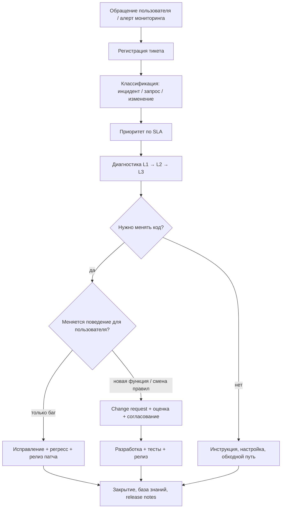

# Сопровождение программных комплексов

  ОБЯЗАТЕЛЬНО
  ДЛЯ НОВИЧКОВ

Руководителю
Разработчику
Аналитику

## С чего начать, если вы новичок

**Сопровождение** (software maintenance, иногда пишут «поддержка» или maintenance) — всё, что делают с уже **сданным** продуктом, чтобы он **продолжал работать** и соответствовал новым условиям: законы меняются, банк меняет API, пользователи находят баги, хакеры находят дыры в библиотеках.

Частая иллюзия: «проект закончился на акте приёмки». На деле у долгоживущих систем **значительная доля полной стоимости** (TCO — total cost of ownership, «стоимость владения») приходится на годы **после** первой поставки. В учебниках это глава 2.6; в жизненном цикле ПО — фаза **эксплуатация и поддержка** ([SDLC](/encyclopedia/7-project/7-03-metodologiya-i-zhiznennyy-tsikl-po/1)).

  
Аналогия

  
Разработка — постройка дома. Сопровождение — коммунальные платежи, ремонт крыши после шторма, замена лифта по новым нормам. Дом «готов», но без ухода он дешевеет и становится опасным.

  
Связь с легаси

  
Любое сопровождаемое годами ПО со временем становится «наследием» (legacy). Безопасные изменения — в разделе <a href="/encyclopedia/7-project/7-11-legasi-kod/intro">Легаси-код</a>.

### Мини-глоссарий

| Термин | Простыми словами |
|--------|------------------|
| **Инцидент** | Событие «что-то сломалось» или «не работает как ожидали» |
| **Заявка / тикет** | Запись в системе учёта (Jira, ServiceNow): описание проблемы, приоритет, статус |
| **SLA** | Service Level Agreement — договорённые сроки реакции и восстановления |
| **L1 / L2 / L3** | Уровни поддержки: первая линия (типовые ответы) → углублённый анализ → разработчики |
| **Регресс** | Проверка, что исправление **не сломало** старый функционал |
| **Release notes** | Краткое описание изменений в новой версии для пользователей и поддержки |
| **Техдолг** | Упрощения при разработке, которые потом **дорого** чинить |

---

## Четыре вида сопровождения (классика IEEE)

Исторически выделяют **четыре типа** работ — на практике один тикет часто сочетает два.

| Вид | По-английски | Суть | Пример из жизни |
|-----|--------------|------|-----------------|
| **Корректирующее** | Corrective | Исправление **дефектов** — система вела себя не так, как в ТЗ | Неверный расчёт НДС в счёте |
| **Адаптивное** | Adaptive | Подстройка к **изменившейся среде** без смены бизнес-требований | Новая версия Windows, банк отключил старый API |
| **Совершенствующее** | Perfective | Улучшение **без изменения спецификации** | Ускорили отчёт, который «и так работал, но медленно» |
| **Предупреждающее** | Preventive | Работа **заранее**, чтобы снизить будущие риски | Обновили уязвимую библиотеку, отрефакторили модуль перед пиком нагрузки |

**Как отличить на совещании:** спросите «меняется ли то, что **обещали** заказчику в ТЗ?»

- Только баг — **corrective**.
- ТЗ то же, среда другая — **adaptive**.
- ТЗ то же, хотим быстрее/удобнее — **perfective**.
- Профилактика без жалобы пользователя — **preventive**.

Смешанный пример: «После обновления ОС перестала печататься накладная» — **adaptive** (среда) + часто **corrective** (ошибка в драйвере/коде).

---

## Этапы и процедуры: путь заявки от звонка до релиза

Типовой цикл (близок к ITIL — библиотеке практик ИТ-услуг):

### Что происходит на каждом шаге

1. **Регистрация** — без тикета нет истории, нет SLA, нельзя доказать объём работ при споре с заказчиком.
2. **Классификация** — **инцидент** (срочно, что-то упало) отличают от **запроса на обслуживание** («как выгрузить отчёт?») и от **запроса на изменение** (новая кнопка в интерфейсе).
3. **Приоритет** — обычно матрица «влияние × срочность»; P1 — простой всей системы, P4 — косметика.
4. **Диагностика** — воспроизведение на копии prod или staging; без логов L3 часто «слепой».
5. **Релиз** — патч идёт через тот же [SCM](./3), что и основная разработка: версия, тег, протокол регресса.

**Ключевые артефакты:** журнал инцидентов, SLA, release notes, обновлённая документация, запись в [управлении конфигурацией](./3).

---

## SLA — что обещают заказчику и как это считать

**SLA** фиксирует **измеримые** обязательства. Примеры формулировок (цифры — иллюстрация, в контракте свои):

| Метрика | Что значит | Пример |
|---------|------------|--------|
| **Время реакции** | Когда дежурный **подтвердил** тикет и начал работу | P1 — 15 минут, P3 — 8 рабочих часов |
| **Время восстановления (RTO)** | Когда **сервис снова доступен** (хотя бы обходной путь) | RTO ≤ 4 ч для P1 |
| **Доступность (uptime)** | Доля времени, когда система **доступна** | 99,5% в месяц (≈ 3,6 ч простоя) |

**RPO** (recovery point objective) — сколько **данных можно потерять** при катастрофе (например, «не больше 15 минут несохранённых транзакций»). Это уже про резервное копирование и [надёжность по ISO 25010](./2).

:::info Штрафы и KPI
В госконтракте SLA часто привязаны к **штрафам** или **бонусам**. Для исполнителя важно закладывать в смету **дежурства**, **стенд**, **автотесты регресса** — иначе формально SLA выполнить невозможно.
:::

---

## Ресурсы для сопровождения

| Ресурс | Зачем нужен | Что бывает, если нет |
|--------|-------------|----------------------|
| **Команда L2/L3** | Анализ, код, релизы | Всё зависает на одном «герое» |
| **База знаний / runbook** | Типовые инструкции («перезапуск службы X») | Каждый раз изобретают велосипед |
| **Среды dev / test** | Воспроизвести баг без риска для prod | Патч «на живую» ломает больше |
| **Мониторинг и логи** | Раннее обнаружение, расследование | Пользователь звонит раньше, чем вы узнали |
| **Контракт и бюджет** | Понятный объём работ в год | «Бесплатные» доработки съедают маржу |

**Ориентир по бюджету:** для многих корпоративных систем закладывают **15–25% от стоимости первоначальной разработки в год** на сопровождение — сильно зависит от домена (медицина, финансы, АСУ ТП дороже).

В **госзаказе** сопровождение часто выносят **отдельным этапом** или **отдельным контрактом** с штатным расписанием и регламентом.

---

## Экономика сопровождения: почему это тема курса

Три связи с [экономикой производства](./intro):

1. **Стоимость изменения** растёт, если при разработке не закладывали [сопровождаемость](./2) (modularity, testability, документация).
2. **Технолг** на этапе «быстро сдать» — это **счёт**, который предъявят в сопровождении: каждый патч дороже предыдущего.
3. **COCOMO II** учитывает опыт людей и стабильность требований; после сдачи часто растёт доля **adaptive**-работ (законы, интеграции), даже если функциональные требования «заморожены».

### Учебный пример TCO на 5 лет

Допустим, разработка стоила **80 млн ₽**, сопровождение — **20% в год** от этой суммы.

| Год | Разработка | Сопровождение | Накоплено |
|-----|------------|---------------|-----------|
| 0 | 80 млн | — | 80 млн |
| 1 | — | 16 млн | 96 млн |
| 2 | — | 16 млн | 112 млн |
| 3 | — | 16 млн | 128 млн |
| 4 | — | 16 млн | 144 млн |
| 5 | — | 16 млн | **160 млн** |

За пять лет сопровождение **сравнялось** с первоначальной разработкой. Решение «переписать с нуля» vs «чинить дальше» сравнивают именно по такой **полной стоимости** — см. [TCO и легаси](/encyclopedia/7-project/7-11-legasi-kod/6).

---

## Организационные модели: кто делает сопровождение

| Модель | Как устроено | Плюсы | Минусы |
|--------|--------------|-------|--------|
| **Та же команда разработки** | «You build it, you run it» | Знают код, быстрые фиксы | Дорого; выгорание; мало времени на новые фичи |
| **Выделенная поддержка** | Отдельный штат L2/L3 | Фокус на SLA | Разрыв с архитектурой; «костыли» без рефакторинга |
| **Аутсорс** | Внешний подрядчик по регламенту | Гибкий бюджет | Потеря экспертизы; долгий онбординг |
| **Гибрид** | L1 у заказчика, L2/L3 у разработчика | Баланс | Нужны чёткие границы эскалации |

Выбор модели — решение **экономики и риска**, а только HR.

---

## Связь с документированием и приёмкой

При каждом релизе сопровождения обновляют:

- руководство пользователя / оператора;
- **release notes** (что изменилось, что проверить после обновления);
- при изменении поведения — фрагмент ТЗ или приложение к контракту;
- сценарии для **регрессионных** испытаний в ПМИ.

Иначе заказчик примет патч «на словах», а на следующей приёмке крупного релиза всплывёт расхождение с документацией — см. [сертификацию и приёмку](./6).

---

## Типичные ошибки и как их избежать

1. **Нет регресса** — каждый патч ломает старое. *Лечение:* минимальный набор автотестов на критичные сценарии + smoke после деплоя.
2. **«Героический» L3** — знания только в одной голове. *Лечение:* runbook, парная работа, код-ревью даже «мелких» фиксов.
3. **Сопровождение без логов prod** — невозможно расследовать. *Лечение:* централизованные логи, correlation id в запросах.
4. **Игнорирование preventive** — накопление CVE в зависимостях. *Лечение:* регулярный dependency audit, окно на обновления.
5. **Смешение сопровождения и бесплатных доработок** — scope creep без change request. *Лечение:* в контракте чётко: что входит в SLA, что — отдельная оплата.

---

## Куда читать дальше

| Тема | Материал |
|------|----------|
| SCM, версии | [Управление конфигурацией](./3) |
| Безопасные правки | [Легаси-код](/encyclopedia/7-project/7-11-legasi-kod/3) |
| Приёмка релизов | [Сертификация и приёмка](./6) |
| Качество и NFR | [ISO/IEC 25010](./2) |
| Оценка трудозатрат | [COCOMO II](./1) |

---
