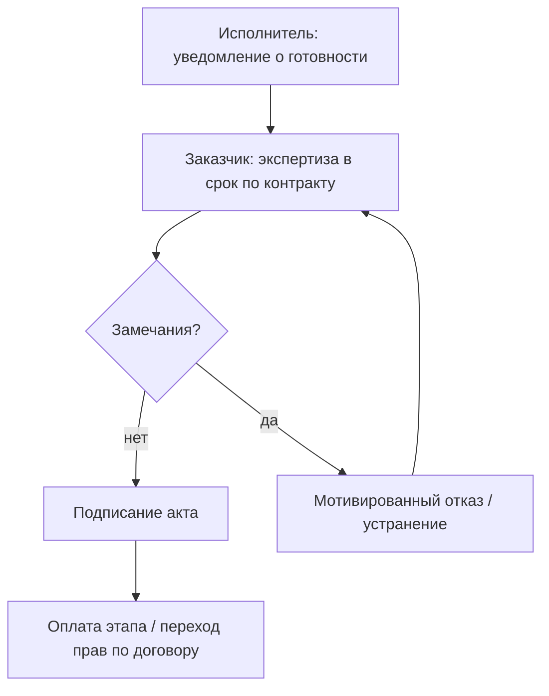

# Сертификация и приёмка заказных программных продуктов

  ОБЯЗАТЕЛЬНО
  ДЛЯ НОВИЧКОВ

Руководителю
Аналитику
Тестировщику

---

## Три разных слова — три разных процесса

На приёмке часто смешивают понятия. Разделение экономит месяцы споров:

| Термин | Что это | Кто обычно делает | Результат |
|--------|---------|-------------------|-----------|
| **Испытания** | Проверка по **ПМИ** / тест-плану: "соответствует ТЗ?" | QA, заказчик, комиссия | Протоколы pass/fail |
| **Удостоверение качества** | **Доказательная база**, что качество **обеспечено** процессами и метриками | QA, ИБ, аудитор | Пакет отчётов, матрицы |
| **Сертификация** | **Независимая** оценка по регламенту аккредитованного органа | Лаборатория, ведомство | **Сертификат** / заключение |

Для **внутреннего** продукта часто хватает **испытаний + акта**. Для **ГИС, ОПК, медицины, ФСТЭК** — добавляют **формальную сертификацию** процесса и/или продукта.

  
Базовый документ

  

  Пошаговый разбор ПМИ — [ПМИ по ГОСТ 19.301-79](/encyclopedia/7-project/7-08-tehnicheskoe-pismo/14).

  Эта статья дополняет его блоком про сертификацию (гл. 2.8).

  

---

### Мини-глоссарий

| Термин | Простыми словами |
|--------|------------------|
| **ПМИ** | Программа и методика испытаний — **что, как и чем** проверяем |
| **UAT** | User Acceptance Testing — приёмочные испытания с участием заказчика |
| **Baseline** | Версия ПО и документов, которую **сдают** (см. [SCM](./3)) |
| **Мотивированный отказ** | Официальный документ: **почему** не подписываем акт |
| **Класс дефекта** | Серьёзность: blocker / critical / major / minor — влияет на приёмку |

---

## Организация испытаний — от модуля до комиссии

### Виды (типичная последовательность)

| Этап | Кто | Цель | Когда |
|------|-----|------|--------|
| **Модульные** | Разработка | Код модуля верен | Во время разработки |
| **Интеграционные** | Разработка, QA | Модули вместе работают | Перед системными |
| **Системные** | QA | Система в целом на стенде | Перед UAT |
| **Приёмочные (UAT)** | Заказчик | Бизнес-сценарии "как в жизни" | Перед актом |
| **Государственные / квалификационные** | Комиссия | Соответствие контракту и нормативам | По регламенту контракта |

**ПМИ** фиксирует для каждого сценария: **предусловия**, **шаги**, **ожидаемый результат**, **инструмент** (ручной / автотест), **критерий** успеха.

---

### Пример строки в ПМИ

| ID | Сценарий | Данные | Ожидание | Метод |
|----|----------|--------|----------|--------|
| TC-012 | Создание заказа авторизованным пользователем | Логин user1 | HTTP 201, сумма = Σ строк | API-тест + ручная проверка в UI |

Без такой детализации "протестировали" на приёмке не защитить.

---

## Завершение испытаний — пакет для приёмки

Перед подписанием акта собирают **пакет**:

1. **Протоколы** по каждому обязательному сценарию ПМИ.
2. **Перечень открытых дефектов** с классом и планом устранения.
3. **Матрица трассировки** ТЗ → требование → тест → результат.
4. **Baseline**: версия ПО (tag), образ/digest, комплект документации с тем же номером версии.
5. **Акт** о приёмке или **мотивированный отказ** с перечнем замечаний.

  
Критерий "сдали" (типичный для госконтрактов)

  

  **Нет** дефектов **класса 1** (блокирующих). Дефекты класса 2 — с **письменным** планом и сроками.

  **Все обязательные** сценарии ПМИ — **pass**.

  Точные классы — в контракте и ТЗ.

  

**Демо на ноутбуке** руководителю — полезно для коммуникации, но **заменяет** протоколы ПМИ только если контракт это прямо допускает (редко).

---

## Удостоверение качества — "почему нам можно верить"

**Quality assurance** в смысле гл. 2.8 — **совокупность доказательств**, а не только зелёные галочки в TestRail:

- процессы по [ISO/IEC 12207](/encyclopedia/7-project/7-12-konstruirovanie-po/1) (как организованы разработка и тесты);
- метрики по [ISO 25010](./2) (NFR с цифрами);
- результаты [SCM-аудита](./3) (версии совпадают);
- статический анализ, coverage, нагрузка, отчёты ИБ.

**Заказчик или внешний аудитор** смотрит: можно ли **доверять** выводу "качество обеспечено", а не только факту "100 тестов прошли вчера".

| Артефакт | Что доказывает |
|----------|----------------|
| Отчёт нагрузки | Performance по 25010 |
| Протокол пентеста | Security |
| Журнал code review | Контроль изменений |
| CMMI / ISO 9001 (если есть) | Зрелость **процессов** организации |

---

## Сертификация технологических процессов

**Сертификация процессов** — подтверждение, что **организация** стабильно производит ПО по требованиям стандарта: оценивают **производственный процесс** ("фабрику"), а не отдельную версию продукта.

| Модель / стандарт | Что оценивают |
|-------------------|---------------|
| **ISO 9001** | Система менеджмента качества (широко, не только IT) |
| **CMMI appraisal** | Зрелость процессов разработки ([SDLC](/encyclopedia/7-project/7-03-metodologiya-i-zhiznennyy-tsikl-po/1)) |
| **ISO/IEC 15504 (SPICE)** | Компетентность отдельных процессов |
| **Отраслевые** | DO-178C (авиация), IEC 62304 (медизделия), ГОСТ Р 56939 (ИБ) |

Для **подрядчика** сертификат процессов — аргумент в тендере: "мы умеем **повторять** результат".

---

## Сертификация готового продукта

**Сертификация продукта** — конкретная **версия** ПО проходит оценку в **аккредитованной** лаборатории или ведомстве.

Примеры контекста в РФ:

- **ФСТЭК / ФСБ** — требования по защите информации;
- **реестр отечественного ПО / ГИС** — импортозамещение, отраслевые регламенты;
- **медрегулятор** — Software as Medical Device.

Требуют: **комплект документации**, **стенд**, иногда **исходники**, **повторяемую сборку** ([SCM](./3)). Сроки и стоимость — **отдельная строка** сметы, часто **месяцы**.

---

## Акт приёмки и юридический контур

В госконтракте (**44-ФЗ**, **223-ФЗ**) приёмка — **этап контракта**:

1. Исполнитель направляет **уведомление о готовности** и пакет документов.
2. Заказчик (комиссия) проводит **экспертизу** в **срок**, указанный в контракте (пропуск срока иногда трактуется в пользу исполнителя — смотрите договор).
3. Подписывается **акт** или **мотивированный отказ**.
4. Без акта — **нет оплаты** этапа и часто **нет** перехода прав на результаты.

**Agile** внутри команды **сосуществует** с актом на milestone "релиз 1.0" в гибридной модели: спринты — внутри, **формальная приёмка** — на границе контракта ([гос. методологии](/encyclopedia/7-project/7-03-metodologiya-i-zhiznennyy-tsikl-po/2)).

---

## Связь с экономикой проекта

| Фактор | Влияние |
|--------|---------|
| **Стоимость сертификации** | Отдельная строка: лаборатория + подготовка документов + простой команды |
| **Повторные испытания** | После провала — двойные затраты; в [COCOMO](./1) бьют **PCON** (нестабильные требования), **DOCU** |
| **Досрочная приёмка** без полного ПМИ | Экономия сейчас, **штраф** на [сопровождении](./4) и репутации |
| **Полный ПМИ с NFR** | Дороже до акта, дешевле споры после |

---

## Типичные ошибки

1. **ПМИ пишут после разработки** — сценарии подогнаны под код, а не под ТЗ.
2. **Нет baseline** — нельзя идентифицировать, что сдавали.
3. **Путают демо и приёмочные испытания** — нет протоколов = нет юридической силы.
4. **Игнорируют NFR на приёмке** — проверяют только UI happy path.
5. **Не закладывают время на устранение замечаний комиссии** — срыв срока оплаты.

---

## Куда читать дальше

| Тема | Материал |
|------|----------|
| ПМИ, пошагово | [14](/encyclopedia/7-project/7-08-tehnicheskoe-pismo/14) |
| Модель качества | [25010](./2) |
| Приёмочное тестирование | [111](/encyclopedia/7-project/7-05-testirovanie/111) |
| Гос. контракты | [7-03/2](/encyclopedia/7-project/7-03-metodologiya-i-zhiznennyy-tsikl-po/2) |
| SCM и версии | [Управление конфигурацией](./3) |

---