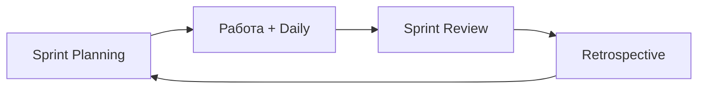

# Scrum — роли, артефакты и события

<div class="article-tags">
  <span class="tag tag-required">ОБЯЗАТЕЛЬНО</span>
  <span class="tag tag-beginner">ДЛЯ НОВИЧКОВ</span>
</div>

<span class="complexity-badge">Руководителю</span>
<span class="complexity-badge">Аналитику</span>
<span class="complexity-badge">Разработчику</span>


<div class="callout callout--info">
  <div class="callout-title">Теория данных (раздел 3)</div>
  <div class="callout-body">
  Миграции в инкременте — [Пакетная работа](/encyclopedia/3-data-markup/3-11-analiz-dannyh/433); проверка — [SQL для тестировщика](/encyclopedia/7-project/7-05-testirovanie/129).
  </div>
</div>

---

## Два слоя знаний

| Слой | Где |
|------|-----|
| **Норма** (актуальные определения) | [Scrum Guide 2020+](https://scrumguides.org/) |
| **Запуск** (11 шагов, формулировки встреч) | [Внедрение](./7) |

Ниже — каркас, с которым можно идти на сертификацию и в ежедневную работу. История «зачем» — в [предыдущей статье](./1).

---

## Три аккаунта (роли)

В Scrum Guide одна **Scrum Team** (обычно до 10 человек), внутри три **accountability**:

### Product Owner (владелец продукта)

- Отвечает за **максимизацию ценности** продукта от работы команды.
- Ведёт и **приоритизирует Product Backlog**; единственный, кто «режет» порядок задач с учётом **всех** стейкхолдеров.
- Принимает решения по scope: что делаем, что откладываем.

PO — человек с **видением**, кто взвешивает риски, выгоду и то, что реально вдохновляет команду и бизнес.

### Developers (разработчики)

Термин **не** означает «только программисты». Это все, кто **создаёт инкремент** в спринте: разработка, анализ, тестирование, дизайн — по составу команды.

- Самоорганизация: **как** выполнить работу спринта.
- Владеют **Definition of Done** для инкремента (согласуют с PO и организацией).

### Scrum Master

- Служит **Scrum Team** и организации: помогает применять Scrum, устраняет **impediments** (препятствия).
- Фасилитирует события, следит за **time-box** и фокусом.
- SM — **лидер-слуга** (между капитаном и тренером): не раздаёт задачи сверху, а держит процесс и непрерывное улучшение.

<div class="callout callout--info">
  <div class="callout-title">Scrum Master ≠ Project Manager</div>

  <div class="callout-body">
  PM часто отвечает за бюджет, контракт и портфель.

  SM — за **процесс Scrum** и здоровье команды.

  В маленьких продуктах роли могут совмещать люди, но **функции** путать опасно.
</div>
  </div>


---

## Артефакты и обязательства (commitments)

| Артефакт | Обязательство (Scrum Guide) | Смысл |
|----------|----------------------------|--------|
| **Product Backlog** | Product Goal | Единый ориентир продукта |
| **Sprint Backlog** | Sprint Goal | Зачем этот спринт |
| **Increment** | Definition of Done | Что значит «готово» |

### Product Backlog

- **Единственный** упорядоченный список всего, что нужно продукту: фичи, исправления, техдолг, исследования.
- Живёт **весь жизненный цикл** продукта; уточняется (refinement) постоянно.
- PO говорит со **всеми** заинтересованными лицами, чтобы бэклог отражал полную картину.

### Sprint Backlog

- Подмножество Product Backlog **на текущий спринт** + план, **как** команда достигнет Sprint Goal.
- Принадлежит **Developers**; обновляется в течение спринта по мере обучения.

### Increment

- Конкретный результат спринта, соответствующий **DoD**.
- К концу спринта инкремент **готов к использованию** (не «почти готово на стенде разработчика»).

Пример фрагмента **Definition of Done** (адаптируйте под команду):

```yaml
definition_of_done:
  - код в основной ветке, code review выполнен
  - автотесты по затронутым модулям зелёные
  - обновлена документация API при изменении контракта
  - нет открытых дефектов severity ≥ Major
  - демо на тестовом стенде, PO подтвердил критерии
```

Шаблон **user story** и **Definition of Ready** — в [аналитике](/encyclopedia/7-project/7-04-analitika/116) и кратко в [7-03/1](/encyclopedia/7-project/7-03-metodologiya-i-zhiznennyy-tsikl-po/1).

---

## События (events)

Все события **time-boxed**; пропуск ради экономии времени обычно **увеличивает** риск и неясность.

| Событие | Длительность (ориентир) | Участники | Цель |
|---------|-------------------------|-----------|------|
| **Sprint** | ≤ 1 месяца, чаще 1–2 недели | Scrum Team | Инкремент + цели спринта |
| **Sprint Planning** | до 8 ч для месячного спринта (меньше для коротких) | Вся Scrum Team | Sprint Goal + начальный Sprint Backlog |
| **Daily Scrum** | 15 мин | Developers (SM фасилитирует) | Синхронизация к Sprint Goal |
| **Sprint Review** | до 4 ч / месяц | Scrum Team + стейкхолдеры | Инспекция инкремента, адаптация бэклога |
| **Sprint Retrospective** | до 3 ч / месяц | Scrum Team | Улучшение процесса |

### Sprint Planning

На практике внедрения:

- Спринт **фиксированной длины** (не «неделя, потом три»).
- Команда берёт верх бэклога и прогнозирует объём; если уже были спринты — опирается на **velocity** (динамику производительности).
- **Правило фокуса:** договорившись о объёме спринта, **не добавлять** новую работу в тот же спринт (исключения — только если команда **сама** отменяет Sprint).

### Daily Scrum

Распространённая формулировка Daily (чуть шире классической тройки «вчера / сегодня / блокеры»):

1. Что ты делал **вчера**, чтобы помочь команде **завершить спринт**?
2. Что сделаешь **сегодня** для того же?
3. Какие **препятствия** на пути команды?

Этика и антипаттерны дейли — [7-02/111](/encyclopedia/7-project/7-02-komanda-i-upravlenie/111).

### Sprint Review

- Демонстрируется только то, что **Done** по DoD.
- Открытая встреча: PO, пользователи, руководство — как в кейсе **Sentinel** (см. [гл. 1](./1)).
- Результат — обновлённый Product Backlog с учётом feedback.

### Sprint Retrospective

- Фокус на **процессе**, не на поиске виноватых (см. [Команда](./3), «вините игру»).
- Улучшение (**kaizen**) должно попасть в работу **следующего** спринта (задача, эксперимент, изменение DoD).

---

## Цикл спринта (схема)



Между спринтами Product Backlog refinement идёт **параллельно** обычной работе.

---

## 11 шагов запуска (краткая выжимка)

Полный разбор — [Внедрение](./7). Типовый порядок:

1. Product Owner  
2. Команда (3–9 человек, все нужные навыки)  
3. Scrum Master  
4. Product Backlog  
5. Оценка бэклога (относительная, Fibonacci)  
6. Sprint Planning  
7. Видимость работы (доска, burndown)  
8. Daily Scrum  
9. Sprint Review  
10. Retrospective  
11. Сразу следующий спринт  

---

## Что читать дальше

| Тема | Статья |
|------|--------|
| Размер команды, SM | [./3](./3) |
| Спринт, velocity, доска | [./4](./4) |
| Потери, DoD углублённо | [./5](./5) |
| Оценка, Planning Poker | [./6](./6) |

**Нормативная база:** [Scrum Guide](https://scrumguides.org/).

---
