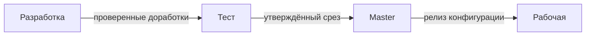

# Разработка, тесты и опытная эксплуатация ERP

Разработчику
Аналитику

  
Теория данных (раздел 3)

  

  Модель данных ERP, миграция — [Основы БД](/encyclopedia/3-data-markup/3-05-osnovy-baz-dannyh/intro), [роль БД](/encyclopedia/3-data-markup/3-05-osnovy-baz-dannyh/6), [пакетная работа](/encyclopedia/3-data-markup/3-11-analiz-dannyh/433). Карта — [о разделе](./intro).
  

---

## Контуры баз (пример для платформы 1С)

Допустимые схемы (от более строгой к компактной):

| Схема | Базы |
|-------|------|
| 4 контура | разработка → тест → **master** → рабочая |
| 3 контура | dev+test → master → рабочая |
| 2 контура | dev+test → рабочая |

**Запрещён** для внедрения ERP вариант «всё в одной prod»: разработка и тесты на живых данных пользователей.

- **Разработка** — хранилище конфигурации, отладка, слияние доработок.
- **Тест** — консультанты и ключевые пользователи проверяют учётную модель.
- **Master** — стабильный срез, регрессия перед релизом; перенос конфигурации **целиком** в prod.
- **Рабочая** — только ПЭ, без экспериментов.

### Схема четырёх контуров

На **master** прогоняют регрессию «заказ → отгрузка → закрытие периода» перед переносом в рабочую. Обратный поток данных из prod в dev — только **обезличенные** копии по регламенту.

Для веб- и микросервисных ERP-ландшафтов те же роли выполняют **dev / test / staging / prod**; логика разделения та же — см. [Тестирование — о разделе](/encyclopedia/7-project/7-05-testirovanie/intro).

## Тестирование и обучение

Регресс на master ловит поломки **сквозных** процессов (заказ → отгрузка → закрытие). Обучение готовят до ОЭ; материалы привязаны к to-be процессам.

## Опытная эксплуатация (ОЭ)

Параллельный или ограниченный учёт в новой системе. Ведут **список запросов на изменение** (дефекты, уточнения, новые редкие операции). Критерии выхода из ОЭ фиксируют заранее — см. [Промышленная эксплуатация](./10).

Интеграционное тестирование с внешними системами — [SIT](/encyclopedia/7-project/7-05-testirovanie/119).
