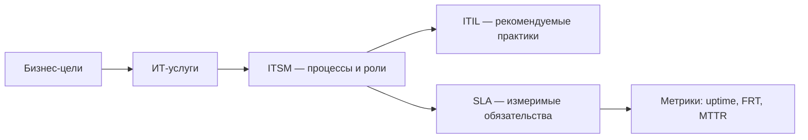

# ITSM — управление ИТ-услугами

<div class="article-tags">
  <span class="tag tag-required">ОБЯЗАТЕЛЬНО</span>
  <span class="tag tag-beginner">ДЛЯ НОВИЧКОВ</span>
</div>

<span class="complexity-badge">Руководителю</span>
<span class="complexity-badge">Аналитику</span>
<span class="complexity-badge">Архитектору</span>


<div class="callout callout--info">
  <div class="callout-title">Теория данных (раздел 3)</div>
  <div class="callout-body">
  CMDB — [Основы БД](/encyclopedia/3-data-markup/3-05-osnovy-baz-dannyh/intro); RPO — [восстановление](/encyclopedia/3-data-markup/3-05-osnovy-baz-dannyh/8).
  </div>
</div>

**ITSM** (IT Service Management, [управление ИТ-услугами](https://ru.wikipedia.org/wiki/ITSM)) — это не конкретный продукт и не один стандарт, а **способ организовать работу ИТ-подразделения или поставщика**: рассматривать информационные технологии как **услуги**, которые потребляет бизнес (или внешний клиент), а не как "набор серверов и программистов".

Практическая цель ITSM — сделать работу ИТ **предсказуемой** — понятно, как принять обращение, как восстановить сервис, как внести изменение без хаоса и как измерить, выполняются ли обещания. Чаще всего для этого используют процессы и роли из [ITIL](./3), а обязательства фиксируют в [SLA](./2).

---

## От технологий к услугам

В зрелой модели у каждой **ИТ-услуги** есть:

- **потребитель** (подразделение, продуктовая команда, внешний клиент);
- **описание** — что именно получает потребитель (например, "корпоративная почта", "API заказов", "линия поддержки L1");
- **владелец услуги** — ответственный за качество и развитие;
- **уровень обслуживания** — измеримые цели, обычно в [SLA](./2);
- **зависимости** — другие услуги, инфраструктура, интеграции.

Разработка фичи, эксплуатация кластера и обработка тикета — разные **активности**, но с точки зрения бизнеса они могут входить в одну **услугу** "цифровой канал продаж" или "сопровождение ERP".

:::note Связь с проектом
Договор на разработку или внедрение — это тоже оказание услуг — проектная команда поставляет **результат** (релиз, акт), а после приёмки часто остаётся **услуга сопровождения** с отдельным SLA. См. [внедрение ERP](/encyclopedia/7-project/7-15-vnedrenie-erp-sistem/10) и [экономику сопровождения](/encyclopedia/7-project/7-13-ekonomika-proizvodstva-po/intro).
:::

---

## Что обычно входит в ITSM

Набор процессов зависит от зрелости организации, но в корпоративной практике чаще всего выделяют:

| Процесс | Зачем | Пример |
|--------|--------|--------|
| **Управление инцидентами** | Быстро восстановить работу услуги | "Не открывается портал" |
| **Управление запросами (ЗНО)** | Выполнить стандартную просьбу по каталогу | "Выдать доступ к отчёту" |
| **Управление проблемами** | Найти и устранить корневую причину повторов | "Падает auth после каждого релиза" |
| **Управление изменениями** | Вносить изменения контролируемо | "Релиз патча в prod в окно" |
| **Управление конфигурациями (CMDB)** | Знать, из чего состоит услуга | Связь сервис → сервер → БД |
| **Каталог услуг** | Прозрачный перечень того, что можно заказать | Self-service портал |
| **Уровень обслуживания** | Связать ожидания с метриками | [SLA](./2), отчёты compliance |

Подробнее о типах обращений и жизненном цикле тикета — в [Технической поддержке](/encyclopedia/2-system-network/2-07-tehnicheskaya-podderzhka/115) и [приёме обращений](/encyclopedia/2-system-network/2-07-tehnicheskaya-podderzhka/112).

---

## Процессы ITSM подробнее

**ITSM** — системный подход к проектированию, доставке, эксплуатации и улучшению ИТ-услуг. В отличие от "пожаротушения" на линии поддержки, акцент на регламенте, прозрачности и анализе. Встречается в банках, телекоме, SaaS, госсекторе и у managed services-провайдеров.

### Предоставление услуг

- **Каталог услуг (Service Catalog)** — реестр услуг с описанием и ответственными ("доступ к CRM", "установка ПО"). Доступен через портал self-service.
- **Управление уровнем услуг (SLM)** — согласование ожиданий бизнеса, мониторинг и пересмотр. Базовый инструмент — [SLA](./2).

### Разрешение сбоев

- **Инциденты** — восстановить сервис в кратчайший срок.
- **Проблемы (Problem)** — устранить корневую причину (RCA) повторов.
- **События (Event)** — мониторинг и автоматическая реакция (алерты).

### Контроль изменений

- **Change Management** — структурированное внесение изменений; **CAB** оценивает риски.
- **Управление конфигурациями** — актуальные **CI** и **CMDB** (что на что влияет при сбое или релизе).

### Учёт ресурсов

- **[ITAM](./4) (управление активами)** — жизненный цикл оборудования и ПО.
- **License Management** — соответствие лицензиям, снижение штрафов и "слепых зон" при диагностике.

---

## Как ITSM работает в ITSM-системе

Типовой поток (ServiceNow, Jira Service Management и аналоги):

1. Пользователь создаёт тикет (портал, email, чат, API).
2. Система определяет тип (инцидент / ЗНО), категорию, приоритет, [SLA](./2).
3. Тикет назначается в рабочую группу по правилам маршрутизации.
4. Диагностика → при необходимости CAB → решение → подтверждение пользователем.
5. После закрытия — опрос CSAT/NPS и аналитика повторов и нарушений SLA.

**Инцидент из мониторинга:** алерт из [Zabbix](/encyclopedia/2-system-network/2-06-sistemnoe-administrirovanie/zabbix-praktikum/intro), Prometheus Alertmanager и т.п. по webhook превращается в тикет с контекстом:

```json
{
  "source": "alertmanager",
  "alertname": "HighErrorRate",
  "service": "order-api",
  "severity": "critical",
  "startsAt": "2026-05-26T09:55:00Z",
  "labels": { "instance": "order-api-3", "env": "prod" },
  "annotations": {
    "summary": "5xx rate > 5% for 10m",
    "runbook_url": "https://wiki.internal/runbooks/order-api-5xx"
  },
  "suggested_priority": "P1"
}
```

Интеграция снижает время до регистрации: инженер получает не "голый" пинг, а тикет с runbook. Практический срез для линии — [ITSM в техподдержке](/encyclopedia/2-system-network/2-07-tehnicheskaya-podderzhka/118).

---

## Внедрение: условия успеха и типичные провалы

**Условия успеха:**

- единые правила классификации и приоритизации;
- владельцы услуг и рабочих групп;
- аудит SLA и качества данных в тикетах;
- актуальная KB и runbook.

**Типичные провалы:**

1. Сложные workflow без пользы.
2. Поля тикета, не используемые в аналитике.
3. Формальные SLA без связи с критичностью сервиса.
4. Нет обратной связи поддержки с разработкой и продуктом.

Исправление обычно начинается с упрощения процессов и пересборки каталога услуг.

---

## ITSM и инструменты

ITSM реализуют в **Service Desk / ITSM-платформах** (ServiceNow, Jira Service Management, ManageEngine и др.) — единая очередь, SLA-таймеры, эскалации, KB, отчёты. Инструмент не заменяет процесс: без классификации инцидент vs ЗНО и без согласованных приоритетов даже дорогая система превращается в "архив переписки".

Для продуктовых команд часть практик ITSM пересекается с [базами знаний и задачниками](/encyclopedia/7-project/7-09-bazy-znaniy-i-zadachniki/intro) (бэклог, баги, релизы), но **SLA поддержки** и **SLA доступности API** — разные договорённости; их не смешивают в одной метрике без явного согласования.

---

## ITSM, ITIL и SLA — как связаны



- **[ITIL](./3)** — международный свод **лучших практик** (как проектировать и улучшать услуги). Это не закон и не сертификат "обязательно к исполнению", но де-факто общий язык в крупных компаниях. Обзор: [Atlassian — ITIL](https://www.atlassian.com/ru/itsm/itil).
- **[SLA](./2)** — **договорной** слой: что именно обещано заказчику и что будет при нарушении.
- **ITSM** — **операционная** модель: как ежедневно живут процессы в вашей организации.

---

## Зачем это разработчику и архитектору

Даже если вы не работаете в Service Desk:

- требования "99,9% uptime" приходят из [SLA](./2) и [NFR](/encyclopedia/7-project/7-06-proektirovanie-i-arhitektura/design/1116), а не "с потолка";
- релизы в production проходят через **change management** — см. [уважение к процессам изменений](/encyclopedia/7-project/7-02-komanda-i-upravlenie/2);
- инциденты после релиза попадают в очередь с **приоритетом P1–P4** и таймерами — см. [метрики поддержки](/encyclopedia/2-system-network/2-07-tehnicheskaya-podderzhka/117).

Понимание ITSM снижает конфликт "бизнес требует срочно" vs "инженеры боятся ломать prod": есть согласованные правила эскалации и изменений.

---

## Смежные материалы

- [Словарь ITIL 4 и ИТ-услуг](./5)
- [ITAM — управление ИТ-активами](./4)
- [SLA — соглашение об уровне услуги](./2)
- [ITIL — практики управления ИТ-услугами](./3)
- [Техническая поддержка — о разделе](/encyclopedia/2-system-network/2-07-tehnicheskaya-podderzhka/intro)
- [Уровни SLA и реальное время простоя](/encyclopedia/7-project/7-06-proektirovanie-i-arhitektura/design/2135)

---
