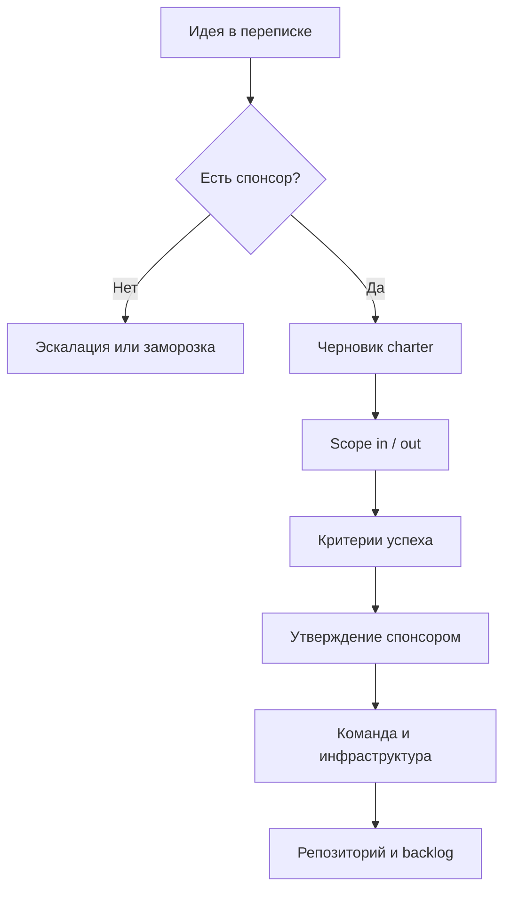
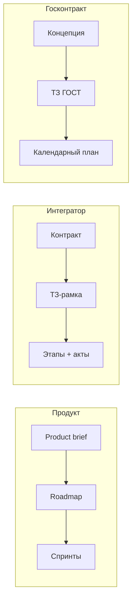

# От идеи к старту проекта

  ОБЯЗАТЕЛЬНО
  ДЛЯ НОВИЧКОВ

Руководителю
Аналитику

**Проект** в управленческом смысле — временная работа с уникальным результатом, сроком и бюджетом. Пока идея живёт только в переписке, у участников разные картины будущего: один ждёт мобильное приложение, другой — интеграцию с учётной системой, третий — отчёт для директора.

Эта статья — первый шаг раздела [Начало работы на проекте](./intro). Она описывает, что зафиксировать **до** найма команды, закупки серверов и открытия [репозитория](./4). Основы управления — в [Основах управления IT-проектами](/encyclopedia/7-project/7-02-komanda-i-upravlenie/1) и [PMBOK](/encyclopedia/7-project/7-02-komanda-i-upravlenie/17).

---

## Мини-глоссарий

| Термин | Расшифровка | Простыми словами |
|--------|-------------|------------------|
| **Charter** | Project charter | Устав проекта — короткий документ с целью, границами и спонсором |
| **Scope** | Объём работ | Что входит в проект и что сознательно не делаем |
| **MVP** | Minimum Viable Product | Минимальный продукт, достаточный для проверки гипотезы |
| **Stakeholder** | Заинтересованная сторона | Человек или группа, чьи интересы затрагивает проект |
| **Sponsor** | Спонсор | Тот, кто даёт мандат, деньги и несёт ответственность за результат |
| **PO** | Product Owner | Владелец продукта — приоритеты и ценность для пользователя |
| **PM** | Project Manager | Руководитель проекта — план, риски, коммуникации |
| **RACI** | Responsible, Accountable, Consulted, Informed | Схема "кто делает, кто утверждает, кого спрашиваем, кого информируем" |
| **NFR** | Non-Functional Requirements | Нефункциональные требования — скорость, безопасность, доступность |
| **SLA** | Service Level Agreement | Соглашение об уровне сервиса — например, доступность 99,5% |
| **T&M** | Time and Materials | Оплата за время и материалы — почасовая или помесячная модель |
| **Fixed price** | Фиксированная цена | Контракт на заранее согласованную сумму за результат |
| **NDA** | Non-Disclosure Agreement | Соглашение о неразглашении |
| **IP** | Intellectual Property | Интеллектуальная собственность — права на код и документы |
| **ГОСТ** | Государственный стандарт | Норматив для технической документации в госзаказе |
| **ГИС** | Государственная информационная система | Класс систем с повышенными требованиями к безопасности и документам |

---

## Устав проекта и письменные договорённости

**Устав проекта** (project charter), концепция или паспорт проекта — короткий документ, который фиксирует общую рамку. Его цель — чтобы все участники читали **одну и ту же** картину, а не додумывали её из устных разговоров.

В charter отвечают на вопросы:

- **Цель** — какую бизнес-задачу решаем и как измерим успех
- **Границы (scope)** — что входит в работу и что сознательно откладываем
- **Спонсор** — кто даёт мандат, деньги и принимает итог
- **Сроки** — когда нужен первый полезный результат (MVP, пилот)
- **Ресурсы** — бюджет, люди, лицензии, [инфраструктура](./3)

  
Типичная ошибка

  

  Команда открывает репозиторий и пишет код раньше, чем согласованы границы. Итог — волна <a href="/encyclopedia/7-project/7-22-upravlenie-izmeneniyami/1">запросов на изменение</a>, срыв дедлайнов и конфликт "мы же договаривались по-другому".
  

### Что должно быть в charter (минимум)

| Раздел | Содержание | Пример формулировки |
|--------|------------|---------------------|
| Название и код | Краткий идентификатор | "PROJ-DOCFLOW — кабинет согласования договоров" |
| Бизнес-цель | Роль для организации | "Сократить цикл согласования с 5 до 2 рабочих дней" |
| Описание результата | Что получит пользователь | "Веб-кабинет для юротдела до 200 пользователей" |
| Scope in | Явно входит | Маршруты согласования, уведомления, архив PDF |
| Scope out | Явно не входит | Мобильное приложение, миграция архива старше 10 лет |
| Спонсор | ФИО, должность | Директор по правовым вопросам |
| Ключевые вехи | Даты без детального плана | Пилот — Q2, промышленная эксплуатация — Q4 |
| Бюджет (укрупнённо) | Порядок цифр | 12 млн руб., из них 3 млн — лицензии и инфра |
| Допущения | Что считаем истинным | API бухгалтерии будет доступен к марту |
| Ограничения | Жёсткие рамки | Только облако заказчика, без публичного SaaS |

Charter не заменяет детальное ТЗ — это **мандат** на старт. Детали требований появятся в работе [аналитика](/encyclopedia/7-project/7-04-analitika/113) и в backlog.

### Пошаговый чек-лист инициации

**Неделя 0 — идея**

- [ ] Зафиксирована проблема, а не только "хотим IT-систему"
- [ ] Есть хотя бы один стейкхолдер с полномочиями принимать решения
- [ ] Понятна [модель бизнеса](/encyclopedia/7-project/7-01-obschee-o-biznese/2) (продукт, интегратор, госконтракт)

**Неделя 1 — рамка**

- [ ] Проведена стартовая встреча со спонсором и ключевыми стейкхолдерами
- [ ] Написан черновик charter (1–3 страницы)
- [ ] Заполнена таблица scope in / scope out
- [ ] Назначен временный PM или тимлид на период инициации

**Неделя 2 — согласование**

- [ ] Charter подписан или утверждён письмом спонсора
- [ ] Составлен список стейкхолдеров и частота контактов ([план взаимодействия](/encyclopedia/7-project/7-04-analitika/116))
- [ ] Запущен реестр рисков в [трекере](/encyclopedia/7-project/7-09-bazy-znaniy-i-zadachniki/21)
- [ ] Выбрана предварительная [методология](/encyclopedia/7-project/7-03-metodologiya-i-zhiznennyy-tsikl-po/4)

**Перед наймом команды**

- [ ] Утверждён укрупнённый бюджет и источник финансирования
- [ ] Согласованы NDA и вопросы [интеллектуальной собственности](/encyclopedia/7-project/7-07-intellektualnye-prava/intro)
- [ ] Понятно, кто заказывает инфраструктуру — заказчик или исполнитель
- [ ] Charter доступен в wiki или общей папке, а не только в чате

---

## Спонсор и заинтересованные стороны

**Стейкхолдер** (stakeholder) — человек или группа, чьи интересы затрагивает проект. **Спонсор** (sponsor) — стейкхолдер, который выделяет ресурсы и несёт ответственность за результат на уровне организации.

Спонсор **не обязан** писать код или ТЗ. Его задача — дать проекту "право существовать", снять организационные блокеры и принять итоговый результат или этап.

| Роль | Что делает на старте | Типичные ошибки |
|------|----------------------|-----------------|
| **Спонсор** | Бюджет, политическая поддержка, эскалация блокеров | "Спонсор" без полномочий — формальная подпись |
| **Заказчик / владелец продукта** | Приоритеты, приёмка ценности — часто [PO или PM](/encyclopedia/7-project/7-19-produktovye-roli/1) | Несколько "равных" заказчиков без приоритизации |
| **Руководитель проекта (PM)** | План, риски, отчётность, коммуникации | PM без доступа к спонсору |
| **Технический лид / архитектор** | Техническая осуществимость, [NFR](/encyclopedia/7-project/7-06-proektirovanie-i-arhitektura/design/1116) | Архитектор решает продуктовые споры вместо PO |
| **Юрист / закупки** | Договор, NDA, лицензии, персональные данные | Договор подписан после начала разработки |
| **ИБ (информационная безопасность)** | Требования к данным, средам, аудиту | ИБ подключают за неделю до prod |
| **Ключевые пользователи** | Реальные сценарии, приёмка пилота | "Представители" без времени на встречи |

### Карта стейкхолдеров (пример)

| Имя / группа | Интерес | Влияние | Частота контакта | Канал |
|--------------|---------|---------|------------------|-------|
| Директор департамента | Срок и бюджет | Высокое | Раз в месяц | Отчёт PM |
| Руководитель юротдела | Удобство согласования | Высокое | Раз в 2 недели | Демо, backlog review |
| IT-директор | Интеграция с AD, SLA | Среднее | По запросу | Техсовещание |
| Бухгалтерия | Выгрузка в 1С | Среднее | На этапе интеграции | Воркшоп |
| Регулятор (для ГИС) | Соответствие нормам | Высокое | По регламенту | Протоколы, акты |

Список стейкхолдеров и частота контактов оформляют в [плане взаимодействия](/encyclopedia/7-project/7-04-analitika/116). На старте достаточно таблицы на одну страницу — без сложных диаграмм, если команда маленькая.

---

## RACI на этапе инициации

**RACI** — схема распределения ответственности:

- **R** (Responsible) — выполняет работу
- **A** (Accountable) — утверждает решение; **один** человек на действие
- **C** (Consulted) — консультирует до решения
- **I** (Informed) — получает информацию после решения

  
Правило одного A

  

  Если у решения два "Accountable", на практике никто не accountable. Спор "PM или спонсор" решают явно в charter.
  

### RACI — утверждение charter

| Действие | R | A | C | I |
|----------|---|---|---|---|
| Написать черновик charter | PM | PM | PO, архитектор, юрист | Команда |
| Согласовать scope | PM, BA | PO или спонсор | Ключевые пользователи | IT |
| Утвердить бюджет | PM (расчёт) | Спонсор | Финансы | PM |
| Подписать NDA с подрядчиком | Юрист | Спонсор | PM | — |
| Выбрать методологию | PM | Спонсор | Тимлид | Команда |

### RACI — ключевые решения до кода

| Действие | R | A | C | I |
|----------|---|---|---|---|
| Утвердить MVP и первую веху | PO | Спонсор | PM, архитектор | Команда |
| Зафиксировать scope out | BA, PO | PO | Юрист (если контракт) | PM |
| Решить "облако или on-prem" | Архитектор | Спонсор или IT-директор | ИБ, DevOps | PM |
| Назначить владельца требований | PM | Спонсор | HR | Команда |
| Открыть репозиторий | DevOps, техлид | Техлид | PM | Команда |

Подробнее про RACI в команде — в статье [Команда, роли и найм](./2).

---

## Границы и критерии успеха

Хорошие границы **конкретны и проверяемы**. Плохие границы звучат красиво, но их нельзя проверить на приёмке.

| Качество формулировки | Пример | Почему |
|-----------------------|--------|--------|
| **Хорошо** | "К концу Q2 пользователи юротдела (до 200 человек) согласуют договоры в веб-кабинете" | Есть аудитория, срок, канал |
| **Слабо** | "Сделать удобную систему документооборота" | Нет метрик и границ |
| **Хорошо** | "Интеграция с 1С — выгрузка проведённых договоров, не редактирование первички в 1С" | Ясно, что входит и что нет |
| **Слабо** | "Полная интеграция с учётной системой" | Каждый понимает по-своему |

### Scope in и scope out

**Scope in** — что делаем в этом проекте:

- веб-кабинет согласования для юротдела
- маршруты согласования и уведомления по email
- экспорт PDF и выгрузка в 1С
- роли "инициатор", "согласующий", "архивариус"

**Scope out** — что **не** делаем сейчас (но часто просят "заодно"):

- мобильное приложение — вторая фаза
- миграция архивных данных старше 10 лет — отдельный контракт
- электронная подпись КЭП для внешних контрагентов — отдельный проект
- замена корпоративной ECM-системы целиком

  
Scope out спасает сроки

  

  Явный список "не делаем" снижает давление "а давайте ещё вот это". Каждый новый запрос сверяют с charter и процессом <a href="/encyclopedia/7-project/7-22-upravlenie-izmeneniyami/1">управления изменениями</a>.
  

### Критерии успеха

**Критерии успеха** связывают IT с бизнесом ([основы бизнеса](/encyclopedia/7-project/7-01-obschee-o-biznese/1)):

| Тип | Пример | Как измерить |
|-----|--------|--------------|
| Бизнес | Сократить время согласования | С 5 дней до 2 в среднем по отчёту |
| Бизнес | Снизить долю бумажных договоров | Минус 80% за 6 месяцев после пилота |
| Технический | Доступность сервиса | [SLA](/encyclopedia/7-project/7-16-itsm-i-it-uslugi/2) 99,5% в рабочие часы |
| Технический | Время отклика страницы | p95 не хуже 2 сек на stage |
| Процессный | Удовлетворённость пользователей | Опрос ключевых пользователей ≥ 4 из 5 |
| Процессный | Доля задач без возврата с QA | Не ниже 85% после 3-го спринта |

Критерии записывают в charter и повторяют в [Definition of Done](/encyclopedia/7-project/7-25-dostavka-i-gotovnost/2) для релизов.

---

## Модель поставки и тип заказчика

От [модели бизнеса](/encyclopedia/7-project/7-01-obschee-o-biznese/2) зависят процесс, глубина ТЗ и то, кто заказывает [инфраструктуру](./3).

| Модель | Особенности старта | Charter или аналог |
|--------|-------------------|-------------------|
| **Продуктовая компания** | Roadmap, метрики продукта, долгий горизонт | Product brief, OKR, roadmap |
| **Интегратор / заказная разработка** | Договор, этапы приёмки, документы по [ГОСТ](/encyclopedia/7-project/7-08-tehnicheskoe-pismo/12) | Контракт + ТЗ-рамка |
| **Аутстафф** | Вы встраиваетесь в Jira, Git и процессы **клиента** | Рамка от клиента, ваш внутренний charter опционален |
| **Аутсорс (fixed price / T&M)** | Жёсткие границы scope или почасовой учёт | SOW, контракт, приложения |
| **Госконтракт / ГИС** | Регламент, ФЗ-44/223, формальные акты | Концепция, ТЗ по ГОСТ, календарный план |

Выбор [методологии](/encyclopedia/7-project/7-03-metodologiya-i-zhiznennyy-tsikl-po/4) (Scrum, Kanban, waterfall, гибрид) делают с учётом этой модели.

### Сценарий — продуктовая компания

**Контекст:** SaaS-платформа для малого бизнеса, команда 15 человек, свой PO.

**Старт:**

- charter = product brief на 2 страницы с гипотезой и метриками (activation, retention)
- спонсор = CEO или CPO
- scope in = один сегмент клиентов и один ключевой сценарий
- scope out = корпоративный SSO, white-label — позже
- инфраструктура на стороне компании, [DevOps](/encyclopedia/8-infra-security/8-04-devops-ci-cd/intro) с первого дня

**Риски:** строить функции без проверки гипотез; размытый MVP "для всех сразу".

### Сценарий — интегратор (заказная разработка)

**Контекст:** Банк заказывает модуль отчётности, fixed price, этапная приёмка.

**Старт:**

- charter = раздел контракта + согласованная ТЗ-рамка
- спонсор со стороны заказчика = IT-директор или куратор проекта
- scope жёстко привязан к приложению к договору
- каждое расширение — change request с пересмотром сроков и цены
- [ПМИ](/encyclopedia/7-project/7-05-testirovanie/intro) и протоколы приёмки планируют до кода

**Риски:** [scope creep](/encyclopedia/7-project/7-22-upravlenie-izmeneniyami/1) "мелочами"; расхождение Scrum внутри команды и waterfall в договоре.

### Сценарий — госконтракт (ГИС)

**Контекст:** Региональная информационная система, требования регулятора, аудит.

**Старт:**

- charter часто заменяют **ТЗ-рамкой** или разделом концепции — см. [техническое задание по ГОСТ](/encyclopedia/7-project/7-08-tehnicheskoe-pismo/12)
- отдельный трек по [ГИС](/encyclopedia/7-project/7-03-metodologiya-i-zhiznennyy-tsikl-po/2) и ИБ
- календарный план с вехами и актами
- inside этапа возможен Scrum, но **внешняя** отчётность — по регламенту

**Риски:** формальные документы без связи с реальным backlog; ИБ и эксплуатация подключаются слишком поздно.

---

## Бюджет и ресурсы на старте

На этапе инициации не нужен детальный сметный расчёт — нужен **порядок цифр** и понимание статей расходов.

| Статья | Что включить | Типичные вопросы |
|--------|--------------|------------------|
| Люди | Штат, аутстафф, подрядчики | Кто платит за простой между этапами? |
| Инфраструктура | Облако, серверы, лицензии | Dev/stage/prod — чей аккаунт? |
| ПО | Jira, Confluence, IDE, CI | Есть корпоративные лицензии? |
| Интеграции | API партнёров, SMS, КЭП | Есть тестовый контур? |
| Обучение и внедрение | Ключевые пользователи, техпис | Заложено в проект или в линию? |
| Резерв | 10–20% на риски | Кто утверждает трату резерва? |

**Предварительная оценка** может опираться на аналоги, expert judgment или модели вроде [COCOMO](/encyclopedia/7-project/7-13-ekonomika-proizvodstva-po/1). Точность на старте низкая — это нормально, если цифры пересматривают после первого этапа проектирования.

### T&M и fixed price на старте

| Модель | Когда уместна | Что зафиксировать в charter |
|--------|---------------|----------------------------|
| **T&M** | Неясные требования, исследование | Потолок бюджета, состав команды, отчётность |
| **Fixed price** | Ясный scope, формальная приёмка | Границы, критерии приёмки, процесс изменений |
| **Гибрид** | Ядро fixed + опции T&M | Что в "коробке", что в backlog опций |

---

## Риски до старта разработки

Реестр рисков можно вести в [трекере](/encyclopedia/7-project/7-09-bazy-znaniy-i-zadachniki/21) с первого дня. На инициации достаточно таблицы на 10–15 строк.

| Риск | Что происходит | Как снижать | Владелец |
|------|----------------|-------------|----------|
| Нет владельца требований | Аналитик пишет в вакууме | Назначить [PO/BA](/encyclopedia/7-project/7-04-analitika/113) | Спонсор |
| Нет среды dev/stage | Разработка только на ноутбуках | [Инфраструктура](./3) до активной разработки | DevOps / IT |
| Нет юридической базы | Код в личном GitHub | [IP](/encyclopedia/7-project/7-07-intellektualnye-prava/intro), NDA, договор | Юрист |
| Интеграции "на словах" | API партнёра без песочницы | Контракт, тестовый контур ([интеграции](/encyclopedia/2-system-network/2-09-osnovy-integratsionnogo-vzaimodeystviya/intro)) | SA / PM |
| Процесс только в презентации | Scrum в слайдах, waterfall в договоре | [Чек-лист методологии](/encyclopedia/7-project/7-03-metodologiya-i-zhiznennyy-tsikl-po/999) | PM |
| ИБ подключена поздно | Переделка архитектуры | Ранний review NFR | Архитектор + ИБ |
| Нет ключевых пользователей | Систему не примут | Список и SLA на участие | PO |
| Зависимость от одного вендора | Блокировка по лицензии | Альтернативы в ADR | Архитектор |
| Нереалистичный дедлайн | Техдолг и выгорание | Пересмотр scope или ресурсов | Спонсор |
| Утечка данных на stage | Репутационный ущерб | Маскирование, без prod-копий на dev | DevOps + ИБ |

### Допущения и ограничения

**Допущение** — то, что считаем истинным без проверки ("API бухгалтерии будет готов к 1 марта").

**Ограничение** — жёсткая рамка ("только PostgreSQL", "данные не покидают РФ").

Оба списка ведут рядом с рисками: если допущение не сбылось — риск материализовался.

---

## Артефакты инициации

| Артефакт | Назначение | Где хранить |
|----------|------------|-------------|
| Charter / концепция | Мандат, границы, спонсор | Wiki, папка проекта |
| Укрупнённый roadmap | Вехи на 3–6 месяцев | Трекер, wiki |
| Предварительная оценка | T&M, fixed price, грубая оценка ([COCOMO](/encyclopedia/7-project/7-13-ekonomika-proizvodstva-po/1)) | Финансы, PM |
| Реестр рисков и допущений | Что может пойти не так | Jira, Excel, wiki |
| Решение о процессе | Scrum, [Kanban](/encyclopedia/7-project/7-18-kanban/intro), гибрид, [ГИС](/encyclopedia/7-project/7-03-metodologiya-i-zhiznennyy-tsikl-po/2) | Wiki, протокол старта |
| План коммуникаций | Кто, когда, в каком формате | [116](/encyclopedia/7-project/7-04-analitika/116) |
| RACI по ключевым решениям | Кто утверждает | Wiki |

В госконтрактах charter часто заменяют **ТЗ-рамкой** или разделом концепции — см. [техническое задание по ГОСТ](/encyclopedia/7-project/7-08-tehnicheskoe-pismo/12).

### Шаблон протокола kick-off (стартовой встречи)

1. Цель проекта и критерии успеха (10 мин)
2. Scope in / out — зачитывание вслух (15 мин)
3. Роли и RACI (10 мин)
4. Календарь вех и первый MVP (10 мин)
5. Риски и допущения — топ-5 (10 мин)
6. Следующие шаги и ответственные (5 мин)

Протокол публикуют в wiki в течение 24 часов.

---

## Безопасность и правовые вопросы на старте

До активной разработки согласуйте:

- **Персональные данные** — категории данных, основание обработки, нужен ли DPO
- **NDA** — с подрядчиками, аутстаффом, консультантами
- **IP** — кому принадлежит код, документы, диз datasets ([раздел 7.07](/encyclopedia/7-project/7-07-intellektualnye-prava/intro))
- **Лицензии OSS** — политика использования open source в продукте
- **Доступы** — кто выдаёт учётные записи, срок действия ([инфраструктура](./3))

  
Код в личном репозитории

  

  Если разработчик уже пушит в личный GitHub "пока IT не настроил" — это риск утечки и спора о правах. Остановите практику до корпоративного repo и подписанных документов.
  

---

## Типичные ошибки на инициации

| Ошибка | Симптом | Что делать |
|--------|---------|------------|
| "Все согласны" без документа | Через месяц разные ожидания | Charter + протокол kick-off |
| Спонсор формальный | Нет бюджета и эскалации | Найти реального A или заморозить |
| Scope только "in" | Бесконечные "а ещё" | Явный scope out в charter |
| Оценка "на глаз" в договор | Fixed price без буфера | T&M на discovery или резерв |
| Методология "как у всех" | Scrum без PO и инкремента | [Выбор процесса](/encyclopedia/7-project/7-03-metodologiya-i-zhiznennyy-tsikl-po/4) под контекст |
| Игнорирование эксплуатации | Некому поддерживать prod | Заложить [ITSM](/encyclopedia/7-project/7-16-itsm-i-it-uslugi/intro) и on-call |
| Старт без аналитика | Разработчики угадывают требования | BA/PO до массового найма dev |

---

## FAQ

**Нужен ли charter для внутреннего проекта на 3 человека?**

Да, но достаточно одной страницы: цель, scope, спонсор (даже если это ваш руководитель), дата первого демо. Форма проще, смысл тот же.

**Charter и ТЗ — это одно и то же?**

Нет. Charter — мандат и рамка. ТЗ — детальное описание требований. В госконтракте ТЗ может включать функции charter.

**Кто пишет charter — PM или PO?**

Черновик обычно готовит PM с участием PO и архитектора. Утверждает (A) спонсор или PO — зафиксируйте в RACI.

**Можно ли менять scope после подписания?**

Да, через управляемый процесс изменений. В продукте — переприоритизация backlog. В fixed price — change request с пересмотром сроков и цены.

**Что если спонсора нет?**

Проект в зоне риска. Эскалируйте на уровень, где могут выделить бюджет, или переведите инициативу в "исследование" без обязательств по срокам.

**Как связать charter с Jira?**

Создайте Epic "Инициация" с ссылкой на wiki-страницу charter. Критерии успеха — в описание Epic или в custom field.

**Нужен ли roadmap до найма разработчиков?**

Укрупнённый — да (3–6 вех). Детальный sprint backlog — после появления команды и [декомпозиции](./6).

**Чем charter отличается от project brief?**

Project brief — чаще в продуктовых компаниях, акцент на гипотезе и метриках. Charter — универсальный термин из PMBOK; по смыслу на старте они близки.

**Кто владелец charter после утверждения?**

PM хранит актуальную версию; изменения scope — через спонсора или PO (A), не тихой правкой в wiki.

---

## Пример charter (фрагмент)

Ниже — сокращённый образец для внутреннего проекта документооборота. Полный текст храните в wiki.

**Название:** PROJ-DOCFLOW — кабинет согласования договоров юротдела

**Бизнес-цель:** сократить средний цикл согласования договора с 5 до 2 рабочих дней к 30.09.2026.

**Scope in:**

- веб-интерфейс для ролей инициатор, согласующий, архивариус
- маршруты согласования до 5 шагов
- email-уведомления о статусе
- экспорт PDF и выгрузка метаданных в 1С

**Scope out:**

- мобильное приложение
- КЭП для внешних контрагентов
- миграция архива старше 2015 года

**Спонсор:** Иванова М.П., директор юридического департамента

**Критерии успеха:**

- 80% договоров проходят полностью в системе (без бумаги) через 6 месяцев после пилота
- доступность 99,5% в рабочие часы 09:00–19:00 МСК

**Укрупнённый бюджет:** 14 млн руб. (ФОТ 9 млн, инфра 2 млн, лицензии 1 млн, резерв 2 млн)

**Допущения:** API 1С будет выдан к 01.03.2026; ключевые пользователи выделены на 4 ч/нед каждый.

---

## Календарь инициации (ориентир)

| Неделя | Действие | Результат |
|--------|----------|-----------|
| 0 | Интервью со спонсором | Проблема и мандат |
| 1 | Kick-off, черновик charter | Scope in/out v0.1 |
| 2 | Согласование с ИБ и юристами | NDA, ограничения |
| 3 | Утверждение charter, RACI | Старт найма |
| 4 | Roadmap v1, реестр рисков | Переход к [команде](./2) |

Сроки сжимают только если спонсор и PO доступны ежедневно и нет госконтракта с жёстким регламентом документов.

---

## Связь с соседними разделами

| Тема | Куда идти дальше |
|------|------------------|
| Договор и оплата | [Общее о бизнесе](/encyclopedia/7-project/7-01-obschee-o-biznese/intro) |
| Методология | [Как выбрать процесс](/encyclopedia/7-project/7-03-metodologiya-i-zhiznennyy-tsikl-po/4) |
| Изменения scope | [Управление изменениями](/encyclopedia/7-project/7-22-upravlenie-izmeneniyami/intro) |
| Экономика | [Экономика производства ПО](/encyclopedia/7-project/7-13-ekonomika-proizvodstva-po/intro) |
| Продуктовые роли | [PO и PM](/encyclopedia/7-project/7-19-produktovye-roli/intro) |

---

## Чек-лист самопроверки перед шагом 2

- [ ] Charter утверждён спонсором (письмо или подпись)
- [ ] Scope in и scope out записаны и разосланы стейкхолдерам
- [ ] Критерии успеха измеримы
- [ ] RACI по ключевым решениям заполнен
- [ ] Реестр рисков заведён
- [ ] Модель контракта и методология согласованы
- [ ] NDA/IP/закупки не отложены "на потом"
- [ ] Kick-off проведён, протокол в wiki

---

## Что дальше

После утверждения границ переходите к [команде и найму](./2) — кого привлекать первым и как разграничить ответственность. Затем [инфраструктура и доступы](./3) и [репозиторий, трекер и wiki](./4). Если вы **присоединяетесь** к уже идущему проекту, переходите сразу к [онбордингу](./7).

---
