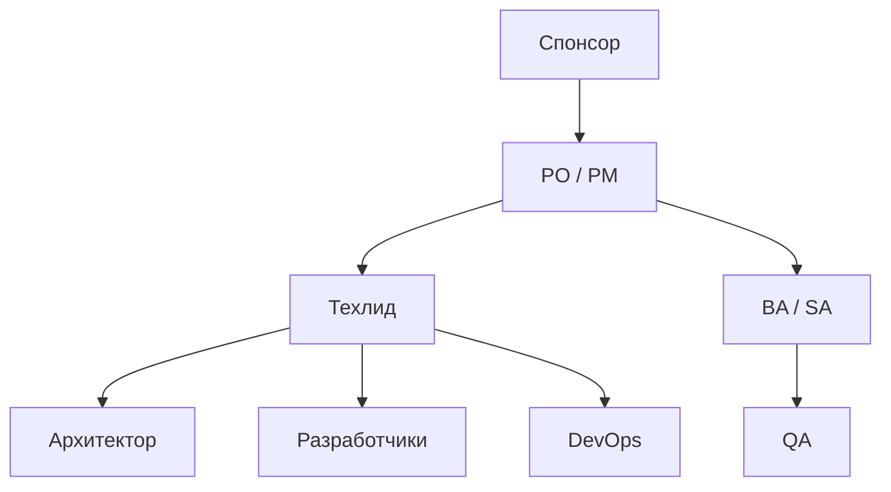

# Команда, роли и найм на старте проекта

  ОБЯЗАТЕЛЬНО
  ДЛЯ НОВИЧКОВ

Руководителю

После [утверждения границ проекта](./1) нужно собрать людей с правильными ролями — не "15 разработчиков с понедельника", а последовательное ядро, которое сможет поднять [инфраструктуру](./3) и [инструменты](./4). Эта статья — второй шаг раздела [Начало работы на проекте](./intro).

---

## Мини-глоссарий

| Термин | Расшифровка | На старте проекта |
|--------|-------------|-------------------|
| **PO** | Product Owner | Приоритеты, ценность, приёмка с точки зрения бизнеса |
| **PM** | Project Manager | План, риски, коммуникации, отчётность |
| **BA** | Business Analyst | Требования, процессы, согласование с заказчиком |
| **SA** | System Analyst | Технический дизайн, интеграции, NFR |
| **Tech Lead** | Технический лид | Стандарты кода, архитектурные решения, найм dev |
| **QA** | Quality Assurance | Тестирование, критерии приёмки, автотесты |
| **DevOps** | Development + Operations | CI/CD, среды, мониторинг |
| **SRE** | Site Reliability Engineering | Надёжность prod, on-call |
| **RACI** | Responsible, Accountable, Consulted, Informed | Кто делает и кто утверждает |
| **Аутстафф** | Outstaff | Специалисты в команду клиента по часам/месяцам |
| **Аутсорс** | Outsourcing | Подрядчик сдаёт результат по контракту |
| **MVP** | Minimum Viable Product | Минимальный продукт для первой проверки |
| **DoR** | Definition of Ready | Критерии готовности задачи к разработке |
| **Buddy** | Наставник | Опытный коллега для junior |
| **Fit-gap** | Сопоставление "как есть / как должно быть" | Типично для ERP-проектов |

---

## Минимальный состав для нового продукта

Для **нового продукта** (не режим поддержки legacy) роли обычно появляются в таком порядке:

| Очередь | Роль | Задачи на старте |
|---------|------|------------------|
| 1 | Спонсор + [PO/PM](/encyclopedia/7-project/7-19-produktovye-roli/1) | Границы, приоритеты, charter |
| 2 | Тимлид / техлид | Процесс, стандарты, план найма разработчиков |
| 3 | Архитектор (часто совмещён с техлидом на MVP) | Эскиз системы, [NFR](/encyclopedia/7-project/7-06-proektirovanie-i-arhitektura/design/1116) |
| 4 | [BA](/encyclopedia/7-project/7-04-analitika/113) / [SA](/encyclopedia/7-project/7-04-analitika/114) | Требования, интеграции, критерии приёмки |
| 5 | Разработчики (2–5) | После появления repo и backlog с [DoR](/encyclopedia/7-project/7-25-dostavka-i-gotovnost/1) |
| 6 | [QA](/encyclopedia/7-project/7-05-testirovanie/100) | До первого релиза на stage |
| 7 | DevOps / SRE | До production; на старте — CI и dev-среда |
| 8 | Техпис | Параллельно с ростом команды и первым пилотом |

  
Ядро 5–7 человек

  

  На старте эффективнее <strong>кросс-функциональное ядро</strong>, чем 15 узких ролей без процесса. Один человек может совмещать техлид + архитектор, PM + PO — если RACI явный.
  

На **заказном проекте** заказчик может дать своего PM и аналитика; интегратор закрывает разработку, тесты и внедрение ([командная работа](/encyclopedia/7-project/7-02-komanda-i-upravlenie/11)).

---

## Роли подробнее

### Спонсор и PO/PM

- **Спонсор** — из [charter](./1); не путать с PO
- **PO** — что строим и в каком порядке; доступен для вопросов команды
- **PM** — когда, за сколько, с какими рисками; отчитывается спонсору

В маленькой команде PO и PM часто один человек — зафиксируйте, **какую шапку** он надевает на встрече (продукт или сроки).

### Техлид и архитектор

| Аспект | Техлид | Архитектор |
|--------|--------|------------|
| Фокус | Команда, код, review | Границы систем, NFR, интеграции |
| Артефакты | Стандарты, CI, hiring bar | C4, [ADR](/encyclopedia/7-project/7-20-adr-i-arhitekturnaya-pamyat/1) |
| На MVP | Часто совмещение | Эскиз, не BDUF |

### BA и SA

- **BA** — поведение пользователя, процессы, user stories, согласование с бизнесом
- **SA** — API, схемы данных, интеграции, нефункциональные ограничения

На старте одного сильного аналитика часто достаточно; разделение BA/SA — по мере роста домена.

### QA на старте

QA подключают **до** первого "ручного теста на prod":

- критерии приёмки в задачах
- тестовая стратегия (что автоматизируем с первого дня)
- доступ к dev/stage

См. [тестирование](/encyclopedia/7-project/7-05-testirovanie/intro).

### DevOps / SRE

На старте DevOps закрывает:

- dev-среду и [CI](/encyclopedia/8-infra-security/8-04-devops-ci-cd/intro)
- секреты и доступы ([статья 3](./3))
- базовый мониторинг stage

SRE и полноценный on-call — ближе к prod.

---

## RACI на этапе запуска

**RACI** — кто исполняет, утверждает, консультирует и информируется.

### RACI — выбор стека и репозитория

| Действие | R | A | C | I |
|----------|---|---|---|---|
| Утвердить язык и фреймворк | Техлид | Спонсор или PO | Архитектор, ИБ | PM |
| Создать организацию в Git | DevOps | Техлид | Разработчики | PM |
| Настроить проект в Jira | PM | PM | Тимлид, аналитик | Команда |
| Политика code review | Техлид | Техлид | Разработчики | PM |
| Шаблон PR и веток | Техлид | Техлид | DevOps | Команда |

### RACI — найм и онбординг

| Действие | R | A | C | I |
|----------|---|---|---|---|
| Портрет вакансии | Техлид, PM | Техлид | HR, PO | — |
| Техническое интервью | Разработчики | Техлид | HR | PM |
| Оффер | HR | Спонсор или директор | PM, техлид | — |
| Онбординг-пакет | PM, техпис | PM | Buddy | Новый сотрудник |
| Доступы в первый день | IT / DevOps | IT-директор или техлид | ИБ | PM |

### RACI — требования и приёмка

| Действие | R | A | C | I |
|----------|---|---|---|---|
| Приоритизация backlog | PO | PO | PM, техлид | Команда |
| Описание user story | BA | PO | SA, QA | Dev |
| Критерии приёмки | BA, QA | PO | Dev | PM |
| Приёмка пилота | PO | Спонсор | Ключевые пользователи | PM |

**Администрирование** (доступы, серверы, лицензии) — у DevOps или IT-админа. **Продуктовые решения** — у PO. **Технические стандарты** — у техлида.

---

## Сценарий — продуктовая компания

**Контекст:** FinTech-стартап, свой продукт, Series A, цель — MVP за 4 месяца.

**Состав на месяц 1:**

- CPO совмещает PO
- PM на контракте или штат
- техлид (fullstack) + 1 senior backend
- BA part-time или PO пишет stories сам

**Месяц 2:**

- +2 разработчика
- DevOps 0.5 FTE или аутстафф
- QA с первого sprint на stage

**Особенности найма:**

- акцент на [культуру кода](/encyclopedia/7-project/7-10-kultura-koda/intro) и автономность
- equity и миссия продукта в вакансии
- меньше формальных актов, больше demo и метрик

**Риски:**

- нанять только senior без middle — bottleneck на review
- PO перегружен — backlog без [DoR](/encyclopedia/7-project/7-25-dostavka-i-gotovnost/1)

---

## Сценарий — интегратор

**Контекст:** Системный интегратор, контракт с ритейлом, fixed price, 3 этапа.

**Состав на старт:**

- PM интегратора (R за план и акты)
- PM заказчика (C, приёмка)
- SA интегратора + BA заказчика
- техлид + команда 4–6 dev
- QA + тест-менеджер на этап ПМИ

**Особенности:**

- в договоре прописаны роли и FTE по этапам
- смена состава — уведомление заказчика
- [коммуникации](/encyclopedia/7-project/7-02-komanda-i-upravlenie/11) через статус-митинг и протоколы

**Риски:**

- "скрытый" аутстафф без опыта в домене
- BA заказчика недоступен — блокировка аналитики

---

## Сценарий — госконтракт

**Контекст:** Разработка модуля ГИС, календарный план, акты по вехам.

**Состав:**

- руководитель проекта (ГИП) по регламенту
- архитектор и ИБ — с первого месяца
- аналитики под [ТЗ по ГОСТ](/encyclopedia/7-project/7-08-tehnicheskoe-pismo/12)
- разработчики и QA — по штатному расписанию контракта
- представители заказчика на приёмочной комиссии

**Особенности:**

- квалификационные требования к персоналу в документации закупки
- замена ключевых специалистов — с согласования
- журналы работ, протоколы, [ГИС-процесс](/encyclopedia/7-project/7-03-metodologiya-i-zhiznennyy-tsikl-po/2)

**Риски:**

- формальный состав "на бумаге" vs реальные исполнители
- ИБ не допускает удалённых dev без VPN и DLP

---

## Найм в штат и аутстафф

| Критерий | Штат | Аутстафф |
|----------|------|----------|
| Долгий горизонт продукта | Подходит | Риск текучки и смены людей |
| Срочный пик на 3 месяца | Долгий найм | Подходит |
| Секреты и IP | Проще контролировать | Жёсткий договор, NDA, доступы |
| Онбординг | Окупается со временем | Короткий ramp-up, нужен buddy |
| Влияние на архитектуру | Выше | Зависит от контракта |
| Стоимость | ФОТ + налоги + льготы | Ставка × часы, без скрытых HR-задач |

Портрет вакансии — [Найм](/encyclopedia/7-project/7-02-komanda-i-upravlenie/144).

### Когда аутсорс вместо штата

- нужен готовый модуль "под ключ" с передачей IP
- нет компетенции в стеке (например, mobile)
- жёсткий дедлайн и fixed scope

[Интеллектуальная собственность](/encyclopedia/7-project/7-07-intellektualnye-prava/intro) и код — явно в контракте.

---

## Пошаговый чек-лист найма на старте

**Подготовка**

- [ ] Утверждён укрупнённый headcount и бюджет ([charter](./1))
- [ ] RACI по ролям заполнен
- [ ] Портреты вакансий для первых 3–5 ролей
- [ ] Стек и минимальные требования согласованы с техлидом

**Процесс**

- [ ] Единый шаблон интервью (HR + тех + культурный fit)
- [ ] Задача для live-coding или take-home — одинаковая для кандидатов
- [ ] Срок обратной связи кандидату ≤ 5 рабочих дней
- [ ] Чек-лист референсов для senior

**Первый день**

- [ ] Учётная запись, почта, VPN ([инфраструктура](./3))
- [ ] Доступ к Jira, Git, wiki ([инструменты](./4))
- [ ] Назначен buddy
- [ ] Встреча с PO и техлидом — контекст проекта
- [ ] [Онбординг-пакет](/encyclopedia/7-project/7-09-bazy-znaniy-i-zadachniki/24) прочитан

**Первая неделя**

- [ ] Локальная сборка проекта работает
- [ ] Первая задача с DoR в трекере
- [ ] Первый PR с review (даже документация)

---

## Junior и наставничество

Для **junior** на старте проекта критично:

- назначенный **наставник (buddy)** — не "вся команда"
- задачи с выполненным [DoR](/encyclopedia/7-project/7-25-dostavka-i-gotovnost/1)
- обязательный **code review** ([культура кода](/encyclopedia/7-project/7-10-kultura-koda/intro))
- [онбординг-пакет](/encyclopedia/7-project/7-09-bazy-znaniy-i-zadachniki/24) в wiki
- ограничение WIP — 1–2 задачи, не "закрыть backlog"

| Практика | Содержание |
|----------|-------|
| Pair programming на первых задачах | Быстрее контекст домена |
| Мелкие PR (до 300 строк) | Учиться review и git |
| Явные критерии "готово" | Меньше переработок |
| Еженедельный 1:1 с buddy | Обратная связь |

Без этого экономия на зарплате junior часто превращается в рост сроков и [техдолга](/encyclopedia/4-code-dev/4-06-arhitektura-vypolneniya/115).

  
Junior без наставника

  

  Не нанимайте junior на старте, если нет senior/buddy с запланированным временем на менторство — минимум 4–6 часов в неделю.
  

---

## ERP и внедрение корпоративных систем

Если проект — **внедрение ERP** (SAP, 1С, Oracle и т.д.), состав расширяют:

- **функциональные консультанты** — настройка модулей под процессы
- **ключевые пользователи** бизнеса — UAT и обучение
- **интегратор от вендора** — лицензии, обновления, поддержка
- **технический архитектор** — интegrations, обмен данными
- **change manager** — сопротивление изменениям, обучение

См. [Внедрение ERP](/encyclopedia/7-project/7-15-vnedrenie-erp-sistem/intro) — отдельный жизненный цикл и fit-gap.

| Фаза ERP | Кто критичен |
|----------|--------------|
| Обследование | BA, функциональные консультанты, ключевые пользователи |
| Fit-gap | Архитектор, вендор, PM |
| Настройка и разработка | Dev, консультанты |
| UAT | Ключевые пользователи, QA |
| Go-live | Все + поддержка L1/L2 |

---

## Организация коммуникаций

| Событие | Участники | Частота | Артефакт |
|---------|-----------|---------|----------|
| Daily / stand-up | Команда разработки | Ежедневно 15 мин | Блокеры в трекере |
| Backlog refinement | PO, BA, dev, QA | 1–2 раза в неделю | Обновлённые stories |
| Sprint planning / commitment | Команда + PO | Раз в 2 недели (Scrum) | Sprint goal |
| Demo | PO, стейкхолдеры | Конец спринта | Запись, feedback |
| Retro | Команда | Конец спринта | 1–3 action items |
| Статус для спонсора | PM | Раз в 2–4 недели | Отчёт 1 страница |

[Удалённая команда](/encyclopedia/7-project/7-23-udalennaya-komanda/1) — те же ритуалы, но явные часовые пояса и async-каналы.

---

## Безопасность и доступы при найме

При выходе каждого сотрудника:

- учётная запись через **SSO**, не общие логины
- группы AD / IdP по роли (dev, qa, pm)
- **NDA** подписан до доступа к репозиторию
- ноутбук с политикой шифрования диска (для удалёнки)
- offboarding-чек-лист при увольнении — отзыв доступов в тот же день

Подробнее — [инфраструктура и доступы](./3).

---

## Типичные ошибки

| Ошибка | Последствие | Решение |
|--------|-------------|---------|
| Нанять dev до PO/BA | Код без требований | Сначала владелец backlog |
| 10 dev, 0 QA | Баги на prod | QA до stage-релиза |
| Нет техлида | Разный стиль кода | Техлид — вторая найм-позиция |
| Аутстафф без buddy | Человек "висит" | Buddy + задача в день 1 |
| Роли в RACI дублируются | Никто не решает | Один A на действие |
| HR без техинтервью | Неверный уровень | Bar raiser от техлида |
| Игнор key users (ERP) | Отказ от системы | Включить в RACI как C |

---

## FAQ

**Кого нанимать первым — dev или QA?**

После PO/PM, техлида и аналитика — первые 1–2 dev. QA — до первого релиза на stage, но критерии приёмки пишет QA или опытный BA раньше.

**Можно ли начать без PM?**

На 3–5 человек техлид может совмещать. С ростом команды и стейкхолдеров PM нужен явно.

**PO может быть заказчиком?**

Да, на заказном проекте. Важно, чтобы у него было **время** на backlog и приёмку.

**Сколько аутстаффа допустимо?**

Зависит от контракта и IP. Ядро (техлид, архитектор, PO) чаще в штате; пик нагрузки — аутстафф.

**Как оценить кандидата на аутстафф?**

Тот же техbar, что и штат; плюс проверка soft skills для работы в вашем процессе.

**Нужен ли отдельный Scrum Master?**

На старте до 8 человек SM часто совмещает PM или техлид. Отдельная роль — при конфликтах процесса и масштабе.

**Как оформить аутстафф в RACI?**

Сотрудник аутстаффа — R на задачах; A остаётся у вашего техлида или PM. Клиент (если аутстафф у заказчика) — C или I по договорённости.

**Что делать, если заказчик не даёт BA?**

Зафиксируйте риск в charter; назначьте SA/BA интегратора; запросите SLA на ответы заказчика (≤ 2 рабочих дней).

---

## Матрица компетенций на старте (T-shaped)

| Роль | Глубина (основа) | Ширина (понимает) |
|------|------------------|-------------------|
| Техлид | Backend или frontend | CI, SQL, облако |
| BA | Домен заказчика | API, UX, тест-кейсы |
| DevOps | CI/CD, Linux | K8s basics, сеть |
| QA | Тест-дизайн | Git, SQL, API Postman |

Кросс-функциональность снижает простои "ждём другую роль".

---

## Шаблон описания вакансии (фрагмент)

**Middle Backend Developer — PROJ-DOCFLOW**

- **Контекст:** внутренний продукт, стек Java 21 + Spring Boot + PostgreSQL
- **Задачи на первые 3 месяца:** API согласований, интеграция с 1С, unit/integration tests
- **Must have:** REST, SQL, Git, code review culture
- **Nice to have:** Kafka, опыт document workflow
- **Процесс:** Scrum 2 нед., CI на каждый PR, buddy для первого месяца
- **Не предлагать:** работу без трекера и без описанных stories

Портрет — [Найм](/encyclopedia/7-project/7-02-komanda-i-upravlenie/144).

---

## Оценка численности (ориентир)

| Размер MVP | Роли (FTE) | Комментарий |
|------------|------------|-------------|
| Малый (3 мес.) | PO 0.5, TL 1, dev 2, QA 0.5, DevOps 0.25 | TL совмещает arch |
| Средний (6 мес.) | + BA 1, dev +2, DevOps 0.5 | Отдельный QA к 3-му месяцу |
| Заказной этап | По ТЗ и календарному плану | FTE в контракте |

Цифры не заменяют оценку — только порядок величины для charter.

---

## Связь с соседними разделами

| Тема | Раздел |
|------|--------|
| Командная работа на заказе | [7.02 — командная работа](/encyclopedia/7-project/7-02-komanda-i-upravlenie/11) |
| Продуктовые роли | [7.19](/encyclopedia/7-project/7-19-produktovye-roli/intro) |
| Онбординг | [Пакет онбординга](/encyclopedia/7-project/7-09-bazy-znaniy-i-zadachniki/24) |
| ERP-состав | [7.15](/encyclopedia/7-project/7-15-vnedrenie-erp-sistem/intro) |

---

## Первые 30 дней команды (roadmap)

| День | Фокус | Артефакт |
|------|-------|----------|
| 1–3 | PO, PM, техлид on board | Kick-off, RACI в wiki |
| 4–10 | Первый BA/SA, 1–2 dev | Backlog v0.1, repo |
| 11–15 | DevOps 0.5, QA planning | Dev-среда, DoR/DoD |
| 16–20 | +dev, первые stories In Progress | PR с review |
| 21–30 | Stage, demo для спонсора | Increment на stage |

Roadmap не заменяет sprint planning — задаёт ожидания для [инфраструктуры](./3) и [инструментов](./4).

---

## Чек-лист готовности команды

- [ ] PO/PM и техлид на месте
- [ ] RACI по ключевым решениям опубликован
- [ ] Минимум один аналитик или PO пишет stories с DoR
- [ ] План headcount на 3 месяца согласован
- [ ] Buddy назначен для каждого junior
- [ ] Процесс интервью и онбординга описан в wiki
- [ ] Первые встречи (daily, refinement) в календаре

---

## Что дальше

Параллельно с ростом команды поднимайте [инфраструктуру и доступы](./3) и настраивайте [репозиторий, трекер и wiki](./4).

---
