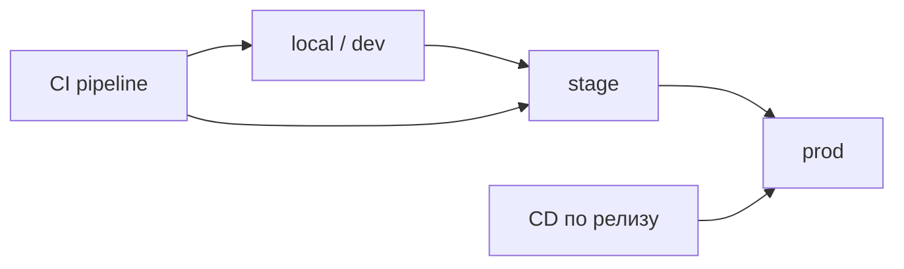
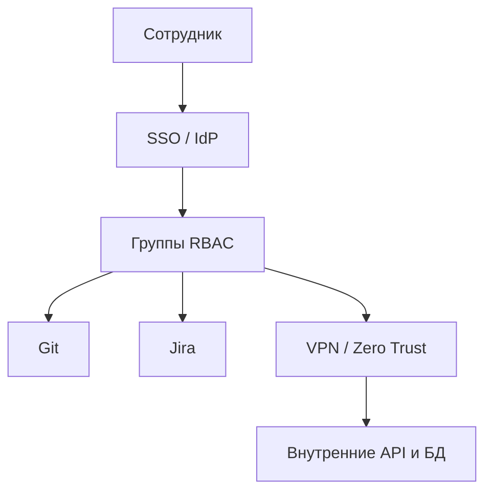

# Инфраструктура, доступы и администрирование на старте

  ОБЯЗАТЕЛЬНО
  ДЛЯ НОВИЧКОВ

Руководителю
Разработчику

После [charter](./1) и [формирования команды](./2) нужна техническая база: среды, доступы, инструменты и правила, кто что администрирует. Без этого разработчики работают только на ноутбуках, секреты утекают в чат, а prod появляется "на коленке". Эта статья — третий шаг раздела [Начало работы на проекте](./intro).

---

## Мини-глоссарий

| Термин | Расшифровка | На старте |
|--------|-------------|-----------|
| **Environment** | Среда | Изолированный контур (dev, stage, prod) |
| **CI** | Continuous Integration | Автосборка и тесты на каждый коммит/PR |
| **CD** | Continuous Delivery/Deployment | Автодеплой на среду |
| **VPN** | Virtual Private Network | Зашифрованный доступ во внутреннюю сеть |
| **SSO** | Single Sign-On | Единый вход во все сервисы |
| **IdP** | Identity Provider | Провайдер идентичности (Azure AD, Keycloak) |
| **RBAC** | Role-Based Access Control | Доступ по ролям |
| **Secrets** | Секреты | Пароли, API-ключи, сертификаты |
| **Vault** | Хранилище секретов | HashiCorp Vault и аналоги |
| **DLP** | Data Loss Prevention | Защита от утечек данных |
| **On-call** | Дежурство | Кто реагирует на алерты prod |
| **IaC** | Infrastructure as Code | Terraform, Ansible — инфраструктура в коде |
| **K8s** | Kubernetes | Оркестратор контейнеров |
| **SLA** | Service Level Agreement | Соглашение об уровне сервиса |

---

## Среды разработки

**Среда** (environment) — изолированный контур, где запускается приложение: свои настройки, база данных, секреты.

| Среда | Назначение | Кто пользуется | Данные |
|-------|------------|----------------|--------|
| **local** | Разработка на машине разработчика | Dev | Фикстуры, docker-compose |
| **dev / integration** | Общая сборка, интеграционные тесты | Dev, QA | Синтетика, без PII |
| **stage / preprod** | Копия prod по конфигу, приёмка | QA, PO, заказчик | Маскированная копия или синтетика |
| **prod** | Боевые пользователи | Ops, on-call | Реальные данные |

Правило: **отладка на prod** только по процедуре ([инциденты](/encyclopedia/7-project/7-21-incidenty-i-ekspluatatsiya/1)). На старте достаточно **dev + stage**; prod — перед первым пилотом.

Детали CI/CD и деплоя — [DevOps](/encyclopedia/8-infra-security/8-04-devops-ci-cd/intro).

### Что должно быть одинаково между stage и prod

- версия runtime (Node, Java, .NET)
- схема БД (миграции тем же инструментом)
- переменные окружения (имена ключей; значения — разные)
- балансировщик и TLS (пусть упрощённый на stage)

### Что может отличаться

- размер инстансов и реплик
- внешние sandbox API вместо боевых
- уровень логирования (debug на dev, info на prod)

---

## Пошаговый чек-лист поднятия сред

**Dev (неделя 1–2)**

- [ ] Репозиторий с README "как поднять локально"
- [ ] docker-compose или skaffold для зависимостей (БД, Redis)
- [ ] Общий dev-контур в облаке/ВЦ — опционально, но полезно для интеграций
- [ ] CI собирает проект на каждый PR

**Stage (неделя 2–4)**

- [ ] Деплой из ветки `main` или release branch
- [ ] Тестовые учётные записи для QA и PO
- [ ] Мониторинг: логи + алерт "среда лежит"
- [ ] Бэкап конфигурации (не обязательно данных на старте)

**Prod (перед пилотом)**

- [ ] Отдельный аккаунт/подписка или namespace
- [ ] Runbook: кто деплоит, откат, контакты on-call
- [ ] [SLA](/encyclopedia/7-project/7-16-itsm-i-it-uslugi/2) согласован со спонсором
- [ ] ИБ-review пройден

---

## Сценарий — продуктовая компания

**Контекст:** SaaS в AWS, команда 12 человек, микросервисы.

**Инфра на старте:**

- dev — локально + общий EKS namespace `dev`
- stage — EKS `staging`, деплой из GitHub Actions
- prod — отложен до beta; заранее заведён аккаунт и IaC-репозиторий
- секреты — AWS Secrets Manager + External Secrets в K8s
- мониторинг — CloudWatch + Grafana (даже базовая)

**Особенности:**

- техлид + DevOps 1 FTE с первого месяца
- [ADR](/encyclopedia/7-project/7-20-adr-i-arhitekturnaya-pamyat/1) на выбор облака
- cost alerts на dev/stage

**Риски:**

- "prod-like" только на словах — stage на SQLite, prod на PostgreSQL
- общий admin-доступ ко всем namespace

---

## Сценарий — интегратор

**Контекст:** Разработка в контуре заказчика (on-prem), VPN, Active Directory.

**Инфра на старте:**

- dev/stage — ВМ заказчика, доступ по VPN
- CI — Jenkins или GitLab на стороне заказчика
- prod — поднимает IT заказчика по акту
- секреты — согласованное хранилище (Vault заказчика)

**Особенности:**

- заявки на доступы — SLA IT заказчика (3–10 дней)
- запрет на вынос кода и данных за контур
- документирование портов и firewall rules

**Риски:**

- разработка началась до выдачи VPN
- тестовые данные = копия prod без маскирования (нарушение ФЗ-152)

---

## Сценарий — госконтракт / ГИС

**Контекст:** Сертифицированный контур, требования регулятора, аудит.

**Инфра на старте:**

- среды описаны в проектной документации
- dev/stage/prod — физическая или логическая сегментация
- журналирование доступа и изменений
- антивирус, DLP, сертифицированные СЗИ (средства защиты информации) — по ТЗ
- prod — только после приёмки stage и акта

**Особенности:**

- смена конфигурации prod — change request в [ITSM](/encyclopedia/7-project/7-16-itsm-i-it-uslugi/intro)
- pentest или сканирование уязвимостей по регламенту
- данные не покидают контур РФ

**Риски:**

- "временный" prod на незащищённой ВМ
- админские пароли в Excel на общем диске

---

## Программное обеспечение

Минимальный набор для веб/backend-команды:

| Категория | Варианты | Кто выбирает |
|-----------|----------|--------------|
| **IDE** | VS Code, IntelliJ, Rider | Техлид рекомендует, dev выбирает |
| **Git-хостинг** | GitHub, GitLab, Bitbucket, self-hosted | Техлид + IT |
| **CI** | GitHub Actions, GitLab CI, Jenkins, TeamCity | DevOps |
| **Трекер** | Jira, YouTrack, Linear, Azure Boards | PM |
| **Wiki** | Confluence, Notion, docs в репо | PM + техпис |
| **Чат** | Slack, Teams, Mattermost, Telegram (осторожно с секретами) | PM |
| **Секреты** | Vault, Sealed Secrets, env в CI | DevOps + ИБ |
| **Мониторинг** | Prometheus+Grafana, Datadog, ELK | DevOps |
| **СУБД** | PostgreSQL, MySQL, MS SQL — по ADR | Архитектор |

Список фиксируют в [онбординг-пакете](/encyclopedia/7-project/7-09-bazy-znaniy-i-zadachniki/24) с ссылками на установку и версиями.

### Согласованные версии

Зафиксируйте в wiki таблицу:

| Компонент | Версия | Где проверить |
|-----------|--------|---------------|
| Node.js | 20 LTS | `.nvmrc`, CI |
| Java | 21 | `pom.xml`, CI |
| PostgreSQL | 16 | docker-compose, stage |
| Docker | 24+ | README |

Разъезд версий local vs CI vs stage — частая причина "у меня работает".

---

## Аппаратное обеспечение

| Роль | Типичные требования | Примечание |
|------|---------------------|------------|
| **Разработчик** | 16+ GB RAM, SSD 512 GB+, второй монитор | Android/iOS — больше RAM |
| **QA web** | Как у dev + профили браузеров | |
| **QA mobile** | Стенд устройств или BrowserStack / Sauce Labs | |
| **ML / тяжёлая сборка** | GPU-станции или облачные runner'ы | Не покупать GPU "на всех" |
| **DevOps** | Доступ к админкам облака, не обязательно топовое железо | |
| **Удалёнка** | Гарнитура, стабильный канал 50+ Мбит/с | [Удалённая команда](/encyclopedia/7-project/7-23-udalennaya-komanda/1) |

Закупку согласует **IT-администратор** или офис-менеджер; техлид даёт **минимальные спеки**, не бренды "на вкус".

### Корпоративный ноутбук и BYOD

| Модель | Плюсы | Минусы |
|--------|-------|--------|
| Корпоративный | MDM, шифрование, единая политика | Срок поставки |
| BYOD (личное) | Быстрый старт | Риск утечки, сложный offboarding |

На проектах с ПДн и госконтрактом BYOD часто запрещён политикой ИБ.

---

## Доступы и безопасность

На старте оформите:

1. **Учётные записи** — SSO (Azure AD, Google Workspace, Keycloak), группы по ролям
2. **VPN / Zero Trust** — доступ к внутренним API и БД
3. **Принцип наименьших привилегий** — junior без root в prod
4. **Ротация секретов** — API-ключи не в репозитории
5. **Аудит** — кто выдал доступ, срок действия, журнал входов
6. **MFA** — двухфакторная аутентификация на Git и облако

### Матрица доступов (пример)

| Роль | Git | Jira | Dev БД | Stage БД | Prod БД | K8s prod |
|------|-----|------|--------|----------|---------|----------|
| Junior dev | Read/Write feature | Read/Write | Read/Write | Read | — | — |
| Senior dev | Write + review | Read/Write | Read/Write | Read | Read | — |
| DevOps | Admin org | Read | Admin | Admin | Admin | Admin |
| QA | Read | Read/Write | Read | Read/Write | — | — |
| PM | Read | Admin project | — | — | — | — |
| PO | Read | Read/Write | — | Read stage | — | — |

### Секреты — что нельзя

- коммитить в Git (даже "временно")
- слать в Slack/Telegram/email
- хранить в общем Google Doc
- шарить один API-ключ на всю команду

### Секреты — что можно

- Vault / Secrets Manager с аудитом
- переменные CI (masked)
- `.env.local` в `.gitignore` + пример `.env.example` без значений
- ротация при уходе сотрудника

  
Prod-копия на dev

  

  Слив дампа prod на ноутбук разработчика — нарушение политики ПДн и типичный источник утечек. Используйте маскирование и синтетические данные.
  

---

## RACI — инфраструктура и доступы

| Действие | R | A | C | I |
|----------|---|---|---|---|
| Выбор облака / on-prem | DevOps, архитектор | Спонсор / IT-директор | ИБ, финансы | PM |
| Поднять dev-среду | DevOps | Техлид | Devs | PM |
| Выдать доступ новому dev | IT / DevOps | Техлид | ИБ | PM |
| Добавить секрет в Vault | DevOps | Техлид | ИБ | — |
| Деплой на stage | DevOps или CI | Техлид | QA | PM |
| Деплой на prod | DevOps | Спонсор или change board | ИБ, on-call | Команда |
| Закупка ноутбуков | IT | IT-директор | Техлид | HR |

---

## Администрирование и разработка

| Зона | Кто владеет | Разработчик может |
|------|-------------|-------------------|
| Серверы, K8s, БД prod | DevOps / SRE / IT | Только по runbook |
| Репозиторий, ветки, CI | Техлид + DevOps | Maintainer/developer по политике |
| Jira workflow | PM + тимлид | Предлагать изменения |
| Wiki, структура разделов | Техпис / тимлид | Редактировать по правилам |
| Лицензии ПО | IT / закупки | Запрос через тикет |
| DNS, TLS-сертификаты | DevOps / IT | — |
| Firewall, порты | IT / сеть | Заявка с обоснованием |

Ситуация, когда разработчик сам поднял prod на личном VPS, — сигнал отсутствия [ITSM](/encyclopedia/7-project/7-16-itsm-i-it-uslugi/intro) и риска для [SLA](/encyclopedia/7-project/7-16-itsm-i-it-uslugi/2).

### Граница "сделай сам" и "заявка в IT"

| Действие | DevOps/команда | IT организации |
|----------|----------------|----------------|
| Новый pod в K8s dev | Команда | — |
| Открыть порт на firewall prod | Заявка | IT |
| Новый домен `*.company.com` | Заявка | IT |
| Увеличить RAM на dev-ВМ | Команда (если облако) | IT (если on-prem) |

---

## Инструменты по этапам зрелости

| Этап | Минимум | Следующий шаг |
|------|---------|---------------|
| День 1 | Git, CI lint+test, local docker | — |
| Неделя 2 | Dev-среда, секреты вне git | Stage |
| Месяц 1 | Stage + мониторинг | IaC для stage |
| Пилот | Prod + on-call + runbook | Автоскейлинг |
| Масштаб | K8s, observability, DR | Chaos testing |

Не обязательно покупать Datadog и Terraform в первый день — обязательно **не** хранить пароли в репозитории.

---

## Чек-лист готовности среды

- [ ] Dev-среда поднимается **по документации** новым человеком за ≤ 1 рабочий день
- [ ] Есть **тестовые данные** без персональных данных prod (маскирование)
- [ ] CI запускается на **каждый PR**
- [ ] Секреты **не** в git history (проверка gitleaks/trufflehog)
- [ ] Известно, **к кому** эскалировать падение dev/stage
- [ ] Матрица доступов опубликована
- [ ] MFA включена на Git и облако
- [ ] Offboarding-чек-лист для отзыва доступов

---

## Типичные ошибки

| Ошибка | Симптом | Решение |
|--------|---------|---------|
| Только local | "На моей машине работает" | Общий dev + CI |
| Stage = dev | Баги только на prod | Отдельный конфиг stage |
| Один admin на всех | Нет аудита | RBAC + персональные учётки |
| Секреты в .env в git | Утечка в истории | Vault + rotate + gitleaks |
| Prod без мониторинга | Узнаём от пользователей | Алерты с первого пилота |
| VPN "когда-нибудь" | Dev без доступа к API | VPN в неделю 1 |
| Игнор лицензий | Аудит штраф | Реестр лицензий в IT |

---

## FAQ

**Можно ли начать без stage?**

На 1–2 dev и MVP — допустимо dev + local, но приёмку PO лучше на отдельном stage. QA на prod недопустимо.

**Кто платит за облако?**

Фиксируют в [charter](./1): заказчик, интегратор или продуктовая компания. Cost center нужен до первого инстанса.

**Нужен ли Kubernetes на старте?**

Не обязательно. Docker-compose или PaaS (Heroku, Fly.io, managed App Service) часто быстрее для MVP.

**Как быстро выдать доступы?**

Цель — первый день. SLA IT > 3 дней — риск для онбординга; эскалируйте заранее.

**Что такое Zero Trust?**

Модель "не доверяй сети по умолчанию" — доступ к каждому ресурсу с проверкой identity и политики, не только "внутри VPN всё можно".

**Как проверить, что секреты не в git?**

`gitleaks`, `trufflehog` в CI; при находке — rotate секрета немедленно.

**Нужен ли отдельный аккаунт облака на проект?**

Рекомендуется: billing и IAM изолированы; проще закрыть проект без риска для других продуктов.

**Как передать инфра новому DevOps?**

Runbook в wiki + IaC в Git + список секретов в Vault (без значений в doc) + shadowing 3–5 дней.

---

## Runbook деплоя (минимальный шаблон)

1. **Предусловия:** PR merged, CI green, тикет в статусе "Ready for deploy"
2. **Кто деплоит:** DevOps или release manager по RACI
3. **Команда / pipeline:** ссылка на job в CI
4. **Проверка после деплоя:** smoke-тест URL, health endpoint
5. **Откат:** предыдущий tag или `helm rollback` — одна команда
6. **Эскалация:** контакт on-call, канал #incidents

Храните в wiki раздела **Среды**; обновляйте при каждом изменении pipeline.

---

## Мониторинг на старте (минимум)

| Сигнал | Инструмент | Алерт |
|--------|------------|-------|
| HTTP 5xx | Ingress / load balancer | > 1% за 5 мин |
| Pod not ready | K8s / health check | любой prod pod |
| Disk > 85% | node exporter | email on-call |
| CI failed on main | GitHub/GitLab | Slack команда |

Полный observability stack — после пилота; **алерт "среда лежит"** — до первого пользователя на stage.

---

## Offboarding — чек-лист доступов

- [ ] Git — revoke membership org
- [ ] Jira / wiki — deactivate user
- [ ] VPN / SSO — disable account
- [ ] Облако — remove IAM keys
- [ ] Vault — revoke personal tokens
- [ ] Переназначить owned tickets и open PR
- [ ] Сменить shared secrets, если были в группе

Выполнять **в день** последней смены, не "на следующей неделе".

---

## Связь с соседними разделами

| Тема | Раздел |
|------|--------|
| CI/CD углублённо | [DevOps](/encyclopedia/8-infra-security/8-04-devops-ci-cd/intro) |
| Инциденты prod | [7.21](/encyclopedia/7-project/7-21-incidenty-i-ekspluatatsiya/intro) |
| Инструменты Git/Jira | [Статья 4](./4) |
| Безопасность инфры | [Раздел 8](/encyclopedia/8-infra-security/intro) |

---

## Стоимость инфраструктуры (ориентир)

| Статья | MVP (мес.) | Комментарий |
|--------|------------|-------------|
| Облако dev+stage | 15–80 тыс. руб. | Зависит от региона и SLA |
| CI minutes | 0–20 тыс. | GitHub free tier часто хватает |
| Лицензии Jira/Confluence | по seats | Согласовать с IT до старта |
| VPN / FortiClient | лицензия IT | Включить в заявку неделю 0 |
| Мониторинг SaaS | 0–30 тыс. | Free tier Grafana Cloud |

Заложите **cost review** раз в квартал — dev-среды часто "раздуваются" незаметно.

---

## Частые вопросы от разработчиков на старте

**"Почему нет доступа к prod?"**

По политике наименьших привилегий. Prod — через runbook и пару людей с правами; отладка — на stage.

**"Можно ли поставить свою IDE?"**

Обычно да, если код не копируется в личные облака без DLP. Уточните у ИБ.

**"Docker на Windows тормозит"**

WSL2 backend, выделите 8+ GB RAM Docker Desktop; тяжёлые сборки — на CI или remote dev.

**"Где взять тестовые данные?"**

Генераторы (Faker), фикстуры в repo, маскированный дамп — по заявке через DBA; не копируйте prod сами.

---

## Связь со следующими шагами

Инфраструктура без [репозитория и CI](./4) — половина контура. Настройте Git, трекер и wiki параллельно с dev-средой.

---

## Что дальше

[Репозиторий, трекер и wiki](./4) — как связать инструменты в единый контур.

---
