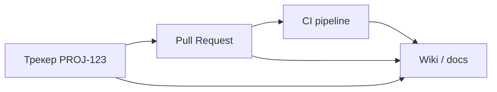
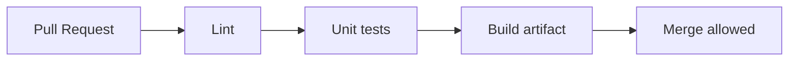
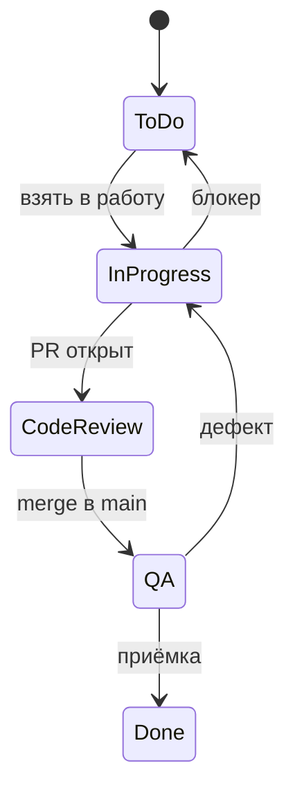

# Репозиторий, трекер и wiki на старте проекта

<div class="article-tags">
  <span class="tag tag-required">ОБЯЗАТЕЛЬНО</span>
  <span class="tag tag-beginner">ДЛЯ НОВИЧКОВ</span>
</div>

<span class="complexity-badge">Руководителю</span>
<span class="complexity-badge">Разработчику</span>

Когда [границы проекта](./1) согласованы, [команда](./2) собрана, а [среды](./3) поднимаются, нужно связать **трекер**, **Git** и **wiki** в один контур. Иначе задачи живут в чате, решения — в головах, код — без истории. Эта статья — четвёртый шаг раздела [Начало работы на проекте](./intro).

---

## Мини-глоссарий

| Термин | Расшифровка | В контуре команды |
|--------|-------------|-------------------|
| **PR** | Pull Request (Merge Request) | Запрос на слияние кода с review |
| **CI** | Continuous Integration | Автопроверки на каждый PR |
| **ADR** | Architectural Decision Record | Запись архитектурного решения |
| **DoD** | Definition of Done | Критерии завершённости задачи |
| **DoR** | Definition of Ready | Критерии готовности к разработке |
| **Epic** | Эпик | Крупная цель в трекере |
| **Backlog** | Бэклог | Упорядоченный список работ |
| **Workflow** | Рабочий процесс | Статусы задачи в трекере |
| **CODEOWNERS** | Файл владельцев кода | Автоназначение ревьюеров |
| **docs-as-code** | Документация в Git | ADR, OpenAPI рядом с кодом |
| **WIP** | Work In Progress | Незавершённая работа; лимит в Kanban |

---

## Единый контур

Зрелая команда связывает три опорных инструмента:



| Инструмент | Роль | Без него |
|------------|------|----------|
| **Трекер** | Что делаем и для кого ([Jira/YouTrack](/encyclopedia/7-project/7-09-bazy-znaniy-i-zadachniki/21)) | Хаос приоритетов |
| **Git** | Как реализовано ([Git](/encyclopedia/4-code-dev/4-13-osnovy-raboty-s-git/intro)) | Нет истории и review |
| **Wiki** | Почему так и как эксплуатировать ([Wiki](/encyclopedia/7-project/7-09-bazy-znaniy-i-zadachniki/22)) | Повторные вопросы в чате |

Правила:

- **если задачи нет в трекере — её нет**
- **если решения нет в ADR/wiki — его не было** ([ADR](/encyclopedia/7-project/7-20-adr-i-arhitekturnaya-pamyat/1))
- **если PR не связан с тикетом — не мержим** (исключения — hotfix по runbook)

<div class="callout callout--tip">
  <div class="callout-title">Пустой repo лучше хаоса</div>
  <div class="callout-body">
  Репозиторий с README, веточной политикой и CI-скелетом полезнее, чем 5000 строк кода без review и без связи с backlog.
  </div>
</div>

---

## Репозиторий

На старте техлид с DevOps создаёт организацию/группу и первый репозиторий.

### Структура — монорепо или multi-repo

| Подход | Когда подходит | Минусы |
|--------|----------------|--------|
| **Монорепо** | Один продукт, общий CI, tight coupling | Долгий CI без кэша |
| **Multi-repo** | Независимые сервисы, разные команды | Версионирование контрактов |
| **Monorepo + packages** | Frontend + backend + shared libs | Нужна дисциплина границ |

Решение фиксируют в **ADR-0001** ([архитектурная память](/encyclopedia/7-project/7-20-adr-i-arhitekturnaya-pamyat/1)).

### Элементы репозитория на день 1

| Элемент | Рекомендация |
|---------|--------------|
| **Структура каталогов** | `src/`, `docs/`, `infra/` — или по соглашению стека |
| **Ветки** | `main` защищён; feature `PROJ-123-short-title` |
| **README** | Как собрать, тесты, контакты, ссылка на wiki |
| **CONTRIBUTING** | Ветки, commit message, review |
| **.gitignore** | IDE, `.env`, артефакты сборки |
| **.editorconfig** | Единый стиль ([культура кода](/encyclopedia/7-project/7-10-kultura-koda/1)) |
| **Шаблон PR** | Ссылка на тикет, чек-лист DoD |
| **Шаблон Issue** | Bug / feature — опционально в Git |
| **CODEOWNERS** | Кто ревьюит какие каталоги |
| **CI-скелет** | lint + unit на каждый PR |
| **LICENSE** | Если open source; иначе — proprietary в README |
| **`.env.example`** | Ключи без секретов |

### Защита ветки main

- merge только через PR
- минимум 1–2 approve
- CI green обязателен
- запрет force-push
- optional: signed commits

### Именование веток и коммитов

| Элемент | Формат | Пример |
|---------|--------|--------|
| Feature | `PROJ-123-add-login` | `PROJ-456-export-pdf` |
| Bugfix | `PROJ-789-fix-timeout` | |
| Commit | `PROJ-123 краткое описание` | `PROJ-123 добавить валидацию email` |

Интеграция Jira: ключ `PROJ-123` в commit — автолинк в тикете.

### CODEOWNERS (пример)

```
# Все изменения — техлид
* @techlead

# Frontend
/frontend/ @frontend-lead @techlead

# Infra
/infra/ @devops @techlead

# ADR
/docs/adr/ @architect @techlead
```

---

## CI-скелет

Минимальный pipeline на старте:



| Job | Инструменты (примеры) | Время |
|-----|----------------------|-------|
| Lint | ESLint, Ruff, Checkstyle | < 2 мин |
| Unit | Jest, pytest, JUnit | < 5 мин |
| Build | docker build, mvn package | < 10 мин |

Позже добавляют:

- интеграционные тесты на stage
- SAST (статический анализ безопасности)
- проверку секретов (gitleaks)

Подробнее — [DevOps](/encyclopedia/8-infra-security/8-04-devops-ci-cd/intro) и [инфраструктура](./3).

### Пример GitHub Actions (фрагмент)

```yaml
name: CI
on:
  pull_request:
    branches: [main]
jobs:
  test:
    runs-on: ubuntu-latest
    steps:
      - uses: actions/checkout@v4
      - uses: actions/setup-node@v4
        with:
          node-version-file: '.nvmrc'
      - run: npm ci
      - run: npm run lint
      - run: npm test
```

---

## Трекер

Минимальная настройка проекта в Jira/YouTrack/Linear.

### Типы задач

| Тип | Назначение |
|-----|------------|
| **Epic** | Крупная цель (квартал, модуль) |
| **Story / Task** | Единица поставки для спринта |
| **Sub-task** | Шаг внутри story (dev, QA, docs) |
| **Bug** | Дефект с severity/priority |
| **Spike** | Исследование с timebox |

### Workflow (пример для Scrum)



1. **To Do** → **In Progress** → **Code Review** → **QA** → **Done**
2. Подстройка под [Scrum](/encyclopedia/7-project/7-14-scrum/intro) или [Kanban](/encyclopedia/7-project/7-18-kanban/intro)
3. **Bug** может входить с любого этапа

### Обязательные поля задачи

- **компонент** (frontend, backend, infra)
- **приоритет**
- **ссылка на среду** (если баг)
- **критерии приёмки** (Given/When/Then или чек-лист)
- **story points** или оценка — по договорённости команды

### Интеграция Git ↔ трекер

| Событие | Действие в трекере |
|---------|-------------------|
| PR opened | Комментарий + статус "Code Review" |
| PR merged | "QA" или "Done" (по политике) |
| Deploy on stage | Комментарий с версией |
| Commit message `PROJ-123` | Линк в истории тикета |

Подробнее — [Системы управления задачами](/encyclopedia/7-project/7-09-bazy-znaniy-i-zadachniki/2) и [Jira/YouTrack](/encyclopedia/7-project/7-09-bazy-znaniy-i-zadachniki/21).

### Доска — не декорация

- колонки = **реальные** статусы workflow
- WIP-лимиты для Kanban ([раздел Kanban](/encyclopedia/7-project/7-18-kanban/intro))
- блокеры видны (flag, отдельное поле)
- фильтр "мои задачи" для daily

---

## Wiki и docs-as-code

| Контент | Где хранить | Почему |
|---------|-------------|--------|
| Онбординг, runbook | Wiki ([структура](/encyclopedia/7-project/7-09-bazy-znaniy-i-zadachniki/22)) | Часто редактируют не-dev |
| ADR, OpenAPI, README модулей | Git ([docs-as-code](/encyclopedia/7-project/7-09-bazy-znaniy-i-zadachniki/23)) | Версия рядом с кодом |
| Протоколы встреч, бизнес-регламенты | Confluence / Notion | Широкая аудитория |
| Пользовательская документация | Отдельный сайт или раздел wiki | Публикация для клиентов |

### Структура wiki на старте

```
Проект PROJ
├── Онбординг
│   ├── Первый день
│   ├── Доступы и инструменты
│   └── Контакты
├── Архитектура
│   ├── Контекстная диаграмма
│   └── Ссылка на ADR в Git
├── Среды
│   ├── Dev / Stage / Prod URL
│   └── Runbook деплоя
├── Процессы
│   ├── Definition of Ready / Done
│   ├── Code review
│   └── Релизы
└── Глоссарий домена
```

На старте создайте разделы: **Онбординг**, **Архитектура**, **Среды**, **Процессы**, **ADR** (ссылки на Git).

---

## RACI — инструментальный контур

| Действие | R | A | C | I |
|----------|---|---|---|---|
| Создать repo и политики веток | DevOps, техлид | Техлид | Devs | PM |
| Настроить Jira project | PM | PM | Техлид, BA | Команда |
| Шаблоны wiki | Техпис / PM | PM | Техлид | Команда |
| ADR-0001 монорепо | Архитектор | Техлид | Devs | PM |
| CI pipeline | DevOps | Техлид | Devs | — |
| Интеграция Jira-Git | DevOps / PM | PM | Техлид | Команда |

---

## Сценарий — продуктовая компания

**Контекст:** 10 dev, GitHub, Linear, Notion.

**День 1–3:**

- org GitHub, repo `product-api`, branch protection
- Linear project с префиксом `LIN-`
- Notion: онбординг + glossary
- CI: lint + test (GitHub Actions)

**Неделя 2:**

- ADR в `docs/adr/`
- Linear ↔ GitHub через автomation
- CODEOWNERS на `infra/`

**Особенности:**

- быстрые итерации, мало формальных шаблонов
- demo каждые 2 недели — тикеты закрываются после deploy stage

---

## Сценарий — интегратор

**Контекст:** Jira заказчика, GitLab self-hosted, Confluence.

**Старт:**

- доступы к Jira/Git **до** первого commit
- префикс тикетов заказчика (`BANK-`) в ветках
- PR template с полем "этап контракта"
- wiki — копия структуры, согласованная с PM заказчика

**Особенности:**

- статусы workflow могут быть жёстко заданы заказчиком
- отчёты по тикетам для актов
- запрет merge без linked issue

**Риски:**

- двойной учёт (Excel + Jira)
- разработка в личном fork

---

## Сценарий — госконтракт

**Контекст:** GitLab в контуре, Jira или Redmine, ТЗ по ГОСТ.

**Старт:**

- репозиторий в сертифицированном контуре
- журнал коммитов = артефакт приёмки
- wiki/Confluence — протоколы, версии документов
- теги релизов соответствуют пунктам календарного плана

**Особенности:**

- доступ к repo только по VPN
- signed commits по требованию ИБ
- ветка `release/X.Y` для актов

См. [техническое задание по ГОСТ](/encyclopedia/7-project/7-08-tehnicheskoe-pismo/12).

---

## Definition of Ready и Done на старте

Согласуйте в wiki и продублируйте в шаблоне PR.

**DoR** ([подробнее](/encyclopedia/7-project/7-25-dostavka-i-gotovnost/1)):

- описание и критерии приёмки есть
- зависимости известны
- макеты/API согласованы (если нужны)
- оценка проставлена

**DoD** ([подробнее](/encyclopedia/7-project/7-25-dostavka-i-gotovnost/2)):

- код в main через PR с review
- CI green
- тесты написаны или обосновано нет
- документация обновлена
- задеплоено на stage (если применимо)
- тикет переведён в Done

---

## Оформление и единообразие

- Именование проектов в трекере = префикс в ветках (`PROJ-`)
- Единый **глоссарий** терминов домена ([аналитика](/encyclopedia/7-project/7-04-analitika/1231))
- Шаблоны страниц wiki — не пустые "New page"
- [Стилевые паттерны](/encyclopedia/7-project/7-08-tehnicheskoe-pismo/11) для документов
- Один канал объявлений об изменении процесса (#proj-announcements)

---

## Пошаговый чек-лист "инструменты за неделю"

**День 1**

- [ ] Repo создан, README, `.gitignore`, branch protection
- [ ] Проект в трекере, типы задач, минимальный workflow
- [ ] Wiki: страница "Онбординг" со ссылками

**День 2–3**

- [ ] CI lint + test на PR
- [ ] Шаблон PR с полем "Closes PROJ-XXX"
- [ ] Интеграция commit/PR → тикет

**День 4–5**

- [ ] CODEOWNERS
- [ ] ADR-0001 в `docs/adr/`
- [ ] DoR/DoD в wiki
- [ ] Первый тикет проходит путь To Do → Done end-to-end

---

## Безопасность репозитория

- private repo по умолчанию
- 2FA обязательна для org
- Dependabot / Renovate для обновления зависимостей
- secret scanning включён
- нет service account с правами owner на всех

При уходе сотрудника — revoke tokens, пересмотр CODEOWNERS.

---

## Типичные ошибки

| Ошибка | Симптом | Решение |
|--------|---------|---------|
| Код без тикета | Нет traceability | PR template + policy |
| Тикеты без AC | Переделки на QA | DoR с acceptance criteria |
| Wiki пустая | Вопросы в чате | Минимум 5 страниц в день 1 |
| CI только на main | Баги в PR | CI на pull_request |
| Разные префиксы | Jira не линкует | Единый PROJ- |
| ADR в голове | Споры через месяц | ADR-0001 в первую неделю |
| Merge без review | Техдолг | Branch protection |

---

## FAQ

**Jira или YouTrack?**

Зависит от лицензий и IT. Важнее единый процесс, чем бренд. См. [сравнение в разделе 7.09](/encyclopedia/7-project/7-09-bazy-znaniy-i-zadachniki/21).

**Wiki в Git или Confluence?**

Гибрид: ADR и API — в Git; онбординг и протоколы — в wiki для нетехнических ролей.

**Нужен ли monorepo?**

Не обязательно. Зафиксируйте решение в ADR, не спорьте каждый sprint.

**Как связать deploy и тикет?**

CI добавляет комментарий в Jira с версией и средой; или release notes генерируются из merged PR.

**Можно ли работать без PR?**

Только solo MVP на 1 человека. Команда 2+ — PR и review с первого дня.

**Что писать в первом ADR?**

Монорепо/multi-repo, стек, СУБД — три решения, которые дорого менять позже.

**Как мигрировать с Excel-задач в Jira?**

Импорт CSV одноразово; дальше правило "новое только в Jira"; Excel архивировать с датой.

**Нужен ли Conventional Commits?**

Полезно для changelog и семантических релизов; на старте достаточно префикса `PROJ-123` в subject.

---

## Шаблон Pull Request (markdown)

```markdown
## Тикет
Closes PROJ-123

## Что сделано
- краткий список изменений

## Как проверить
1. шаги для QA/reviewer

## Чек-лист DoD
- [ ] CI green
- [ ] тесты добавлены/обновлены
- [ ] документация (если нужно)
- [ ] без секретов в diff
```

Храните как `.github/pull_request_template.md` или в настройках GitLab.

---

## Шаблон user story в трекере

**Как** [роль], **я хочу** [действие], **чтобы** [ценность].

**Критерии приёмки:**

- Given пользователь авторизован as согласующий
- When он открывает договор PROJ-001
- Then видит кнопку "Согласовать" и историю шагов

**DoR:** макет согласован / API описан в OpenAPI / зависимостей нет

См. [аналитику](/encyclopedia/7-project/7-04-analitika/113) и [DoR/DoD](/encyclopedia/7-project/7-25-dostavka-i-gotovnost/intro).

---

## Сравнение трекеров (кратко)

| Критерий | Jira | YouTrack | Linear |
|----------|------|----------|--------|
| Корпоративный стандарт | часто | часто в .NET-shop | стартапы |
| Git integration | + | + | + |
| Кастом workflow | ++ | ++ | + |
| Простота для новичка | средняя | средняя | высокая |

Выбор — с IT и лицензиями; процесс важнее бренда.

---

## Связь с соседними разделами

| Тема | Раздел |
|------|--------|
| Git углублённо | [4.13 Git](/encyclopedia/4-code-dev/4-13-osnovy-raboty-s-git/intro) |
| Культура кода | [7.10](/encyclopedia/7-project/7-10-kultura-koda/intro) |
| ADR | [7.20](/encyclopedia/7-project/7-20-adr-i-arhitekturnaya-pamyat/intro) |
| Архитектура на старте | [Статья 5](./5) |

---

## Чек-лист готовности контура

- [ ] Каждый dev может клонировать, собрать, прогнать CI локально
- [ ] PR проходит review и CI до merge
- [ ] Тикет связан с PR
- [ ] Wiki содержит онбординг, среды, DoR/DoD
- [ ] ADR-0001 опубликован
- [ ] PM видит актуальную доску

---

## Что дальше

[Архитектура и проектирование на старте](./5) — эскиз системы, NFR и первые ADR по стеку и интеграциям.

---
