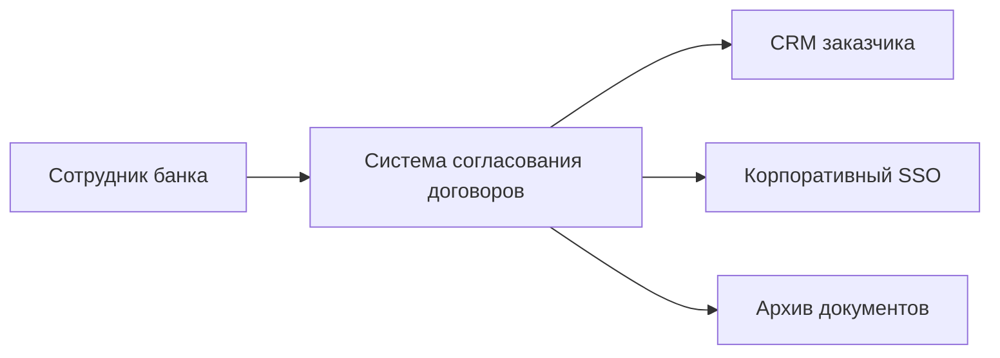
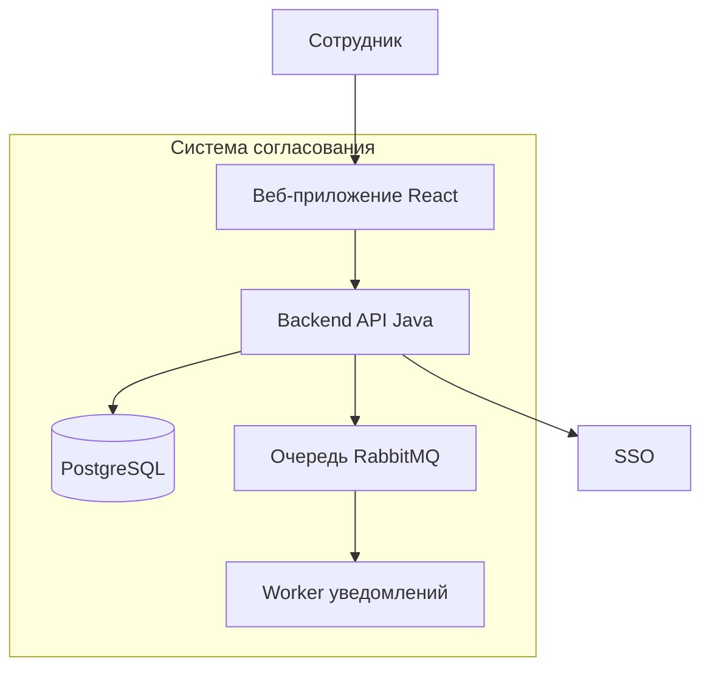
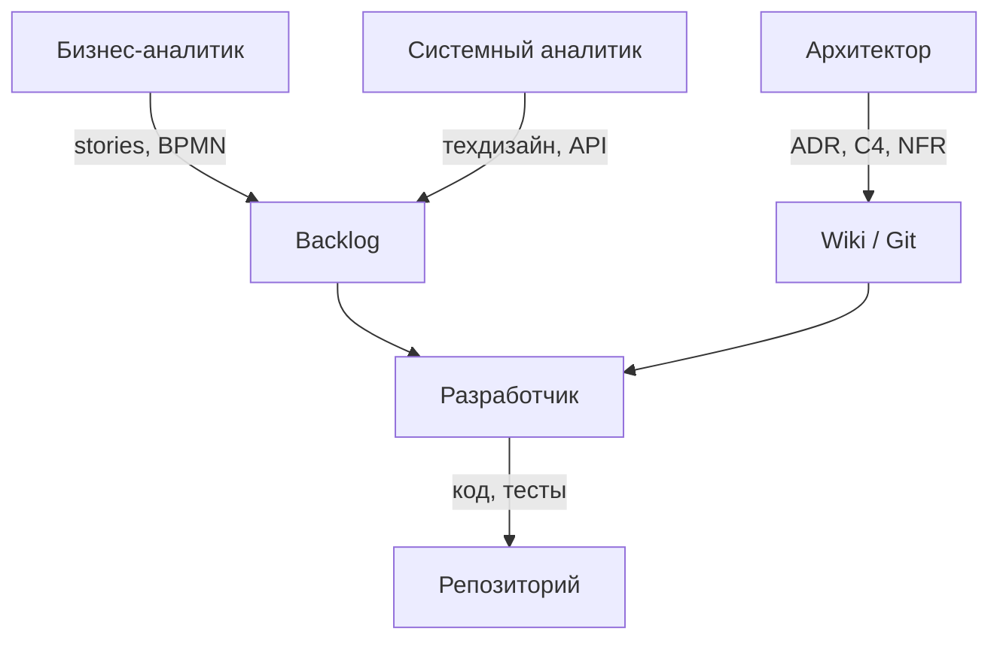

# Архитектура и проектирование на старте проекта

<div class="article-tags">
  <span class="tag tag-required">ОБЯЗАТЕЛЬНО</span>
  <span class="tag tag-beginner">ДЛЯ НОВИЧКОВ</span>
</div>

<span class="complexity-badge">Архитектору</span>
<span class="complexity-badge">Аналитику</span>

---

## Архитектурная взлётная полоса

**Архитектура** — это не один большой документ на 200 страниц, а согласованная картина того, из каких частей состоит система, как они общаются и какие ограничения нельзя нарушать.

**Big Design Up Front** (BDUF) — подход, когда всю систему проектируют до первой строки кода. На старте коммерческого продукта он обычно избыточен: требования меняются, а месяцы проектирования без обратной связи от пользователей съедают бюджет.

**Architecture runway** (архитектурная взлётная полоса) — минимальный согласованный каркас, достаточный для первых итераций разработки. Метафора с самолётом: полоса не описывает весь маршрут полёта, но даёт безопасный старт и посадку.

<div class="callout callout--tip">
  <div class="callout-title">Что входит в runway на старте</div>

  <div class="callout-body">
  <ul>
    <li>контекст системы — кто снаружи и зачем обращается к нам;</li>
    <li>ключевые компоненты и интеграции — что внутри и с чем связано;</li>
    <li>нефункциональные требования (NFR) — скорость, безопасность, объём данных;</li>
    <li>осознанные риски — что может сломаться, если не принять решение сейчас.</li>
  </ul>
  </div>
</div>

Без эскиза каждый разработчик построит свой вариант архитектуры. Три человека за неделю получат три разных способа хранить пользователей, три стиля API и три подхода к логированию. Потом это сольют в один проект — и потратят месяцы на переделку.

С другой стороны, 200-страничное техническое задание до первого коммита тоже не требуется. Runway — золотая середина между хаосом и параличом анализа.

Углубление — [Проектирование и архитектура](/encyclopedia/7-project/7-06-proektirovanie-i-arhitektura/intro).

---

## Модель C4 на старте

**C4 model** — способ описывать архитектуру на четырёх уровнях детализации. На старте проекта обычно хватает первых двух.

| Уровень | Название | Что показывает | Когда рисовать |
|---------|----------|----------------|----------------|
| 1 | System Context | Система и внешние акторы | День 1–3 проекта |
| 2 | Container | Приложения, БД, очереди внутри системы | Первая неделя |
| 3 | Component | Модули внутри одного контейнера | Перед крупной фичей |
| 4 | Code | Классы и интерфейсы | Редко на старте; в коде и ADR |

**Контейнер** в C4 — не Docker-контейнер, а отдельное развёртываемое приложение: веб-сервер, мобильное приложение, база данных, фоновый worker.

### Уровень 1 — контекст системы

Показывает систему как один блок и людей/системы вокруг неё.



На этом уровне отвечают на вопросы:

- кто пользователи и внешние системы;
- какие данные входят и выходят;
- есть ли регуляторные ограничения (персональные данные, отраслевые стандарты).

### Уровень 2 — контейнеры

Раскрывает, из чего состоит система внутри.



На старте достаточно:

- одной диаграммы контекста;
- одной диаграммы контейнеров;
- короткого текста к каждой стрелке (протокол, формат данных).

Инструменты: draw.io, Mermaid в wiki, PlantUML, Structurizr. Важнее актуальность, чем красота.

---

## Нефункциональные требования (NFR)

**NFR** (non-functional requirements) — требования к качеству системы, а не к конкретной функции. Пользователь не говорит "мне нужна доступность 99,9%", но без NFR команда не знает, как проектировать.

Подробнее — [NFR в проектировании](/encyclopedia/7-project/7-06-proektirovanie-i-arhitektura/design/1116).

### Примеры NFR на старте

| Категория | Плохая формулировка | Хорошая формулировка | Влияние на архитектуру |
|-----------|---------------------|----------------------|------------------------|
| Производительность | "Система должна быть быстрой" | "95% запросов списка заявок — до 300 мс при 500 одновременных пользователях" | Кэш, индексы БД, пагинация |
| Доступность | "Сервис не должен падать" | "99,5% uptime в рабочие часы; RTO 4 часа" | Резервирование, health-check, runbook |
| Безопасность | "Защитить данные" | "Аутентификация через корпоративный SSO; данные в покое — AES-256" | OAuth2/OIDC, шифрование, аудит |
| Масштабируемость | "Должно расти" | "До 50 000 заявок в год без смены СУБД" | Партиционирование, архив |
| Сопровождаемость | "Код должен быть чистым" | "Новый разработчик поднимает среду за 2 часа по README" | CI, документация, стандарты |
| Соответствие | "Соблюдать закон" | "Хранение ПДн по 152-ФЗ; журнал доступа 3 года" | Локализация данных, логирование |

<div class="callout callout--info">
  <div class="callout-title">Как собрать NFR на старте</div>

  <div class="callout-body">
  <ol>
    <li>Опросите спонсора и эксплуатацию — что критично для бизнеса.</li>
    <li>Посмотрите договор и SLA — там часто уже есть цифры.</li>
    <li>Зафиксируйте 5–10 NFR в wiki и ссылку в ADR-000.</li>
    <li>Пересматривайте после каждого релиза — NFR живут вместе с продуктом.</li>
  </ol>
  </div>
</div>

### Типичные риски без NFR

- Одна БД на всё — потом нельзя масштабировать чтение отдельно от записи.
- Синхронные вызовы между сервисами — цепочка из пяти сервисов падает целиком при сбое одного.
- Отсутствие идемпотентности — повторный запрос создаёт дубликат платежа или заявки.
- Логи без структуры — при инциденте невозможно найти причину за разумное время.

Каждый риск, который осознанно принимают, стоит записать в ADR с объяснением, почему отложили решение.

---

## Первые ADR

**ADR** (Architectural Decision Record) — короткая запись об архитектурном решении: что выбрали, почему и какие последствия. С первого дня ведите [Architectural Decision Records](/encyclopedia/7-project/7-20-adr-i-arhitekturnaya-pamyat/1).

### Типичные ADR на старте

| № | Типичное решение | Почему на старте |
|---|------------------|------------------|
| ADR-001 | Монолит или микросервисы | Задаёт границы репозитория и деплоя |
| ADR-002 | Язык и основной фреймворк | Влияет на найм и скорость |
| ADR-003 | СУБД и стратегия миграций | Сложно поменять позже |
| ADR-004 | Аутентификация (OAuth2, SSO) | Граница безопасности |
| ADR-005 | Стиль API (REST, события) | Контракт с фронтом и интеграциями |
| ADR-006 | Формат логов и трассировки | Нужен до prod |
| ADR-007 | Стратегия веток и релизов | Связь с CI/CD |

### Шаблон ADR

```markdown
# ADR-003: PostgreSQL как основная СУБД

## Статус
Принято (accepted)

## Контекст
Нужна реляционная БД для транзакционных заявок.
Команда знает SQL. Объём — до 50 000 записей в год.
Требуется JSON-поля для гибких атрибутов.

## Решение
Используем PostgreSQL 16.
Миграции — Flyway/Liquibase в репозитории.
Резервное копирование — ежедневный snapshot + WAL.

## Альтернативы
- MySQL — отклонено: слабее поддержка JSON и расширений.
- MongoDB — отклонено: нужны жёсткие транзакции и отчёты.

## Последствия
+ Зрелая экосистема, знакомая команде.
+ Хорошая поддержка в облаках.
- Потребуется DBA-консультация при росте нагрузки.
- Горизонтальное масштабирование записи — отдельная задача.

## Связанные артефакты
- Диаграмма контейнеров (C4 level 2)
- NFR: доступность 99,5%
```

### Статусы ADR

| Статус | Значение |
|--------|----------|
| proposed | Предложено, обсуждается |
| accepted | Принято, действует |
| deprecated | Устарело, не применять к новому коду |
| superseded | Заменено другим ADR (указать номер) |

<div class="callout callout--tip">
  <div class="callout-title">Правила ADR на старте</div>

  <div class="callout-body">
  <ul>
    <li>Один ADR — одно решение, не свалка тем.</li>
    <li>Не удаляйте старые ADR — помечайте deprecated или superseded.</li>
    <li>Храните в Git рядом с кодом, не только в wiki.</li>
    <li>Обсуждение в PR к ADR — так же, как к коду.</li>
  </ul>
  </div>
</div>

---

## Аналитик и архитектор — разграничение

На старте часто путают роли **бизнес-аналитика** (BA) и **системного аналитика / архитектора** (SA). Обе роли нужны, но отвечают за разные слои.

| Вопрос | BA (бизнес-аналитик) | SA / архитектор |
|--------|----------------------|-----------------|
| Что видит пользователь? | Да | Консультирует |
| Какие бизнес-правила? | Да | Проверяет реализуемость |
| Какие системы вокруг? | Описывает интеграции с точки зрения данных | Проектирует контракты и протоколы |
| Сколько RPS выдержать? | Собирает ожидания | Формулирует NFR и решения |
| Какая модель данных? | Глоссарий домена | ER-диаграмма, миграции |

**Разграничение ответственности**:

- аналитик фиксирует *поведение и правила* — что система делает для пользователя;
- архитектор — *границы систем и NFR* — из чего состоит, какие ограничения;
- разработчик — *реализацию в рамках ADR* — код, тесты, деплой ([о разделе проекта](/section/project)).

### Артефакты в связке

| Артефакт | Владелец | Связь |
|----------|----------|-------|
| User stories / use cases | BA / PO | Backlog |
| BPMN процессов | BA | [BPMN](/encyclopedia/7-project/7-04-analitika/129) |
| Технический дизайн фичи | SA / техлид | [128](/encyclopedia/7-project/7-04-analitika/128) |
| OpenAPI / схемы | Dev + SA | [Swagger](/encyclopedia/7-project/7-08-tehnicheskoe-pismo/3) |
| Модель данных | SA / DBA | [design/117](/encyclopedia/7-project/7-06-proektirovanie-i-arhitektura/design/117) |
| ADR | Архитектор / техлид | [ADR](/encyclopedia/7-project/7-20-adr-i-arhitekturnaya-pamyat/1) |



### Типичные конфликты и как их снимать

| Конфликт | Симптом | Решение |
|----------|---------|---------|
| BA пишет техническое ТЗ | 80 страниц до первого спринта | Разделить: BA — поведение, SA — техдизайн по фичам |
| Архитектор пишет user stories | Разработчики не понимают ценность | Stories — зона PO/BA; архитектор ревьюит NFR |
| Нет SA | Архитектор тонет в деталях API | Назначить SA или ротировать техлида на фичи |
| OpenAPI устарел | Фронт и бэк расходятся | OpenAPI в Git, ревью в PR, CI-валидация |

---

## Документирование на старте

Минимальный набор, который окупается в первый месяц:

1. **README и CONTRIBUTING** в репозитории — как собрать, как оформить PR.
2. **Диаграмма контекста** (C4 level 1) — даже draw.io в wiki.
3. **Глоссарий домена** — 20–30 терминов, согласованных с заказчиком.
4. **Политика веток и релизов** — main защищён, feature branches, теги.
5. **[Definition of Done](/encyclopedia/7-project/7-25-dostavka-i-gotovnost/2)** и **[Definition of Ready](/encyclopedia/7-project/7-25-dostavka-i-gotovnost/1)** — когда задача готова к работе и к приёмке.

### Что хранить где

| Контент | Git (docs-as-code) | Wiki |
|---------|-------------------|------|
| ADR | Да | Ссылка |
| OpenAPI | Да | — |
| README модулей | Да | — |
| Онбординг | Частично | Да |
| Протоколы встреч | — | Да |
| Runbook инцидентов | Да | Дубль для дежурных |

Подробнее — [docs-as-code](/encyclopedia/7-project/7-09-bazy-znaniy-i-zadachniki/23).

---

## Госконтракт и формальное ТЗ

В коммерческой разработке часто хватает lean-backlog и ADR. В **госзаказе** и крупных корпоративных тендерах дополнительно требуется **техническое задание** (ТЗ) по нормативам — часто со ссылкой на [ГОСТ](/encyclopedia/7-project/7-08-tehnicheskoe-pismo/12).

<div class="callout callout--info">
  <div class="callout-title">Два контура документов</div>

  <div class="callout-body">
  <strong>Рабочий контур</strong> — backlog, ADR, wiki, то, чем пользуется команда каждый день.

  <strong>Формальный контур</strong> — ТЗ по ГОСТ, акты, протоколы приёмки — то, что проверяет заказчик и аудит.

  Оба должны не противоречить друг другу. Изменение в backlog без отражения в ТЗ (или приложения к договору) — риск на приёмке.
  </div>
</div>

### Типичная структура госконтрактного ТЗ

| Раздел ГОСТ | Что пишет команда | Связь с agile |
|-------------|-------------------|---------------|
| Общие сведения | PM, юрист | Charter проекта |
| Назначение и цели | BA + спонсор | Vision, OKR |
| Характеристики объекта | SA + архитектор | C4, NFR |
| Требования к функциям | BA | Epics, stories |
| Требования к надёжности | Архитектор | NFR, SLA |
| Состав и содержание работ | PM | WBS, roadmap |
| Порядок контроля и приёмки | PM + QA | DoD, тест-план |

### Как не утонуть в формализме

- Ведите **матрицу трассировки**: пункт ТЗ → epic/story → тест-кейс → релиз.
- Формальные документы обновляйте **пакетами** при согласованных изменениях ([управление изменениями](/encyclopedia/7-project/7-22-upravlenie-izmeneniyami/1)).
- Технические детали в ТЗ — на уровне возможностей, не классов Java.
- Приложения к ТЗ — ADR, диаграммы, OpenAPI; основной текст остаётся стабильным.

FAQ по оформлению — [7.08 FAQ](/encyclopedia/7-project/7-08-tehnicheskoe-pismo/998).

---

## Пример runway за первую неделю

**Проект**: внутренний портал заявок на закупку для компании из 500 сотрудников.

| День | Артефакт | Результат |
|------|----------|-----------|
| 1 | C4 context + список стейкхолдеров | Все видят границы системы |
| 2 | C4 containers + ADR-001 (монолит) | Решение о структуре репо |
| 3 | NFR-таблица (10 пунктов) | Критерии для техдизайна |
| 4 | ADR-002 (стек), ADR-003 (PostgreSQL) | Можно создать каркас приложения |
| 5 | Глоссарий (25 терминов) + OpenAPI черновик | BA и dev говорят на одном языке |

К концу недели команда из четырёх человек может начать [первые задачи](./6) без споров о стеке и границах.

---

## Частые ошибки на старте

| Ошибка | Последствие | Что делать |
|--------|-------------|------------|
| Нет диаграммы контекста | Интеграции всплывают в середине спринта | C4 level 1 в первые 3 дня |
| NFR в голове архитектора | Prod падает под нагрузкой | Таблица NFR в wiki, ревью с PO |
| ADR пишут задним числом | Никто не знает, почему выбран MongoDB | ADR до merge критичного кода |
| BA пишет SQL в ТЗ | Привязка к реализации, сложные изменения | Модель данных — зона SA |
| Только wiki, нет ADR в Git | Документация расходится с кодом | docs-as-code |
| Госконтрактное ТЗ без связи с backlog | Не сдают этап | Матрица трассировки с дня 1 |

---

## Согласование эскиза с командой

Архитектурный runway не пишется в одиночку. Минимальный цикл согласования на первой неделе:

| Шаг | Участники | Время | Выход |
|-----|-----------|-------|-------|
| Черновик C4 L1 | Архитектор | 2–4 ч | Диаграмма в wiki |
| Ревью интеграций | BA + представитель заказчика | 60 мин | Список внешних систем |
| Воркшоп C4 L2 | Архитектор + техлиды | 90 мин | Контейнеры и протоколы |
| NFR-ревью | PO + эксплуатация | 45 мин | Таблица NFR v1 |
| ADR party | Вся команда разработки | 60 мин | 3–5 ADR в статусе accepted |

Фиксируйте **протокол**: кто согласен, какие пункты отложены, дата следующего пересмотра. Без протокола через месяц никто не вспомнит, почему выбрали RabbitMQ, а не Kafka.

### Вопросы для воркшопа C4 L2

- Где граница нашей системы при сбое внешнего SSO?
- Какой контейнер владеет данными заявки — один источник правды?
- Синхронный или асинхронный вызов к CRM — и что при таймауте?
- Где хранятся секреты и кто ротирует ключи?
- Какой контейнер первым выкатываем на prod — можно ли откатить без миграции БД?

---

## Матрица трассировки для госконтракта

Связывает формальное ТЗ с рабочим backlog. Ведите в Excel, wiki или трекере.

| ID ТЗ | Формулировка в ТЗ | Epic / Story | Тест-кейс | Релиз | Статус |
|-------|-------------------|--------------|-----------|-------|--------|
| FR-3.2.1 | Регистрация заявки пользователем | PROJ-12 | TC-045 | 1.0 | В работе |
| NFR-2.1 | Время отклика до 2 с | PROJ-88 | TC-PERF-01 | 1.1 | Запланировано |
| FR-5.1 | Экспорт в PDF | PROJ-40 | TC-102 | 2.0 | Backlog |

Правила:

- каждый обязательный пункт ТЗ имеет хотя бы одну story;
- story без пункта ТЗ — либо вне scope, либо нужно **допсоглашение**;
- при закрытии этапа акт приёмки ссылается на ID ТЗ и релиз.

---

## FAQ

**Нужно ли рисовать все 4 уровня C4?**

На старте — уровни 1 и 2. Уровень 3 — перед крупной фичей или при споре о границах модулей. Уровень 4 — в коде и code review, не в отдельной диаграмме.

**Сколько ADR достаточно в первый месяц?**

Обычно 5–10. Больше — признак, что решения не консолидируют. Меньше — возможно, решения принимают устно и теряют.

**Кто утверждает ADR?**

Техлид или архитектор — автор. Команда — ревью в PR. Спонсор — только если ADR влияет на бюджет или сроки (например, смена облака).

**Чем runway отличается от MVP?**

Runway — технический каркас для разработки. MVP — минимальный продукт для пользователя. Runway нужен, чтобы построить MVP быстрее и без переделок.

**Как совместить ГОСТ-ТЗ и Scrum?**

ТЗ описывает результат этапа и критерии приёмки. Спринты — способ доставки внутри этапа. Backlog — рабочий инструмент; ТЗ — юридический якорь.

**Аналитик может быть архитектором?**

В маленькой команде — да, но роли лучше разделять хотя бы на уровне артефактов: stories пишет как BA, ADR — как архитектор.

---

## Что дальше

[План, декомпозиция и первые задачи](./6) — как разложить runway на backlog и первый спринт.

---
