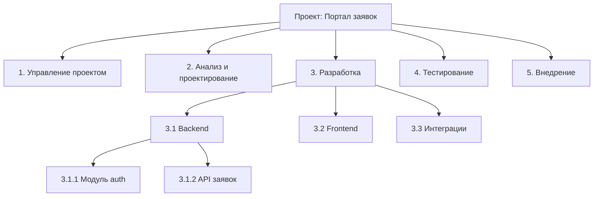
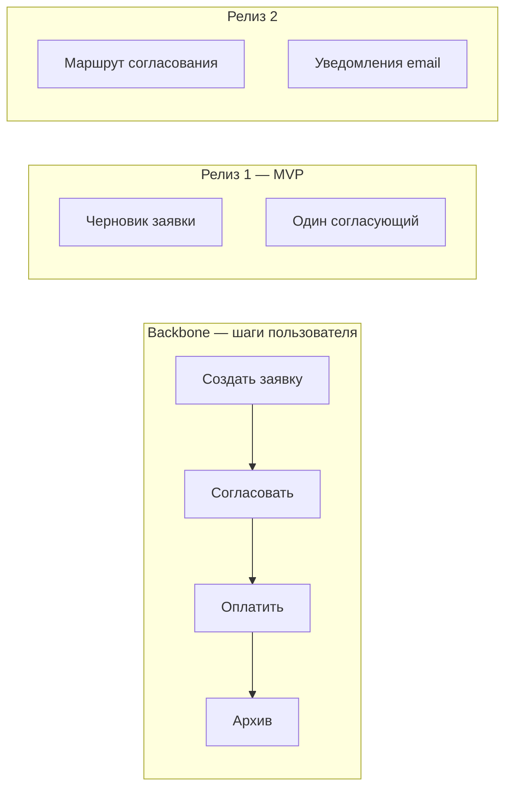
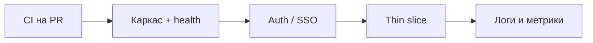
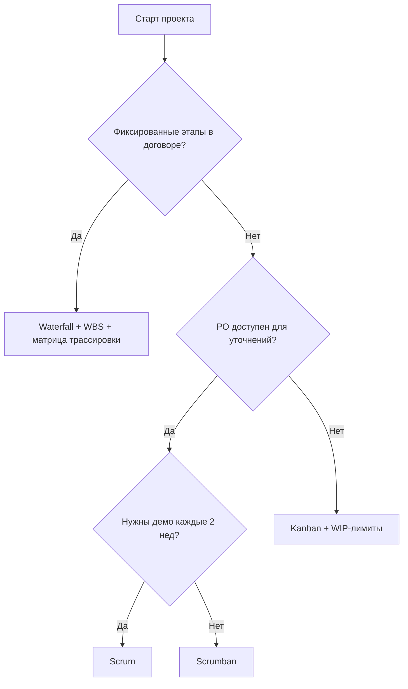

# План, декомпозиция и первые задачи

  ОБЯЗАТЕЛЬНО
  ДЛЯ НОВИЧКОВ

Руководителю
Аналитику

---

## Уровни планирования

**Планирование** — это не один документ на весь проект, а несколько горизонтов с разной детализацией. На старте важно не перепутать уровни: roadmap на год не заменяет задачи на завтра.

| Уровень | Горизонт | Артефакт | Кто ведёт |
|---------|----------|----------|-----------|
| Стратегия | квартал–год | Roadmap, OKR | PO, спонсор |
| Релиз | 4–12 недель | Release plan, milestones | PM, техлид |
| Итерация | 1–4 недели | Sprint goal / WIP-план | Scrum Master, тимлид |
| День | 1–3 дня | Задачи в In Progress | Разработчик |

**Roadmap** — последовательность крупных результатов во времени. Не список всех фич, а ответ на вопрос: что пользователь получит в каком квартале.

**OKR** (Objectives and Key Results) — цели и измеримые ключевые результаты. Пример: цель "ускорить согласование договоров", ключевой результат "среднее время с 5 до 2 дней к концу Q3".

На старте достаточно **roadmap на 3 месяца** и **первой итерации** с измеримой целью:

> Пользователь логинится через SSO и видит список своих заявок на stage-среде.

Такая формулировка проверяема: можно показать демо стейкхолдерам и закрыть milestone.

---

## Декомпозиция работ

**Декомпозиция** — разбиение большой цели на части, которые можно оценить, назначить и сдать.

### Иерархия в agile-backlog

1. **Epic** — крупная ценность ("Авторизация и профиль пользователя").
2. **Story** — ценность для пользователя с [acceptance criteria](/encyclopedia/7-project/7-04-analitika/116) (критерии приёмки).
3. **Task** — технический шаг (миграция БД, эндпоинт, UI-компонент).
4. **Spike** — исследование с ограничением по времени (например, 2 дня на выбор библиотеки PDF).

  
Definition of Ready

  

  В спринт или Kanban-поток не берут задачи без [Definition of Ready](/encyclopedia/7-project/7-25-dostavka-i-gotovnost/1):

  <ul>
    <li>понятна ценность для пользователя или системы;</li>
    <li>есть критерии приёмки;</li>
    <li>нет незакрытых блокирующих зависимостей;</li>
    <li>оценка согласована (хотя бы порядок величины).</li>
  </ul>
  

### Пример декомпозиции epic

**Epic**: Авторизация и профиль

| Story | Acceptance criteria (кратко) |
|-------|------------------------------|
| Вход через SSO | Пользователь жмёт "Войти", редирект на IdP, возврат с токеном |
| Профиль | Отображаются ФИО и отдел из LDAP |
| Выход | Сессия завершена, редирект на страницу входа |

**Tasks** к story "Вход через SSO":

- настроить OAuth2 client в Keycloak;
- эндпоинт `/auth/callback` на бэкенде;
- middleware проверки JWT;
- e2e-тест happy path.

---

## WBS — иерархия работ

**WBS** (Work Breakdown Structure) — древовидное разбиение проекта на пакеты работ. Привычен в waterfall, госпроектах и строительстве ПО по контракту.

### Правила WBS

- Каждый уровень — **100% scope** родителя, без дыр и дублей.
- Листья WBS — **пакеты работ**, которые можно оценить в часах/днях.
- WBS описывает **результаты** (deliverables), не действия ("совещание" — плохой лист).

### WBS и agile-backlog

| WBS | Agile-backlog |
|-----|---------------|
| Стабильная структура этапа | Живой, меняется каждый спринт |
| Нужен заказчику по ГОСТ | Нужен команде каждый день |
| Узлы 1.2.3 | Epic → Story → Task |

На госконтракте ведут **оба**: WBS в ТЗ для приёмки этапа, backlog — для ежедневной работы. Связь — [матрица трассировки](/encyclopedia/7-project/7-08-tehnicheskoe-pismo/12): узел WBS 3.1.2 → epic PROJ-45.

Инструменты WBS — [Microsoft Project](/encyclopedia/7-project/7-02-komanda-i-upravlenie/16), [планирование конструирования](/encyclopedia/7-project/7-12-konstruirovanie-po/4).

---

## Story mapping — карта историй

**Story mapping** — техника Джеффа Паттона: выстраивает user stories вдоль **пользовательского пути** (слева направо), а приоритеты и релизы — сверху вниз.

### Как провести story mapping на старте

1. Соберите PO, BA, 2–3 разработчиков, представителя пользователей (2–3 часа).
2. Нарисуйте **backbone** — основные шаги сценария без деталей.
3. Под каждым шагом — стикеры со stories (активности пользователя).
4. Горизонтальную линию проведите ниже — всё **выше** линии в первый релиз (walking skeleton).
5. Фотография доски → wiki; stories → трекер.

Story mapping помогает не утонуть в инфраструктурных задачах и держать фокус на **сквозном пути пользователя**.

---

## Sprint 0 и thin slice

На старте часто спорят: тратить первые две недели на настройку или сразу показать фичу?

### Sprint 0

**Sprint 0** — итерация без пользовательской ценности в привычном смысле, посвящённая фундаменту:

- репозиторий, CI, среды;
- каркас приложения;
- трекер, wiki, доступы;
- ADR и диаграммы.

Риск: две недели только Jira и Confluence без инкремента — [Scrum-театр](/encyclopedia/7-project/7-14-scrum/999).

### Thin slice (тонкий сквозной срез)

**Thin slice** — минимальный путь данных через всю систему: UI → API → БД → ответ пользователю. Одна фича, но **настоящая**, не заглушка на всех слоях.

| Подход | Плюсы | Минусы |
|--------|-------|--------|
| Только Sprint 0 | Чистая инфраструктура | Нет демо, спонсор нервничает |
| Только thin slice | Быстрое демо | Техдолг в CI и мониторинге |
| **Гибрид** | Демо + фундамент | Нужна дисциплина приоритетов |

  
Рекомендация на старте

  

  Первая итерация (1–2 недели) — <strong>гибрид</strong>:

  <ul>
    <li>день 1–3: CI, каркас, health-check ([задачи скелета](#первые-задачи-скелета));</li>
    <li>день 4–10: одна thin slice (например, список заявок без фильтров);</li>
    <li>конец итерации: демо на stage + ретро.</li>
  </ul>
  

### Пример thin slice

**Цель**: пользователь видит список из трёх тестовых заявок после входа.

- Frontend: страница `/requests`, таблица, кнопка входа.
- Backend: `GET /api/requests`, JWT middleware.
- БД: таблица `requests`, seed-данные.
- Deploy: dev и stage, health-check зелёный.

Не входит в slice (сознательно отложено): фильтры, пагинация, создание заявки, уведомления.

---

## Первые задачи скелета

Типичная последовательность технических задач до первой бизнес-фичи:

| # | Задача | Результат | Оценка (команда 4 чел.) |
|---|--------|-----------|-------------------------|
| 1 | CI: lint + test на PR | Качество с первого коммита | 1–2 дня |
| 2 | Каркас приложения + health-check | Деплой на dev | 2–3 дня |
| 3 | Auth stub / SSO | Граница безопасности | 3–5 дней |
| 4 | Первая thin slice | Демо для стейкхолдеров | 3–5 дней |
| 5 | Логирование и базовые метрики | Подготовка к prod | 2–3 дня |

Задачи 1–3 можно распараллелить между DevOps, backend и frontend. Задача 4 — только после 2 и частично 3.

---

## Оценка трудозатрат

**Оценка** — не обещание с точностью до часа, а согласованное понимание порядка величины и рисков.

### Методы на старте

| Метод | Суть | Когда использовать |
|-------|------|-------------------|
| **Story points** | Относительная сложность (1, 2, 3, 5, 8, 13) | Scrum, стабильная команда |
| **Часы/дни** | Абсолютная трудоёмкость | Госконтракт, WBS, аутстафф |
| **T-shirt sizes** | S, M, L, XL | Грубый roadmap, ранний backlog |
| **Planning poker** | Команда голосует картами | Уточнение stories перед спринтом |
| **Аналогии** | "Похоже на PROJ-88" | Есть история velocity |

**Velocity** — сколько story points команда закрывает за спринт в среднем. На старте velocity **неизвестна**; первые 2–3 спринта — калибровка, не KPI для наказаний.

### Правила оценки для новичков

- Оценивайте **всю story** (анализ + код + тест + ревью), не только кодинг.
- Задачи больше 8 points — дробите.
- **Spike** с фиксированным потолком (16 часов) — для неизвестности.
- Записывайте допущения в тикете: "оценка 5, если API CRM доступен".

### Пример planning poker

Story: "Пользователь создаёт черновик заявки"

| Участник | Оценка | Аргумент |
|----------|--------|----------|
| Dev 1 | 5 | CRUD + валидация |
| Dev 2 | 8 | Неясна модель вложений |
| QA | 5 | Тесты стандартные |
| После обсуждения | 8 | Spike 4ч на вложения, потом пересмотр |

---

## Распределение по людям

Принципы из [систем управления задачами](/encyclopedia/7-project/7-09-bazy-znaniy-i-zadachniki/2):

- **соответствие навыку** — junior не тянет критичный auth в одиночку;
- **баланс нагрузки** — смотрите на доску, а не только на календарь;
- **явный владелец** — одна задача, один ответственный (не "мы все");
- **парное распределение рискованных зон** — интеграции, платежи, персональные данные.

| Зона | Как распределять |
|------|------------------|
| CI/CD | DevOps + один dev для контекста |
| Auth | Middle+ с ревью архитектора |
| UI-компоненты | Frontend, параллельно с API-контрактом |
| Интеграция CRM | Пара dev + аналитик для контракта |
| Документация онбординга | Новичок + buddy |

PO/PM **приоритизирует** backlog. Тимлид следит, чтобы **WIP** (work in progress) не взорвался — не больше 2 задач In Progress на человека без веской причины ([Kanban](/encyclopedia/7-project/7-18-kanban/2)).

---

## Scrum, Kanban или гибрид

Выбор процесса на старте влияет на ритм, метрики и ожидания стейкхолдеров.

| Критерий | Scrum | Kanban |
|----------|-------|--------|
| Ритм | Фиксированные спринты 1–4 нед | Непрерывный поток |
| Планирование | Sprint Planning | Пополнение очереди по мере опустошения |
| Метрика | Velocity, burndown | Lead time, cycle time, WIP |
| Роли | PO, SM, команда | Меньше формальных ролей |
| Подходит когда | Новый продукт, нужны демо каждые 2 нед | Поддержка, много входящих, неопределённость |

### Когда что выбирать

| Выбор | Сигналы на старте |
|-------|-------------------|
| **Scrum** | Новый продукт, PO доступен, стейкхолдеры ждут регулярные демо |
| **Kanban** | Поток багов и мелких задач, L2-поддержка, непредсказуемый вход |
| **Scrumban** | Спринты для отчётности + WIP-лимиты для дисциплины |
| **Waterfall/WBS** | Госконтракт, фиксированные этапы, жёсткая приёмка |

Помощник — [Как выбрать процесс](/encyclopedia/7-project/7-03-metodologiya-i-zhiznennyy-tsikl-po/4).

  
Смена процесса

  

  Процесс не высечен в камне. Команда из 3 человек на старте часто живёт без формального Scrum. При росте до 8+ и появлении внешних демо — имеет смысл ввести спринты. Главное — явно договориться и записать в wiki, а не менять правила каждую неделю молча.
  

### Scrumban на практике

- Спринты 2 недели для отчёта спонсору.
- WIP-лимит: 3 задачи In Progress на команду из 4 dev.
- Пополнение backlog — по средам, не только в sprint planning.
- Daily — 15 минут, фокус на блокерах.

---

## План первого релиза — пример

**Команда**: 1 PM, 1 BA, 2 backend, 1 frontend, 1 QA (part-time).

**Roadmap 3 месяца**:

| Месяц | Milestone | Ключевые stories |
|-------|-----------|------------------|
| 1 | Walking skeleton на stage | Auth, список заявок, CI |
| 2 | Создание и согласование | Форма заявки, один уровень согласования |
| 3 | Пилот с 20 пользователями | Уведомления, отчёт, исправления по пилоту |

**Спринт 1 (2 недели)** — цель: демо входа и списка заявок.

| Story | Points | Владелец |
|-------|--------|----------|
| CI pipeline | 3 | DevOps + BE-1 |
| Каркас API + health | 5 | BE-1 |
| OAuth2 callback | 8 | BE-2 |
| Страница списка | 5 | FE-1 |
| e2e: login + list | 3 | QA |

**Ёмкость спринта**: ~24 points (оценка до калибровки velocity). Одна story (OAuth2) — риск; заложен буфер 20%.

---

## Частые ошибки планирования

| Ошибка | Симптом | Что делать |
|--------|---------|------------|
| Нет измеримой цели итерации | Спринт "делаем auth" без демо | Sprint goal в одном предложении |
| Backlog = список технических задач | Пользователь не видит ценности | Story mapping, thin slice |
| Оценка в вакууме | Срыв сроков с первого спринта | Planning poker, spike на неизвестное |
| WIP без лимитов | 10 задач In Progress, ничего не Done | WIP-лимиты, фокус на завершении |
| WBS и backlog расходятся | Не сдают этап по госконтракту | Матрица трассировки |
| Sprint 0 без демо | Спонсор теряет доверие | Гибрид с thin slice |

---

## Дерево выбора процесса

Используйте дерево на воркшопе с командой в первую неделю. Решение запишите в wiki — [Как выбрать процесс](/encyclopedia/7-project/7-03-metodologiya-i-zhiznennyy-tsikl-po/4).

---

## Refinement backlog на старте

**Refinement** (уточнение backlog) — регулярная сессия, где stories доводят до Definition of Ready.

| Элемент | Рекомендация на старте |
|---------|------------------------|
| Частота | 1–2 раза в неделю по 60 мин |
| Участники | PO, BA, 2–3 dev, QA по необходимости |
| Вход | Топ 10–15 stories из roadmap |
| Выход | Stories с AC, оценкой, без блокеров |

### Повестка refinement (шаблон)

1. PO объясняет ценность story (5 мин на story).
2. BA уточняет правила и граничные случаи.
3. Dev оценивает и называет технические риски.
4. QA формулирует сценарии приёмки.
5. Решение: Ready / Needs spike / Отложить.

Не превращайте refinement в мини-проектирование всей системы — детальный техдизайн на одну фичу ([128](/encyclopedia/7-project/7-04-analitika/128)) выносите отдельным тикетом.

---

## Калибровка velocity — первые три спринта

| Спринт | Ожидание | Действие |
|--------|----------|----------|
| 1 | Velocity неизвестна | Берите на 20% меньше stories, чем "влезает" |
| 2 | Первая цифра | Сравните план и факт, обсудите на ретро |
| 3 | Тренд | Используйте среднее для прогноза релиза |

Пример: спринт 1 — запланировали 24 points, сделали 18. Спринт 2 — план 20, факт 22. Спринт 3 — план 21. **Не** используйте velocity спринта 1 для обещаний заказчику — данных мало.

---

## FAQ

**Чем epic отличается от milestone?**

Epic — единица backlog (ценность). Milestone — точка на временной шкале (дата/событие). Один milestone может включать несколько epics.

**Нужен ли WBS в чистом Scrum?**

Формальный WBS — не обязателен. Но иерархия epic → story → task — та же логика декомпозиции. WBS обязателен, если контракт требует ТЗ по ГОСТ.

**Сколько stories в первом спринте?**

Зависит от размера команды и points. Правило: меньше, чем хочется — лучше закрыть 5 stories, чем зависнуть на 10.

**Что такое spike и когда он заканчивается?**

Spike — ограниченное исследование. Заканчивается отчётом: решение, оценка, ADR или новые stories. Не превращайте spike в бесконечную разработку без критериев.

**Kanban без оценок — это нормально?**

Да, если измеряете lead time и держите WIP. Оценки нужны, когда заказчик требует прогноз даты по часам.

**Кто режет story на tasks?**

Разработчики на refinement или в начале спринта. BA готовит story и AC; техническое дробление — зона команды.

---

## Что дальше

[Онбординг участника](./7) — для тех, кто приходит в уже запущенный контур.

---
