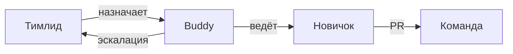

# Онбординг участника проекта

<div class="article-tags">
  <span class="tag tag-required">ОБЯЗАТЕЛЬНО</span>
  <span class="tag tag-beginner">ДЛЯ НОВИЧКОВ</span>
</div>

<span class="complexity-badge">Разработчику</span>
<span class="complexity-badge">Руководителю</span>

---

## Два сценария входа

| Сценарий | Вы фокусируетесь на |
|----------|---------------------|
| **Запускаете проект с нуля** | [Раздел 7.17](./intro) целиком — charter, инфраструктура, архитектура |
| **Входите в существующую команду** | Эта статья + [онбординг-пакет](/encyclopedia/7-project/7-09-bazy-znaniy-i-zadachniki/24) |

**Онбординг** — упорядоченный маршрут с наставником (buddy) и проверяемыми шагами. Цель — чтобы человек стал **продуктивным** (сам закрывает типовые задачи с предсказуемым качеством), а не просто получил доступы.

"Прочитай wiki на 500 страниц" без структуры, сроков и проверки — онбордингом не считается. Это архив, а не маршрут.

<div class="callout callout--tip">
  <div class="callout-title">Критерий успешного онбординга</div>

  <div class="callout-body">
  К концу второй недели новичок:

  <ul>
    <li>поднимает среду локально без помощи;</li>
    <li>закрыл минимум один PR с ревью;</li>
    <li>знает, к кому идти с вопросами по домену, процессу и коду;</li>
    <li>участвует в ритме команды (дейли, ретро, планирование).</li>
  </ul>
  </div>
</div>

---

## Программа buddy

**Buddy** (наставник) — опытный участник команды, назначенный на 2–4 недели помогать новичку. Не замена тимлида и не HR: buddy отвечает за **ежедневную навигацию** по проекту.

### Роль buddy

| Обязанность buddy | Не обязанность buddy |
|-------------------|----------------------|
| 30–60 мин intro в день 1 | Оценка зарплаты и KPI |
| Ответы на вопросы в первые 2 недели | Ревью каждой строки кода вместо команды |
| Парное прохождение одного модуля | Решение конфликтов с заказчиком |
| Проверка, что чек-лист онбординга закрыт | Замена тимлида в управлении |

### Как назначить buddy

- Выберите человека с **терпением** и знанием кодовой базы, не обязательно самого сеньора.
- Снизьте нагрузку buddy на 20–30% в первые две недели (явно в плане спринта).
- Дайте buddy **чек-лист** (см. ниже) и право эскалировать блокеры тимлиду.
- Ротация: один buddy — не больше двух новичков одновременно.

### Чек-лист buddy по неделям

| Неделя | Buddy делает | Новичок делает |
|--------|--------------|----------------|
| 1 | Intro, доступы, обзор архитектуры | Локальная среда, первый мелкий PR |
| 2 | Разбор legacy-модуля, ревью подхода | 2–3 задачи растущей сложности |
| 3 | Снимает ежедневные синки, остаётся на связи | Самостоятельные задачи |
| 4 | Фидбек-сессия с тимлидом | Полноценный участник потока |



### Программа buddy для тимлида

1. До выхода новичка: назначить buddy, подготовить тикет ONBOARD-001 с чек-листом.
2. День 1: buddy + тимлид на intro (роли, ожидания, ритм).
3. Еженедельно: 15 мин sync тимлид ↔ buddy ↔ новичок.
4. Конец 4-й недели: формальное "выпускание" — buddy переходит в режим обычного коллеги.

---

## Первый день

| Шаг | Действие | Результат | Время |
|-----|----------|-----------|-------|
| 1 | Доступы: Git, трекер, wiki, чат, VPN | Чек-лист IT закрыт | 1–4 часа |
| 2 | Встреча с тимлидом и buddy | Роли, ритм, ожидания | 30–60 мин |
| 3 | [Онбординг-пакет](/encyclopedia/7-project/7-09-bazy-znaniy-i-zadachniki/24) | Среда поднята локально | 2–4 часа |
| 4 | Одна **мелкая** задача | Первый PR | до конца дня 2 |

Не назначайте критичный модуль в день один без ревью архитектуры. Первый PR — документация, мелкий баг, правка конфига, тест к существующему коду.

### Чек-лист доступов

| Система | Для чего | Кто выдаёт |
|---------|----------|------------|
| Git (GitHub/GitLab) | Код, PR | DevOps / тимлид |
| Трекер (Jira/YouTrack) | Задачи | PM |
| Wiki (Confluence) | Процессы, архитектура | PM / buddy |
| Чат (Slack/Teams) | Коммуникация | IT |
| VPN / jump host | Доступ к stage | DevOps |
| CI (просмотр пайплайнов) | Статус сборок | DevOps |
| Секреты (.env шаблон) | Локальный запуск | Buddy |

---

## Первая неделя

Структура недели для разработчика (QA и аналитик — см. [онбординг по ролям](#онбординг-по-ролям)):

| День | Фокус |
|------|-------|
| 1 | Доступы, intro, онбординг-пакет |
| 2 | Первый PR (мелкая задача) |
| 3 | Участие в дейли, вторая задача |
| 4 | Чтение ADR и C4 context |
| 5 | Парный разбор модуля с buddy, ретро-фидбек |

Обязательные элементы недели:

- участие в **дейли** или async-стендап ([111](/encyclopedia/7-project/7-02-komanda-i-upravlenie/111));
- **2–3 задачи** с нарастающей сложностью;
- чтение **ADR** и диаграммы контекста ([архитектура](./5));
- парный разбор **одного** legacy-модуля, если проект не greenfield ([легаси](/encyclopedia/7-project/7-11-legasi-kod/intro));
- **обратная связь** от buddy в конце недели (15–30 мин, структурированно).

### Вопросы для фидбека в конце недели 1

- Что было непонятнее всего?
- Где документация устарела или отсутствует?
- Достаточно ли был доступен buddy?
- Какая задача следующая по сложности?

---

## Шаблон первого Pull Request

Первый PR задаёт тон. Используйте шаблон в репозитории и заполните все поля.

```markdown
## Тикет
PROJ-142 — исправить опечатку в README онбординга

## Что изменилось
- Исправлена команда запуска тестов (было `npm test`, стало `npm run test`)
- Добавлена ссылка на wiki-раздел "Среды"

## Почему
Новички падали на шаге 3 онбординг-пакета (см. комментарий в PROJ-142).

## Как проверить
1. Клонировать репо
2. `npm install && npm run test` — зелёные тесты
3. Открыть README — ссылка ведёт на wiki

## Скриншоты
(для UI — обязательно; для docs — не нужны)

## Чек-лист
- [ ] CI зелёный
- [ ] Тикет указан в названии ветки
- [ ] Запросил ревью у buddy или CODEOWNERS
```

### Ветка и коммиты

1. Ветка `PROJ-NNN-short-description` ([Git workflow](/encyclopedia/4-code-dev/4-13-osnovy-raboty-s-git/112)).
2. Коммиты с понятными сообщениями: `PROJ-142 fix test command in README`.
3. Один PR — одна логическая цель; первый PR — **до 100 строк** идеально.
4. **CI зелёный** до запроса review.
5. Ответ на комментарии с **пояснением**, не одним словом "исправил".

### Культура ревью первого PR

| Для новичка | Для ревьюера |
|-------------|--------------|
| Не воспринимать замечания как личную критику | Тон обучающий, не придирки |
| Задавать вопросы, если комментарий непонятен | Объяснять "почему", не только "как" |
| Показать PR buddy до официального review | Быстрый первый отклик (в тот же день) |

Культура ревью — [Культура кода](/encyclopedia/7-project/7-10-kultura-koda/intro). Политика [ИИ в процессе](/encyclopedia/7-project/7-24-ii-v-proektnom-protsesse/1) — если в команде используют Copilot, прочитайте до первого PR.

---

## Онбординг по ролям

Общий каркас (день 1, buddy, первый PR) одинаков. Ниже — **дополнительные** шаги по роли.

### Разработчик

| Неделя | Активность | Артефакт |
|--------|------------|----------|
| 1 | Локальная среда, первый PR | PR в main через review |
| 2 | Задача с API или UI под присмотром | Покрытие тестами по DoD |
| 3 | Участие в code review чужих PR | Минимум 2 ревью |
| 4 | Задача средней сложности самостоятельно | Закрытый тикет без эскалации |

Дополнительно: [Культура кода](/encyclopedia/7-project/7-10-kultura-koda/1), [Git](/encyclopedia/4-code-dev/4-13-osnovy-raboty-s-git/intro), ADR по стеку.

### QA / тестировщик

| Неделя | Активность | Артефакт |
|--------|------------|----------|
| 1 | Доступ к stage, тест-кейсы онбординга | Чек-лист "среда работает" |
| 2 | Регресс одной области с buddy | Баг-репорты в трекере |
| 3 | Написание/обновление тест-кейсов | 5+ кейсов в репозитории тестов |
| 4 | Участие в приёмке story | Sign-off по AC |

Дополнительно: [Добро пожаловать в тестирование](/encyclopedia/7-project/7-05-testirovanie/100), доступ к тестовым данным и политика [багов](/encyclopedia/7-project/7-05-testirovanie/intro).

### Бизнес-аналитик

| Неделя | Активность | Артефакт |
|--------|------------|----------|
| 1 | Глоссарий, BPMN ключевого процесса | Конспект встречи с PO |
| 2 | Одна story с AC под ревью PO | Story в backlog |
| 3 | Участие в уточнении с заказчиком | Протокол требований |
| 4 | Связка story ↔ тест-кейс | Трассировка в трекере |

Дополнительно: [Аналитика — intro](/encyclopedia/7-project/7-04-analitika/intro), доступ к заказчику (согласованный с PM).

### Тимлид (новый на проекте)

| Неделя | Активность | Артефакт |
|--------|------------|----------|
| 1 | Карта рисков, 1:1 с каждым | Список блокеров |
| 2 | Ревью ADR и CI | План улучшений |
| 3 | Ритм ретро и планирования | Согласованный процесс |
| 4 | Онбординг следующего человека (через buddy) | Обновлённый онбординг-пакет |

Дополнительно: [Первые 90 дней](/encyclopedia/7-project/7-02-komanda-i-upravlenie/141).

### DevOps / SRE

| Неделя | Активность | Артефакт |
|--------|------------|----------|
| 1 | Схема сред, доступы, runbook деплоя | Диаграмма infra |
| 2 | Один деплой на stage с buddy | Запись в runbook |
| 3 | Алерты и дашборды | Базовый мониторинг |
| 4 | Участие в инцидент-учении | Postmortem-шаблон |

---

## Удалённый онбординг

Если команда [распределённая](/encyclopedia/7-project/7-23-udalennaya-komanda/1), обычного "покажу за соседним столом" нет. Нужны явные правила.

### Дополнения к онбордингу remote

| Элемент | Офис | Remote |
|---------|------|--------|
| Intro с buddy | Устно у доски | Видеозвонок 60 мин + запись |
| Парное программирование | Рядом | Screen share, VS Code Live Share |
| Вопросы | Перекрикнуть | Выделенный чат `#proj-onboarding` |
| Документация | "Спроси" | Обязательна и с датой обновления |
| Социализация | Обед | Виртуальный кофе 15 мин |

### Часовые пояса

- Зафиксируйте **core hours** — 3–4 часа пересечения для синхронных встреч.
- Дейли в core hours; остальное — async-обновления в треде.
- Buddy в **близком** часовом поясе (+/- 3 часа), иначе новичок ждёт ответы сутки.
- Первый PR не ставьте дедлайн "к вечеру по Калифорнии", если новичок в Москве.

### Async-стендап для новичка (шаблон)

```markdown
**Вчера**: поднял БД локально, застрял на миграции v14
**Сегодня**: созвон с buddy в 14:00 MSK, закрыть PROJ-150
**Блокеры**: нет доступа к vault секретов stage
```

<div class="callout callout--info">
  <div class="callout-title">Оборудование и связь</div>

  <div class="callout-body">
  Для удалённого онбординга в первый день проверьте: стабильный интернет, гарнитура, камера (желательно), доступ к корпоративному VPN. IT-чек-лист выдаётся <strong>до</strong> даты выхода, не в день один.
  </div>
</div>

### Неделя 1 remote — календарь

| Событие | Когда | Длительность |
|---------|-------|--------------|
| Welcome с тимлидом | День 1, core hours | 30 мин |
| Buddy deep-dive (архитектура) | День 1–2 | 60 мин |
| Парная сессия (среда) | День 2–3 | 90 мин |
| Office hours buddy | Ежедневно | 30 мин слот |
| Фидбек недели | Пятница | 30 мин |

---

## Ошибки онбординга

| Ошибка | Почему больно | Как исправить |
|--------|---------------|---------------|
| Wiki без даты и владельца | Новичок следует устаревшим шагам | Владелец страницы + "обновлено DD.MM" |
| Нет buddy | Вопросы теряются в общем чате | Назначить buddy до дня 1 |
| Первый PR на 2000 строк | Ревью неделю, демотивация | Разбить или согласовать дизайн заранее |
| Игнор часовых поясов | Новичок неделю без ответов | Core hours, buddy в близком TZ |
| Нет задачи в день 1–2 | Человек "сидит без дела" | Тикет ONBOARD готов заранее |
| Онбординг только для dev | QA/BA теряются | Ролевые чек-листы |
| Нет фидбека в конце недели 1 | Повторяют те же ошибки в процессе | 15 мин структурированный разговор |

---

## Шаблон тикета ONBOARD для тимлида

Создайте в трекере до выхода сотрудника:

```markdown
## ONBOARD: [Имя], [Роль], [Дата выхода]

### До выхода
- [ ] Доступы запрошены (Git, Jira, wiki, VPN)
- [ ] Buddy назначен: @username
- [ ] Первая задача: PROJ-___ (мелкая, до 4ч)
- [ ] Встречи в календаре: intro, buddy sessions

### Неделя 1
- [ ] Онбординг-пакет пройден
- [ ] Первый PR merged
- [ ] ADR и C4 прочитаны
- [ ] Фидбек с buddy

### Неделя 2–4
- [ ] 2+ PR без критических замечаний по процессу
- [ ] Участие в ритме команды
- [ ] Выпускание: дата ___
```

---

## Первый месяц — ожидания по ролям

| Роль | К концу месяца 1 | К концу месяца 3 |
|------|------------------|------------------|
| Junior dev | 3–5 PR, типовые задачи с ревью | Средние задачи, ревью чужих PR |
| Middle dev | Самостоятельные фичи | Менторство junior, участие в ADR |
| QA | Регресс области, 10+ кейсов | Автотесты, приёмка релиза |
| BA | 5+ stories с AC | Воркшопы с заказчиком, BPMN |
| Аутстафф | Соблюдение процессов команды | Те же ожидания, что у штатного |

Тимлид фиксирует ожидания в 1:1 в **первую неделю**, не через месяц "внезапно".

---

## Инструменты buddy

| Ситуация | Инструмент | Заметка |
|----------|------------|---------|
| Показать код | Screen share, Live Share | Запись по согласию |
| Быстрый вопрос | Личный чат или `#onboarding` | Ответ в течение core hours |
| Разбор архитектуры | Wiki + ADR + 30 мин созвон | Не только устно |
| Первый PR | Комментарии в Git | Тон обучающий |
| Блокер по доступам | Эскалация тимлиду в тот же день | Не ждать неделю |

---

## Чек-лист удалённого онбординга для HR и IT

Выдаётся **за 3 рабочих дня** до выхода:

- [ ] Корпоративная почта и чат
- [ ] VPN / SSO инструкция с скриншотами
- [ ] Ноутбук или компенсация (для контрактников)
- [ ] Гарнитура
- [ ] Приглашения в календарь: intro, buddy, core hours
- [ ] Контакт buddy и тимлида в письме welcome

---

## FAQ

**Кто buddy — тимлид?**

Обычно нет. Тимлид подключается на эскалации. Buddy — рядовой опытный разработчик/QA с хорошей коммуникацией.

**Сколько длится онбординг?**

Формально buddy-программа — 2–4 недели. Полная продуктивность на сложных доменах — 1–3 месяца. Это нормально.

**Что если первый PR завалили ревью?**

Нормально. Цель первого PR — научить процессу, не блеснуть. Исправьте, спросите buddy, не сдавайтесь.

**Нужен ли онбординг для опытного сеньора?**

Да, но короче: акцент на домен, ADR, политики репо и контакты. Не пропускайте intro с тимлидом — сеньор без контекста принимает решения, которые конфликтуют с ADR.

**Как онбордить аутстафф?**

Те же чек-листы, но явно: каналы эскалации, границы ответственности, NDA, доступы только к нужным репо. Buddy из штатной команды обязателен.

**Remote без ever meeting — реально?**

Для полного онбординга — плохая идея. Минимум: intro по видео, одна парная сессия, фидбек по видео. Дальше можно больше async.

---

## Что дальше

Углубляйтесь в роль через маршруты разделов [7.04 Аналитика](/encyclopedia/7-project/7-04-analitika/intro), [7.05 Тестирование](/encyclopedia/7-project/7-05-testirovanie/intro), [7.10 Культура кода](/encyclopedia/7-project/7-10-kultura-koda/intro). Диагностика проекта — [чек-лист 7.17](./999).

---
