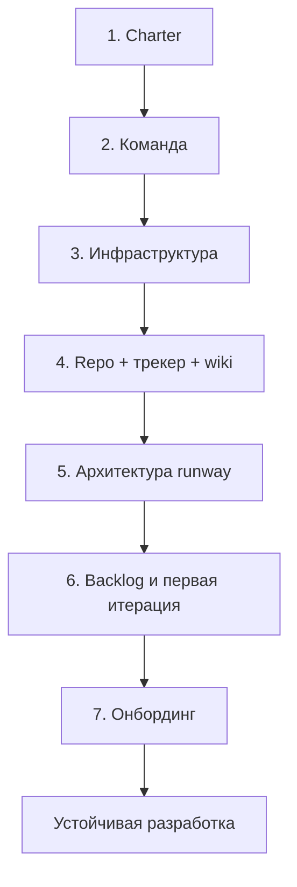

# Начало работы на проекте — итоги раздела

  ОБЯЗАТЕЛЬНО
  ДЛЯ НОВИЧКОВ

---

## Главное за семь глав

1. **Charter и границы** — письменные договорённости до кода и найма. Без scope in/out — scope creep и споры с заказчиком.
2. **Команда и RACI** — ядро 5–7 человек с явными владельцами решений, а не 15 разработчиков без процесса.
3. **Среды и доступы** — dev + stage до активной разработки; секреты вне репозитория; известен контакт администрирования.
4. **Git + трекер + wiki** — единый контур: задача в трекере, код в PR, решения в ADR/wiki.
5. **Architecture runway** — C4 context/container, NFR-таблица, 5–10 ADR по стеку и интеграциям.
6. **Backlog и первый инкремент** — roadmap на 3 месяца, thin slice на stage, DoR/DoD согласованы.
7. **Онбординг людей** — buddy, ONBOARD-тикет, первый PR за 1–2 недели.

Проверка готовности — [чек-лист 999](./999). Вводная — [о разделе](./intro).

---

## Цепочка запуска

| Шаг | Материал | Ключевые артефакты | Ориентир |
|-----|----------|--------------------|----------|
| 1 | [От идеи к старту](./1) | Charter, спонсор, scope in/out, критерии успеха | 3–10 дней |
| 2 | [Команда, роли и найм](./2) | RACI, план найма, ядро ролей | 2–8 недель |
| 3 | [Инфраструктура и доступы](./3) | Dev/stage, VPN, секреты, runbook IT | 1–2 недели |
| 4 | [Репозиторий, трекер и wiki](./4) | Repo, CI на PR, доска, wiki-онбординг | 3–7 дней |
| 5 | [Архитектура на старте](./5) | C4 L1–2, NFR, ADR, глоссарий | 1–2 недели |
| 6 | [План и первые задачи](./6) | Roadmap, backlog, sprint 0 / thin slice | 1–2 недели |
| 7 | [Онбординг участника](./7) | Buddy, ONBOARD-тикет, первый PR | 2–4 недели на человека |

---

## Два сценария входа

| Сценарий | Маршрут | С чего начать |
|----------|---------|---------------|
| **Greenfield** — проект с нуля | Шаги 1 → 7 по порядку | [Глава 1](./1), charter на одной странице |
| **Onboarding** — вход в существующую команду | [Глава 7](./7) + [онбординг-пакет](/encyclopedia/7-project/7-09-bazy-znaniy-i-zadachniki/24) | Buddy в день первый, [чек-лист 999](./999) для оценки зрелости |

  
Уже пишете код, но хаос

  

  Не обязательно идти с шага 1. Откройте <a href="./999">чек-лист 999</a>, отметьте пробелы и закройте их по таблице провалов ниже. Charter и RACI можно догнать за 2–3 дня, если спонсор доступен.
  

---

## Маршруты по роли

| Роль | Обязательно на старте | Можно отложить на 2–4 недели |
|------|----------------------|------------------------------|
| **PM / руководитель** | [1](./1), [2](./2), [4](./4), [6](./6), [999](./999) | Глубокий C4 (делегировать архитектору) |
| **Архитектор / техлид** | [3](./3), [4](./4), [5](./5), [6](./6) | Найм (участвовать в техсобеседованиях) |
| **Разработчик** | [4](./4), [7](./7), [Git](/encyclopedia/4-code-dev/4-13-osnovy-raboty-s-git/intro) | Charter (достаточно краткого brief) |
| **Аналитик** | [1](./1) (границы), [5](./5), [6](./6) | Инфраструктура (знать контакты) |
| **QA** | [4](./4), [6](./6) (DoR/DoD), [7](./7) | WBS (если не госконтракт) |
| **DevOps** | [3](./3), [4](./4) (CI) | Story mapping |

---

## Что должно быть к концу первого месяца

| Область | Минимум | Красный флаг |
|---------|---------|--------------|
| Управление | Charter, спонсор, RACI по ключевым решениям | Нет письменных границ scope |
| Инструменты | Repo + CI на PR + трекер + wiki-онбординг | Код в личных ветках без review |
| Архитектура | C4 context, ADR по стеку и БД, NFR-таблица | Каждый модуль на разном стеке |
| Поставка | Roadmap 3 мес., первая thin slice на stage | 4 недели без демо |
| Люди | Buddy для новичков, DoR/DoD согласованы | Первый PR на тысячи строк |

Подробная самопроверка — [чек-лист 999](./999).

---

## Тип заказчика и акценты

| Тип проекта | Дополнительный акцент | Соседний материал |
|-------------|----------------------|-------------------|
| Стартап / продукт | Thin slice, Scrum, минимум формализма | [Продуктовые роли](/encyclopedia/7-project/7-19-produktovye-roli/intro) |
| Enterprise / интеграция | NFR, ADR, согласование с ИБ | [Проектирование](/encyclopedia/7-project/7-06-proektirovanie-i-arhitektura/intro) |
| Госконтракт | WBS, ТЗ по ГОСТ, трассировка | [Техническое письмо](/encyclopedia/7-project/7-08-tehnicheskoe-pismo/intro) |
| Аутстафф в чужую команду | Онбординг, культура кода, границы задач | [Культура кода](/encyclopedia/7-project/7-10-kultura-koda/intro) |
| Удалённая команда | Buddy remote, core hours | [Удалённая команда](/encyclopedia/7-project/7-23-udalennaya-komanda/intro) |

---

## Типичные провалы на старте

| Провал | На каком шаге лечится | Профилактика |
|--------|----------------------|--------------|
| Код без charter | [1](./1) | Не открывать repo до границ scope |
| Нет CI с первого PR | [4](./4) | CI в sprint 0 / первая неделя |
| Архитектура в голове одного человека | [5](./5) | C4 + ADR в Git |
| Backlog = список технических задач | [6](./6) | Story mapping, thin slice |
| Новичок неделю без buddy | [7](./7) | ONBOARD-тикет до выхода |
| Госконтракт без связи ТЗ и backlog | [5](./5), [6](./6) | Матрица трассировки |
| Секреты в репозитории | [3](./3) | Vault / переменные CI, pre-commit hook |
| Задачи только в чате | [4](./4) | Правило: нет тикета — нет работы |

  
Самый дорогой провал

  

  Команда месяц пишет код без демо на stage и без связи с backlog. Исправление — остановить новые фичи, собрать thin slice за 1–2 недели, показать стейкхолдерам. Подробнее — <a href="./6">глава 6</a>.
  

---

## Куда дальше в энциклопедии

| Тема | Раздел |
|------|--------|
| Основы управления | [7.02 Команда и управление](/encyclopedia/7-project/7-02-komanda-i-upravlenie/intro) |
| Scrum / Kanban / выбор процесса | [7.03 Методологии](/encyclopedia/7-project/7-03-metodologiya-i-zhiznennyy-tsikl-po/4) |
| Jira, YouTrack, wiki | [7.09 Базы знаний и задачники](/encyclopedia/7-project/7-09-bazy-znaniy-i-zadachniki/intro) |
| Глубокое проектирование | [7.06 Проектирование и архитектура](/encyclopedia/7-project/7-06-proektirovanie-i-arhitektura/intro) |
| ADR и архитектурная память | [7.20 ADR](/encyclopedia/7-project/7-20-adr-i-arhitekturnaya-pamyat/intro) |
| DoR / DoD | [7.25 Готовность](/encyclopedia/7-project/7-25-dostavka-i-gotovnost/intro) |
| DevOps и CI/CD | [8.04 DevOps](/encyclopedia/8-infra-security/8-04-devops-ci-cd/intro) |
| Git и PR | [4.13 Основы Git](/encyclopedia/4-code-dev/4-13-osnovy-raboty-s-git/intro) |
| Управление изменениями scope | [7.22 Управление изменениями](/encyclopedia/7-project/7-22-upravlenie-izmeneniyami/intro) |
| Онбординг-пакет (шаблон) | [7.09/24](/encyclopedia/7-project/7-09-bazy-znaniy-i-zadachniki/24) |

---

## FAQ

  
Вопрос. Можно ли начать кодить до Jira и CI?

  
Ответ. На прототипе одного человека — да. В команде <strong>без трекера и CI</strong> теряются задачи и качество. Минимум — repo + трекер + lint в CI в первую неделю. Подробнее — <a href="./4">глава 4</a>.

  
Вопрос. Можно ли пропустить charter и сразу открыть репозиторий?

  
Ответ. Технически да, практически — получите scope creep и споры. Минимум: одностраничный charter из <a href="./1">главы 1</a>: цель, scope in/out, спонсор, критерии успеха.

  
Вопрос. Сколько времени занимает полный цикл 7.17?

  
Ответ. Для команды 5–8 человек — <strong>4–8 недель</strong> до устойчивого ритма (демо, CI, онбординг). Госконтракт с ТЗ добавляет 2–4 недели на формальные документы.

  
Вопрос. Раздел только для greenfield?

  
Ответ. Нет. <a href="./7">Глава 7</a> и <a href="./999">чек-лист 999</a> — для любого проекта. Главы 1–6 полезны при реанимации хаотичного старта.

  
Вопрос. Где граница между 7.17 и 7.06 (архитектура)?

  
Ответ. 7.17 — <strong>когда и что минимум</strong> на старте (runway, C4 L1–2, ADR). 7.06 — <strong>как проектировать</strong> глубже: паттерны, DDD, интеграции.

  
Вопрос. Нужен ли раздел аутстаффу?

  
Ответ. Да: <a href="./7">глава 7</a>, <a href="/encyclopedia/7-project/7-10-kultura-koda/intro">культура кода</a>, <a href="./4">глава 4</a> — как устроены PR и трекер в конкретной команде.

  
Вопрос. Кто должен быть первым в команде?

  
Ответ. Спонсор + PO/PM, затем техлид. Разработчиков нанимают после repo, backlog с DoR и CI. Порядок — <a href="./2">глава 2</a>.

  
Вопрос. Sprint 0 — это отдельный спринт без ценности?

  
Ответ. Нет. Sprint 0 — <strong>инфраструктура и thin slice</strong> с демо на stage. Цель: пользователь видит первый сценарий, а не только настроенный Jenkins. См. <a href="./6">глава 6</a>.

  
Вопрос. Сколько ADR нужно на старте?

  
Ответ. Ориентир — <strong>5–10</strong> записей: стек, БД, аутентификация, интеграции, логирование. Не 200 страниц ТЗ. Шаблон — <a href="/encyclopedia/7-project/7-20-adr-i-arhitekturnaya-pamyat/1">ADR 7.20</a>.

  
Вопрос. PO и PM — одно лицо или разные?

  
Ответ. На MVP часто <strong>совмещают</strong>, если RACI явный: кто приоритизирует backlog, кто отчитывается спонсору. При росте — разделить. См. <a href="./2">глава 2</a>, <a href="/encyclopedia/7-project/7-19-produktovye-roli/intro">продуктовые роли</a>.

  
Вопрос. Когда поднимать prod?

  
Ответ. Перед <strong>первым пилотом</strong> с реальными пользователями. До этого достаточно dev + stage. Отладка на prod — только по runbook. См. <a href="./3">глава 3</a>.

  
Вопрос. Как понять, что онбординг удался?

  
Ответ. К концу 2-й недели новичок поднимает среду сам, закрыл PR с ревью, знает контакты по домену и процессу. Чек-лист — <a href="./7">глава 7</a>, <a href="./999">999</a> (блок Онбординг).

  
Вопрос. Scrum или Kanban на старте?

  
Ответ. Новый продукт с неопределённостью — чаще <strong>Scrum</strong> (sprint 0, thin slice). Support и смешанный поток — <strong>Kanban</strong>. Сравнение — <a href="/encyclopedia/7-project/7-03-metodologiya-i-zhiznennyy-tsikl-po/4">как выбрать процесс</a>.

---

## Следующий шаг

| Ваша ситуация | Действие |
|---------------|----------|
| Запускаете проект | [Глава 1](./1) — charter на одной странице |
| Уже пишете код, хаос | [Чек-лист 999](./999) → закрыть пробелы |
| Выходите в команду | [Глава 7](./7) + buddy в день первый |
| Нужна глубина по архитектуре | [7.06 Проектирование](/encyclopedia/7-project/7-06-proektirovanie-i-arhitektura/intro) |

---
