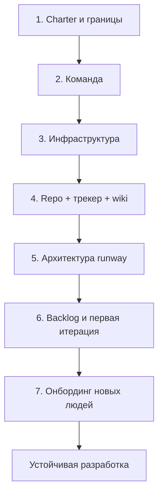

import DocCardList from '@theme/DocCardList';

# О разделе "Начало работы на проекте"

Проект в IT начинается **до первой строки кода** — с идеи, спонсора, договорённостей, команды, инфраструктуры и инструментов. Раздел описывает **полный цикл запуска**: от charter и найма до репозитория, трекера, wiki, архитектурного эскиза, декомпозиции и первых задач в потоке. Отдельная глава — **онбординг** человека, который присоединяется к уже идущему проекту.

Здесь два пересекающихся сценария:

- **Greenfield** — проект с нуля; проходите раздел по порядку от [шага 1](./1) до [шага 7](./7).
- **Onboarding** — вы входите в существующую команду; начните с [онбординга](./7) и [онбординг-пакета](/encyclopedia/7-project/7-09-bazy-znaniy-i-zadachniki/24), остальное — по мере необходимости.

  
Для кого этот раздел

  

  <strong>Руководителю и PM</strong> — чек-лист запуска, RACI, риски "начали кодить без среды", выбор Scrum/Kanban, первый roadmap.

  <strong>Архитектору и тимлиду</strong> — architecture runway, C4, NFR, ADR с первого дня, CI-скелет, разграничение с аналитикой.

  <strong>Новичку в команде</strong> — buddy-программа, первый день и неделя, шаблон первого PR; см. также [онбординг-пакет](/encyclopedia/7-project/7-09-bazy-znaniy-i-zadachniki/24).

  <strong>Аналитику на старте</strong> — связка stories, BPMN и техдизайна; в госконтракте — трассировка к ТЗ по ГОСТ.
  

---

## Маршрут по разделу

Полная таблица шагов с содержанием, артефактами и типичными сроками для команды 4–8 человек.

| Шаг | Материал | Содержание | Ключевые артефакты | Ориентир по сроку |
|-----|----------|------------|--------------------|-------------------|
| 1 | [От идеи к старту](./1) | Charter, спонсор, границы scope, бюджет, риски | Устав, RACI, критерии успеха | 3–10 дней |
| 2 | [Команда, роли и найм](./2) | Состав, RACI, подбор, аутстафф и штат | Матрица ролей, план найма | 2–8 недель |
| 3 | [Инфраструктура и доступы](./3) | Среды, ПО, VPN, секреты, администрирование | Dev/stage/prod, чек-лист IT | 1–2 недели |
| 4 | [Репозиторий, трекер и wiki](./4) | Git, Jira/YouTrack, Confluence, CI-скелет | Repo, доска, wiki-разделы | 3–7 дней |
| 5 | [Архитектура на старте](./5) | Runway, C4, NFR, ADR, аналитик и архитектор | C4 L1–2, 5–10 ADR, глоссарий | 1–2 недели |
| 6 | [План и первые задачи](./6) | Roadmap, WBS, story mapping, sprint 0 / thin slice | Backlog, sprint goal, демо | 1–2 недели |
| 7 | [Онбординг участника](./7) | Buddy, первый день, PR, remote, по ролям | ONBOARD-тикет, первый PR | 2–4 недели на человека |
| 8 | [Итоги](./998) | Резюме раздела и типичные провалы | — | 15 мин чтения |
| 9 | [Чек-лист самопроверки](./999) | Готов ли проект к устойчивой разработке | Заполненный чек-лист | 30 мин |

Перед шагом **1** полезно пройти [Основы управления IT-проектами](/encyclopedia/7-project/7-02-komanda-i-upravlenie/1). Выбор процесса (Scrum, Kanban, Waterfall) — [Как выбрать процесс](/encyclopedia/7-project/7-03-metodologiya-i-zhiznennyy-tsikl-po/4).

---

## Маршруты по роли

Не обязательно читать всё подряд. Ниже — сжатые треки.

| Роль | Обязательно на старте | Можно отложить на 2–4 недели |
|------|----------------------|------------------------------|
| **PM / руководитель** | 1, 2, 4, 6, 9 | Глубокий C4 (делегировать архитектору) |
| **Архитектор / техлид** | 3, 4, 5, 6 | Найм (участвовать в техсобеседованиях) |
| **Разработчик** | 4, 7, [Git](/encyclopedia/4-code-dev/4-13-osnovy-raboty-s-git/intro) | Charter (достаточно краткого brief) |
| **Аналитик** | 1 (границы), 5 (разграничение), 6 (stories) | Инфраструктура (знать контакты) |
| **QA** | 4, 6 (DoR/DoD), 7 | WBS (если не госконтракт) |
| **DevOps** | 3, 4 (CI) | Story mapping |

  
Новичок в существующей команде

  

  Маршрут: <a href="./7">Онбординг участника</a> → <a href="/encyclopedia/7-project/7-09-bazy-znaniy-i-zadachniki/24">Онбординг-пакет</a> → <a href="./5">Архитектура</a> (ADR и C4) → <a href="./999">Чек-лист 999</a> для понимания зрелости проекта.

  Шаги 1–3 читайте выборочно, если нужно понять историю и договорённости с заказчиком.
  

---

## Что должно быть к концу первого месяца

Контрольный список для самопроверки руководителя и техлида (подробнее — [чек-лист 999](./999)):

| Область | Минимум | Красный флаг |
|---------|---------|--------------|
| Управление | Charter, спонсор, RACI по ключевым решениям | Нет письменных границ scope |
| Инструменты | Repo + CI на PR + трекер + wiki-онбординг | Код в личных ветках без review |
| Архитектура | C4 context, ADR по стеку и БД, NFR-таблица | Каждый модуль на разном стеке |
| Поставка | Roadmap 3 мес., первая thin slice на stage | 4 недели без демо |
| Люди | Buddy для новичков, DoR/DoD согласованы | Первый PR на тысячи строк |

---

## Тип заказчика и акценты

| Тип проекта | Дополнительный акцент в разделе | Соседний материал |
|-------------|--------------------------------|-------------------|
| Стартап / продукт | Thin slice, Scrum, минимум формализма | [Продуктовые роли](/encyclopedia/7-project/7-19-produktovye-roli/intro) |
| Enterprise / интеграция | NFR, ADR, согласование с ИБ | [Проектирование](/encyclopedia/7-project/7-06-proektirovanie-i-arhitektura/intro) |
| Госконтракт | WBS, ТЗ по ГОСТ, трассировка | [Техническое письмо](/encyclopedia/7-project/7-08-tehnicheskoe-pismo/intro) |
| Аутстафф в чужую команду | Онбординг, культура кода, границы задач | [Культура кода](/encyclopedia/7-project/7-10-kultura-koda/intro) |
| Удалённая команда | Buddy remote, core hours | [Удалённая команда](/encyclopedia/7-project/7-23-udalennaya-komanda/intro) |

---

## Соседние разделы

| Тема | Связь с запуском | Где углубляться |
|------|------------------|-----------------|
| Договор и бизнес-модель | Понимать, откуда бюджет и scope | [Общее о бизнесе](/encyclopedia/7-project/7-01-obschee-o-biznese/intro) |
| Scrum / Kanban | Ритм после первой итерации | [Scrum](/encyclopedia/7-project/7-14-scrum/intro), [Kanban](/encyclopedia/7-project/7-18-kanban/intro) |
| DevOps и CI/CD | Зрелость поставки | [DevOps](/encyclopedia/8-infra-security/8-04-devops-ci-cd/intro) |
| Git и PR | Ежедневная работа | [Основы Git](/encyclopedia/4-code-dev/4-13-osnovy-raboty-s-git/intro) |
| ADR | Память решений | [ADR и архитектурная память](/encyclopedia/7-project/7-20-adr-i-arhitekturnaya-pamyat/intro) |
| Управление изменениями | Когда scope меняется | [Управление изменениями](/encyclopedia/7-project/7-22-upravlenie-izmeneniyami/intro) |

---

## Типичные провалы на старте

Краткая карта рисков — полный разбор в [итогах](./998).

| Провал | На каком шаге лечится | Профилактика |
|--------|----------------------|--------------|
| Код без charter | 1 | Не открывать repo до границ scope |
| Нет CI с первого PR | 4 | CI в sprint 0 / первая неделя |
| Архитектура в голове одного человека | 5 | C4 + ADR в Git |
| Backlog = список технических задач | 6 | Story mapping, thin slice |
| Новичок неделю без buddy | 7 | ONBOARD-тикет до выхода |
| Госконтракт без связи ТЗ и backlog | 5, 6 | Матрица трассировки |

  
С чего начать прямо сейчас

  

  <ul>
    <li><strong>Запускаете проект</strong> — откройте <a href="./1">шаг 1</a> и заполните charter на одной странице.</li>
    <li><strong>Уже пишете код, но хаос</strong> — <a href="./999">чек-лист 999</a>, затем закройте пробелы по таблице выше.</li>
    <li><strong>Выходите в команду</strong> — <a href="./7">онбординг</a> и попросите buddy в день первый.</li>
  </ul>
  

---

## Частые вопросы о разделе

**Можно ли пропустить charter и сразу открыть репозиторий?**

Технически да, практически — получите scope creep и споры с заказчиком. Минимум: одностраничный charter из [шага 1](./1).

**Сколько времени занимает полный цикл 7.17?**

Для команды 5–8 человек — 4–8 недель до устойчивого ритма (демо, CI, онбординг). Госконтракт с ТЗ добавляет 2–4 недели на формальные документы.

**Раздел только для greenfield?**

Нет. [Шаг 7](./7) и [чек-лист 999](./999) — для любого проекта. Шаги 1–6 полезны при реанимации хаотичного старта.

**Где граница между 7.17 и 7.06 (архитектура)?**

7.17 — **когда и что минимум** на старте. 7.06 — **как проектировать** глубже (паттерны, DDD, интеграции).

**Нужен ли раздел аутстаффу?**

Да: [шаг 7](./7), [культура кода](/encyclopedia/7-project/7-10-kultura-koda/intro), [шаг 4](./4) — как устроены PR и трекер в конкретной команде.

---

## Все статьи раздела

<DocCardList />

---
