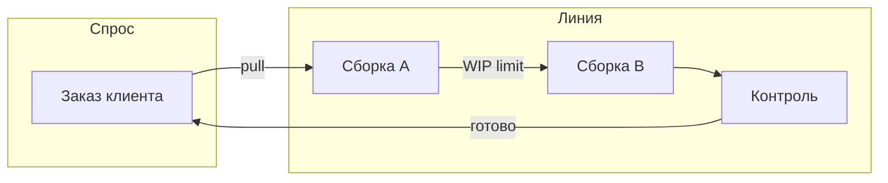
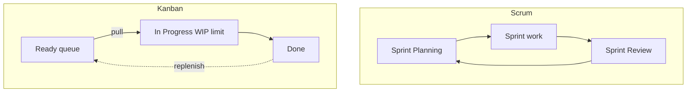

# История Kanban и отличие от Scrum

  ОБЯЗАТЕЛЬНО
  ДЛЯ НОВИЧКОВ

Руководителю

---

## Откуда взялось слово Kanban

**Kanban** (яп. 看板, "визуальная карточка") появился в **Toyota Production System** — системе бережливого производства Toyota. Идеи, которые пережили переход в IT:

- ограничить объём **незавершённой работы** на линии;
- **вытягивать** следующую операцию по реальному спросу, а не "запихивать" заготовки сверх мощности;
- **видеть** узкие места на доске с карточками;
- улучшать процесс **эволюционно**, а не одним большим реинжинирингом.

На заводе физическая карточка kanban давала сигнал: "можно произвести следующую партию деталей". В IT карточка — тикет в [Jira или YouTrack](/encyclopedia/7-project/7-09-bazy-znaniy-i-zadachniki/21), но логика та же: **сначала закончить важное, потом начинать новое**.

В IT метод систематизировали **David J. Anderson**, **Mike Burrows** и сообщество Kanban/Agile. Предмет труда изменился (код и задачи вместо деталей), принципы потока остались.

Нормативное описание практик — [Kanban Guide](https://kanbanguide.scrum.org/) (2022). Обзор Agile-семейства — в [методологии ЖЦ ПО](/encyclopedia/7-project/7-03-metodologiya-i-zhiznennyy-tsikl-po/intro).

---

## Toyota и pull-система

**Pull-система** на заводе: следующий участок **забирает** деталь, когда готов её обработать, а не когда предыдущий участок "вывалил" сотню заготовок в склад. Склад между участками — это **WIP без лимита**: кажется, что все заняты, но заказ клиента не ускорился.

Аналогия в разработке: менеджер назначил пять задач каждому разработчику. Все "в работе", но PR не мержатся, потому что ревьюеры перегружены. **WIP-лимит** и pull заставляют сначала довести две задачи до Done, потом брать третью.

---

## Путь Kanban в IT

| Год / период | Событие |
|--------------|---------|
| 2004–2010 | David J. Anderson — Kanban для knowledge work, Microsoft и другие кейсы |
| 2010 | Книга *Kanban* (Anderson) — WIP, классы обслуживания, метрики потока |
| 2013+ | Mike Burrows — *Kanban from the Inside*, STATIK, профили изменений |
| 2022 | [Kanban Guide](https://kanbanguide.scrum.org/) — общий язык с Scrum-сообществом |
| Сегодня | Kanban в dev, support, DevOps, marketing ops, HR |

IT-контекст добавил:

- **высокую вариативность** задач (инцидент рядом с эпиком);
- **немaterialный** результат (код, конфиг, документ);
- **удалённые команды** и цифровые доски;
- связь с [CI/CD](/encyclopedia/7-project/7-25-dostavka-i-gotovnost/intro) и [инцидентами](/encyclopedia/7-project/7-21-incidenty-i-ekspluatatsiya/intro).

---

## Kanban в IT — это не только доска в Jira

Колонки "To Do / In Progress / Done" сами по себе **не делают** команду Kanban. Метод включает шесть практик из [Kanban Guide](https://kanbanguide.scrum.org/):

1. **Визуализация** — вся работа видна на доске.
2. **WIP-лимиты** (Work In Progress) — сколько задач одновременно может быть "в работе".
3. **Управление потоком** — задачи **вытягивают** исполнители, когда есть свободная мощность.
4. **Явные политики** — когда карточка может перейти в следующую колонку ([DoR](/encyclopedia/7-project/7-25-dostavka-i-gotovnost/1), [DoD](/encyclopedia/7-project/7-25-dostavka-i-gotovnost/2)).
5. **Обратная связь** — регулярный разбор потока (replenishment, delivery review).
6. **Эволюционное улучшение** — процесс меняют по шагам, без "революции с понедельника".

  
Jira-board ≠ Kanban

  

  Типичная ловушка: в Jira выбрали тип доски "Kanban", но WIP не настроен, задачи назначают сверху, метрик нет. Это <strong>визуализация</strong>, не метод. Диагностика — <a href="./999">чек-лист</a>.

  

Подробный маршрут — в [разделе Kanban](./intro).

---

## Kanban и Scrum — в чём разница

[Scrum](/encyclopedia/7-project/7-14-scrum/intro) и Kanban решают схожую проблему — **как поставлять ценность итеративно** — но разными ритмами и акцентами.

| Параметр | Scrum | Kanban |
|----------|-------|--------|
| Ритм | Фиксированный **спринт** (1–4 недели) | **Непрерывный поток** |
| Планирование | Sprint Planning на начало спринта | Пополнение очереди (replenishment) по мере освобождения WIP |
| Роли | PO, Scrum Master, Developers ([7.14/2](/encyclopedia/7-project/7-14-scrum/2)) | Обязательных ролей в методе нет |
| Изменения в середине цикла | Ограничены договорённостями спринта | Допустимы по политикам потока и классам обслуживания |
| Главная метрика | Velocity (story points за спринт) | Lead time, cycle time, throughput ([глава 4](./4)) |
| Commitment | Sprint Goal | SLAs, классы обслуживания, WIP-лимиты |
| Ретроспектива | Обязательное событие спринта | Review потока (cadence на выбор команды) |

### Когда Scrum удобнее

- Новый продукт, нужен **ритм демо** и фиксированный инкремент.
- Стабильный PO, команда учится работать вместе.
- Заказчик ожидает "двухнедельные итерации" в договоре.

### Когда Kanban удобнее

- Поток **багов, фич и инцидентов** без предсказуемого ритма.
- Поддержка L2/L3, on-call, [эксплуатация](/encyclopedia/7-project/7-21-incidenty-i-ekspluatatsiya/intro).
- Команда зрелая, прерывания — норма, а не исключение.

**Scrumban** — гибрид: цели на спринт плюс WIP-лимиты внутри. Подробнее — [когда выбирать Kanban](./5).

---

## Kanban и каскад (Waterfall)

**Waterfall** (каскад) планирует крупные **фазы** заранее: требования → проектирование → разработка → тесты → внедрение. Kanban оптимизирует **текущий поток задач** внутри фазы и позволяет процессу эволюционировать.

| Аспект | Waterfall | Kanban |
|--------|-----------|--------|
| Единица планирования | Фаза, веха, Гант | Карточка, поток |
| Изменение scope | Change request, часто дорого | По политикам пополнения Ready |
| Прогноз сроков | Оценка экспертов на старте | Lead time / cycle time по факту |
| Визуализация | Диаграмма Ганта | Kanban-доска, CFD |

На регулируемых проектах фазы часто остаются в **договоре**, а внутри фазы команда работает Kanban или Scrum — это нормальный [гибрид](/encyclopedia/7-project/7-03-metodologiya-i-zhiznennyy-tsikl-po/4).

  
Гос и банк

  

  Внешний контракт может требовать этапы "ТЗ — разработка — ПСИ", но daily work команды — Kanban с WIP и метриками. Это не противоречие, если отчётность для заказчика собирается отдельно от операционной доски.

  

---

## Общие корни Lean и Agile

И Scrum, и Kanban опираются на **бережливое производство** и **эмпиризм**:

- убрать **потери** (ожидание, переключения, незавершёнка);
- **прозрачность** — видеть реальное состояние;
- **улучшение** на основе данных, а не только мнений.

Scrum упаковал это в **спринт, роли и события**. Kanban — в **поток, WIP и метрики времени**. Команды часто берут лучшее из обоих: Daily из Scrum, WIP из Kanban, Review из Scrum, CFD из Kanban.

---

## Исторический пример — от завода к helpdesk

Упрощённый кейс (по мотивам ранних IT-внедрений):

**Было:** команда поддержки закрывала тикеты "кто успел". Менеджер раздавал срочные сверху. Среднее время ответа росло, хотя "все заняты".

**Стало:** доска с колонками New → Triage → In Progress → Waiting Customer → Done. WIP In Progress = 4. Класс **expedite** для P1. **Pull** — инженер берёт из Triage, когда слот свободен.

**Результат через два месяца:** lead time для standard-тикетов снизился, потому что перестали копить 30 "in progress". P1 по-прежнему прерывают поток — но **один** expedite, с postmortem после закрытия.

Детали для support — [глава 7](./7).

---

## Мифы о Kanban

| Миф | Реальность |
|-----|------------|
| "В Kanban нет планирования" | Есть **replenishment** и приоритизация Ready; просто нет обязательного спринта |
| "Kanban только для поддержки" | Подходит и для продукта, особенно при частых прерываниях |
| "Без story points нельзя планировать roadmap" | Roadmap — на throughput и размере эпиков; операционный прогноз — на cycle time |
| "Kanban = без сроков" | **Fixed delivery date** — отдельный класс обслуживания |
| "WIP-лимит = простой" | Лимит заставляет **помогать завершать**, а не сидеть без дела |

---

## Когда имеет смысл читать этот раздел

- В потоке смешаны **фичи, баги и инциденты**.
- Спринты проводят "для отчёта", без рабочего инкремента ([Scrum-театр](/encyclopedia/7-project/7-14-scrum/999)).
- Нужен прогноз **"когда будет готово"** на основе фактического времени прохождения задач, а не только покерной оценки.
- Команда перегружена задачами "in progress", а Done — редкость.
- Вы настраиваете [задачник](/encyclopedia/7-project/7-09-bazy-znaniy-i-zadachniki/intro) и хотите понять, **зачем** WIP, а не только **как** нарисовать колонки.

---

## Сравнение трёх подходов одной задачей

Задача: "Исправить баг в оплате".

**Waterfall:** баг попадает в план следующей фазы "стабилизация", через три месяца.

**Scrum:** баг ждёт следующего спринта, если не сорвали Sprint Goal expedite-ом без правил.

**Kanban:** баг классифицируют (standard или expedite), кладут в Ready, команда **вытягивает** по WIP и политике. Cycle time попадает в статистику для похожих багов.

---

## Связь с метриками (предпросмотр)

Уже на этапе выбора метода полезно знать термины из [главы 4](./4):

- **Lead time** — сколько клиент ждал от заявки до fix в prod.
- **Cycle time** — сколько команда реально работала над fix.
- **Throughput** — сколько багов закрыли за неделю при текущем WIP.

Kanban не требует velocity; он требует **честного потока** и измерения времени.

---

## Практическое упражнение

1. Откройте доску команды за последний месяц.
2. Посчитайте задачи, которые **начали**, но не **закончили**.
3. Сравните с числом разработчиков.
4. Если WIP >> людей — вы уже кандидат на Kanban с лимитами, даже если процесс называется Scrum.

---

## Хронология Kanban в IT (расширенная)

| Период | Автор / событие | Вклад |
|--------|-----------------|-------|
| 1940–1970 | Toyota, Taiichi Ohno | Pull, jidoka, снижение muda |
| 2004 | David J. Anderson, Microsoft | Первые Kanban-системы для knowledge work |
| 2010 | *Kanban: Successful Evolutionary Change* | Классы обслуживания, cadence |
| 2014 | Mike Burrows, *Kanban from the Inside* | STATIK, профили изменений |
| 2020+ | DevOps, SRE | Kanban для ops, incident flow |
| 2022 | Kanban Guide + Scrum.org | Единый язык практик с Agile-сообществом |

Книги Anderson и Burrows — не обязательны для старта, но полезны тимлиду после [STATIK](./6).

---

## Словарь для новичка

| Термин | Простыми словами |
|--------|------------------|
| WIP | Сколько задач уже начали, но не закончили |
| Pull | Сам взял из очереди, когда освободился |
| Push | Начальник накидал сверх лимита |
| Lead time | Сколько клиент ждал от заявки до результата |
| Cycle time | Сколько команда реально работала |
| Expedite | Один "пожар" в потоке, остальное ждёт |
| CFD | График "сколько задач в какой колонке по дням" |
| Throughput | Сколько задач закрыли за неделю |

---

## Кейс — команда мобильного приложения

**Состав:** 2 iOS, 2 Android, 1 backend, 1 QA.

**Было (Scrum 2 нед):** Sprint Goal срывался из-за review в App Store и P2 багов. Velocity "прыгал", PO не мог назвать дату релиза fix.

**Переход:** Scrumban → Kanban за 2 месяца. WIP dev=4, review=2. Class of service для store rejection = fixed date.

**Результат:** Cycle time standard fix — 85% перцентиль 6 дней (было "от 3 до 30"). Sprint Review оставили для stakeholders раз в 2 недели.

Урок: метод **подстраивают** под constraint (store), а не копируют шаблон.

---

## Кейс — аутсорс на несколько заказчиков

**Проблема:** один pool разработчиков, три заказчика, каждый "срочно".

**Решение Kanban:**

- swimlane по заказчику **только** в Ready, не в In Progress (чтобы не дробить WIP);
- общий WIP pool = 6;
- expedite согласует account manager **и** тимлид;
- weekly replenishment с представителями заказчиков.

**Метрика успеха:** lead time перестал зависеть от "кто громче звонит".

---

## Вопросы на собеседовании / review процесса

| Вопрос | Хороший ответ |
|--------|---------------|
| Чем Kanban отличается от Scrum? | Поток и WIP vs спринт и velocity |
| Что такое pull? | Исполнитель берёт из Ready при свободном слоте |
| Нужны ли WIP-лимиты, если все заняты? | Busy с 10 задачами ≠ throughput |
| Можно без story points? | Да, прогноз по cycle time |

---

## Связь с Agile-манифестом

| Принцип манифеста | Kanban |
|-------------------|--------|
| Люди и взаимодействие | Политики на доске, не 200-стр. регламент |
| Работающий продукт | DoD на колонку Done |
| Сотрудничество с заказчиком | Replenishment, прогноз по lead time |
| Реакция на изменения | Классы обслуживания, не frozen sprint |

Подробнее — [Agile в 7.03](/encyclopedia/7-project/7-03-metodologiya-i-zhiznennyy-tsikl-po/3).

---

## Частые заблуждения руководства

| Заблуждение | Факт |
|-------------|------|
| "Kanban = без сроков" | Fixed date class + cycle time forecast |
| "Kanban = без ответственных" | Политики и WIP **строже** неформального хаоса |
| "Нам нужен Scrum для Agile" | Agile ≠ только Scrum ([7.03/4](/encyclopedia/7-project/7-03-metodologiya-i-zhiznennyy-tsikl-po/4)) |
| "Доска заменит PM" | PO/PM prioritizes Ready |

---

## Мини-FAQ по главе

  
Вопрос. Kanban — это Agile?

  
Ответ. Kanban — метод управления потоком, совместимый с Agile-ценностями; часто идёт рядом со Scrum или вместо него.

  
Вопрос. Нужна ли сертификация Kanban?

  
Ответ. Не обязательна. Важнее WIP, метрики и [Kanban Guide](https://kanbanguide.scrum.org/).

---

## Что дальше

Следующий шаг — [доска, колонки и WIP-лимиты](./2): как устроить визуализацию, pull-систему и политики перехода.

Параллельно можно прочитать [Scrum — о разделе](/encyclopedia/7-project/7-14-scrum/intro) для сравнения ритуалов и ролей.

---
