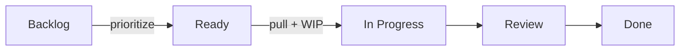
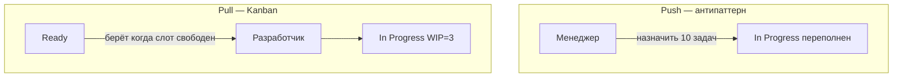

# Доска Kanban, колонки и WIP-лимиты

  ОБЯЗАТЕЛЬНО
  ДЛЯ НОВИЧКОВ

---

## Визуализация потока

**Kanban-доска** показывает, **что сейчас в работе** и **где застряло**. Это первый из шести элементов [Kanban Guide](https://kanbanguide.scrum.org/). Без визуализации WIP и метрики не работают: команда не видит очереди и блокеры.

Минимальный набор колонок для разработки ПО:

`Backlog` → `Ready` → `In Progress` → `Review` → `Done`

### Отдельная колонка Ready

**Backlog** — всё, что **когда-нибудь** сделаем. **Ready** — задачи, которые **можно начать сейчас** по [Definition of Ready](/encyclopedia/7-project/7-25-dostavka-i-gotovnost/1): описание понятно, зависимости сняты, оценка риска пройдена.

Разделение защищает от ситуации "в To Do 200 задач, команда не знает, с чего начать". PO упорядочивает **Ready**; команда **вытягивает** сверху вниз.

### Типичные колонки для dev-команды

| Колонка | Смысл |
|---------|--------|
| `Analysis` | Уточнение требований, spike |
| `Development` | Код, unit-тесты |
| `Code Review` | PR открыт, ждёт или проходит ревью |
| `QA` | Проверка на test/stage |
| `Release` | Ожидание деплоя, feature flag |
| `Blocked` | Работа остановлена (может быть меткой, а не колонкой) |

Каждая колонка — **состояние задачи**, а не фамилия исполнителя. Колонка "Вася" — антипаттерн: при отпуске человека поток ломается, WIP не виден.

Настройка в [Jira или YouTrack](/encyclopedia/7-project/7-09-bazy-znaniy-i-zadachniki/21).

---

## Swimlanes (дорожки)

**Swimlane** — горизонтальная полоса на доске для **типа работы** или **класса обслуживания**:

| Swimlane | Пример |
|----------|--------|
| Features | Новый функционал |
| Bugs | Дефекты prod |
| Incidents | P1/P2 из on-call |
| Tech debt | Intangible, рефакторинг |

Swimlanes помогают не смешивать expedite с обычной фичей на одной визуальной куче. Подробнее о классах — [глава 3](./3).

  
Не перегружайте доску

  

  Начните с <strong>5–7 колонок</strong>. Лишние стадии ("Waiting for UX", "Waiting for Legal") имеют смысл только если там реально копится очередь и вы готовите отдельный WIP или политику эскалации.

  

---

## WIP-лимиты

**WIP** (Work In Progress) — сколько задач **одновременно** может находиться в колонке (или на участке доски).

Пример: команда из 5 разработчиков, лимит **3** в In Progress.

### Что даёт ограничение WIP

| Эффект | Объяснение |
|--------|------------|
| Меньше переключений | Человек доводит задачу, а не прыгает между пятью |
| Быстрее Done | Закон Литтла: рост WIP без роста throughput увеличивает cycle time |
| Видны узкие места | Очередь в Review → не хватает ревьюеров |
| Честный pull | Нельзя "начать" без свободного слота |

При достижении лимита правило потока: **сначала помочь завершить текущее** (ревью, QA, разблокировать Blocked), потом брать новое из Ready.

Менеджерам с привычкой "назначить всем по задаче" это часто кажется контринтуитивным — но именно так падает среднее время выполнения ([метрики](./4)).

### Как выбрать первый WIP-лимит

| Подход | Формула / правило |
|--------|-------------------|
| Консервативный | Число исполнителей **минус 1** |
| На колонку | 1–2 задачи на человека в этой колонке |
| На всю доску | Суммарный WIP ≤ 1.5 × команда |
| Эмпирический | Начать с 3, через 2 недели посмотреть CFD и скорректировать |

WIP можно лимитировать:

- на **колонку** (In Progress ≤ 3);
- на **человека** (не более 2 active);
- на **класс обслуживания** (expedite ≤ 1).

### Пример в Jira

1. Board → Board settings → Columns.
2. Для колонки "In Progress" указать **Max** = 3.
3. При превышении Jira подсветит колонку; команда договаривается **не добавлять** карточки, пока не освободится слот.

В **YouTrack** аналог — ограничения на колонку в Agile board settings или договорённость + еженедельная проверка на stand-up.

---

## Pull-система и назначение сверху

**Pull** (вытягивание) — исполнитель **сам берёт** задачу из Ready, когда освободился и есть свободный WIP-слот.

**Push** (проталкивание) — менеджер **назначает** задачи сверх лимита WIP ("всем по задаче, чтобы были заняты").

Kanban строится на pull: работа входит в поток по **готовности** и **свободной мощности**, а не по давлению загрузки.

### Правила pull на практике

1. Задача в Ready **упорядочена** PO (или triage для support).
2. Разработчик берёт **верхнюю** задачу своего класса обслуживания.
3. Если слот WIP занят — **помогает** закрыть review/QA/blocked, а не берёт новую.
4. Expedite — **исключение** по политике ([глава 3](./3)).

---

## Политики перехода между колонками

**Политика** — явное правило, когда карточка может перейти дальше. Пишут в wiki, на доске стикером или в описании колонки в Jira.

| Переход | Условие |
|---------|---------|
| → Ready | Выполнен [Definition of Ready](/encyclopedia/7-project/7-25-dostavka-i-gotovnost/1): AC, макет, зависимости |
| → In Progress | Есть свободный слот WIP, назначен исполнитель (или self-assign) |
| → Code Review | CI зелёный, PR создан, описание заполнено, линтер пройден |
| → QA | PR смержен в develop, deploy на test env |
| → Done | Выполнен [DoD](/encyclopedia/7-project/7-25-dostavka-i-gotovnost/2), проверено на stage, документация обновлена |

Без политик WIP-лимит обходят "формальными" переносами: задача в In Progress без кода, или в Done без тестов.

  
DoD на каждый шаг

  

  Definition of Done — не только для колонки Done. Для Review: "PR ≤ 400 строк или согласовано". Для QA: "тест-кейс или автотест добавлен". Иначе дефекты возвращаются назад и cycle time растёт.

  

---

## Состояние Blocked

Метка или колонка **Blocked** обязательна. В тикете фиксируют:

- **причину** блокировки (ждём API партнёра, нет доступа к prod);
- **кто разблокирует** (конкретный человек или роль);
- **дату следующей проверки** (не "когда-нибудь").

Иначе [lead time и cycle time](./4) искажаются — задача "висит" в In Progress без видимой причины.

### Пример Blocked в support-сценарии

Тикет: "Не приходит SMS-код".

| Поле | Значение |
|------|----------|
| Статус | In Progress + Blocked |
| Причина | Провайдер SMS недоступен, тикет #4521 у вендора |
| Owner unblock | On-call + vendor manager |
| Next check | 2026-06-15 14:00 |

На daily stand-up Blocked обходят **первыми** — не "статус по людям", а "что мешает потоку".

---

## Пример доски команды из 6 человек

**Контекст:** веб-продукт, 4 backend, 1 frontend, 1 QA.

| Колонка | WIP |
|---------|-----|
| Ready | 10 (очередь, без жёсткого pull сверх) |
| In Progress (dev) | 4 |
| Code Review | 3 |
| QA | 2 |
| Done | ∞ |

**Политика expedite:** один слот может быть занят P1; WIP dev временно +1 только по согласованию тимлида.

**Cadence:** по понедельникам replenishment Ready (30 мин), по пятницам delivery review (что Done, cycle time, блокеры).

---

## Jira — пошаговая настройка

1. **Create board** → Kanban → filter по проекту.
2. **Columns** — map statuses: `To Do`, `In Progress`, `In Review`, `Done`.
3. **WIP limit** на In Progress.
4. **Quick filters** — `class of service = Expedite`, `labels = blocked`.
5. **Swimlanes** — по Epic или по custom field "Work type".
6. **Control Chart** (если доступен) — cycle time по статусам.

Подробнее об инструментах — [7.09/21](/encyclopedia/7-project/7-09-bazy-znaniy-i-zadachniki/21).

---

## YouTrack — пошаговая настройка

1. Agile Board → Columns по **State** или **Stage**.
2. Добавить состояния `Ready`, `Blocked` как отдельные значения или тег.
3. **Work in Progress** limit в настройках колонки.
4. **Swimlanes** по Priority или Type (Bug/Feature/Incident).
5. Отчёт **Cumulative Flow** в Insights.

---

## Антипаттерны доски

| Симптом | Проблема | Что делать |
|---------|----------|------------|
| 40 карточек In Progress | Нет WIP | Ввести лимит, остановить push |
| Колонки не менялись 2 года | Процесс не эволюционирует | Review потока, STATIK |
| Задачи в Done без деплоя | Слабый DoD | Уточнить политику Done |
| Секретные задачи в Slack | Доска ≠ реality | Визуализировать всё |
| Ревью — бутылочное горло | WIP только на dev | Лимит на Review + правило "сначала ревьюить" |

---

## Связь WIP с метриками

Когда вводите WIP, через 2–4 недели смотрите:

- **Cycle time** — должен стабилизироваться или снизиться для типовых задач;
- **CFD** — полоса In Progress не должна бесконечно расширяться;
- **Throughput** — число Done за неделю при том же составе команды.

Без метрик WIP превращается в "лишнее правило". См. [глава 4](./4).

---

## Физическая доска и цифровая

| Аспект | Стикеры на стене | Jira/YouTrack |
|--------|------------------|---------------|
| Видимость в офисе | Отлично | Нужен большой монитор |
| Удалёнка | Плохо | Необходимо |
| Cycle time | Вручную | Автоматически из переходов |
| История | Теряется | Сохраняется |

Гибрид: цифровая доска — источник правды, на стене — только Ready + In Progress для фокуса.

---

## Чек-лист минимальной доски

- [ ] Все типы работы видны на доске
- [ ] Есть Ready отдельно от Backlog
- [ ] WIP на In Progress (и при необходимости на Review/QA)
- [ ] Политики перехода записаны и команда их знает
- [ ] Blocked с причиной и датой проверки
- [ ] Pull — команда берёт из Ready, а не только получает назначения

Полная диагностика — [999](./999).

---

## Размер карточки и WIP

| Размер задачи | Рекомендация |
|---------------|--------------|
| > 3 days cycle time | Split на подзадачи |
| Epic на доске | Только если flow epics; иначе stories |
| Subtasks | Не каждая subtask в WIP — одна card = one flow item |

Крупные карточки раздувают cycle time и ломают прогноз.

---

## Колонка Done — что внутри

| Вариант | Когда |
|---------|-------|
| Done = merged | Continuous deploy |
| Done = on prod | Regulated release |
| Done = accepted by PO | UAT gate |

Политика Done **одна** для всей команды — см. [DoD](/encyclopedia/7-project/7-25-dostavka-i-gotovnost/2).

---

## Daily на Kanban-доске

Формат 15 мин:

1. Blocked — что мешает потоку?
2. WIP — перегруз? кто помогает review?
3. Expedite — статус единственного?
4. Не status по каждому человеку 5 минут.

Сравнение с [Daily Scrum](/encyclopedia/7-project/7-14-scrum/3) — фокус на flow, не на индивидуальный % complete.

---

## Что дальше

[Классы обслуживания и приоритеты](./3) — как expedite и fixed date вписываются в доску без хаоса.

---
