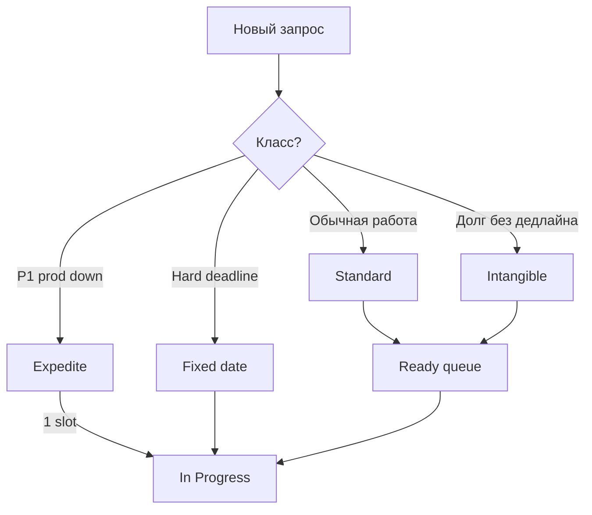
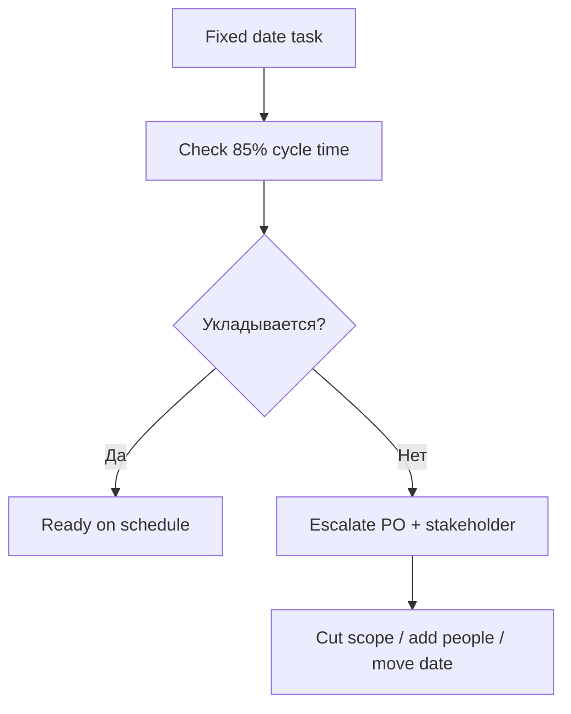

# Классы обслуживания и приоритеты в Kanban

  ОБЯЗАТЕЛЬНО
  ДЛЯ НОВИЧКОВ

---

## Роль классов обслуживания

**Classes of service** (классы обслуживания) — правила **очереди**, **ожидания** и **реакции на риск** для разных типов работы. Без классов всё становится **expedite** (срочным), и команда работает в режиме постоянного пожара.

Kanban не говорит "никогда не срочно". Он говорит: **срочность — осознанный выбор с ценой**, а не дефолт для каждого тикета.

Связь с [Kanban Guide](https://kanbanguide.scrum.org/): управление потоком включает политики для разных типов спроса.

---

## Четыре базовых класса

| Класс | Смысл | Пример | Риск для потока |
|-------|--------|--------|-----------------|
| **Expedite** | Критичный сбой, SLA нарушен | Prod недоступен ([инциденты](/encyclopedia/7-project/7-21-incidenty-i-ekspluatatsiya/1)) | Останавливает или сжимает остальной WIP |
| **Fixed delivery date** | Жёсткий дедлайн (закон, контракт, marketing) | Отчёт к 1 марта, релиз к конференции | Cost of delay растёт к дате |
| **Standard** | Обычная фича или баг | Улучшение UI, некритичный дефект | FIFO внутри приоритета Ready |
| **Intangible** | Техдолг, обучение, улучшение процесса | Рефакторинг модуля, runbook | Нет срочности, легко вытесняется |

---

## Expedite

**Expedite** — класс для работы, которую **нельзя** держать в обычной очереди без неприемлемого ущерба (простой prod, утечка данных, нарушение регуляторного SLA).

### Правила expedite

| Правило | Смысл |
|---------|--------|
| **Один** expedite на поток одновременно | Иначе "всё срочное" снова |
| Явное **объявление** (кто объявил, почему) | Прозрачность для команды и PO |
| WIP остальных может **остановиться** | Все помогают закрыть P1 |
| После закрытия — **postmortem** | Почему попало в expedite, как предотвратить |
| Нельзя объявлять expedite **без критериев** | Иначе менеджеры обходят очередь |

Связь с [ITSM](/encyclopedia/7-project/7-16-itsm-i-it-uslugi/1) и приоритетами P1/P2.

### Пример сценария P1

**06:12** — мониторинг: error rate 100% на `/api/pay`.

**06:15** — on-call создаёт тикет `INC-8842`, класс **Expedite**, swimlane Incidents.

**06:16** — тимлид подтверждает expedite; карточка идёт в In Progress **вне** обычного WIP (политика: +1 слот только для expedite).

**07:40** — hotfix в prod, тикет в Done.

**08:00** — daily: остальные задачи стояли — это **ожидаемая цена** expedite.

**На следующей неделе** — postmortem → задача intangible "добавить circuit breaker".

  
Expedite каждый день

  

  Если expedite — норма, классы не работают. Нужны: жёсткие критерии P1, улучшение надёжности, возможно выделенный on-call <strong>не</strong> из того же WIP, что фичи.

  

---

## Fixed delivery date

Задачи с **фиксированной датой** нельзя бесконечно откладывать: cost of delay растёт по мере приближения дедлайна.

### Планирование fixed date

1. Определить **дату Done** (не "начать разработку").
2. Посмотреть **cycle time** похожих задач ([глава 4](./4)) — перцентиль 85%.
3. Отнять buffer (20–30%) → дата старта в Ready.
4. Если дата нереалистична — **эскалация** к [PO/PM](/encyclopedia/7-project/7-19-produktovye-roli/1), а не тихое "дожмём".

| Поле в Jira | Пример |
|-------------|--------|
| Class of Service | Fixed date |
| Due date | 2026-03-01 |
| Start by (custom) | 2026-02-10 (из cycle time + buffer) |

### Пример — отчёт для регулятора

**Задача:** выгрузка для ЦБ к 1 марта.

**Fixed date** — пропуск в начало Ready за две недели до расчётной даты старта.

**Standard** фичи на этот период **не expedite**, но PO может **снизить** их приоритет в Ready.

---

## Standard

**Standard** — основной поток: фичи, улучшения, некритичные баги.

**Политика очереди:**

- PO упорядочивает Ready (WSJF, MoSCoW — [задачники](/encyclopedia/7-project/7-09-bazy-znaniy-i-zadachniki/2));
- команда **pull** сверху вниз;
- **FIFO** внутри одного приоритета, если нет других правил;
- WIP-лимит **не** обходится.

### Jira — custom field

Создайте поле `Class of Service` (select): Expedite, Fixed date, Standard, Intangible.

Board quick filter: `Class of Service = Standard`.

---

## Intangible и техдолг

**Intangible** — работа без внешнего дедлайна, но с **долгосрочной** ценностью: рефакторинг, автоматизация, документация, обучение.

Без выделенного capacity intangible **никогда не случается** — его всегда вытеснят standard и expedite.

### Практики для intangible

| Практика | Описание |
|----------|----------|
| 10–20% WIP | Из 5 слотов dev один — только intangible |
| Swimlane "Tech debt" | С отдельным WIP = 1 |
| Связь с change | Крупный рефакторинг — [change management](/encyclopedia/7-project/7-22-upravlenie-izmeneniyami/1) |
| После postmortem | Action items → intangible в Ready |

---

## Cost of delay (интуиция)

**Cost of delay** — сколько теряем, откладывая задачу на неделю/месяц.

| Класс | Cost of delay |
|-------|---------------|
| Expedite | Очень высокий **сейчас** |
| Fixed date | Растёт к дедлайну |
| Standard | Умеренный, зависит от ценности |
| Intangible | Низкий краткосрочно, высокий на горизонте года |

Приоритизация в Ready учитывает cost of delay, а не только "кто громче крикнул".

---

## Приоритизация и replenishment

**Replenishment** — регулярная встреча (часто 30–60 мин раз в неделю): PO и команда наполняют **Ready** из Backlog.

### Порядок на replenishment

1. Проверить **expedite** и **fixed date** — слоты и даты.
2. Оценить **ёмкость** Ready (сколько задач команда реально вытянет до следующего replenishment — из throughput).
3. Добавить **standard** сверху backlog.
4. Зарезервировать место для **intangible** (хотя бы одна карточка).

Scrum-аналог частично — Sprint Planning; разница — **не обязательный** фиксированный контейнер спринта. См. [Scrum](/encyclopedia/7-project/7-14-scrum/intro).

---

## Swimlanes и цвета

| Визуал | Класс |
|--------|-------|
| Красная карточка / swimlane | Expedite |
| Жёлтая метка + due date | Fixed date |
| Обычная | Standard |
| Серая / отдельная lane | Intangible |

В YouTrack — `Priority` + `Tags`; в Jira — `Priority` Blocker/Critical **не равны** expedite автоматически — нужна **явная** политика.

---

## Сценарий — смешанный поток support + dev

**Команда:** 3 dev, 1 support L2.

| Утро | Событие | Класс |
|------|---------|-------|
| 09:00 | Тикет "не работает печать PDF" | Standard bug |
| 10:30 | P2 "медленный поиск" | Standard |
| 11:00 | P1 "оплата 500" | **Expedite** |
| 11:00–14:00 | Фичи стоят, все на INC | Цена expedite |
| 14:30 | P1 закрыт | Возврат к pull из Ready |
| 15:00 | Replenishment не нужен — Ready на 2 дня вперёд |

Подробнее — [глава 7](./7).

---

## Антипаттерны приоритетов

| Симптом | Проблема |
|---------|----------|
| Все тикеты High priority | Нет классов |
| Expedite от CEO каждый вторник | Нет критериев и push-back |
| Техдолг 0% три месяца | Intangible не зарезервирован |
| Fixed date узнали за 2 дня | Нет replenishment и прогноза cycle time |
| "Срочно" в Slack минуя доску | Нет визуализации |

---

## Связь со Scrum Sprint Goal

В Scrumban Sprint Goal может включать **одну** fixed date и **лимит** expedite на спринт. В чистом Kanban цели задаются через **политики потока** и SLA, а не через Sprint Goal.

Сравнение — [глава 5](./5).

---

## Таблица решений для PO

| Вопрос заказчика | Класс | Действие |
|------------------|-------|----------|
| "Prod лежит" | Expedite | Немедленно, postmortem потом |
| "К 15 числа отчёт" | Fixed date | Проверить cycle time + buffer |
| "Хотелось бы в следующем квартале" | Standard | Backlog → Ready по приоритету |
| "Надо бы рефакторить" | Intangible | Зарезервировать WIP |

---

## Настройка в Jira (кратко)

1. Custom field `Class of Service`.
2. Workflow: expedite может миновать некоторые статусы **только** по политике (например, skip QA для hotfix с rollback plan).
3. Automation: при Priority = Blocker **предлагать** expedite, но не автоматически без подтверждения тимлида.
4. Filter на board по классу.

---

## Сценарий role-play для команды (30 мин)

**Упражнение:** три запроса одновременно — P1 prod, fixed date отчёт через 5 дней, "хотелка" CEO.

1. Классифицировать каждый запрос.
2. Расставить Ready.
3. Решить, кто останавливает WIP на P1.
4. Зафиксировать, что CEO-запрос — standard, не expedite.

Разбор: если всё expedite — политика не работает.

---

## WSJF и Kanban

**Weighted Shortest Job First** — cost of delay / duration. В Kanban duration заменяют **ожидаемым cycle time** по типу задачи, не story points.

| Задача | CoD | Cycle time est. | WSJF |
|--------|-----|-----------------|------|
| A | High | 3 d | High |
| B | Medium | 1 d | Medium |
| C | Low | 5 d | Low |

Подробнее о приоритизации — [7.09/2](/encyclopedia/7-project/7-09-bazy-znaniy-i-zadachniki/2).

---

## Эскалация когда fixed date нереален

Не молчать до последнего дня — lead time в Ready тоже съедает buffer.

---

## Матрица "кто решает класс"

| Класс | Кто assign |
|-------|------------|
| Expedite | On-call / TL + criteria |
| Fixed date | PO + TL planning |
| Standard | PO order in Ready |
| Intangible | TL + tech lead slot |

---

## Что дальше

[Метрики потока](./4) — как измерять lead time и cycle time по классам обслуживания отдельно.

---
