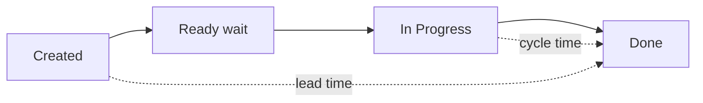
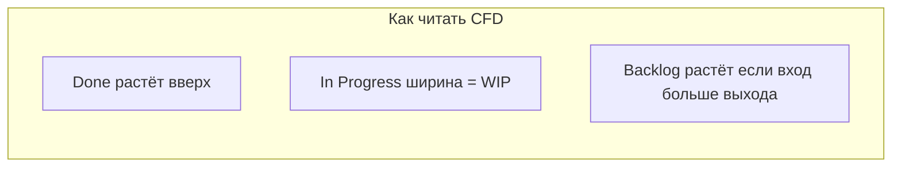

import ExternalPlayEmbed from '@site/src/components/ExternalPlayEmbed';

# Метрики потока в Kanban

  НЕ ОБЯЗАТЕЛЬНО
  ДЛЯ НОВИЧКОВ

---

## Роль метрик в Kanban

Kanban обещает **предсказуемый поток**, а не "обещание на Sprint Planning". Предсказуемость строят на **факте**: сколько времени задачи **уже** проводили в системе. Без метрик WIP-лимиты и классы обслуживания — декорация.

[Kanban Guide](https://kanbanguide.scrum.org/) включает управление потоком и эволюционное улучшение — оба опираются на измерения.

Scrum часто использует **velocity** в story points ([7.14](/encyclopedia/7-project/7-14-scrum/intro)). Kanban предпочитает **время** и **количество завершённых единиц** — без обязательных оценок.

<ExternalPlayEmbed example="project/kanban-flow-simulator-play" title="Симулятор Kanban-потока" minHeight={520} />

---

## Определения

| Метрика | Что измеряет | Формула (упрощённо) |
|---------|--------------|---------------------|
| **Lead time** | От появления запроса до **Done** | Done date − Created date |
| **Cycle time** | От **начала работы** до **Done** | Done date − In Progress date |
| **Throughput** | Сколько задач **завершено** за период | Count(Done) / week |
| **WIP** | Сколько задач **сейчас** не завершено | Count(not Done) |

### Lead time vs cycle time — на примере

**Задача:** исправить баг в авторизации.

| Событие | Дата |
|---------|------|
| Тикет создан | 1 июня |
| Взяли в In Progress | 5 июня |
| Done (fix в prod) | 8 июня |

- **Lead time** = 8 − 1 = **7 дней** (клиент ждал неделю)
- **Cycle time** = 8 − 5 = **3 дня** (команда работала три дня)

4 дня задача **ждала** в Ready — сигнал для PO (переполнен Ready?) или для команды (WIP был полон?).

---

## Прогноз по перцентилям

**Прогноз** "сколько займёт типичная задача" строят по **перцентилям** cycle time (50%, 85%), а не по среднему из трёх задач.

| Перцентиль | Смысл для заказчика |
|------------|---------------------|
| 50% (median) | "Обычно укладываемся за N дней" |
| 85% | "В 85% случаев не дольше M дней" |
| 95% | Для fixed date и SLA с buffer |

**Пример:** последние 40 standard-багов: cycle time 50% = 2 дня, 85% = 5 дней.

PO говорит заказчику: "С высокой вероятностью fix за **5 рабочих дней** после старта работы", а не "story points = 3".

  
Разбивайте по типу

  

  Не смешивайте cycle time <strong>инцидента</strong> и <strong>эпика</strong>. Отдельные гистограммы по классу обслуживания и размеру задачи — см. <a href="./3">классы</a>.

  

---

## Throughput

**Throughput** — сколько work items завершено за неделю (или спринт для сравнения).

| Неделя | Done (standard) | Done (bugs) | WIP avg |
|--------|-----------------|-------------|---------|
| 1 | 8 | 4 | 12 |
| 2 | 10 | 3 | 9 |
| 3 | 9 | 5 | 8 |

После введения WIP throughput **стабилизировался**, WIP снизился — типичный паттерн.

**Replenishment:** если throughput ≈ 9 задач/неделю, в Ready не кладут 30 — хватит 10–12 с запасом.

---

## CFD (Cumulative Flow Diagram)

**CFD** — накопительная диаграмма: ось X — время, ось Y — **число задач** в каждой колонке (слои цветом).

### Сигналы на CFD

| Паттерн | Интерпретация | Действие |
|---------|---------------|----------|
| **Расширение** полосы In Progress | WIP растёт, завершения не успевают | Ужесточить WIP, снять блокеры |
| **Плато** в Done (наклон пологий) | Поток остановился | Праздники? Expedite? Blocked? |
| **Скачок** Backlog вверх | Вход быстрее выхода | Replenishment, push-back scope |
| **Зубья пилы** In Progress | Стартуем много, не финишируем | Pull, DoD на Review |
| Расширение **Blocked** | Зависимости, внешние команды | Эскалация, SLA с партнёрами |

### Где построить CFD

- **Jira** — Cumulative Flow Diagram (Premium) или Gadget.
- **YouTrack** — Report Cumulative Flow.
- **Excel** — ежедневный снимок count по колонкам (CSV export).

Подробнее об экспорте — [7.09](/encyclopedia/7-project/7-09-bazy-znaniy-i-zadachniki/22).

---

## Закон Литтла (интуиция)

**Закон Литтла:** в стабильном потоке

**Средний WIP ≈ Throughput × Средний Cycle Time**

Если WIP растёт без роста throughput — cycle time **увеличивается**. Отсюда смысл WIP-лимитов ([глава 2](./2)).

| Было | Стало |
|------|-------|
| WIP = 20, throughput = 5/нед | WIP = 8, throughput = 5/нед |
| Cycle time ~4 недели | Cycle time ~1.5 недели |

Тот же throughput — но клиент ждёт меньше, потому что меньше незавершёнки.

---

## Control Chart (cycle time scatter)

**Control chart** — точки: X = дата Done, Y = cycle time. Показывает выбросы и тренды.

| Наблюдение | Действие |
|------------|----------|
| Точка в 3× выше median | Разобрать кейс: блокер? огромный scope? |
| Рост trend 2 месяца | Техдолг, нехватка людей, плохой DoD |
| Стабильный cloud | Можно обещать 85% перцентиль |

---

## STATIK и метрики

На этапе **Analysis** в [STATIK](./6) смотрят вариабельность:

- разброс cycle time по типам задач;
- где задачи **застревают** (широкая полоса Review на CFD);
- сезонность (конец квартала, релизы).

Метрики **до** изменения доски — baseline; **после** WIP — сравнение.

---

## Антипаттерны метрик

| Антипаттерн | Почему плохо |
|-------------|--------------|
| KPI "закрыть 50 тикетов" | Поощряет мелкие тикеты и игнор качества |
| Сравнение cycle time разных типов без разбивки | Ложные выводы |
| Игнорирование **Blocked** времени | Cycle time врёт |
| Среднее вместо перцентилей | Выбросы ломают прогноз |
| Метрики без review | Декорация на dashboard |

---

## Пример расчёта для PO

**Вопрос:** "Когда будет фича 'экспорт в Excel'?"

1. Найти 15 похожих standard-фич за последние 3 месяца.
2. Cycle time от In Progress до Done: перцентиль 85% = **12 дней**.
3. Buffer 20% → **~15 рабочих дней** после старта.
4. Если в Ready очередь 8 задач выше — добавить **ожидание в Ready** из lead time статистики.

Оценка в story points **опциональна** для roadmap; операционный ответ — из cycle time.

---

## Jira — включить cycle time

1. Убедиться, что статусы map на board columns.
2. Reports → Control Chart / Cycle Time (зависит от edition).
3. Filter: project = X, class of service = Standard.
4. Экспорт CSV для перцентилей в Excel.

---

## YouTrack — cycle time

1. Insights → Report → Time in State.
2. Или Agile Board → Chart → Cycle Time.
3. Сегментация по Type: Bug, Feature.

---

## Метрики и классы обслуживания

| Класс | Что мерить |
|-------|------------|
| Expedite | Lead time P1, время до mitigate |
| Fixed date | % попадания в дедлайн |
| Standard | Cycle time перцентили |
| Intangible | % WIP spent, throughput intangible |

Expedite **не** должен "портить" статистику standard — фильтруйте отчёты.

---

## Связь с оценками

Kanban **не требует** story points. Оценки опциональны для **грубого** roadmap; операционный прогноз — из метрик потока ([оценка трудозатрат](/encyclopedia/7-project/7-02-komanda-i-upravlenie/112)).

Scrumban-команды иногда оставляют points для **сравнения спринтов**, но commitment на Kanban-участке — через WIP и cycle time.

---

## Еженедельный ритуал метрик (15 мин)

1. CFD за 4 недели — один взгляд, есть ли расширение WIP.
2. Throughput vs прошлая неделя.
3. Топ-3 Blocked старше 3 дней.
4. Один выброс cycle time — разбор root cause.

Это может быть частью **delivery review** ([Kanban Guide](https://kanbanguide.scrum.org/)).

---

## Monte Carlo (упрощённо)

При большой истории cycle time можно симулировать: "100 virtual weeks" случайной выборки cycle times → распределение "когда Done" для backlog из N задач. Инструменты: ActionableAgile, Excel, некоторые Jira plugins.

Для новичка достаточно **перцентилей** без Monte Carlo.

---

## Aging chart

**Aging** — сколько задача уже в текущем статусе. Карточка 10 дней в Review при median cycle time 3 дня — кандидат на эскалацию.

| Age in column | Action |
|---------------|--------|
| > 2× median | Daily mention |
| > 7 days Review | Reassign reviewer |
| Blocked > 3 days | Escalate owner |

---

## Сравнение метрик Scrum и Kanban (для hybrid)

| Вопрос stakeholder | Scrum answer | Kanban answer |
|--------------------|--------------|---------------|
| Когда будет? | End of sprint + spill | 85% cycle time date |
| Сколько сделали? | Velocity | Throughput |
| Загружены ли? | Sprint commitment | WIP vs limit |

---

## Экспорт данных для Excel

Минимальные колонки CSV:

- Issue key
- Created
- In Progress date (first)
- Done date
- Class of service
- Type

Формулы: `=Done-InProgress` (cycle), `=Done-Created` (lead).

---

## Дашборд для руководства (1 слайд)

1. Throughput last 4 weeks (bar)
2. Cycle time 85% trend (line)
3. Open expedite count (number, target 0–1)
4. Top 3 Blocked > 3 days (table)

Без story points — меньше gaming metrics.

---

## Что дальше

[Когда Kanban лучше Scrum](./5) — как метрики влияют на выбор процесса.

---
