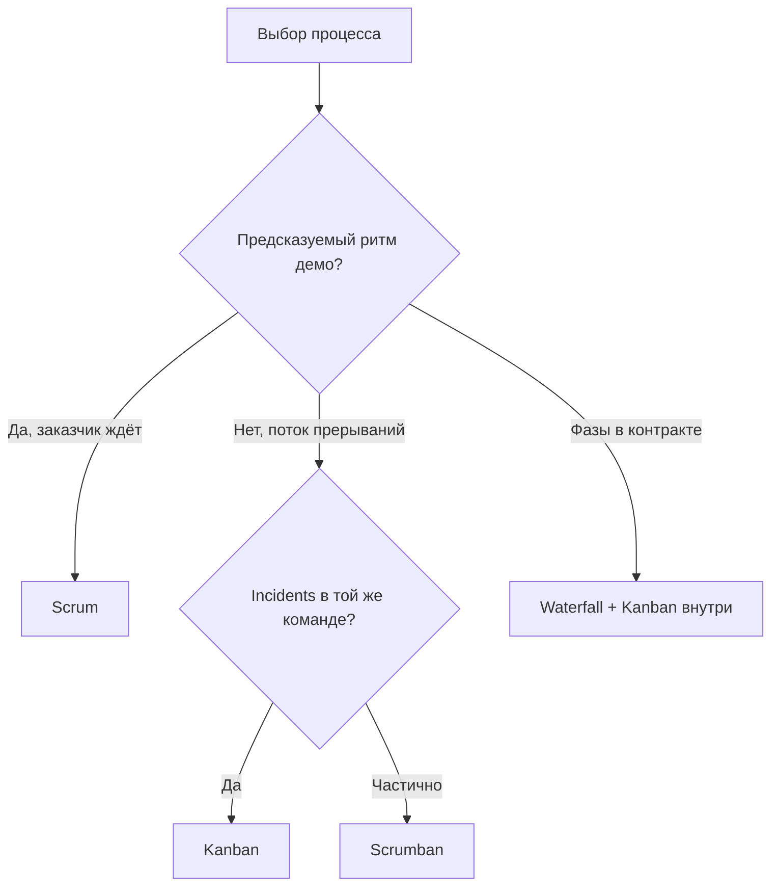
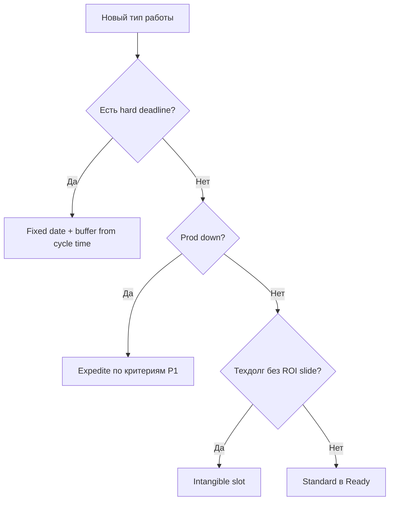

# Когда Kanban лучше Scrum

  НЕ ОБЯЗАТЕЛЬНО
  ДЛЯ НОВИЧКОВ

---

## Два ответа на одну боль

И [Scrum](/encyclopedia/7-project/7-14-scrum/intro), и [Kanban](./intro) помогают команде **поставлять ценность итеративно** вместо многолетнего каскада. Разница — в **ритме**, **обязательствах** и **метриках**.

| Вопрос | Scrum | Kanban |
|--------|-------|--------|
| Когда планируем? | Начало спринта | Replenishment по cadence |
| Когда меняем приоритеты? | Между спринтами (в идеале) | По политикам потока |
| Как обещаем срок? | Sprint Goal + velocity | Lead time / cycle time |
| Как ограничиваем работу? | Sprint scope | WIP-лимиты |

Нет "лучшего" метода — есть **контекст** команды. Обзор — [Как выбрать процесс](/encyclopedia/7-project/7-03-metodologiya-i-zhiznennyy-tsikl-po/4).

---

## Матрица выбора

| Контекст | Лучше подходит |
|----------|----------------|
| Новый продукт, стабильный PO, нужен ритм демо | **Scrum** ([7.14](/encyclopedia/7-project/7-14-scrum/intro)) |
| Поток багов + фич + инцидентов | **Kanban** |
| Жёсткий госконтракт по фазам | **Waterfall** + Kanban внутри фазы |
| Команда зрелая, много прерываний | **Kanban** или Scrumban |
| Нужна сертификация/ритуалы для заказчика | Scrum-оболочка + Kanban внутри |
| Поддержка L2/L3, on-call | **Kanban** ([глава 7](./7)) |
| Стартап, поиск product-market fit | Часто **Scrum** (короткие эксперименты) |
| Platform/SRE, много unplanned work | **Kanban** |

---

## Сигналы, что пора смотреть на Kanban

| Сигнал | Пояснение |
|--------|-----------|
| Sprint Goal рвётся каждую неделю | Поток не укладывается в контейнер спринта |
| Velocity не помогает прогнозу | Story points не коррелируют со временем |
| 30 задач In Progress | Нужны WIP, не новый спринт |
| "Срочно" из Slack минует доску | Нужны классы обслуживания |
| Scrum-театр ([999 Scrum](/encyclopedia/7-project/7-14-scrum/999)) | Ритуалы есть, инкремента нет |
| Команда support+dev | [Глава 7](./7) |

---

## Scrumban

**Scrumban** — гибрид:

- **Спринт** как контейнер отчётности и цели (для заказчика и PO);
- **WIP-лимиты** внутри спринта;
- пополнение backlog **по мере** освобождения слотов;
- метрики **cycle time** дополняют velocity.

### Когда Scrumban уместен

| Ситуация | Элемент Scrum | Элемент Kanban |
|----------|---------------|----------------|
| Заказчик требует "двухнедельные итерации" | Sprint Review, Goal | WIP, pull |
| P1 несколько раз за спринт | Sprint boundary формальный | Expedite, классы |
| Команда привыкла к Daily | Daily остаётся | Фокус на поток, не burndown |

Полезно, когда заказчик требует "двухнедельные итерации", а реальность — постоянные P1.

### Пример Scrumban

**Sprint Goal:** "Оплата картой + стабильность SLA P1".

**WIP:** dev = 4, review = 2.

**Expedite:** максимум 2 P1 за спринт; третий — эскалация на найм/on-call.

**Review:** показывают Done за спринт **и** CFD за месяц.

---

## Kanban и Scrum — что можно комбинировать

| Из Scrum | Из Kanban |
|----------|-----------|
| Daily (15 мин) | WIP-лимиты |
| Sprint Review с демо | CFD, cycle time |
| Retrospective | Replenishment, delivery review |
| Product Backlog | Classes of service |
| Definition of Done | Explicit policies на колонки |

Не обязательно выбрасывать всё из Scrum при переходе на Kanban — выбрасывают **жёсткий** scope commit на спринт, если он не работает.

---

## Waterfall + Kanban

На [госпроектах](/encyclopedia/7-project/7-03-metodologiya-i-zhiznennyy-tsikl-po/2) фазы зафиксированы контрактом. Внутри фазы "Разработка":

- Kanban-доска;
- WIP и метрики для **подрядчика и заказчика**;
- отчётность для контракта — milestones, не sprint burndown.

---

## Сравнение метрик

| Scrum | Kanban |
|-------|--------|
| Velocity (points/sprint) | Throughput (items/week) |
| Sprint burndown | CFD |
| Commitment vs Done in sprint | Cycle time percentiles |
| Forecast по average velocity | Forecast по 85% cycle time |

Kanban не запрещает velocity — но **не делает** points обязательными. См. [глава 4](./4).

---

## Роли при переходе

| Scrum-роль | В Kanban |
|------------|----------|
| Product Owner | Остаётся — prioritizes Ready |
| Scrum Master | Может стать **flow coach** — WIP, policies, metrics |
| Developers | Pull из Ready |

[Kanban Guide](https://kanbanguide.scrum.org/) не назначает обязательных ролей — но ответственность за поток **остаётся**.

---

## Сценарий миграции Scrum → Kanban

**Месяц 1:** добавить WIP на доску спринта, не меняя длину спринта (Scrumban).

**Месяц 2:** ввести классы обслуживания и cycle time отчёт.

**Месяц 3:** убрать обязательство "весь scope спринта", оставить Sprint Goal как **ориентир**.

**Месяц 4:** optional — убрать спринт, оставить cadence review раз в 2 недели.

Детали внедрения — [STATIK](./6).

---

## Когда Scrum всё же лучше

- **Новая команда** — Scrum даёт структуру ритуалов.
- **Нужен жёсткий инкремент** каждые 2 недели для инвесторов.
- **PO учится** prioritization — Sprint Planning дисциплинирует.
- **Мало прерываний** — поток предсказуем.

Диагностика Scrum — [7.14/999](/encyclopedia/7-project/7-14-scrum/999).

---

## Вопросы заказчика

| "Мы же Agile, почему не Scrum?" | Ответ |
|----------------------------------|-------|
| Для support | Kanban — рекомендация ITIL-подобных потоков |
| Для продукта с P1 | Scrumban или Kanban |
| Для нового MVP | Scrum часто проще стартовать |

Ссылайтесь на [методологии](/encyclopedia/7-project/7-03-metodologiya-i-zhiznennyy-tsikl-po/intro), не на "моду".

---

## Процесс меняется со временем

Процесс **эволюционирует** ([STATIK](./6)): стартуете с того, что есть, визуализируете, вводите WIP, измеряете, меняете колонки.

Выбор Scrum или Kanban — **не навсегда**. Команда может вернуться к спринтам после стабилизации prod.

---

## Scrumban на одной доске (пример)

| Элемент | Настройка |
|---------|-----------|
| Спринт | 2 недели, цель на стикере |
| WIP | In Progress ≤ 4 на весь сп sprint |
| Replenishment | Понедельник + по необходимости |
| Review | Пятница — Done за спринт + CFD |
| Expedite | Не более 1 за спринт без эскалации |

Burndown **optional**; если команда смотрит только burndown и игнорирует WIP — burndown убрать, чтобы не дублировать ложную метрику.

---

## Decision tree для PO

---

## Переговоры с заказчиком о смене процесса

| Аргумент заказчика | Ответ PO |
|--------------------|----------|
| "Хотим sprint demo" | Оставить Review раз в 2 нед, работать Kanban внутри |
| "Нужна velocity" | Throughput + cycle time прозрачнее для ops |
| "Agile = Scrum в договоре" | Scrumban, формулировка "итеративная поставка" |
| "Как прогноз без points?" | 85% cycle time по похожим задачам |

---

## Команды разного размера

| Размер | Рекомендация |
|--------|--------------|
| 3–5 | Kanban или Scrum, один WIP на команду |
| 6–9 | Kanban + явный review WIP |
| 10+ | Две доски или два потока с отдельным WIP |
| Распределённая | Цифровая доска обязательна, CFD weekly |

---

## Сезонность и Kanban

Black Friday, конец квартала, релиз OS — **throughput** падает. Не сравнивайте CFD декабря с июнем. Заранее:

- снизить replenishment standard work;
- поднять intangible после сезона;
- согласовать fixed date **до** marketing-кампании.

---

## Связь с [7.14](/encyclopedia/7-project/7-14-scrum/intro) событиями

| Scrum event | Kanban-аналог |
|-------------|---------------|
| Sprint Planning | Replenishment |
| Daily Scrum | Daily + focus Blocked/WIP |
| Sprint Review | Delivery review |
| Retrospective | Improvement cadence |
| Backlog refinement | Grooming Ready |

Можно **оставить** названия Scrum для заказчика, содержание — Kanban.

---

## Чек-лист выбора (краткий)

- [ ] Прерывания чаще раза в день → Kanban
- [ ] Стабильный PO + demo каждые 2 нед → Scrum
- [ ] Договор требует спринт + P1 daily → Scrumban
- [ ] Только support tickets → Kanban ([глава 7](./7))

---

## Ошибки при выборе (антипаттерны)

| Ошибка | Последствие |
|--------|-------------|
| Scrum "потому что все так делают" | Scrum-театр без инкремента |
| Kanban без метрик | Доска без прогноза |
| Scrumban без WIP | Спринт + хаос inside |
| Переключение каждый месяц | Команда не учится на потоке |

Стабильность процесса **минимум 6–8 недель** перед сменой.

---

## Что дальше

[Внедрение Kanban и типичные ошибки](./6) — пошаговый STATIK и антипаттерны.

---
