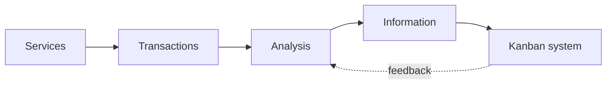

# Внедрение Kanban и типичные ошибки

<div class="article-tags">
  <span class="tag tag-notrequired">НЕ ОБЯЗАТЕЛЬНО</span>
</div>

<span class="complexity-badge">Руководителю</span>

---

## Начните с реальности, не с книги

Главная ошибка внедрения — нарисовать "идеальную" доску из тренинга и **заставить** команду под неё подстраиваться. Kanban — **эволюционный** метод ([Kanban Guide](https://kanbanguide.scrum.org/)): сначала **картографируете** текущий поток, потом улучшаете.

Для стартового анализа используют **STATIK**.

---

## STATIK по шагам

**STATIK** (Systems Thinking Approach to Introducing Kanban) — Mike Burrows. Аббревиатура:

| Буква | Шаг | Вопросы |
|-------|-----|---------|
| **S** — Services | Что поставляем, **кому**? | Клиенты внутренние/внешние, SLA |
| **T** — Transactions | Какие **типы** работ? | Фича, баг, инцидент, запрос доступа |
| **A** — Analysis | Где **узкие места**, вариабельность? | CFD, очереди, жалобы |
| **I** — Information | Как **визуализируем** и какие политики? | Доска, DoR/DoD, классы |
| **K** — Kanban | WIP, cadence, **правила потока** | Лимиты, replenishment, review |



### S — Services

Пример dev-команды:

| Service | Потребитель | Ожидание |
|---------|-------------|----------|
| Новые фичи в prod | Product, пользователи | Cycle time predictable |
| Hotfix P1 | On-call, бизнес | Minutes–hours |
| Техподдержка L2 | Support desk | SLA по приоритету |

### T — Transactions

Список **всех** типов карточек, включая "невидимые":

- ad-hoc запросы в Slack;
- "быстренько посмотри PR";
- регламентные релизы;
- [инциденты](/encyclopedia/7-project/7-21-incidenty-i-ekspluatatsiya/intro).

Если тип не на доске — его нет в Kanban.

### A — Analysis

- Средний WIP за месяц;
- где карточки **стареют** (status report);
- сколько expedite за квартал;
- throughput по неделям.

Baseline **до** WIP — чтобы показать улучшение.

### I — Information

- Колонки = реальные состояния;
- политики на wiki;
- [задачник](/encyclopedia/7-project/7-09-bazy-znaniy-i-zadachniki/intro) настроен.

### K — Kanban

- Первый WIP (часто In Progress);
- cadence: replenishment + delivery review;
- классы обслуживания ([глава 3](./3)).

---

## Шаги внедрения по неделям

| Неделя | Действие | Участники |
|--------|----------|-----------|
| 1 | Визуализировать **всю** работу на доске | TL, команда |
| 2 | Договориться о **DoD** на колонки | + PO, QA |
| 3 | Ввести **WIP** на 1–2 колонки | Команда |
| 4 | Начать мерить **cycle time** | TL, analytic |
| 5 | Ретро потока: что убрать/добавить | Все |
| 6 | Классы обслуживания + expedite policy | + PO, support |
| 8 | CFD review, корректировка WIP | TL |

Не обязательно ровно 8 недель — **cadence важнее календаря**.

---

## Cadence (ритмы Kanban)

| Событие | Частота | Длительность | Цель |
|---------|---------|--------------|------|
| **Replenishment** | 1×/нед | 30–60 мин | Наполнить Ready |
| **Delivery review** | 1×/нед или 2×/мес | 30–60 мин | Done, метрики, блокеры |
| **Retrospective / improvement** | 1×/мес | 60–90 мин | Изменить policies, WIP |
| Daily | Ежедневно | 15 мин | Blocked, WIP (можно из Scrum) |

Scrum-события **не конфликтуют** с Kanban, если Daily не превращается в status для начальства.

---

## Роли при внедрении

| Роль | Действие |
|------|----------|
| Тимлид / flow coach | STATIK, WIP, metrics |
| PO | Ready order, классы, push-back на expedite |
| Команда | Pull, Blocked, честная доска |
| Support / SRE | Критерии P1, runbooks ([7.09 wiki](/encyclopedia/7-project/7-09-bazy-znaniy-i-zadachniki/22)) |

---

## Антипаттерны

| Симптом | Проблема | Лечение |
|---------|----------|---------|
| 50 задач In Progress | Нет WIP, push-культура | Лимит + правило stop starting |
| Expedite каждый день | Нет классов обслуживания | Критерии P1, postmortem |
| Доска ≠ реальность | Секретная работа в чате | Визуализировать всё |
| Метрики никто не смотрит | Декорация | 15 мин review в cadence |
| "Kanban без планирования" | Нет replenishment Ready | Weekly replenishment |
| WIP только на бумаге | Лимит не соблюдают | TL моделирует поведение |
| Колонки ради колонок | Copy-paste из Jira template | STATIK Analysis |
| Нет Blocked | Cycle time врёт | Обязательные поля |

---

## Сопротивление изменениям

| Возражение | Ответ |
|------------|-------|
| "WIP = простой" | Простой = перегрузка; помогаем review/QA |
| "Начальству нужна загрузка 100%" | Throughput важнее занятости |
| "У нас особый случай" | STATIK начинается с вашего особого случая |
| "Нет времени на метрики" | 15 мин/нед; иначе не знаем, помогло ли |

<div class="callout callout--info">
  <div class="callout-title">Эволюция, не революция</div>

  <div class="callout-body">
  [Kanban Guide](https://kanbanguide.scrum.org/) подчёркивает: меняйте процесс <strong>без</strong> ломки текущих обязательств перед заказчиком. Scrumban — мост от Scrum.
</div>
  </div>

---

## Связь с запуском проекта

На старте проекта выбор Kanban — в [7.17](/encyclopedia/7-project/7-17-nachalo-raboty-na-proekte/6) и [7.03/4](/encyclopedia/7-project/7-03-metodologiya-i-zhiznennyy-tsikl-po/4).

Checklist первой недели на проекте:

- [ ] Доска в [Jira/YouTrack](/encyclopedia/7-project/7-09-bazy-znaniy-i-zadachniki/21)
- [ ] DoR/DoD согласованы
- [ ] WIP draft
- [ ] Кто PO и кто flow coach

---

## Пример workshop STATIK (2 часа)

1. **20 мин** — Services: кто клиенты, что обещаем.
2. **20 мин** — Transactions: стикеры всех типов работ за последнюю неделю.
3. **30 мин** — Нарисовать as-is доску на белой доске.
4. **20 мин** — Analysis: где застряло больше всего.
5. **20 мин** — Первый WIP и 3 политики.
6. **10 мин** — Cadence и владелец.

Через 2 недели — сравнить CFD/wip snapshot.

---

## Масштабирование на несколько команд

| Уровень | Практика |
|---------|----------|
| Команда | Своя доска, свой WIP |
| Продукт | Общие классы обслуживания, согласованный expedite |
| Портфель | Kanban на уровне epics (опционально) |

Не копируйте одну доску на 50 человек — потоки разные.

---

## Внедрение в удалённой команде

| Риск | Митигация |
|------|-----------|
| Доска не обновляют | Daily первый вопрос — WIP sync |
| Blocked тихие | Bot reminder 48h |
| Time zones | Async replenishment doc + 30 min overlap |
| "Invisible work" | Правило: нет Slack-task без тикета |

---

## Шаблон политик для wiki

```markdown
## Переход в In Progress
- WIP slot free
- DoR complete
- Assignee self-selected

## Expedite
- Only P1 per matrix 7.21
- Max 1 active
- Postmortem within 5 days

## Blocked
- Reason + owner + next check date required
```

---

## Коучинг и обучение

| Неделя | Тема для команды |
|--------|------------------|
| 1 | Визуализация as-is |
| 2 | WIP и "stop starting" |
| 3 | Pull demo на доске |
| 4 | Blocked ceremony |
| 5 | Cycle time report |
| 6 | Classes of service role-play (P1 scenario) |

---

## Регрессия процесса — признаки

- WIP лимит в Jira есть, но колонка 2× over limit месяц;
- replenishment отменяют "из-за дедлайна";
- метрики не открывали since last quarter;
- новый менеджер отменил expedite rule.

**Лечение:** [999](./999) + delivery review с данными, не лекцией.

---

## Интеграция с HR и performance

Не привязывайте bonus к "закрытым тикетам". Поощряйте:

- помощь на review при полном WIP;
- качественные postmortem;
- снижение cycle time **команды**, не героизм одного.

---

## Пилот на одной команде

1. Выбрать команду с болью (support+dev или перегруз WIP).
2. 6 недель pilot без mandatory для остальных.
3. Baseline metrics week 1.
4. Show CFD week 6 to other teams.
5. Решение масштабировать — на основе throughput/lead time, не hype.

---

## Что дальше

1. Создать board filter по команде.
2. Добавить custom fields: Class of Service, Blocked reason.
3. Настроить email/Slack при Blocked > 2 дней (optional).
4. Dashboard: CFD + control chart.

---

## Критерии успеха через 3 месяца

| Метрика | Ожидание |
|---------|----------|
| WIP | Снижение или стабильность при том же составе |
| Cycle time 85% | Стабильный или ниже baseline |
| Expedite | Редкий, с postmortem |
| Blocked avg age | < 3 дней или эскалация |
| Команда | Может объяснить pull и WIP новичку |

Полная диагностика — [999](./999).

---

## Что дальше

[Kanban в поддержке и инцидентах](./7) — прикладной сценарий L2/L3 и on-call.

---
