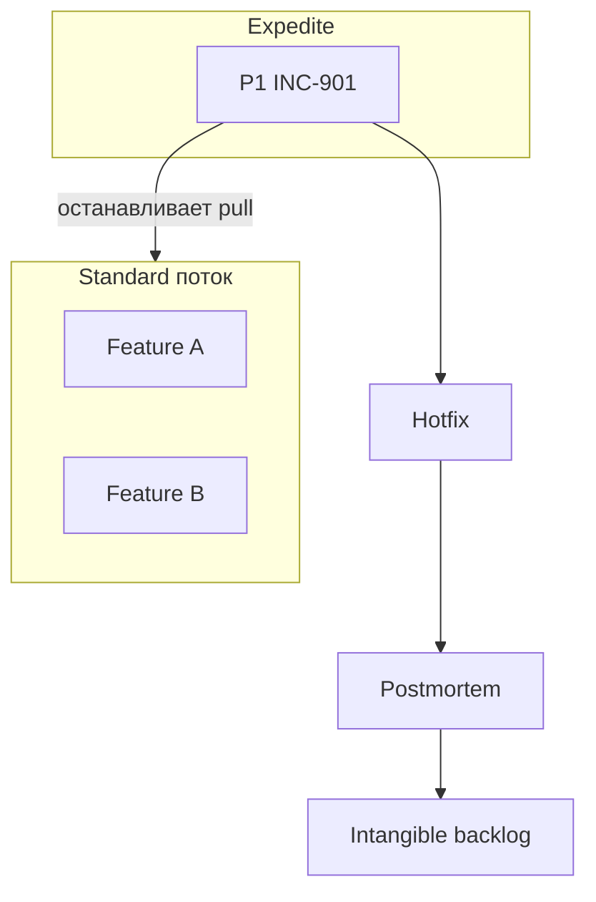
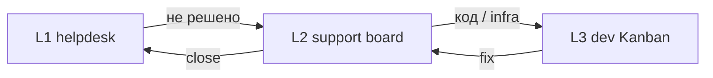

# Kanban в поддержке и инцидентах

  НЕ ОБЯЗАТЕЛЬНО

---

## Почему support — классический Kanban

Команды **L2/L3**, **SRE** и **dev+support** редко живут в чистом Scrum: P1 приходит в 03:00, очередь тикетов не укладывается в Sprint Goal, velocity не описывает **MTTR**.

Kanban родился для **вытягивания** работы по мощности и **явной** срочности через [классы обслуживания](./3). Для эксплуатации — см. [Инциденты и эксплуатация](/encyclopedia/7-project/7-21-incidenty-i-ekspluatatsiya/intro); для L1 — [техподдержка](/encyclopedia/2-system-network/2-07-tehnicheskaya-podderzhka/intro).

---

## Смешанный поток

Типичная боль: **фичи** и **P1-инциденты** в одной команде из пяти человек.

Kanban решает через:

- класс **Expedite** для P1/P2 с правилом "один в потоке";
- отдельные **swimlane** или доска для **инцидентов**;
- WIP на фичи **снижается**, когда горит prod;
- **postmortem** → intangible задачи в backlog;
- **runbooks** в [wiki](/encyclopedia/7-project/7-09-bazy-znaniy-i-zadachniki/22).

---

## Модели организации доски

| Модель | Когда | Плюсы | Минусы |
|--------|-------|-------|--------|
| Одна доска, swimlanes | Малая команда | Вся работа видна | Визуальный шум |
| Две доски: Product + Ops | Чёткое разделение | Фокус | Риск потерять связь |
| Ops board + эскалация на dev | L2 отдельно | L2 не блокирует dev WIP | Handoff |
| On-call **вне** WIP фич | Dedicated rotation | Фичи не стоят каждый P1 | Нужен staffing |

---

## On-call и разработка

| Роль | Kanban-практика |
|------|-----------------|
| On-call | Expedite-тикет, runbook из wiki, таймер acknowledge |
| Разработчик (не on-call) | Продолжает pull **если** политика не требует all-hands |
| Разработчик (all-hands P1) | WIP freeze, один hotfix |
| PO | Пересогласование scope недели, не "втиснуть всё" |
| SRE | Intangible: алерты, автomation |

### Пример смены on-call

**Понедельник:** dev Иван — on-call. WIP personal для фич = 1 вместо 2.

**Среда 02:00:** P1 — INC создаётся, класс Expedite, Иван ведёт, второй dev ревьюит hotfix.

**Среда 10:00:** daily — Blocked и expedite разбор; фичи в Ready **не** трогают до закрытия INC.

**Четверг:** postmortem → задача "добавить алерт на latency payment-api".

---

## SLA и приоритеты

Приоритет тикета согласуется с [SLA](/encyclopedia/7-project/7-16-itsm-i-it-uslugi/2):

| Priority | Typical SLA | Class of service |
|----------|-------------|------------------|
| P1 | Ack 15 min, mitigate 4 h | Expedite |
| P2 | Ack 1 h, resolve 1 day | Standard или expedite-lite |
| P3 | 3 days | Standard |
| P4 | Best effort | Standard / backlog |

Нарушение **MTTR** — сигнал улучшить runbook или код, а не бесконечные ночные авралы без процесса.

**Lead time** для P1 меряют от создания INC до mitigate; **cycle time** — от In Progress до Done.

---

## Сценарий — падение платежей в Black Friday

**Контекст:** интернет-магазин, команда 4 dev + 1 QA, Kanban с WIP dev=3.

| Время | Событие |
|-------|---------|
| T+0 | Алерт: 90% ошибок `/pay` |
| T+5m | On-call создаёт INC-5500, **Expedite** |
| T+10m | TL объявляет WIP freeze на фичи |
| T+45m | Rollback релиза 2.4.1, сервис восстановлен (mitigate) |
| T+2h | Root cause: неверный feature flag |
| T+1d | Hotfix 2.4.2, Done |
| T+3d | Postmortem, intangible: автотест flag + canary |

**CFD** за неделю: spike In Progress в день инцидента — нормально; проблема — если spike **каждую** неделю.

---

## ITSM + Kanban

[ITSM](/encyclopedia/7-project/7-16-itsm-i-it-uslugi/1) даёт процесс **Incident, Problem, Change**. Kanban-доска **не заменяет** CAB для критичных релизов в банке/госе.

| ITSM | Kanban |
|------|--------|
| Incident record | Карточка expedite на доске |
| Problem management | Epic intangible + root cause |
| Change request | Колонка Release / CAB gate |
| SLA reporting | Lead time, MTTR metrics |

Change management для prod — [7.22](/encyclopedia/7-project/7-22-upravlenie-izmeneniyami/1).

  
Два источника правды

  

  Если INC в ServiceNow, а dev work в Jira — настройте <strong>синхронизацию</strong> или явную политику "INC id в каждом hotfix PR". Иначе метрики и аудит расходятся.

  

---

## L2 → L3 эскалация

**Политика эскалации:**

- L2 обязан приложить логи, steps to reproduce, impact;
- L3 не принимает "просто не работает" без DoR;
- класс Standard или Expedite определяет **очередь** L3.

---

## Jira — support board example

**Project:** SUP (support), linked to DEV.

**Columns:** New → Triage → Waiting Customer → In Progress → Escalated to Dev → Done.

**WIP:** In Progress L2 = 5; Escalated to Dev = 3 (dev board).

**Automation:** Priority Critical → prompt expedite checklist.

См. [настройка досок](/encyclopedia/7-project/7-09-bazy-znaniy-i-zadachniki/21).

---

## YouTrack — support example

**States:** Open, In Triage, Pending, In Progress, Fixed, Verified.

**Tags:** `P1`, `customer-wait`, `escalated-dev`.

**Agile board:** swimlane by Priority.

**Insights:** time in Pending (client wait) **не** входит в cycle time команды — отдельная метрика.

---

## Problem management и техдолг

Повторяющиеся P2 по одной области → **Problem** ticket:

- не expedite каждый раз;
- intangible epic "устранить root cause";
- 10% WIP на problem fixes.

Связь с [классами обслуживания](./3).

---

## Runbooks и pull

On-call **не improvises** каждый раз:

1. INC → проверить runbook в [wiki](/encyclopedia/7-project/7-09-bazy-znaniy-i-zadachniki/22);
2. если runbook устарел → intangible "обновить runbook payment";
3. если шага нет → postmortem action.

Runbook — часть **Definition of Ready** для L2.

---

## Метрики support-потока

| Метрика | Для кого |
|---------|----------|
| MTTR P1 | SLA, management |
| Lead time P3 tickets | Клиент support |
| Cycle time L3 fixes | Dev team |
| % expedite weeks | Health of system |
| Throughput problems closed | Problem manager |

CFD на L2: широкая **Waiting Customer** — клиенты не отвечают, не всегда вина L2.

---

## Антипаттерны support + Kanban

| Симптом | Проблема |
|---------|----------|
| Каждый тикет Critical | Нет приоритизации |
| Dev не видит INC | Доски disconnected |
| Hotfix без PR | DoD нарушен |
| Postmortem never | Повтор P1 |
| Фичи "никогда" | Intangible 0%, WIP всегда на INC |

---

## Handoff и shared team

| Подход | Kanban |
|--------|--------|
| Throw over the wall | Две доски + SLA handoff time |
| You build it you run it | Одна доска, классы, on-call rotation |
| Platform team | Internal SLA, expedite между командами |

[DevOps культура](/encyclopedia/7-project/7-03-metodologiya-i-zhiznennyy-tsikl-po/intro) влияет на выбор модели.

---

## Чек-лист support Kanban

- [ ] P1 критерии документированы и известны PO
- [ ] Expedite policy на доске
- [ ] INC linked to dev tasks
- [ ] Runbooks для top-5 сценариев
- [ ] Postmortem template в wiki
- [ ] MTTR dashboard
- [ ] Replenishment учитывает capacity после типичных INC load

Расширенный — [999](./999).

---

## War room при P1

| Время | Действие |
|-------|----------|
| T+0 | INC + expedite на доске |
| T+15m | Bridge call, один scribe в тикет |
| T+30m | Статус каждые 30m до mitigate |
| Post | Postmortem в 5 business days |

Kanban WIP freeze **документируют** в комментарии к INC — прозрачность для PO.

---

## Связь с [7.21](/encyclopedia/7-project/7-21-incidenty-i-ekspluatatsiya/intro) severity

| Severity | Kanban class | WIP impact |
|----------|--------------|------------|
| SEV1 | Expedite | Full freeze optional |
| SEV2 | Expedite or high standard | Partial |
| SEV3 | Standard | Normal pull |
| SEV4 | Standard / backlog | None |

Единая таблица severity ↔ class — в wiki команды.

---

## Дежурство и burnout

On-call неделя **не** = 2× WIP на остальное. Политики:

- on-call dev WIP feature = 0–1;
- compensatory intangible после тяжёлой недели;
- rotation documented в [7.02](/encyclopedia/7-project/7-02-komanda-i-upravlenie/intro).

---

## Итоги раздела

[Итоги](./998) · [Чек-лист](./999)

Предыдущая глава — [внедрение](./6). Начало — [о разделе](./intro).

---
