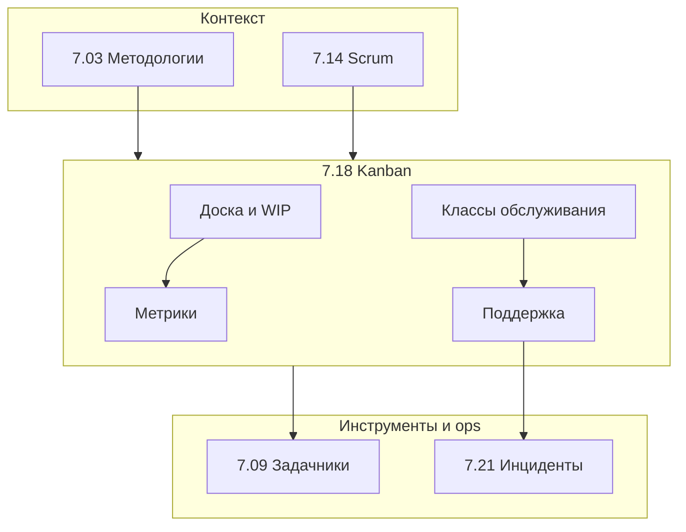

import DocCardList from '@theme/DocCardList';

# О разделе "Kanban"

**Kanban** — метод управления **потоком работ**: визуализация задач на доске, ограничение незавершённой работы (WIP), непрерывная поставка без обязательных спринтов. В разработке ПО Kanban часто соседствует со [Scrum](/encyclopedia/7-project/7-14-scrum/intro) или заменяет его в **поддержке**, **эксплуатации** и **смешанных потоках**, где одновременно идут фичи, баги и инциденты.

Обзор методологий — в [Методология и жизненный цикл ПО](/encyclopedia/7-project/7-03-metodologiya-i-zhiznennyy-tsikl-po/intro); здесь Kanban разобран **подробно**, с опорой на [Kanban Guide](https://kanbanguide.scrum.org/) и индустриальную практику (David J. Anderson, Mike Burrows, сообщество Kanban University).

  
Для кого

  

  <strong>Новичкам</strong> — чем Kanban отличается от "просто доски в Jira".

  <strong>Тимлидам и SM</strong> — WIP, метрики потока, классы обслуживания, STATIK.

  <strong>Поддержке и SRE</strong> — инциденты в общем потоке без Agile-театра.

  <strong>Аналитикам и PO</strong> — прогноз сроков по lead time, а не только по story points.

  

---

## Что вы узнаете из раздела

Kanban отвечает на практические вопросы, которые возникают уже на второй неделе работы с доской:

| Вопрос | Где искать ответ |
|--------|------------------|
| Почему у нас 40 задач "в работе", а сдаём по одной в неделю? | [WIP-лимиты](./2), [метрики](./4) |
| Как в одной команде совмещать фичи и P1-инциденты? | [Классы обслуживания](./3), [поддержка](./7) |
| Когда Kanban уместнее Scrum? | [Выбор процесса](./5), [7.03/4](/encyclopedia/7-project/7-03-metodologiya-i-zhiznennyy-tsikl-po/4) |
| С чего начать внедрение без революции с понедельника? | [STATIK и шаги](./6) |
| Как отличить настоящий Kanban от декоративной доски? | [Чек-лист](./999) |

---

## Kanban в одном абзаце

Представьте очередь в кофейне. Бариста не начинает десятый заказ, пока не выдал готовые напитки — иначе все ждут дольше. **WIP-лимит** ограничивает, сколько заказов одновременно готовятся. **Pull-система** означает, что бариста **берёт** следующий заказ из очереди, когда освободился, а не менеджер **толкает** десять заказов на одну смену.

В IT то же самое: задача проходит колонки доски, команда **вытягивает** работу по готовности и свободной мощности, а менеджмент видит **узкие места** (очередь в Code Review, зависшие Blocked). Прогноз "когда будет готово" строят по **lead time** и **cycle time**, а не только по покерной оценке.

---

## Шесть практик Kanban (Kanban Guide)

[Kanban Guide](https://kanbanguide.scrum.org/) описывает шесть практик. Без них колонки To Do / In Progress / Done — просто визуализация, а не метод:

| № | Практика | Суть |
|---|----------|------|
| 1 | **Визуализация** | Вся работа видна на доске или связанных досках |
| 2 | **Ограничение WIP** | Лимит на количество незавершённых задач в колонке или на человека |
| 3 | **Управление потоком** | Задачи движутся по pull-правилам, блокеры снимаются быстро |
| 4 | **Явные политики** | Понятно, когда карточка может перейти в следующую колонку |
| 5 | **Обратная связь** | Регулярный разбор потока (replenishment, delivery review) |
| 6 | **Эволюционное улучшение** | Процесс меняют маленькими шагами по данным, а не "новый регламент с 1 числа" |

Подробнее по каждой практике — в [главе 2](./2) (доска и WIP), [главе 3](./3) (классы обслуживания), [главе 4](./4) (метрики), [главе 6](./6) (STATIK и внедрение).

---

## Ключевые термины раздела

Ниже — словарь, к которому статьи будут возвращаться. Не обязательно запоминать всё сразу; достаточно понять идею, а детали — по ссылкам.

### WIP (Work In Progress)

**WIP** — незавершённая работа: задачи, которые уже начали, но ещё не в Done. **WIP-лимит** — максимальное число таких задач в колонке (часто в In Progress). Лимит заставляет **заканчивать начатое** вместо бесконечного старта нового.

### Pull-система (вытягивание)

**Pull** — исполнитель **сам берёт** задачу из Ready, когда освободился и есть свободный слот WIP. **Push** — менеджер **назначает** сверх лимита ("всем по задаче"). Kanban строится на pull: работа входит в поток по **готовности** и **мощности**, а не по давлению загрузки.

### Lead time и cycle time

| Метрика | Откуда | Докуда | Что показывает |
|---------|--------|--------|----------------|
| **Lead time** | Появление запроса (создание тикета) | Done | Полное время ожидания клиента |
| **Cycle time** | In Progress (начало работы) | Done | Время активной работы команды |

Lead time включает ожидание в очереди; cycle time — только работу. Прогноз сроков строят по **перцентилям** cycle time (50%, 85%), а не по среднему из трёх задач. Подробно — [глава 4](./4).

### Классы обслуживания (classes of service)

**Classes of service** — правила очереди и реакции на срочность:

- **Expedite** — критичный сбой, один такой поток на команду;
- **Fixed delivery date** — жёсткий дедлайн;
- **Standard** — обычная фича или баг;
- **Intangible** — техдолг, улучшения процесса.

Без классов всё становится expedite. Подробно — [глава 3](./3).

### CFD (Cumulative Flow Diagram)

**CFD** — накопительная диаграмма: по оси X время, по Y число задач в каждой колонке. Расширение полосы In Progress сигнализирует рост WIP; плато в Done — остановку потока. Подробно — [глава 4](./4).

### STATIK

**STATIK** — подход к **стартовому** анализу перед внедрением Kanban: Services, Transactions, Analysis, Information, Kanban. Начинают с **текущего** процесса на доске, а не с "идеальной доски из книги". Подробно — [глава 6](./6).

---

## Как Kanban связан с другими разделами

| Раздел | Связь с Kanban |
|--------|----------------|
| [7.03 Методологии](/encyclopedia/7-project/7-03-metodologiya-i-zhiznennyy-tsikl-po/intro) | Обзор Agile, выбор процесса, гибриды с каскадом |
| [7.14 Scrum](/encyclopedia/7-project/7-14-scrum/intro) | Спринты, роли, velocity; сравнение и Scrumban |
| [7.09 Задачники](/encyclopedia/7-project/7-09-bazy-znaniy-i-zadachniki/intro) | Jira, YouTrack, настройка колонок и фильтров |
| [7.21 Инциденты](/encyclopedia/7-project/7-21-incidenty-i-ekspluatatsiya/intro) | P1/P2, on-call, postmortem в потоке |
| [7.25 DoR/DoD](/encyclopedia/7-project/7-25-dostavka-i-gotovnost/intro) | Политики перехода между колонками |

---

## Типичные сценарии применения

### Команда продукта с частыми срочными правками

PO получает запросы от бизнеса каждый день. Спринт "ломается" на третий день. Kanban с WIP-лимитом и классами обслуживания даёт **предсказуемый поток** без фиктивного Sprint Planning. См. [когда выбирать Kanban](./5).

### L2/L3 поддержка и hotfix

Инженер поддержки и разработчик в одной команде: утром P1, днём мелкий баг, вечером фича. **Expedite** для инцидентов, отдельная swimlane, снижение WIP на фичи при горящем prod. См. [глава 7](./7).

### Внутри фазы госконтракта

Внешний контракт требует фазы "разработка" и "приёмка", но внутри фазы команда работает Kanban — это нормальный [гибрид](/encyclopedia/7-project/7-03-metodologiya-i-zhiznennyy-tsikl-po/4).

### Миграция со Scrum

Команда устала от Scrum-театра ([диагностика Scrum](/encyclopedia/7-project/7-14-scrum/999)): спринты ради отчёта, velocity не помогает прогнозу. Переход через **Scrumban** или полный Kanban — [глава 5](./5), [внедрение](./6).

---

## Как читать раздел

| Шаг | Материал | Содержание |
|-----|----------|------------|
| 1 | [История Kanban и отличие от Scrum](./1) | Toyota, IT, Scrum и waterfall |
| 2 | [Доска, колонки и WIP-лимиты](./2) | Визуализация, политики, pull, DoD |
| 3 | [Классы обслуживания и приоритеты](./3) | Expedite, fixed date, standard, intangible |
| 4 | [Метрики потока](./4) | Lead time, cycle time, throughput, CFD |
| 5 | [Когда Kanban лучше Scrum](./5) | Контекст выбора, Scrumban |
| 6 | [Внедрение и типичные ошибки](./6) | STATIK, с чего начать, антипаттерны |
| 7 | [Kanban в поддержке и инцидентах](./7) | L2/L3, on-call, ITSM |
| 8 | [Итоги](./998) | Сравнение с Scrum, FAQ |
| 9 | [Чек-лист самопроверки](./999) | Есть ли поток или только колонки |

Перед шагом **1** полезно прочитать [Agile](/encyclopedia/7-project/7-03-metodologiya-i-zhiznennyy-tsikl-po/3) и [Как выбрать процесс](/encyclopedia/7-project/7-03-metodologiya-i-zhiznennyy-tsikl-po/4).

  
Порядок не жёсткий

  

  Если доска уже есть, но "не работает" — начните с <a href="./999">чек-листа</a>, затем <a href="./2">WIP</a> и <a href="./4">метрик</a>.

  Если боль — инциденты в prod — сразу <a href="./7">глава 7</a> и <a href="./3">классы обслуживания</a>.

  

---

## Инструменты

Kanban не привязан к одному таск-трекеру. В энциклопедии примеры даны для **Jira** и **YouTrack** — см. [настройка досок](/encyclopedia/7-project/7-09-bazy-znaniy-i-zadachniki/21), [фильтры и отчёты](/encyclopedia/7-project/7-09-bazy-znaniy-i-zadachniki/22).

Минимум для старта:

- доска с колонками, отражающими **реальные** этапы работы;
- поле или метка **класса обслуживания**;
- возможность выгрузить **даты переходов** для cycle time;
- отчёт **CFD** или его аналог.

Физическая доска на стене с стикерами — полноценный Kanban, если соблюдаются WIP и политики. Цифровой трекер упрощает метрики, но не заменяет договорённости команды.

---

## Чего Kanban не обещает

  
Реалистичные ожидания

  

  Kanban <strong>не убирает</strong> неопределённость в требованиях и <strong>не заменяет</strong> Product Owner.

  Kanban <strong>не отменяет</strong> change management в банке или госсекторе — см. <a href="/encyclopedia/7-project/7-22-upravlenie-izmeneniyami/1">7.22</a>.

  Kanban <strong>не гарантирует</strong> мгновенное ускорение: первые недели часто показывают правду о очередях и блокерах, которую раньше не видели.

  

---

## Маршрут по материалам

<DocCardList />

---

## Быстрый старт за один день

Если нужно "попробовать Kanban" без месяца подготовки:

1. Нарисуйте **текущий** поток на доске (включая секретные задачи из чатов).
2. Договоритесь об одном **WIP-лимите** на In Progress (например, число разработчиков минус один).
3. Повесьте **политику** перехода в Review (CI зелёный, PR описан).
4. Введите метку **Blocked** с обязательной причиной.
5. Через две недели посмотрите **cycle time** хотя бы десяти закрытых задач.

Дальше — [STATIK](./6) и регулярный review потока.

---

## Глоссарий раздела (краткий)

| Термин | Статья |
|--------|--------|
| WIP, pull, политики | [2](./2) |
| Expedite, classes of service | [3](./3) |
| Lead time, cycle time, CFD | [4](./4) |
| Scrumban, выбор процесса | [5](./5) |
| STATIK | [6](./6) |
| Support, on-call | [7](./7) |

---

## Сравнение с [Scrum](/encyclopedia/7-project/7-14-scrum/intro) в одной таблице

| | Scrum | Kanban |
|---|-------|--------|
| Контейнер работы | Sprint | WIP |
| Commitment | Sprint Goal | Policies + SLA |
| Приоритеты | Product Backlog order | Ready + classes |
| Прогноз | Velocity | Cycle time % |
| Прерывания | Scope negotiation | Expedite |

Обе системы совместимы с [DoR/DoD](/encyclopedia/7-project/7-25-dostavka-i-gotovnost/intro).

---

## Истории успеха (обобщённо)

**Support desk:** lead time P3 с 12 до 5 дней за квартал после WIP=5 на L2.

**Product team:** перестали "ломать" спринт — Scrumban с expedite cap 2/month.

**Gov contractor:** Kanban внутри фазы разработки, отчёт milestones для заказчика без изменения контракта.

Цифры зависят от контекста; принцип — **измерять до/после**.

---

## Материалы для углубления

- [Kanban Guide](https://kanbanguide.scrum.org/) — бесплатно, на английском
- Раздел [7.03](/encyclopedia/7-project/7-03-metodologiya-i-zhiznennyy-tsikl-po/intro) — место Kanban среди методологий
- [7.09](/encyclopedia/7-project/7-09-bazy-znaniy-i-zadachniki/intro) — практика Jira/YouTrack

---

