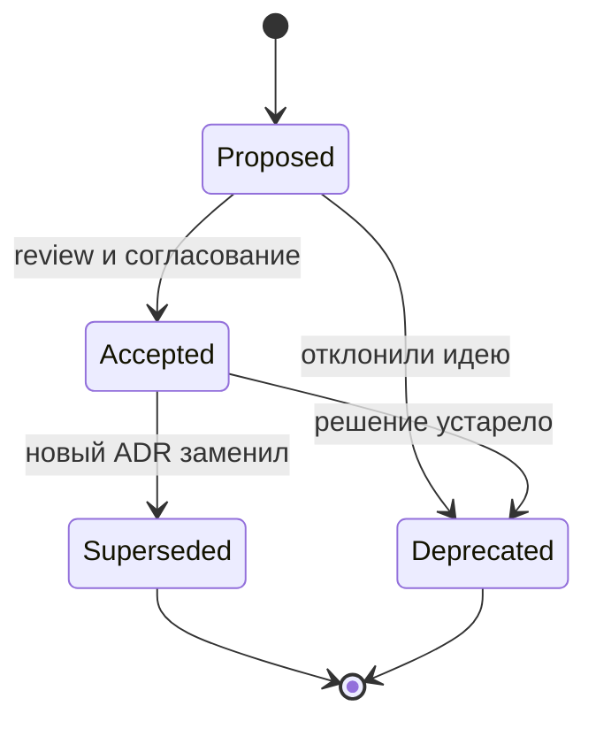

import ExternalPlayEmbed from '@site/src/components/ExternalPlayEmbed';

# ADR — запись архитектурных решений

<div class="article-tags">
  <span class="tag tag-required">ОБЯЗАТЕЛЬНО</span>
  <span class="tag tag-beginner">ДЛЯ НОВИЧКОВ</span>
</div>

<span class="complexity-badge">Архитектору</span>
<span class="complexity-badge">Разработчику</span>

---

## Почему без ADR теряется память проекта

Бизнес-требования эволюционируют, технологии обновляются, а команды растут. В этом потоке перемен архитектура проекта, его фундамент, подвергается постоянному пересмотру и адаптации. Каждое важное решение — от выбора базы данных до стратегии аутентификации или способа интеграции с внешними системами — формирует облик продукта на годы вперед. Однако парадокс в том, что контекст, в котором принимались эти решения, и альтернативы, которые были отвергнуты, быстро стираются из памяти.

Архитектура ПО - это фундаментальная структура программного продукта, определяющая организацию компонентов, их взаимосвязи, принципы взаимодействия и эволюционные траектории развития системы.

Архитектурное решение - это осознанный выбор технической стратегии или структурного паттерна, обеспечивающий достижение целевых показателей надежности, масштабируемости и сопровождаемости разрабатываемой системы.

Через год новый разработчик спросит: "Почему PostgreSQL, а не MongoDB?" или "Зачем синхронный REST, а не очередь?" Если ответ только в голове ушедшего сотрудника или в закрытом PR трёхлетней давности — команда **переоткрывает** тот же спор, тратит недели и иногда принимает **противоположное** решение без понимания последствий. Если ответы на эти вопросы не зафиксированы в доступном и структурированном виде, команда обречена повторно проживать одни и те же архитектурные обсуждения, теряя драгоценное время и ресурсы.

Последствия решений - это прямые и опосредованные изменения в кодовой базе, инфраструктуре и процессах разработки, возникающие в результате внедрения выбранного технического направления.

**ADR** (Architectural Decision Record) — короткий текстовый документ о **важном архитектурном решении**: что выбрали, в каком контексте, какие плюсы и минусы приняли, какие варианты отвергли. Идея популяризована Майклом Найгардом; в зрелых командах ADR живут рядом с кодом в Git и проходят review как [docs-as-code](/encyclopedia/7-project/7-09-bazy-znaniy-i-zadachniki/23).

ADR - это документ, фиксирующий конкретное технический выбор, контекст его принятия, рассмотренные альтернативы и зафиксированные последствия, обеспечивающий сохранение исторической памяти проекта и предотвращающий повторное обсуждение уже решенных вопросов.

<div class="callout callout--tip">
  <div class="callout-title">Одна фраза</div>
  <div class="callout-body">
  ADR — не энциклопедия архитектуры, а <strong>журнал ключевых развилок</strong>: контекст, решение, последствия, статус. Один ADR — одна значимая тема.
  </div>
</div>

Связанные разделы: [проектирование и архитектура](/encyclopedia/7-project/7-06-proektirovanie-i-arhitektura/intro), [базы знаний](/encyclopedia/7-project/7-09-bazy-znaniy-i-zadachniki/intro), [старт проекта](/encyclopedia/7-project/7-17-nachalo-raboty-na-proekte/5).

<ExternalPlayEmbed example="project/adr-lifecycle-play" title="ADR — жизненный цикл решения" minHeight={520} />

---

## Что такое ADR простыми словами

Проблема - это конкретная техническая или бизнес-ситуация, требующая устранения, оптимизации или трансформации существующих механизмов функционирования системы.

Ограничения - это формализованные границы допустимых изменений, задаваемые технологическим стеком, нормативными требованиями, бюджетными параметрами или инфраструктурными возможностями.

ADR, можно сказать, решает проблему.

| Элемент | Смысл |
|---------|--------|
| **Контекст** | Какая проблема, ограничения, NFR, команда, срок |
| **Решение** | Что выбрали (одним абзацем или списком) |
| **Последствия** | Плюсы, минусы, риски, что придётся делать дальше |
| **Статус** | Proposed, Accepted, Deprecated, Superseded |
| **Связи** | PR, тикеты, другие ADR |

ADR **не заменяет** C4-диаграммы, OpenAPI и runbook — он объясняет **почему** архитектура выглядит так, а не только **как**.

NFR - это требования к производительности, безопасности, доступности и сопровождаемости системы, задающие количественные и качественные целевые показатели эксплуатации.

Риски - потенциальные факторы, способные оказать влияние на сроки реализации, стабильность эксплуатации или соответствие системы заявленным техническим характеристикам.

Есть несколько статусов такого ADR:
- Proposed. Статус документации, обозначающий предварительное предложение архитектурного изменения, находящееся на стадии экспертного обсуждения и технического согласования.
- Accepted. Статус документации, подтверждающий утверждение архитектурного изменения командой или архитектурным советом для последующей реализации.
- Deprecated. Статус документации, указывающий на утрату актуальности принятого ранее решения в связи с изменением технологических условий или появлением более эффективных подходов.
- Superseded. Статус документации, отражающий замену ранее действовавшего архитектурного решения новым документом, вносящим коррективы в техническую стратегию.

Runbook - операционный документ, содержащий пошаговые инструкции по реагированию на типовые эксплуатационные события, восстановлению сервисов и выполнению регламентных процедур.

---

## Когда писать ADR

| Стоит зафиксировать | Можно обойтись без ADR |
|-------------------|------------------------|
| Выбор СУБД, брокера сообщений, облака | Переименование пакета |
| Монолит или сервисы, границы bounded context | Мелкий локальный рефакторинг |
| Стратегия аутентификации (OAuth2, SSO, ЕСИА) | Форматирование по линтеру |
| Стиль API (REST, события, gRPC) | Один эндпоинт без влияния на систему |
| Хранение сессий, кэш, мультирегион | Смена версии библиотеки без смены подхода |
| Интеграция с госшиной, СМЭВ, ЕБС | Правка текста на кнопке |

Выбор СУБД - процесс анализа и определения системы управления базами данных, обеспечивающей оптимальное хранение, извлечение и согласованность информационных потоков в рамках заданных нагрузок.

Выбор брокера сообщений - техническая процедура подбора посредника для асинхронного обмена событиями между распределенными компонентами, гарантирующего доставку, очередность и отказоустойчивость коммуникаций.

Выбор облака - стратегическое определение провайдера облачной инфраструктуры, предоставляющего вычислительные мощности, сетевые ресурсы и управляемые сервисы для размещения и масштабирования приложений.

Госшина - единая интеграционная платформа обмена данными между информационными системами государственных органов, обеспечивающая маршрутизацию запросов, трансформацию форматов и централизованный аудит транзакций.

Bounded context - граница предметной области, внутри которой термины, модели данных и бизнес-правила обладают однозначным значением, изолирующим их от контекстов других подсистем.

Локальный рефакторинг - модификация внутренней структуры программного модуля при сохранении его внешнего контракта, направленная на улучшение читаемости кода и упрощение дальнейшего расширения функциональности.

Стратегия аутентификации - совокупность протоколов и механизмов проверки идентичности субъектов, обеспечивающая безопасный доступ к ресурсам системы на основе многофакторной верификации и криптографических методов.

Форматирование по линтеру - автоматизированное приведение исходного кода к единому стилю написания на основе заранее заданных правил статического анализа, гарантирующее визуальную согласованность всей кодовой базы.

Стиль API - набор архитектурных соглашений, определяющий принципы взаимодействия клиентских приложений с серверными компонентами через стандартизированные интерфейсы и форматы обмена данными.

Эндпоинт - уникальный адрес сетевого ресурса или программного интерфейса, принимающий запросы от внешних потребителей и возвращающий структурированные ответы в соответствии с заданным контрактом.

Хранение сессий - механизм поддержания состояния взаимодействия пользователя с веб-приложением на протяжении определенного временного интервала, реализуемый через серверные хранилища или клиентские токены.

Смена версии библиотеки - процедура обновления внешней зависимости до новой мажорной, минорной или патч-версии, требующая проверки обратной совместимости, миграции конфигураций и регрессионного тестирования.

Переименование пакета - архитектурная операция изменения идентификатора программного модуля, требующая синхронизации ссылок, обновления конфигурационных файлов и пересборки зависимых компонентов.

Правило для новичка: если решение **дорого отменить** (месяцы работы) или о нём **регулярно спрашивают** — оформите ADR. Если сомневаетесь — лучше короткий ADR в статусе Proposed, чем спор на каждом онбординге.

Дороговизна решения - это экономическая характеристика архитектурного выбора, отражающая совокупность затрат на лицензии, вычислительные ресурсы, интеграционные работы и долгосрочное сопровождение.

---

## Шаблон Michael Nygard

Майкл Найгард - автор концепции архитектурных журналов решений, предложивший стандартизированный шаблон документирования технических выборов с обязательным указанием контекста, альтернатив и последствий.

Минимальный шаблон, с которого начинают большинство команд:

```markdown
# ADR-0007: Хранение сессий в Redis

## Статус
Принято (2024-03-12)

## Контекст
Горизонтальное масштабирование API; sticky sessions на балансировщике нежелательны.
Ожидаемая нагрузка — 5k RPS, три инстанса API за балансировщиком.

## Решение
Сессии в Redis с TTL 24 часа; JWT только для stateless mobile API.

## Последствия
+ Масштабирование без привязки клиента к одному инстансу
+ Единая точка инвалидации сессии при logout
- Зависимость от Redis; нужен мониторинг кластера и план при падении Redis
- Дополнительная задержка 1–2 мс на чтение сессии
```

Поля **Контекст** и **Последствия** — самые важные: они объясняют *почему*, а не только *что*. Рекомендуется добавить:

- **Рассмотренные варианты** — sticky sessions, JWT в cookie, in-memory;
- **Ссылки** — тикет, PR, [NFR](/encyclopedia/7-project/7-06-proektirovanie-i-arhitektura/design/1116);
- **Авторы и ревьюеры** — кто консультировался ([SA](/encyclopedia/7-project/7-04-analitika/114), [PO](/encyclopedia/7-project/7-19-produktovye-roli/1)).

---

## Расширенный шаблон для команды

```markdown
# ADR-0012: Очередь заказов на RabbitMQ

## Статус
Принято (2025-01-08)

## Контекст
Пиковая нагрузка на создание заказов; синхронная цепочка из 4 сервисов даёт p95 > 3 с.
NFR: p95 < 800 мс на приём заказа, at-least-once доставка допустима.

## Рассмотренные варианты
1. Kafka — высокая пропускная способность, сложнее эксплуатация для команды из 6 человек.
2. RabbitMQ — уже в [стеке компании], достаточный throughput.
3. PostgreSQL LISTEN/NOTIFY — без отдельного брокера, риск нагрузки на БД.

## Решение
RabbitMQ, отдельная очередь на тип заказа, идемпотентные consumer по id заказа.

## Последствия
+ Быстрый ответ API; обработка асинхронно
+ Повторная доставка без двойного списания при idempotency key
- Нужны DLQ, мониторинг lag, runbook при заторе
- Связано с ADR-0009 (идемпотентность платежей)

## Ссылки
- JIRA-4521, PR #891
```

---

## Статусы ADR

| Статус | Смысл | Действие команды |
|--------|--------|------------------|
| **Proposed** | На обсуждении, ещё не действует | Комментарии в PR, можно менять |
| **Accepted** | Действующее решение | Новый код должен соответствовать |
| **Deprecated** | Больше не применяем к новому коду | Старый код могут трогать по плану миграции |
| **Superseded by ADR-NNN** | Заменено другим ADR | Читать новый ADR, старый — для истории |

Устаревшие ADR **не удаляют** — по ним видна эволюция системы при работе с [легаси](/encyclopedia/7-project/7-11-legasi-kod/intro). Удаление "чтобы не путать" — типичная ошибка: через год никто не вспомнит, **почему** отказались от первого варианта.



---

## Где хранить ADR

docs-as-code - практика сопровождения технической документации в формате текстовых файлов системы контроля версий, обеспечивающая синхронизацию изменений документации с обновлением программного кода.

Рекомендуется **docs-as-code** — документация в том же Git, что и код:

- каталог `docs/adr/` или `adr/` в корне репозитория;
- нумерация `0001`, `0002` … — порядок **принятия**, не важности;
- файл `README.md` или `index.md` — оглавление со статусами;
- изменения через **Pull Request** и code review;
- автоматизация — [adr-tools](https://github.com/npryce/adr-tools) (`adr new`, `adr generate toc`).

Подробнее — [ADR и docs-as-code](/encyclopedia/7-project/7-09-bazy-znaniy-i-zadachniki/23). Первые ADR на старте — [архитектура на старте](/encyclopedia/7-project/7-17-nachalo-raboty-na-proekte/5).

<div class="callout callout--info">
  <div class="callout-title">Wiki или Git</div>
  <div class="callout-body">
  Confluence без связи с PR устаревает. ADR в Git <strong>версионируются</strong> вместе с кодом: видно, какое решение действовало на момент релиза. Краткие выжимки можно дублировать в [wiki](/encyclopedia/7-project/7-09-bazy-znaniy-i-zadachniki/22) со ссылкой на файл в репозитории.
  </div>
</div>

Confluence - корпоративная платформа управления знаниями, предоставляющая инструменты совместного редактирования, структурирования информационных пространств и интеграции с системами управления задачами.

---

## Кто пишет и кто ревьюит

| Роль | Участие |
|------|---------|
| Архитектор / SA | Инициирует, черновик контекста и вариантов |
| Тимлид | Feasibility, влияние на команду и сроки |
| Разработчики | Review в PR — последствия для кода |
| [PO/PM](/encyclopedia/7-project/7-19-produktovye-roli/1) | Консультант, если решение влияет на срок roadmap |
| DevOps / SRE | Эксплуатация, мониторинг, [on-call](/encyclopedia/7-project/7-21-incidenty-i-ekspluatatsiya/1) |
| Безопасность | Auth, ПДн, госсегмент |

ADR — не монолог архитектора. Один Approved без review — слабый ADR.

---

## Примеры по контекстам

### Продуктовая SaaS-компания

ADR-0003: мультитенантность через `tenant_id` в одной БД, а не отдельная БД на клиента — команда из 8 человек, 200 клиентов, изоляция на уровне row-level security. Последствие: проще деплой; риск — ошибка в запросе без фильтра tenant. Ссылка на ADR-0011 (тесты на утечку tenant).

Мультитенантность - это архитектурный принцип совместного функционирования множества независимых клиентских групп в рамках единого экземплярного экземпляра программного обеспечения при обеспечении строгой изоляции данных.

### Аутсорс для банка

ADR передано заказчику в репозитории исполнителя; после сдачи — копия в Git заказчика. В [договоре](/encyclopedia/7-project/7-01-obschee-o-biznese/3) зафиксировано: архитектурные решения уровня СУБД и интеграций — с **согласованием** архитектора заказчика. Статус Proposed до письма "согласовано".

### Госсектор

Госсектор - сфера деятельности государственных учреждений и подведомственных организаций, характеризующаяся строгим регулированием, требованиями к локализации данных и повышенными стандартами информационной безопасности.

ADR дополняет ТЗ и протоколы: "почему реляционная БД в контуре X", "почему интеграция через СМЭВ, а не прямой API". На госэкспертизу часто нужны **формальные** документы; ADR ускоряет ответы экспертам и онбординг подрядчиков смены.

---

## ADR и другие артефакты

| Артефакт | Связь с ADR |
|----------|-------------|
| C4 / диаграммы | Показывают структуру; ADR — мотивацию |
| OpenAPI / контракты | Реализация решения из ADR по API |
| [Техническое письмо](/encyclopedia/7-project/7-08-tehnicheskoe-pismo/intro) | Формальный документ для заказчика |
| Runbook | Операционные шаги по последствиям ADR (Redis down) |
| Postmortem | Может породить новый ADR или Superseded |

В PR, меняющем архитектуру, укажите: `Relates to ADR-0007` или создайте ADR в том же PR.

---

## Типичные ошибки

| Ошибка | Почему плохо | Что делать |
|--------|--------------|------------|
| ADR на 40 страниц | Никто не читает | 1–2 экрана; детали — в коде и wiki |
| Нет отвергнутых вариантов | Спор повторяется | Секция "Рассмотренные варианты" |
| Нет последствий | Неожиданный техдолг | Минусы честно, плюс action items |
| ADR в Confluence без Git | Устарело | docs-as-code |
| Удалили старый ADR | Потеря истории | Deprecated / Superseded |
| Accepted без review | Решение одного человека | PR + ревьюеры |

---

## Жизненный цикл ADR в спринте

Refinement - процесс детализации и уточнения требований к будущим задачам, обеспечивающий формирование четких критериев приемки и подготовку технического бэклога к планированию спринта.

Архитектурная встреча - специализированное рабочее совещание, посвященное обсуждению структурных изменений, оценке технических альтернатив и согласованию стратегических направлений развития системы.

1. На refinement или архитектурной встрече — тема "нужен ADR".
2. Автор — черновик **Proposed**, ссылка в тикете.
3. PR с ADR; обсуждение в комментариях (как к коду).
4. **Accepted** после merge; тикеты на реализацию ссылаются на номер.
5. При смене подхода — новый ADR, старый **Superseded**.

Spike на 1–2 дня часто **предшествует** ADR: сначала проверили гипотезу, потом зафиксировали решение.

---

## Связь с инцидентами и изменениями

Postmortem - аналитический разбор завершенного инцидента или внедрения, фиксирующий хронологию событий, выявляющий корневые причины отклонений и формирующий корректирующие действия для повышения устойчивости системы.

Postmortem после [инцидента](/encyclopedia/7-project/7-21-incidenty-i-ekspluatatsiya/1) может показать: архитектурное допущение из ADR-0004 больше не верно. Тогда новый ADR или статус Superseded — не "устное мы передумали". Крупное изменение scope из [change request](/encyclopedia/7-project/7-22-upravlenie-izmeneniyami/1) с архитектурным влиянием — повод для ADR до начала разработки.

---

## Минимальный набор ADR на старте проекта

Для [старта проекта](/encyclopedia/7-project/7-17-nachalo-raboty-na-proekte/5) часто хватает трёх–пяти записей:

1. Выбор стека и репозиторной структуры (монорепо / мультирепо).
2. СУБД и стратегия миграций.
3. Аутентификация и авторизация.
4. Стиль интеграций (sync/async).
5. Среды (dev/stage/prod) и секреты.

Не обязательно всё Accepted в день один — Proposed с датой review тоже ценность.

---

## Нумерация и именование файлов

Распространённые соглашения:

- `docs/adr/0001-use-postgresql.md` — номер в имени файла;
- заголовок внутри: `# 1. Use PostgreSQL` или `# ADR-0001: PostgreSQL`;
- **не переиспользовать** номер удалённого ADR;
- дата в статусе — дата **принятия**, не черновика.

adr-tools создаёт следующий номер автоматически — меньше конфликтов в PR.

---

## Review ADR в Pull Request

Чек-лист ревьюера:

- [ ] Понятен **контекст** без знания тайны проекта?
- [ ] Есть **минимум два** рассмотренных варианта?
- [ ] **Последствия** включают минусы и операционные затраты?
- [ ] Статус корректен (не Accepted до согласования)?
- [ ] Ссылки на тикеты/PR, где решение внедряется?
- [ ] NFR из [требований](/encyclopedia/7-project/7-06-proektirovanie-i-arhitektura/design/1116) упомянуты, если релевантны?

Комментарий "не нравится" без альтернативы — слабый review. Лучше: "вариант B с managed Kafka — сравнить стоимость в ADR".

---

## ADR и C4-диаграммы

| Уровень C4 | ADR |
|------------|-----|
| System context | Роль системы в ландшафте (иногда ADR на границу) |
| Container | **Часто** — выбор БД, API gateway, брокер |
| Component | Реже — только спорные модули |
| Code | Почти никогда — это код и тесты |

Диаграмма без ADR отвечает "как выглядит"; ADR — "почему так, а не иначе". Обе устаревают — ADR проще diff в Git.

---

## MADR и другие форматы

MADR - расширенный формат документирования архитектурных решений, включающий детализированные диаграммы, матрицы соответствия требованиям и формализованные сценарии валидации выбранных подходов.

Существуют варианты шаблона (**MADR** — Markdown ADR с полями Decision Drivers). Суть та же: контекст, решение, последствия. Команда выбирает **один** шаблон и не спорит о формате вместо содержания. В [wiki](/encyclopedia/7-project/7-09-bazy-znaniy-i-zadachniki/22) — ссылка на шаблон в репо.

---

## ADR в микросервисах и монорепо

Монорепо - стратегия организации исходного кода, предполагающая хранение всех модулей проекта, библиотек и конфигурационных файлов в едином репозитории системы контроля версий.

Мультирепо - стратегия организации исходного кода, предусматривающая разделение модулей проекта, микросервисов и библиотек по независимым репозиториям с индивидуальными циклами разработки и развертывания.

| Структура | Где ADR |
|-----------|---------|
| Монорепо | Один каталог `docs/adr/` на весь продукт |
| Мультирепо | ADR в репо **владельца** сервиса; кросс-сервисные — в platform-репо |
| Платформа + продукты | Platform ADR (Kafka) + product ADR (использование топиков) |

Platform ADR - документ, фиксирующий архитектурные решения на уровне инфраструктуры и платформенных сервисов, определяющий стандарты использования управляемых сервисов, сетевых политик и стратегий масштабирования.

Кросс-сервисный ADR без владельца — никто не обновляет при смене контракта.

---

## Пример ADR для аутсорса (интеграция 1С)

Заказчик требует обмен с 1С. ADR-0004 (статус Proposed до согласования):

- **Контекст** — 50k номенклатур, обновление раз в час, on-prem 1С заказчика.
- **Варианты** — прямой OData; файловый обмен на SFTP; message bus.
- **Решение** — SFTP + идемпотентный импорт по batch id (проще для ИБ заказчика).
- **Последствия** — lag до 1 ч; runbook при битом файле; не real-time.

Архитектор заказчика комментирует в PR — после письма "согласовано" статус Accepted.

---

## ADR после легаси-аудита

Легаси-аудит - комплексная экспертиза существующей кодовой базы и инфраструктуры, выявляющая устаревшие компоненты, накопленный технический долг и формирующая дорожную карту постепенной модернизации системы.

При [легаси](/encyclopedia/7-project/7-11-legasi-kod/intro) команда пишет **ретроспективные** ADR: "как есть сейчас" со статусом Accepted и пометкой *as-is legacy*. Это останавливает мифы. Новые ADR — Superseded по мере рефакторинга (Strangler и т.д.).

---

## Ритуалы команды

- **Архитектурный час** раз в две недели — Proposed ADR на обсуждение.
- **Онбординг** — прочитать 3 последних Accepted ADR по своему сервису.
- **Postmortem** — пункт "нужен ли новый ADR?"
- **Release notes** для внутренних команд — ссылка на ADR при ломающих изменениях.

---

## Связь с [PO](/encyclopedia/7-project/7-19-produktovye-roli/1) и сроками

ADR на месяц разработки влияет на roadmap — PO **консультируется** (C в RACI), но не пишет ADR. Если ADR откладывает фичу на квартал (например, миграция БД) — PO пересматривает backlog и [CR](/encyclopedia/7-project/7-22-upravlenie-izmeneniyami/1) к заказчику.

---

## ADR, RFC и design doc — не путать

| Артефакт | Назначение | Жизненный цикл |
|----------|------------|----------------|
| **ADR** | Одно архитектурное решение | Статусы, короткий текст |
| **RFC** | Предложение на широкое обсуждение | Draft → comment → accept |
| **Design doc** | План реализации крупной фичи | Временный, до релиза |
| **ТЗ / техписьмо** | Формальный договор с заказчиком | Версии, экспертиза |

Внутри команды ADR; перед крупной фичей на квартал — design doc со ссылками на ADR. В аутсорсе заказчику — [техписьмо](/encyclopedia/7-project/7-08-tehnicheskoe-pismo/intro), внутри — ADR.

---

## Чтение ADR новичком — порядок

1. Оглавление `docs/adr/README.md` — статусы Accepted.
2. ADR по **своему сервису** (БД, очередь, auth).
3. ADR с пометкой Superseded — понять эволюцию.
4. Proposed — можно комментировать в PR.

15–30 минут — достаточно, чтобы не спорить о Redis на первой неделе.

---

## Инструменты

| Инструмент | Назначение |
|------------|------------|
| [adr-tools](https://github.com/npryce/adr-tools) | CLI: new, generate toc |
| Git + PR | Review и история |
| [Docusaurus](/encyclopedia/7-project/7-09-bazy-znaniy-i-zadachniki/23) | Публикация adr как docs |
| Шаблон в `.github/pull_request_template.md` | Поле "ADR-NNN" |

---

## ADR при аудите и сертификации

Аудиторы ИБ и госэксперты спрашивают **обоснование** технических решений. ADR с датой Accepted и подписью review — доказательство осознанного выбора (шифрование, хранение логов, граница сети). Не заменяет формальный акт, но ускоряет ответы.

---

## Примеры номеров ADR в живом каталоге

| Номер | Тема | Статус |
|-------|------|--------|
| 0001 | PostgreSQL как основная СУБД | Accepted |
| 0002 | REST для внешнего API | Accepted |
| 0003 | JWT для mobile, cookie для web | Accepted |
| 0004 | Kafka для событий заказов | Superseded by 0012 |
| 0012 | RabbitMQ вместо Kafka (команда 6 чел.) | Accepted |
| 0013 | ЕСИА через OIDC | Proposed |

Новичок читает 0001, 0003, 0012 — понимает 80% споров первого месяца.

---

## Вопросы на архитектурном review ADR

1. Что сломается при отказе компонента из решения?
2. Как откатимся в первые 24 часа после внедрения?
3. Кто on-call по новой зависимости?
4. Соответствует ли [NFR](/encyclopedia/7-project/7-06-proektirovanie-i-arhitektura/design/1116)?
5. Нужно ли обучение команды?
6. Есть ли план миграции с текущего состояния?

Ответы — в ADR или явно "вынесено в тикет XXX".

---

## Итоги и чек-лист

[Итоги раздела](./998) · [Чек-лист](./999)

---
