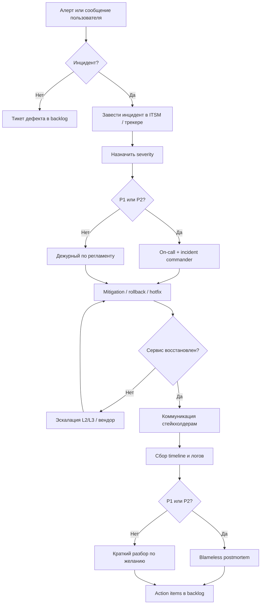
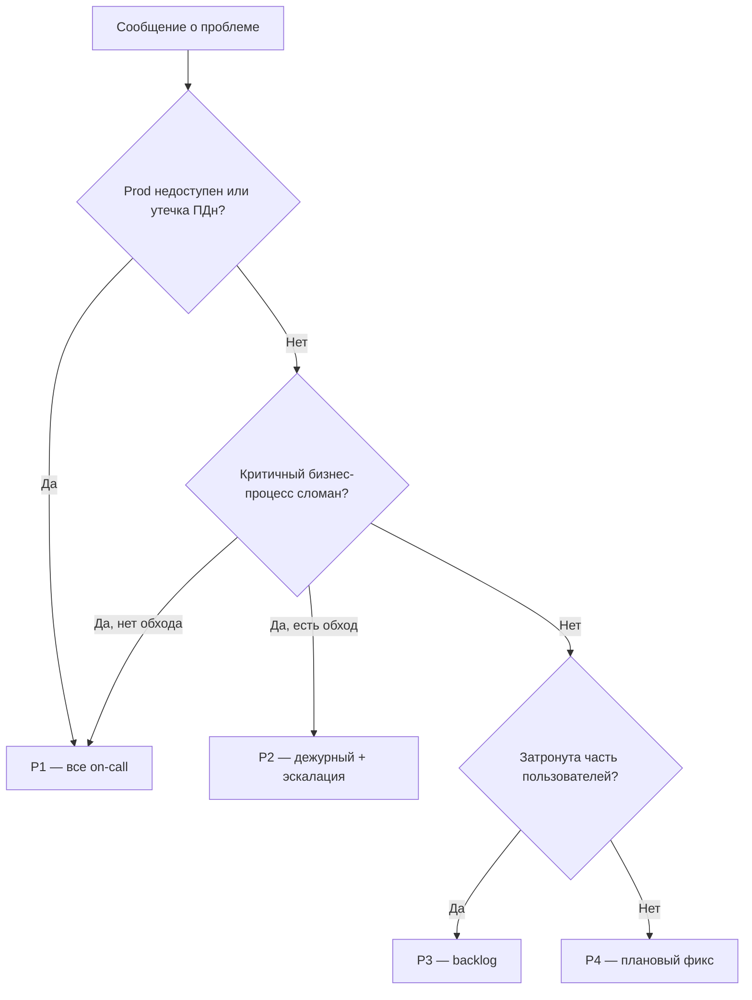

# Инциденты, on-call и postmortem

  ОБЯЗАТЕЛЬНО
  ДЛЯ НОВИЧКОВ

Разработчику
Руководителю

---

## Разработка не заканчивается на деплое

После выкладки в production система живёт **годами**. Пользователи, интеграции, нагрузка и среда меняются. Рано или поздно что-то пойдёт не так: упадёт сервис, замедлится оплата, сломается отчёт для регулятора. Зрелая команда отличает **дефект** от **инцидента**, знает **severity**, держит **on-call** и **runbook**, измеряет **MTTR** и проводит **blameless postmortem** — разбор без поиска виноватых.

Эта глава — вводный регламент для новичка. Смежные темы: [ITSM](/encyclopedia/7-project/7-16-itsm-i-it-uslugi/intro), [Kanban и Expedite](/encyclopedia/7-project/7-18-kanban/7), [DevOps](/encyclopedia/8-infra-security/8-04-devops-ci-cd/intro), [управление изменениями](/encyclopedia/7-project/7-22-upravlenie-izmeneniyami/intro).

  
Порядок при инциденте

  

  1) <strong>Восстановить сервис</strong> (mitigation, rollback, hotfix). 2) Сообщить стейкхолдерам по severity. 3) Собрать факты. 4) <strong>Postmortem</strong> и action items — когда стало тише.
  

---

## Инцидент и дефект — разные сущности

**Дефект (баг)** — несоответствие ожидаемому поведению. Находят на тестах или в эксплуатации, заводят тикет, планируют исправление в [спринте](/encyclopedia/7-project/7-14-scrum/intro) или [потоке Kanban](/encyclopedia/7-project/7-18-kanban/intro). Срочность обычно **плановая**, если баг не роняет prod.

**Инцидент (incident)** — событие, которое **сейчас** ухудшает или останавливает сервис для пользователей. Требует **немедленного** реагирования по регламенту on-call, часто через класс **Expedite** на доске ([Kanban / инциденты](/encyclopedia/7-project/7-18-kanban/7)).

| | Дефект | Инцидент |
|---|--------|----------|
| Срочность | Плановая (если не prod-down) | Немедленная |
| Цель | Исправить качественно | **Восстановить сервис**, затем найти причину |
| Процесс | Обычный backlog | On-call, эскалация, war room, postmortem |
| Метрики | Количество багов, escape rate | **MTTR**, частота P1/P2 |
| Кто владеет | PO приоритизирует в backlog | Incident commander / on-call |

Один и тот же корневой баг может **начаться** как инцидент (prod лежит), а **закончиться** тикетом на долгосрочный фикс в backlog.

---

## Severity — уровни серьёзности

**Severity** (критичность) — договорённая шкала, *насколько плохо* для бизнеса и пользователей. Названия различаются (P1–P4, SEV1–SEV4, Critical–Low), важна **одна таблица на всю организацию**.

| Уровень | Пример | Действия |
|---------|--------|----------|
| **P1** (Critical) | Prod недоступен, утечка ПДн, невозможна оплата | Все on-call, статус-страница, war room, эскалация руководству |
| **P2** (Major) | Сильная деградация, есть обходной путь | On-call в рамках [SLA](/encyclopedia/7-project/7-16-itsm-i-it-uslugi/2), частые апдейты |
| **P3** (Minor) | Ограниченное влияние, мало пользователей | Обычный приоритет в backlog, мониторинг |
| **P4** (Trivial) | Косметика, нет влияния на бизнес | Плановый релиз |

Шкала согласуется с [ITSM](/encyclopedia/7-project/7-16-itsm-i-it-uslugi/1) и договором [SLA](/encyclopedia/7-project/7-16-itsm-i-it-uslugi/2). В аутсорсе в [договоре](/encyclopedia/7-project/7-01-obschee-o-biznese/3) часто прописаны время реакции на P1 и штрафы — знайте определения до первого звонка.

  
Severity и приоритет тикета

  

  <strong>Severity</strong> — влияние на бизнес <strong>сейчас</strong>. <strong>Priority</strong> в backlog — когда починим в плане. P3 инцидент может стать P1, если совпал с днём отчётности для ЦБ.
  

### Примеры по контекстам

| Контекст | P1 | P2 |
|----------|----|----|
| Продуктовый маркетплейс | Нельзя оформить заказ | Поиск не работает, каталог открывается |
| Аутсорс для банка | Нарушен SLA по платежам | Деградация мобильного API |
| Госпортал | Недоступна подача заявления | Ошибка в статусе заявления, повторная подача возможна |

---

## MTTR и другие метрики

**MTTR** (Mean Time To Repair / Recovery) — среднее **время восстановления** сервиса после сбоя. Считают от момента обнаружения (алерт или первый тикет) до момента, когда сервис снова выполняет свою функцию для пользователей.

Что снижает MTTR:

- актуальные **runbook**;
- **rollback** в один клик или по чек-листу;
- **observability** — логи, метрики, трейсы с correlation id;
- **feature flags** для отключения сломанной части;
- регулярные **учения** (game day).

Связанные метрики:

- **MTTD** — время до обнаружения (хорошие алерты);
- **MTBF** — время между отказами;
- частота инцидентов по severity за квартал.

MTTR без postmortem оптимизирует **тушение**, но не **причину** — пожары повторяются.

---

## Поток реагирования на инцидент

---

## On-call — дежурство по инцидентам

**On-call** — ротация инженеров, которые **первыми** реагируют на алерты вне рабочего времени (и часто в рабочее, если нет отдельной L1).

Что должно быть в [wiki](/encyclopedia/7-project/7-09-bazy-znaniy-i-zadachniki/22):

- календарь дежурств и **цепочка эскалации** (5 мин → тимлид → директор);
- **runbook** — пошаговые действия по типовым алертам;
- контакты вендоров (облако, СУБД, платёжный шлюз);
- политика **отдыха** после ночного P1 (не ставить дежурного в обязательный созвон в 9:00);
- как завести инцидент и кто **incident commander**.

**L1** (первая линия) часто в [техподдержке](/encyclopedia/2-system-network/2-07-tehnicheskaya-podderzhka/intro): перезапуск по runbook, сбор скриншотов. Разработчик обычно **L2/L3** — глубокая диагностика, патч, анализ кода.

### Пример ротации в продуктовой команде

Две недели on-call у backend-разработчика, параллельно — DevOps. Алерт из Prometheus → PagerDuty → дежурный. Если за 15 минут нет прогресса — эскалация на тимлида. P1 — созвон в Slack/Teams, канал `#incident-YYYYMMDD`.

### Аутсорс

В [договоре](/encyclopedia/7-project/7-01-obschee-o-biznese/3) — время реакции на P1, доступ к prod, кто утверждает hotfix. Дежурный исполнителя координируется с on-call заказчика; без единого канала MTTR растёт из-за согласований.

---

## Runbook — пошаговая инструкция

**Runbook** — документ "что делать, когда сработал алерт X". Не заменяет понимание системы, но убирает панику в 3 ночи.

Минимальная структура runbook:

1. **Симптом** — какой алерт, что видит пользователь.
2. **Проверки** — дашборды, логи, health-check.
3. **Действия** — restart, rollback, отключить флаг, масштабировать.
4. **Эскалация** — когда звать L3, вендора, [PO](/encyclopedia/7-project/7-19-produktovye-roli/1) для коммуникации.
5. **После стабилизации** — ссылки на postmortem-шаблон.

Runbook ревьюят раз в **3–6 месяцев** или после каждого P1, где шаги устарели.

---

## Hotfix, rollback и mitigation

| Стратегия | Когда применяют | Риски |
|-----------|-----------------|-------|
| **Mitigation** (обход) | Нужно быстро снять боль | Временное решение; не забыть снять |
| **Rollback** (откат версии) | Быстрый откат безопаснее патча | Несовместимость с миграцией БД |
| **Hotfix** (срочный патч) | Откат невозможен | Меньше тестов; нужен stage или canary |

Примеры mitigation:

- включить **fallback** на старую версию расчёта;
- отключить фичу **[feature flag](/encyclopedia/7-project/7-25-dostavka-i-gotovnost/3)**;
- перенаправить трафик на резервный ЦОД;
- поднять rate limit на partner API.

В банке и госсекторе hotfix в prod часто требует **CAB** или согласования по [управлению изменениями](/encyclopedia/7-project/7-22-upravlenie-izmeneniyami/1) — знайте **tier** срочного изменения заранее.

После стабилизации — **postmortem** и action items в backlog.

---

## Blameless postmortem

**Postmortem** (разбор после инцидента) в зрелых командах **без поиска виноватых** (blameless): цель — улучшить систему и процессы, а не наказать дежурного.

Структура документа:

1. **Резюме** — что случилось, severity, длительность, MTTR.
2. **Timeline** — хронология по минутам (алерт, действия, восстановление).
3. **Root cause** — системная причина (процесс, мониторинг, архитектура, [ADR](/encyclopedia/7-project/7-20-adr-i-arhitekturnaya-pamyat/1)), а не "ошибся человек".
4. **Что сработало / не сработало** в реагировании.
5. **Action items** — тикеты с владельцами и сроками (runbook, алерт, тест, рефакторинг).
6. **Публикация** в wiki для обучения команды.

  
Five whys без охоты на ведьм

  

  Метод "пять почему" ищет <strong>системную</strong> цепочку: деплой без canary → нет политики → нет CI gate → не было ADR о стратегии релиза. Вопрос не "кто нажал deploy", а "почему процесс позволил".
  

Культура ошибок как данных — в [уважении к инженерному труду](/encyclopedia/7-project/7-02-komanda-i-upravlenie/2). Postmortem по P1 обычно в течение **5 рабочих дней** после стабилизации.

---

## Observability — наблюдаемость

**Observability** — способность понять состояние системы по **логам**, **метрикам** и **трейсам** (distributed tracing). Без них postmortem превращается в угадывание, MTTR растёт.

Минимум на production:

- централизованные логи с **correlation / trace id**;
- алерты по [SLO](/encyclopedia/7-project/7-06-proektirovanie-i-arhitektura/design/2135), не по "диск 80%" без контекста;
- дашборды для on-call (RPS, error rate, latency p95);
- трассировка между сервисами для цепочек вызовов.

Подробнее — [DevOps и CI/CD](/encyclopedia/8-infra-security/8-04-devops-ci-cd/intro), [системное администрирование](/encyclopedia/2-system-network/2-06-sistemnoe-administrirovanie/intro).

---

## Инциденты в Agile-потоке

- В Scrum инцидент P1 **прерывает** спринт — цель пересматривают с [PO](/encyclopedia/7-project/7-19-produktovye-roli/1).
- В Kanban — класс **Expedite** с правилом WIP ([Kanban](/encyclopedia/7-project/7-18-kanban/7)).
- Action items из postmortem — обычный backlog, приоритет с PO.
- Повторяющиеся P1 по одной причине — сигнал для [ADR](/encyclopedia/7-project/7-20-adr-i-arhitekturnaya-pamyat/1) или архитектурного рефакторинга.

---

## Коммуникация при инциденте

| Аудитория | Что сообщать |
|-----------|--------------|
| Пользователи | Статус-страница, ETA если известно |
| Поддержка | Обходной путь, шаблон ответа |
| Бизнес / PO | Влияние на метрики, деньги, регулятор |
| Заказчик (аутсорс) | По SLA, протокол звонка |
| Регулятор (гос) | По регламенту информирования |

Один **incident commander** координирует технику и коммуникацию — не все чинят и пишут клиентам одновременно.

---

## Роль разработчика при первом P1

1. Не паниковать — открыть runbook и канал инцидента.
2. Собирать **факты** (логи, время, версия релиза), не теории.
3. Предлагать **безопасное** восстановление (rollback часто лучше "быстрого фикса").
4. Документировать действия в тикете — для timeline postmortem.
5. После сбоя — участие в postmortem без стыда; система ломается, задача — учиться.

---

## Incident commander и роли в war room

| Роль | Задача |
|------|--------|
| Incident commander | Координация, timeline, приоритет действий |
| Tech lead / on-call | Диагностика, rollback, hotfix |
| Communications | Статус пользователям и поддержке |
| Scribe | Запись времени и действий для postmortem |
| [PO](/encyclopedia/7-project/7-19-produktovye-roli/1) / PM | Бизнес-решения (отключить фичу, компенсации) |

Один человек не должен одновременно чинить prod и писать пресс-релиз.

---

## Шаблон timeline для postmortem

| Время (UTC) | Событие |
|-------------|---------|
| 14:02 | Алерт: error rate &gt; 5% |
| 14:05 | On-call подтвердил, severity P1 |
| 14:12 | Rollback API v2.4.1 → v2.4.0 |
| 14:18 | Error rate нормализовался |
| 14:30 | Статус-страница: resolved |

Точное время важнее красивых формулировок. Источник — тикет инцидента и логи.

---

## Пример postmortem (фрагмент)

**Инцидент:** недоступна оплата 47 минут, P1. **MTTR:** 47 мин. **Root cause:** миграция БД заблокировала таблицу payments; деплой без проверки lock timeout. **Что сработало:** быстрый rollback. **Что нет:** нет алерта на длительные блокировки. **Action items:** (1) алерт на lock &gt; 30 с — владелец SRE, 2 недели; (2) миграции только с `lock_timeout` — владелец тимлид, 1 спринт; (3) game day на rollback — квартал.

---

## Game day и учения

**Game day** — запланированное учение: симуляция падения Redis, отказа AZ, отката релиза. Цели:

- проверить runbook на практике;
- измерить MTTR в безопасных условиях;
- обучить новичков без ночного P1.

В банке и госе учения иногда **обязательны** по регламенту ИБ.

---

## Статус-страница и ожидания пользователей

Для продуктов с публичным SLA — status.company.ru или встроенный баннер. Шаблоны:

- **Investigating** — разбираемся;
- **Identified** — причина известна, чиним;
- **Monitoring** — починили, наблюдаем;
- **Resolved** — всё стабильно.

Молчание при P1 усиливает репутационный ущерб сильнее самого сбоя.

---

## MTTR в аутсорсе и SLA

В [договоре](/encyclopedia/7-project/7-01-obschee-o-biznese/3) часто:

- время **реакции** (первый ответ);
- время **восстановления** (workaround или fix);
- штрафы или кредиты при нарушении.

Дежурный исполнителя должен **логировать** время обнаружения и восстановления в тикете — иначе спор об MTTR. Заказчик предоставляет доступ к логам и decision maker для emergency [CAB](/encyclopedia/7-project/7-22-upravlenie-izmeneniyami/1).

---

## Инциденты и ПДн (госсектор)

При подозрении на утечку персональных данных:

- severity **P1** по умолчанию;
- юристы и ИБ по регламенту;
- уведомление регулятора в установленный срок;
- postmortem с отдельным классифицированным приложением.

Runbook "утечка ПДн" готовят **до** инцидента, не во время.

---

## Дежурная смена — передача

В конце недели on-call передаёт:

- открытые инциденты и тикеты;
- известные риски (завтра релиз, окно CAB);
- что сломалось в прошлый раз и что не доделали из action items.

Запись в wiki или короткий созвон 15 минут — меньше сюрпризов.

---

## Алерты и усталость от шума

Правила здорового алертинга:

- каждый алерт — **действие** из runbook;
- пороги привязаны к [SLO](/encyclopedia/7-project/7-06-proektirovanie-i-arhitektura/design/2135);
- **дедуп** и группировка (не 500 тикетов за один падение Redis);
- регулярная чистка "алерт никто не смотрит".

Усталый on-call пропускает настоящий P1.

---

## Связь severity и [change request](/encyclopedia/7-project/7-22-upravlenie-izmeneniyami/1)

Emergency fix в prod — это **изменение**. Даже ночью:

- минимум запись в тикет / emergency CAB;
- кто утвердил hotfix;
- план отката если патч не помог.

Иначе postmortem и аудит (особенно в госе) — провал.

---

## Дерево решений severity (упрощённо)

Таблица в wiki должна совпадать с деревом — иначе каждый классифицирует по-своему.

---

## Эскалация к вендору облака и SaaS

При P1 с подозрением на инфраструктуру:

- открыть тикет у провайдера с **severity** по их шкале;
- сохранить incident id вендора в своём тикете;
- параллельно mitigation у себя (другой регион, кэш).

[Договор](/encyclopedia/7-project/7-01-obschee-o-biznese/3) с облаком — SLA и окно поддержки. On-call знает логин и телефон **до** аварии.

---

## Toil и автоматизация после postmortem

**Toil** — повторяющаяся ручная работа при инцидентах (ручной рестарт, чистка очереди). Action items должны отличать:

- **устранить причину** (баг, конфиг);
- **автоматизировать реакцию** (runbook → скрипт → auto-remediation).

Иначе on-call выгорает, MTTR не падает.

---

## Инцидент без production

Иногда **staging** или **интеграционный контур** падает накануне релиза — для команды это P1 по процессу, даже если пользователи не затронуты. Severity внутренняя; действия те же: восстановить, postmortem, не релизить в prod на сломанном stage.

---

## Юридические и репутационные последствия

PO и юристы подключаются при:

- утечке данных;
- невозможности исполнить договор (SLA);
- простое при приёме госэкспертизы.

Технический postmortem дополняется, не заменяется, управленческим отчётом.

---

## Словарь эксплуатации

| Термин | Определение |
|--------|-------------|
| **Инцидент** | Нарушение или деградация сервиса для пользователей |
| **Severity** | Уровень критичности (P1–P4) |
| **MTTR** | Среднее время восстановления |
| **MTTD** | Среднее время до обнаружения |
| **On-call** | Дежурный инженер по алертам |
| **Runbook** | Пошаговая инструкция по типовому сбою |
| **Postmortem** | Разбор инцидента после стабилизации |
| **Blameless** | Без поиска виноватых, фокус на системе |
| **Mitigation** | Временное снижение влияния |
| **Rollback** | Откат к предыдущей версии |
| **Hotfix** | Срочный патч в production |
| **Incident commander** | Координатор реагирования |
| **War room** | Канал/созвон для P1 |
| **Toil** | Повторяющаяся ручная операционная работа |

---

## Чек-лист дежурного на смену

**Перед сменой:**

- [ ] Прочитал передачу от предыдущего дежурного
- [ ] Доступ к prod, логам, runbook, PagerDuty
- [ ] Знаю эскалацию и substitute

**Во время смены:**

- [ ] Каждый алерт — тикет с временем
- [ ] P1 — канал инцидента, commander
- [ ] Действия в тикете для timeline

**После P1:**

- [ ] Передача открытых хвостов
- [ ] Напоминание о postmortem

---

## Итоги и чек-лист

[Итоги раздела](./998) · [Чек-лист самопроверки](./999)

---
