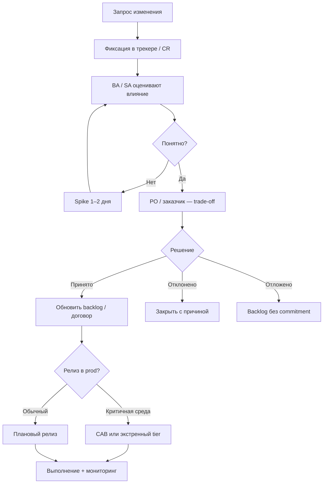

import ExternalPlayEmbed from '@site/src/components/ExternalPlayEmbed';

# Change request и управление изменениями scope

<div class="article-tags">
  <span class="tag tag-required">ОБЯЗАТЕЛЬНО</span>
  <span class="tag tag-beginner">ДЛЯ НОВИЧКОВ</span>
</div>

<span class="complexity-badge">Руководителю</span>
<span class="complexity-badge">Аналитику</span>

---

## Изменения неизбежны — хаос нет

В любом IT-проекте появляются новые пожелания: "добавьте отчёт", "переделайте интеграцию", "регулятор потребовал поле". **Agile** как раз допускает смену приоритетов. Проблема начинается, когда объём **растёт тихо** — в чатах, на демо, "пока вы тут" — а срок и бюджет остаются прежними. Это **scope creep** (незаметное расширение объёма).

**Change management** — набор правил, как обрабатывать запросы "сделайте ещё вот это" **прозрачно**: оценка влияния, решение [PO](/encyclopedia/7-project/7-19-produktovye-roli/1) или заказчика, при необходимости формальный **change request (CR)**. В production критичных систем добавляется **CAB** (Change Advisory Board) — согласование релизов.

Смежные разделы: [договор](/encyclopedia/7-project/7-01-obschee-o-biznese/3), [методология](/encyclopedia/7-project/7-03-metodologiya-i-zhiznennyy-tsikl-po/intro), [инциденты](/encyclopedia/7-project/7-21-incidenty-i-ekspluatatsiya/intro), [трекер](/encyclopedia/7-project/7-09-bazy-znaniy-i-zadachniki/21).

<div class="callout callout--tip">
  <div class="callout-title">Для разработчика</div>
  <div class="callout-body">
  Услышали "срочно добавьте" — вежливо просите тикет или CR и оценку влияния. Не начинайте без приоритета PO. Это не саботаж, а защита срока и вашего сна.
  </div>
</div>

<ExternalPlayEmbed example="project/scope-creep-simulator-play" title="Симулятор scope creep" minHeight={460} />

---

## Scope и scope creep

**Scope** (объём работ) — что входит в проект, релиз или спринт по **договорённости** (договор, backlog, ТЗ, цель спринта).

**Scope creep** — когда объём **растёт**, а сроки, бюджет и capacity команды **не пересмотрены**.

Типичные признаки:

- просьба "добавьте кнопку" в личном чате без тикета;
- ТЗ раздувается, дедлайн тот же;
- разработчик узнаёт о новом требовании только на демо;
- "это же мелочь" повторяется десять раз в неделю;
- в аутсорсе заказчик считает, что всё входит в fixed price.

Лечение: каждое изменение — в [трекер](/encyclopedia/7-project/7-09-bazy-znaniy-i-zadachniki/21); крупное — **change request** с явным trade-off (что снимаем из scope).

| Здоровый признак | Scope creep |
|------------------|-------------|
| Новое = что-то сняли или сдвинули срок | Новое = "втиснем" |
| PO сказал "да" или "нет" письменно | "Все согласны" в чате |
| Влияние на срок оценили | "Должно быстро" |

---

## Change request — что это

**Change request (CR)** — заявка на изменение **scope**, **срока**, **стоимости** или **рисков** проекта. Форма зависит от организации (Jira issue type, Word-форма, портал заказчика), суть одна: **зафиксировать разницу** между планом и новым желанием.

### Минимальные поля CR

| Поле | Содержание |
|------|------------|
| ID и дата | Уникальный номер, автор |
| Описание | Что хотят иначе, чем в текущем плане |
| Обоснование | Бизнес-цель, метрика, регламент, письмо регулятора |
| Влияние | Срок (+N дней), стоимость (+часы/руб), риски, архитектура |
| Альтернативы | Отложить, урезать, заменить другой фичей, MVP |
| Решение | Принято / отклонено / отложено / частично |
| Утверждающий | [PO](/encyclopedia/7-project/7-19-produktovye-roli/1), спонсор, заказчик |

### Fixed price и T&M

- При **fixed price** CR часто ведёт к **допсоглашению** к [договору](/encyclopedia/7-project/7-01-obschee-o-biznese/3) и пересмотру срока/суммы.
- При **T&M** (time and material) — переприоритизация backlog с фиксацией **прогноза часов** и уведомлением заказчика.
- В **продукте** без внешнего заказчика CR может быть лёгким (эпик + комментарий PO), но **trade-off** всё равно явный.

---

## Workflow change request



---

## Изменения в Agile-процессе

**Agile** не значит "меняем всё без последствий". Значит — меняем **прозрачно** и часто.

1. Запрос → тикет типа "Change" или комментарий к эпику с меткой `scope-change`.
2. [BA](/encyclopedia/7-project/7-04-analitika/113) / [SA](/encyclopedia/7-project/7-04-analitika/114) оценивают влияние; при неясности — **spike** на 1–2 дня.
3. [PO/PM](/encyclopedia/7-project/7-19-produktovye-roli/1) меняет приоритет backlog; при нехватке capacity — **снимает** другую работу (называет вслух).
4. В Scrum — пересмотр **Sprint Goal**, а не тихое дописывание задач в середине спринта ([спринт](/encyclopedia/7-project/7-14-scrum/4)).
5. В Kanban — новый элемент в очереди и пересмотр WIP, не "ещё одна карточка без лимита".

<div class="callout callout--info">
  <div class="callout-title">Цель спринта священна не больше PO</div>
  <div class="callout-body">
  Если в середине спринта прилетело изменение — PO решает: продолжаем цель, <strong>сужаем</strong> scope спринта или прерываем. Scrum Master помогает процессу, не подменяет PO.
  </div>
</div>

---

## CAB — совет по изменениям в production

**CAB** (Change Advisory Board) — формальное согласование **изменений в production** в банках, госсекторе, критичной инфраструктуре, телекоме.

Обычно фиксируют:

- **окно обслуживания** (maintenance window);
- чек-лист (тесты на stage, rollback, дежурный [on-call](/encyclopedia/7-project/7-21-incidenty-i-ekspluatatsiya/1));
- **уровни изменений** — стандартное, срочное, экстренное (emergency);
- связь с [severity](/encyclopedia/7-project/7-21-incidenty-i-ekspluatatsiya/1) при инциденте.

CAB **не должен** блокировать каждый мелкий hotfix месяцами. Зрелые организации вводят **tier**:

| Tier | Пример | Согласование |
|------|--------|--------------|
| Standard | Плановый релиз в окно вс | Полный CAB |
| Expedited | Срочный патч вне окна | Укороченный CAB |
| Emergency | P1, восстановление prod | Post-facto документирование |

Разработчик в банке должен знать tier **до** ночного деплоя, а не узнавать от отказа в тикете.

### Пример — госсектор

Релиз портала услуг — заявка в Service Desk, протокол CAB, окно в воскресенье 02:00–06:00, дежурная бригада, rollback по чек-листу. Изменение ТЗ по новому полю от ведомства — отдельный **CR** к контракту, не "впихнуть в воскресный релиз" без оценки.

---

## Примеры по контекстам

### Продуктовая компания

PM получает данные: 40% пользователей бросают корзину на шаге доставки. PO вытаскивает эпик "упростить доставку" вместо "новый раздел блога" в этом квартале. Формальный CR не нужен — достаточно решения PO в backlog с комментарием trade-off. Если затронута архитектура (новый складской API) — [ADR](/encyclopedia/7-project/7-20-adr-i-arhitekturnaya-pamyat/1).

### Аутсорс, fixed price

Заказчик просит интеграцию с 1С в том же релизе, что и личный кабинет. PM исполнителя оформляет CR: +6 недель, +N рублей, риск сдвига приёмки. Заказчик подписывает допсоглашение или отказывается. Разработчик **не** начинает 1С до статуса "принято".

### Внутренний IT

Бизнес подаёт заявку через [ITSM](/encyclopedia/7-project/7-16-itsm-i-it-uslugi/intro). Владелец услуги (PO внутреннего продукта) ранжирует с портфелем. CR — при смене SLA или бюджета департамента.

---

## Роль BA и SA в change request

| Роль | Вклад в CR |
|------|------------|
| BA | Уточнение требований, дельта к ТЗ/AC, влияние на процессы |
| SA | Техническое влияние, интеграции, NFR, оценка риска |
| PO/заказчик | Решение принять / отклонить, что снять из scope |
| PM | Срок, бюджет, коммуникация со стейкхолдерами |
| Юрист (аутсорс) | Допсоглашение при fixed price |

Без оценки влияния CR — просто пожелание. Spike допустим для "не знаем, сколько стоит ЕСИА".

---

## Роль разработчика при "срочной просьбе"

1. Предложить оформить CR или тикет и **оценить влияние** (хотя бы порядок: дни/недели).
2. Не начинать работу без приоритета [PO](/encyclopedia/7-project/7-19-produktovye-roli/1).
3. Эскалировать к PM, если давление обходит процесс.
4. При изменении prod — следовать CAB/runbook, не "задеплою с ноутбука".
5. Фиксировать устные "да" в комментарии к тикету — защита для всех.

---

## Связь с инцидентами и релизами

- **Emergency change** после P1 — отдельный поток CAB, post-facto отчёт.
- Плановый релиз с новым scope без CR при fixed price — юридический и репутационный риск.
- [Postmortem](/encyclopedia/7-project/7-21-incidenty-i-ekspluatatsiya/1) может породить CR на техдолг (мониторинг, тесты).

---

## Антипаттерны change management

| Антипаттерн | Последствие |
|-------------|-------------|
| "Устное OK" директора | Спор на приёмке |
| CR без оценки | Недоверие заказчика |
| PO не в курсе | Scope creep в спринте |
| CAB на каждый hotfix P1 | MTTR растёт |
| Нет CAB на критичный prod | Аварии от непротестированного |
| Все CR принимаются | Ничего не успевают |

---

## Минимальный регламент для маленькой команды

Даже без CAB и юристов:

1. Один трекер, метка `change`.
2. PO комментирует trade-off в эпике.
3. Крупное (> N дней) — короткая форма CR в wiki.
4. Релиз в prod — чек-лист rollback ([доставка](/encyclopedia/7-project/7-25-dostavka-i-gotovnost/intro)).

---

## Пример формы change request

```markdown
# CR-2025-014: Интеграция с ЕСИА

## Описание
Вход через ЕСИА вместо логина по email в личном кабинете.

## Обоснование
Требование заказчика-госоргана, п. 4.2 ТЗ v1.3.

## Влияние
- Срок: +4 недели к этапу 2
- Стоимость: +320 ч по ставке T&M
- Риски: зависимость от тестового контура ЕСИА
- Архитектура: новый ADR-0018 (OAuth2/OIDC)

## Альтернативы
1. MVP без ЕСИА в этапе 2 — отклонено заказчиком
2. Только для госсегмента пользователей — частично принято

## Решение
Принято 2025-06-10, подпись куратора Иванова И.И.

## Trade-off
Снято из этапа 2: экспорт отчётов в Excel.
```

---

## Baseline scope и версии ТЗ

**Baseline** — снимок согласованного объёма на дату (ТЗ v1.0, backlog release 2.0). Любая дельта сравнивается с baseline в CR. В госпроектах версия ТЗ в протоколе — юридическая опора. В продукте baseline — релизная тема в [трекере](/encyclopedia/7-project/7-09-bazy-znaniy-i-zadachniki/21).

---

## Переговоры с заказчиком при CR

1. **Факты** — оценка BA/SA, не "нам кажется долго".
2. **Варианты** — полный scope / MVP / отложить / доплата.
3. **Последствия отказа** — что не получит заказчик (не угроза, а прозрачность).
4. **Письменное решение** — протокол, email, статус в портале.

PM исполнителя **не** обещает срок устно на демо без оценки — классический источник scope creep.

---

## Change board на уровне портфеля

В крупных организациях CR смотрит **change board** (не путать с CAB): приоритет между проектами, бюджет, зависимости. PO одного продукта готовит CR; board решает, вытесняет ли запрос другой инициативу. Разработчик видит результат как сдвиг приоритета в backlog.

---

## Scope creep в цифрах

Признаки для ретро:

- velocity упала при "том же" scope спринта;
- % задач без связи с целью спринта вырос;
- закрытых CR за квартал — 0, а ТЗ выросло на 40%;
- T&M часы +30% при неизменном roadmap.

[PO](/encyclopedia/7-project/7-19-produktovye-roli/1) и PM разбирают причины — часто обход процесса, а не лень команды.

---

## CAB — чек-лист заявки на релиз

- [ ] Версия и changelog
- [ ] Тесты на stage пройдены
- [ ] Rollback проверен
- [ ] [On-call](/encyclopedia/7-project/7-21-incidenty-i-ekspluatatsiya/1) назначен
- [ ] Окно обслуживания согласовано
- [ ] Связанные CR и [ADR](/encyclopedia/7-project/7-20-adr-i-arhitekturnaya-pamyat/1)
- [ ] Коммуникация поддержке и пользователям

Emergency tier — укороченный список + post-facto отчёт за 24 ч.

---

## Продукт без формального CR

Достаточно **прозрачного trade-off** в эпике:

> "Добавили оплату СБП. Сняли: редизайн профиля (эпик PRO-441) → Q3."

[Kanban](/encyclopedia/7-project/7-18-kanban/intro) policies могут требовать комментарий PO при любом Expedite из-за стейкхолдера.

---

## Регресс scope после инцидента

После P1 заказчик или бизнес может просить "ещё страховки". Оформляйте как CR или эпик техдолга с оценкой — не бесплатное дополнение к "исправлению вины". [Postmortem](/encyclopedia/7-project/7-21-incidenty-i-ekspluatatsiya/1) action items уже в backlog; дублировать без приоритета PO нельзя.

---

## Типы договора и изменения

| Модель | Как меняется scope |
|--------|-------------------|
| Fixed price | CR → допсоглашение → новая сумма/срок |
| T&M | CR или письмо → прогноз часов → приоритет PO |
| Retainer | Ежемесячный лимит часов, CR при превышении |
| Внутренний продукт | Trade-off в backlog, бюджет департамента |
| Гос контракт | Допсоглашение, экспертиза, протокол |

Разработчик знает модель — иначе непонятно, почему PM требует подпись на "мелочи".

---

## Протокол изменения в середине спринта

1. Запрос зафиксирован (тикет / CR).
2. PO созывает **короткое** совещание (15–30 мин): цель спринта ещё актуальна?
3. Варианты: сузить scope спринта; прервать спринт; отклонить до следующего.
4. Решение PO в комментарии к спринту — видно на [Daily](/encyclopedia/7-project/7-14-scrum/3).
5. [Scrum Master](/encyclopedia/7-project/7-14-scrum/2) следит за процессом, не за содержанием приоритета.

---

## Release train и заморозка scope

В release train (поезд релизов) за N дней до даты — **freeze**: только баги и CR с tier emergency. Новые фичи — в следующий поезд. PO и PM коммуницируют freeze заранее; обход freeze — формальный CR с риском сдвига поезда для всех команд.

---

## Документирование устного согласия

Если PO сказал "да" на созвоне:

- BA или PM пишет **протокол** в тикет в тот же день;
- перечисляет trade-off;
- PO подтверждает реакцией в тикете.

Для заказчика в аутсорсе — email или портал, не только созвон.

---

## Метрики change management

| Метрика | Назначение |
|---------|-------|
| Количество CR / квартал | Объём изменений |
| % CR принятых | Реалистичность запросов |
| Среднее время согласования CR | Узкое место |
| Scope creep hours (T&M) | Часы вне baseline |
| Релизы без rollback-плана | Риск CAB |

Ретро раз в квартал с PM и [PO](/encyclopedia/7-project/7-19-produktovye-roli/1).

---

## Словарь управления изменениями

| Термин | Определение |
|--------|-------------|
| **Scope** | Согласованный объём работ |
| **Scope creep** | Рост объёма без пересмотра срока и бюджета |
| **Change request** | Формальная заявка на изменение |
| **CAB** | Совет по согласованию prod-изменений |
| **Baseline** | Зафиксированный scope на дату |
| **Trade-off** | Явный обмен — что снимаем |
| **Freeze** | Заморозка scope перед релизом |
| **Emergency change** | Срочное изменение при P1 |
| **Допсоглашение** | Юридическое изменение контракта |
| **Spike** | Краткое исследование для оценки CR |

---

## Сценарий — "это же одна кнопка"

1. Продажи просят кнопку "экспорт в PDF" в отчёте.
2. Разработчик: тикет + оценка с BA — 3 дня (шаблон, права, очередь).
3. PO: берём вместо "улучшения профиля" в спринте.
4. В аутсорсе fixed price — CR-015, заказчик подписывает, сдвиг этапа на неделю.
5. В prod банка — релиз в окно CAB в воскресенье.

Без шагов 2–4 — **scope creep** и срыв цели спринта.

---

## Итоги и чек-лист

[Итоги](./998) · [Чек-лист](./999)

---
