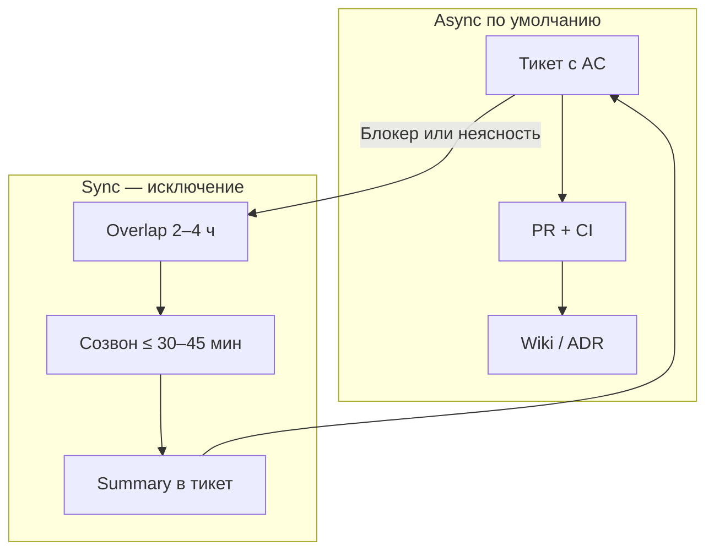

# Удалённая и распределённая команда

<div class="article-tags">
  <span class="tag tag-required">ОБЯЗАТЕЛЬНО</span>
  <span class="tag tag-beginner">ДЛЯ НОВИЧКОВ</span>
</div>

<span class="complexity-badge">Руководителю</span>
<span class="complexity-badge">Разработчику</span>

---

## Удалёнка — это другой режим работы

**Удалённая команда** — люди работают не из одного офиса: разные города, страны, часовые пояса. **Распределённая команда** — то же по сути; иногда подчёркивают, что нет "главного" офиса, где принимают все решения.

Новичку кажется: "есть Zoom и Slack — чем не офис?" Проблема в **неявном контексте**. В офисе вы подслушали обсуждение у доски. Удалённо — если это не в [тикете](/encyclopedia/7-project/7-09-bazy-znaniy-i-zadachniki/21) или [wiki](/encyclopedia/7-project/7-09-bazy-znaniy-i-zadachniki/22), для вас этого не было.

Базовые опоры распределённой работы:

1. **Documentation-first** — решение в wiki или [ADR](/encyclopedia/7-project/7-20-adr-i-arhitekturnaya-pamyat/1), не только в записи звонка.
2. **Async-first** — сначала текст; созвон, когда текст не помог.
3. **Overlap window** — общие часы для синхронных встреч.
4. **Явные ожидания** — SLA ответа в чате, без культуры "онлайн 24/7".

См. [команду и управление](/encyclopedia/7-project/7-02-komanda-i-upravlenie/intro), [методологию](/encyclopedia/7-project/7-03-metodologiya-i-zhiznennyy-tsikl-po/intro), [итоги раздела](./998).

<div class="callout callout--tip">
  <div class="callout-title">Для junior</div>
  <div class="callout-body">
  Не стесняйтесь задавать вопросы <strong>в тикете</strong> с @mention — так ответ увидят все, кто подключится позже. Личка "быстрый вопрос" часто теряется для команды.
  </div>
</div>

---

## Async-first — асинхронность по умолчанию

**Async-first** — способ организации работы, при котором **основной канал асинхронный**: тикет, комментарий, PR, документ. Синхронный созвон — **исключение**, когда:

- за разумное время (4–8 рабочих часов) текстом не сдвинулись;
- нужен парный разбор сложного бага или дизайна;
- эмоционально заряженный конфликт лучше снять голосом (и сразу зафиксировать итог письменно).

### Что писать асинхронно

| Ситуация | Канал | Минимум в сообщении |
|----------|-------|---------------------|
| Новая задача | Тикет | Цель, AC, ссылки, assignee |
| Вопрос по API | Тред к тикету | Что пробовали, лог, версия |
| Code review | PR | Конкретные комментарии к строкам |
| Архитектурный выбор | ADR + ссылка в PR | Альтернативы, решение, последствия |
| Блокер | Тикет + @тимлид | Что блокирует, что нужно, до когда |

### Чего избегать

- "Созвонимся?" без контекста в одном предложении — собеседник в другом TZ не понимает срочность.
- Решение только в DM — коллеги из EU проснутся без контекста.
- Пинг "ты тут?" без вопроса — лучше сразу сформулировать запрос; человек ответит в SLA.



### SLA ответа

Команда договаривается явно, например:

- **Срочный инцидент** — канал on-call, реакция по [runbook](/encyclopedia/7-project/7-21-incidenty-i-ekspluatatsiya/1).
- **Обычный вопрос в чате** — ответ в течение **рабочего дня** автора в его TZ.
- **PR review** — первый ответ в 24 рабочих часа или в договорённый день (например, "review по вторникам и четвергам").

<div class="callout callout--info">
  <div class="callout-title">Async ≠ медленно</div>
  <div class="callout-body">
  Хорошо оформленный тикет с AC экономит дни переписки. Это связано с <a href="/encyclopedia/7-project/7-25-dostavka-i-gotovnost/1">Definition of Ready</a>: задача готова к работе, когда её можно взять без созвона.
  </div>
</div>

---

## Documentation-first

**Documentation-first** — критичные решения **фиксируют письменно** до или сразу после обсуждения.

| Тип информации | Где хранить |
|----------------|-------------|
| Требования, AC | Тикет ([YouTrack/Jira](/encyclopedia/7-project/7-09-bazy-znaniy-i-zadachniki/21)) |
| Архитектура | [ADR](/encyclopedia/7-project/7-20-adr-i-arhitekturnaya-pamyat/1) |
| Процессы, онбординг | [Wiki](/encyclopedia/7-project/7-09-bazy-znaniy-i-zadachniki/22), [онбординг-пакет](/encyclopedia/7-project/7-09-bazy-znaniy-i-zadachniki/24) |
| Итог встречи | Summary в тикете: решения, action items, владельцы |
| API контракт | OpenAPI + wiki для потребителей |

**Запись Zoom** — дополнение, не замена. Запись редко пересматривают; текст ищут за секунды.

Шаблон summary после созвона:

```markdown
## Итог созвона 2026-06-15 (overlap MSK/CET)

**Участники:** @anna, @pavel, @marie

**Решения:**
1. Используем OAuth2 client credentials для интеграции X — ADR-042.
2. Релиз на stage — 2026-06-18 EOD UTC.

**Action items:**
- [ ] @pavel — PR auth middleware — до 2026-06-17
- [ ] @marie — тест-кейсы login — тикет QA-881

**Открытые вопросы:** лимит rate limit — эскалация к PO.
```

---

## Часовые пояса

**Time zone (TZ)** — смещение локального времени относительно UTC. Москва — UTC+3 (MSK), Берлин — UTC+1/+2 (CET/CEST летом), Лондон — UTC+0/+1 (GMT/BST).

Ошибки без TZ-дисциплины:

- "К пятнице" — чья пятница?
- "Утренний daily" — для EU это ещё ночь или наоборот ранний стресс каждый день.
- On-call handoff без явного времени — инцидент "висит" между регионами.

### Практики работы с TZ

| Практика | Результат |
|----------|-----------|
| В профиле и календаре указан **TZ** каждого | Меньше случайных звонков в нерабочее время |
| **Ротация** времени общих встреч раз в 1–2 месяца | Нагрузка распределена справедливо |
| **Summary** daily в треде чата | Пропустившие live в курсе |
| Дедлайны в **UTC** или "2026-06-20 18:00 MSK / 17:00 CEST" | Нет двусмысленности |
| World Clock / календарь с несколькими TZ | PO видит overlap до планирования |

Подробнее — [FAQ команды и управления](/encyclopedia/7-project/7-02-komanda-i-upravlenie/998).

### Overlap window

**Overlap window** — 2–4 часа, когда рабочие дни **пересекаются** у большинства участников. В это окно ставят:

- daily (если sync);
- planning / refinement (короткие);
- парное программирование;
- эскалацию блокеров.

Вне overlap — **только async**, кроме инцидентов по runbook.

---

## Пример: команда Россия + EU

Типичный состав продуктовой команды:

| Роль | Локация | TZ | Рабочие часы (локально) |
|------|---------|-----|-------------------------|
| Backend | Москва | MSK UTC+3 | 10:00–19:00 |
| Frontend | Санкт-Петербург | MSK UTC+3 | 11:00–20:00 |
| QA | Берлин | CEST UTC+2 | 09:00–18:00 |
| PO | Лондон | BST UTC+1 | 09:30–18:30 |
| DevOps | Варшава | CEST UTC+2 | 10:00–19:00 |

**Overlap MSK ↔ CEST:** примерно **10:00–14:00 MSK** = **09:00–13:00 CEST** — все онлайн.

```mermaid
gantt
    title Рабочий день и overlap (летнее время)
    dateFormat HH:mm
    axisFormat %H:%M

    section MSK Moscow
    Backend           :10:00, 9h

    section CEST Berlin
    QA                :09:00, 9h

    section BST London
    PO                :09:30, 9h

    section Overlap
    Sync window       :crit, 10:00, 4h
```



**Расписание ритуалов (пример):**

| Ритуал | Время | Формат |
|--------|-------|--------|
| Daily | 10:30 MSK / 09:30 CEST | 15 мин sync + summary в Slack |
| Refinement | Вт 11:00 MSK | Async-вопросы за день до; sync 45 мин |
| Planning | Раз в 2 недели, overlap | Agenda в wiki заранее |
| Retro | Пт 10:00 MSK | Miro + 30 мин sync |

**Дедлайн спринта:** "2026-06-27 17:00 UTC" — все переводят в локальное время сами.

**On-call:** primary EU 09:00–21:00 CEST, secondary MSK 10:00–22:00 MSK — handoff в wiki с точным UTC.

<div class="callout callout--caution">
  <div class="callout-title">Летнее и зимнее время</div>
  <div class="callout-body">
  EU переводит часы, Россия — нет. Раз в год overlap "съезжает" на час. Обновите wiki и календарь recurring-встреч.
  </div>
</div>

---

## Ежедневная синхронизация удалённо

**Daily** (ежедневный стендап) — короткая синхронизация: вчера / сегодня / блокеры. В удалёнке допустимы форматы:

### Sync daily (в overlap)

- Длительность **≤ 15 минут**; детали — в [тикете](/encyclopedia/7-project/7-09-bazy-znaniy-i-zadachniki/21).
- Камера — по желанию команды.
- Модератор следит за временем; "парковка" длинных тем — отдельный созвон.
- Сразу после — **3–5 строк summary** в треде для тех, кто спал.

### Async daily

Каждый до 10:00 своего локального времени пишет в канал `#daily`:

```
Вчера: закрыл PR-441, миграция на stage.
Сегодня: интеграционные тесты checkout.
Блокеры: жду доступ к sandbox партнёра (тикет INT-90).
```

Тимлид раз в overlap просматривает блокеры и эскалирует.

| Критерий | Sync | Async |
|----------|------|-------|
| Команда в одном TZ | Удобно | Реже нужно |
| Russia + EU | В overlap | Хорошая альтернатива в "тяжёлые" дни |
| Много блокеров | Sync быстрее | Нужен быстрый ответ тимлида |

См. [ежедневные стендапы](/encyclopedia/7-project/7-02-komanda-i-upravlenie/111).

---

## Инструменты удалённой команды

| Категория | Примеры | Задача |
|-----------|---------|--------|
| Чат с **тредами** | Slack, Teams, Mattermost | Обсуждения без потери контекста |
| Видео | Zoom, Meet, Teams | Созвоны по необходимости |
| **Трекер** | Jira, YouTrack, Linear | Статус, assignee, блокеры |
| **Wiki** | Confluence, Notion | Процессы, runbook, онбординг |
| Git + CI | GitHub, GitLab | PR, review, автотесты |
| Доска | Miro, FigJam | Retro, схемы на sync-сессиях |

Правила:

- **Один источник правды по статусу** — трекер, не "готово" только в чате.
- Треды — для тем >3 сообщений.
- @channel — только инциденты и критичные объявления.

[Базы знаний и трекеры](/encyclopedia/7-project/7-09-bazy-znaniy-i-zadachniki/intro) · [Git](/encyclopedia/4-code-dev/4-13-osnovy-raboty-s-git/intro).

---

## Онбординг без офиса

Новый человек в удалёнке не может "посидеть рядом". Нужен [онбординг-пакет](/encyclopedia/7-project/7-09-bazy-znaniy-i-zadachniki/24):

- доступы (Git, трекер, wiki, чаты) — чек-лист первого дня;
- buddy на 2–4 недели в **том же или соседнем TZ**;
- первая задача с чётким DoR — не "разберись с проектом";
- ссылки на [ADR](/encyclopedia/7-project/7-20-adr-i-arhitekturnaya-pamyat/intro), [как мы делаем PR](/encyclopedia/7-project/7-10-kultura-koda/intro);
- welcome-созвон в overlap — знакомство, не лекция на 2 часа.

См. [начало работы на проекте](/encyclopedia/7-project/7-17-nachalo-raboty-na-proekte/intro).

---

## Язык и смешанные команды

Часть команды работает на русском, часть на английском — норма для EU+RU продуктов.

| Артефакт | Язык |
|----------|------|
| Код, комментарии в PR | Английский (обычно) |
| User-facing release notes | Язык продукта / рынка |
| Runbook on-call | Язык дежурных **или** bilingual summary в шапке |
| Wiki процессов | Язык команды + ключевые термины в [глоссарии](/encyclopedia/7-project/7-04-analitika/1231) |
| Тикеты | Один язык на проект — договорённость в wiki |

<div class="callout callout--tip">
  <div class="callout-title">Bilingual summary</div>
  <div class="callout-body">
  В шапке runbook: <strong>EN:</strong> Restart service X if queue &gt; 1000. <strong>RU:</strong> Перезапустить сервис X при очереди &gt; 1000. On-call не тратит минуты на перевод в инциденте.
  </div>
</div>

---

## Безопасность и границы в удалёнке

- Корпоративный VPN и [ИБ-политика](/encyclopedia/8-infra-security/8-07-informatsionnaya-bezopasnost/intro) — не обходить "потому что дома".
- Экран на созвоне — без окон с секретами; демо на stage.
- Личные устройства — по политике компании (MDM, запрет на prod-доступ).
- **П Right to disconnect** — не ожидать ответа вне SLA без инцидента.

---

## ИИ и Copilot в распределённой команде

Когда [Copilot/LLM](/encyclopedia/7-project/7-24-ii-v-proektnom-protsesse/1) в IDE — политика **в wiki**, доступная всем TZ:

- что можно отправлять в облачную модель;
- обязательность review PR;
- запрет секретов в промптах.

Async-команда особенно зависит от **прозрачности в PR** ("использовал Copilot для тестов").

---

## Planning и refinement в удалёнке

**Sprint planning** и **backlog refinement** — моменты, где без подготовки sync растягивается на 3 часа.

### Refinement async-first

1. PO публикует **agenda** за 24–48 ч: список тикетов с черновыми AC.
2. Dev/QA оставляют **комментарии** в тикетах: вопросы, риски, missing DoR.
3. BA дополняет AC **до** sync-сессии в overlap.
4. Sync 45–60 мин только на **спорные** пункты и оценку.

| Артефакт | Где | Когда |
|----------|-----|-------|
| Agenda refinement | Wiki / pinned в канале | −2 дня |
| Обновлённые AC | Тикет | −1 день |
| Решения sync | Summary в тикете | +1 ч после встречи |

[Scrum planning](/encyclopedia/7-project/7-14-scrum/3) · [DoR](/encyclopedia/7-project/7-25-dostavka-i-gotovnost/1).

### Sprint planning

- Capacity считают **до** встречи (отпуска, праздники EU vs RU).
- В план попадают только **DoR-ready** задачи.
- Sprint Goal — **одно предложение** в wiki; mid-sprint change — через [change](/encyclopedia/7-project/7-22-upravlenie-izmeneniyami/1).

---

## Парная работа и mob-сессии

**Pair programming** в удалёнке возможен в overlap:

- инструменты: VS Code Live Share, JetBrains Code With Me, screen share;
- слоты 60–90 мин в календаре, не "когда получится";
- **rotate** driver/navigator каждые 25 мин;
- итог — commit или тикет "что сделали".

Если overlap нет — **async pair**: один открывает draft PR, второй review в течение SLA с комментариями; на следующий день overlap — 30 мин sync только если комментарии не закрыли вопрос.

---

## Retro и team health удалённо

**Retrospective** без офиса:

| Формат | Когда |
|--------|-------|
| Async board (Miro, FigJam) 48 ч | Большая TZ-разница |
| Sync 45 мин в overlap | Нужен эмоциональный разговор |
| Опрос (Google Form) + sync top-3 | Смешанная команда |

Правила:

- action items — **в тикетах** с assignee;
- не превращать retro в status meeting;
- тема **TZ fatigue** — отдельный пункт раз в квартал.

[Команда и управление](/encyclopedia/7-project/7-02-komanda-i-upravlenie/intro).

---

## Календарь и focus time

- **No-meeting blocks** — 2–4 ч в локальном календаре; уважать у коллег.
- В описании встречи: **цель**, ссылка на тикет, agenda.
- Отмена optional meetings, если async summary достаточно.
- Праздники: RU vs EU — [календарь](/encyclopedia/7-project/7-02-komanda-i-upravlenie/998) в wiki (8 марта, Рождество EU и т.д.).

<div class="callout callout--info">
  <div class="callout-title">Focus time в EU+RU</div>
  <div class="callout-body">
  Overlap 4 ч — не значит 4 ч только созвоны. Зафиксируйте: daily 15 мин + один слот collaboration; остальное overlap — доступность в чате, не обязательные meetings.
  </div>
</div>

---

## Недельное расписание (пример Russia + EU)

| День | MSK (Backend) | CEST (QA) | Активность |
|------|---------------|-----------|------------|
| Пн | 10:00 daily | 09:00 daily | Sync 15 мин + summary |
| Вт | Refinement async | Комментарии в Jira | — |
| Ср | 11:00 refinement sync | 10:00 | 45 мин спорные тикеты |
| Чт | PR review batch | PR review batch | Async |
| Пт | 10:00 retro (раз в 2 нед.) | 09:00 | 30–45 мин |

**Release cut:** четверг 17:00 UTC — [release notes](/encyclopedia/7-project/7-25-dostavka-i-gotovnost/2) опубликованы; EU QA успевает sign-off, MSK dev — hotfix window до пятницы 14:00 UTC.

---

## Конфликты и обратная связь

В удалёнке недопонимание копится в тексте. Правила:

1. **Assume good intent** — начинать с уточнения в треде, не с passive-aggressive.
2. Эскалация к тимлиду — с **ссылками** на тикеты, не пересказ "он сказал".
3. Сложный feedback — короткий **sync 1:1** в overlap, затем summary договорённостей.
4. Публичный конфlict в канале — модератор переводит в тред или тикет.

---

## Метрики зрелости удалёнки

| Метрика | Здорово | Тревога |
|---------|---------|---------|
| % встреч с опубликованным summary | &gt;90% | &lt;50% |
| Среднее время ответа в чате (раб. часы) | В пределах SLA | Часы молчания |
| Задачи, возвращённые из IP (no DoR) | Снижается | Растёт |
| On-call handoff без gap | 0 gap | Инцидент "между" регионами |

Не KPI наказания — input для retro.

---

## Типичные ошибки

| Ошибка | Последствие | Что делать |
|--------|-------------|------------|
| Все решения на созвонах | EU не в курсе | Summary + ADR |
| Нет overlap | Блокеры висят сутки | 2–4 ч общего окна |
| "К пятнице" без TZ | Срыв релиза | UTC + явные TZ |
| Daily 45 минут | Усталость, пропуски | 15 мин + тикеты |
| Онбординг = "спроси в Slack" | Потерянный junior | Онбординг-пакет |
| DM вместо тикета | Bus factor | Один URL на задачу |

---

## Связь с доставкой и качеством

Удалёнка усиливает значение [DoR/DoD](/encyclopedia/7-project/7-25-dostavka-i-gotovnost/intro):

- **DoR** — задачу можно взять без созвона с PO;
- **DoD** — результат проверяем по чек-листу, demo не обязательно live для всех.

[Release notes](/encyclopedia/7-project/7-25-dostavka-i-gotovnost/2) и [feature flags](/encyclopedia/7-project/7-25-dostavka-i-gotovnost/3) помогают выкатывать без "все собрались в 3 ночи по MSK".

---

## Итоги и чек-лист

Краткое резюме — [итоги](./998). Самопроверка команды — [чек-лист](./999).

---
