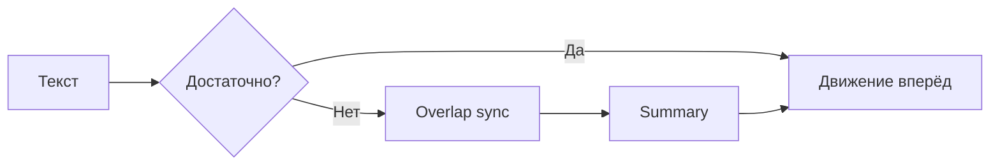

# Удалённая команда — итоги

Раздел собрал практики, без которых распределённая IT-команда быстро скатывается в хаос переписок и ночных созвонов. Ниже — сжатое резюме для тимлида, PM и разработчика.

---

## Главные принципы

| Принцип | Суть |
|---------|------|
| **Async-first** | Сначала тикет, тред, PR; созвон — когда текст не сработал |
| **Documentation-first** | Решения в wiki и [ADR](/encyclopedia/7-project/7-20-adr-i-arhitekturnaya-pamyat/1), summary после встреч |
| **Overlap window** | 2–4 часа общего рабочего времени для sync-ритуалов |
| **Явные SLA** | Ответ в чате — в рабочий день, не 24/7 |
| **TZ-дисциплина** | Дедлайны в UTC или с указанием поясов |

Подробно — в [основной статье](./1).

---

## Async-first — что запомнить

1. Оформляйте задачу так, чтобы её взял человек **без созвона** — это пересекается с [Definition of Ready](/encyclopedia/7-project/7-25-dostavka-i-gotovnost/1).
2. Блокер — в **тикете** с @mention, не только в личке.
3. После любого sync — **summary**: решения, action items, ссылки.
4. PR и CI — техническая async-коммуникация; review в согласованные сроки.

---

## Часовые пояса и overlap

Команда **Россия + EU** — частый кейс. Overlap (например, 10:00–14:00 MSK) — единственное окно для daily, planning и парного разбора. Вне overlap — async и on-call по [runbook](/encyclopedia/7-project/7-21-incidenty-i-ekspluatatsiya/1).

Не забывайте:

- ротацию времени встреч раз в 1–2 месяца;
- летнее/зимнее время в EU;
- handoff on-call с указанием **UTC**.

---

## Документация и инструменты

| Артефакт | Где |
|----------|-----|
| Статус задачи | [Трекер](/encyclopedia/7-project/7-09-bazy-znaniy-i-zadachniki/21) |
| Процессы, онбординг | [Wiki](/encyclopedia/7-project/7-09-bazy-znaniy-i-zadachniki/22) |
| Архитектура | [ADR](/encyclopedia/7-project/7-20-adr-i-arhitekturnaya-pamyat/intro) |
| Обсуждение | Чат с **тредами** |

Запись Zoom — не замена тексту.

---

## Daily и ритуалы

- Sync daily **≤ 15 минут** или async-эквивалент в канале.
- Детали — в тикете, не в монологе на созвоне.
- Retro и planning — agenda заранее в wiki для async-вопросов.

[Ежедневные стендапы](/encyclopedia/7-project/7-02-komanda-i-upravlenie/111) · [Scrum](/encyclopedia/7-project/7-14-scrum/intro).

---

## Онбординг и язык

- [Онбординг-пакет](/encyclopedia/7-project/7-09-bazy-znaniy-i-zadachniki/24) без физического офиса.
- Buddy в соседнем TZ.
- Runbook on-call — язык дежурных или bilingual summary.
- Термины — в [глоссарии](/encyclopedia/7-project/7-04-analitika/1231).

---

## ИИ в удалёнке

[Политика LLM/Copilot](/encyclopedia/7-project/7-24-ii-v-proektnom-protsesse/1) — в wiki для всех часовых поясов. PR с AI-кодом помечают и ревьюят как обычный код.

---

## Типичные ошибки (кратко)

- Решения только на созвонах → половина команды вне контекста.
- Нет overlap → блокеры на сутки.
- Дедлайны без TZ → срывы и конфликты.
- Daily превращается в статус-митинг на час.
- Онбординг "спроси в Slack" → потерянный новичок.

---

## Следующий шаг

Пройдите [чек-лист зрелости](./999) с командой. Выберите **2–3 пункта** на ближайший спринт: чаще всего это overlap, шаблон summary и DoR в тикете.

  
Одно улучшение за итерацию

  

  Не переписывайте все процессы за неделю. Зафиксируйте overlap и SLA чата — уже снизите стресс в распределённой команде.
  

[Чек-лист](./999) · [О разделе](./intro) · [Статья 1](./1)

---
