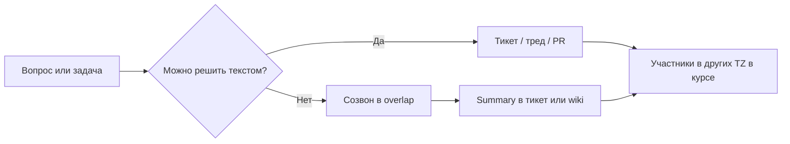

import DocCardList from '@theme/DocCardList';

# О разделе "Удалённая команда"

Удалённая работа в IT — это не "тот же офис, только дома". Команда живёт в **разных городах и часовых поясах**, часть решений принимается **без созвона**, а источником правды становятся **тикет и wiki**, а не разговор у кофемашины. Раздел помогает новичку понять базовые правила: **async-first**, overlap часов, письменные решения и онбординг без физического офиса.

Если вы только входите в профессию, начните с [советов для новичка](/encyclopedia/1-basics/1-12-sovety-dlya-novichka/intro) и [команды и управления](/encyclopedia/7-project/7-02-komanda-i-upravlenie/intro). Если уже работаете в гибриде — сверьте практики с [методологией](/encyclopedia/7-project/7-03-metodologiya-i-zhiznennyy-tsikl-po/intro) и [трекером задач](/encyclopedia/7-project/7-09-bazy-znaniy-i-zadachniki/21).

---

## Для кого этот раздел

| Аудитория | Что найдёте |
|-----------|-------------|
| Junior-разработчик | Как не теряться в чатах, когда наставник в другом TZ |
| Аналитик / PO | Как фиксировать требования так, чтобы их прочитали асинхронно |
| Тимлид / PM | Overlap, ротация встреч, SLA ответа, зрелость распределённой команды |
| QA / DevOps | Runbook on-call на языке всех дежурных, handoff между регионами |

  
Async-first — главная идея раздела

  

  По умолчанию работа идёт <strong>текстом</strong>: тикет, комментарий, ADR, PR. Синхронный созвон — когда асинхронный канал не сработал или нужен быстрый разбор блокера в overlap-окне. Это экономит время и снижает стресс для коллег в другом часовом поясе.
  

---

## Что входит в раздел

| Материал | Содержание |
|----------|------------|
| [Удалённая и распределённая команда](./1) | Принципы, TZ, overlap, daily, инструменты, пример команды Россия + EU |
| [Итоги](./998) | Краткое резюме и типичные ошибки |
| [Чек-лист](./999) | Самопроверка зрелости команды |

Смежные темы в энциклопедии:

- [Ежедневные стендапы](/encyclopedia/7-project/7-02-komanda-i-upravlenie/111) — формат daily в офисе и удалёнке
- [Wiki как источник правды](/encyclopedia/7-project/7-09-bazy-znaniy-i-zadachniki/22) — куда писать решения
- [ADR](/encyclopedia/7-project/7-20-adr-i-arhitekturnaya-pamyat/1) — архитектурные решения письменно
- [Онбординг-пакет](/encyclopedia/7-project/7-09-bazy-znaniy-i-zadachniki/24) — первый день без офиса
- [ИИ в проектном процессе](/encyclopedia/7-project/7-24-ii-v-proektnom-protsesse/intro) — политика Copilot в распределённой команде
- [Доставка и готовность](/encyclopedia/7-project/7-25-dostavka-i-gotovnost/intro) — DoR/DoD, когда команда редко собирается live

---

## Почему удалёнка требует других правил

В офисе многое решается **неявно**: подошли к коллеге, показали экран, услышали контекст из соседнего стола. В распределённой команде этого нет. Если решение не записано — для человека в другом TZ его **не существует**.

Типичные симптомы без дисциплины:

- "Я думал, мы договорились на созвоне" — записи нет, половина команды спит
- Дедлайн "к пятнице" без указания часового пояса — для одних это четверг вечером, для других суббота утром
- Блокер висит в чате без тикета — через сутки никто не помнит контекст
- Онбординг = "спроси в Slack" — новичок неделю боится задавать вопросы

Правила из раздела не про бюрократию. Они про **предсказуемость**: любой участник в любой TZ понимает, где искать правду и когда ждать ответ.

---

## Async-first в двух словах

**Async-first** (асинхронность по умолчанию) означает:

1. **Сначала текст** — описание задачи, вопрос, решение в тикете или треде с контекстом.
2. **Потом созвон** — если за 4–8 рабочих часов не сдвинулось или нужен парный разбор.
3. **Summary после встречи** — кто не был live, должен прочитать итог за 2 минуты.

Подробнее — в [основной статье](./1).

---

## Часовые пояса — preview

Команда "Москва + Берлин + Лондон" — частый кейс для продуктов с рынком EU. Разница **1–2 часа** кажется мелочью, пока не появятся:

- daily в 10:00 MSK = 08:00 CET — для одних норма, для других ранний подъём каждый день;
- "срочно до конца дня" без TZ — Berlin уже закончил смену;
- релиз "ночью по Москве" — on-call в EU не в курсе.

В разделе разбираем **overlap window** (2–4 часа общего рабочего времени), ротацию времени встреч и дедлайны в **UTC** или с явной TZ. Пример расписания — в [статье 1](./1).

---

## Документация как источник правды

В удалёнке [wiki](/encyclopedia/7-project/7-09-bazy-znaniy-i-zadachniki/22) и [трекер](/encyclopedia/7-project/7-09-bazy-znaniy-i-zadachniki/21) важнее, чем запись Zoom:

| Что фиксируют | Где |
|---------------|-----|
| Требования и AC | Тикет, user story |
| Архитектурный выбор | [ADR](/encyclopedia/7-project/7-20-adr-i-arhitekturnaya-pamyat/1) |
| Процесс команды | Wiki-страница "Как мы работаем" |
| Итог созвона | Комментарий к тикету или summary в треде |
| Runbook on-call | Wiki + ссылка в PagerDuty/Opsgenie |

  
Правило одного места

  

  Одно решение — один URL. Не дублируйте в пять чатов: дайте ссылку на тикет или ADR. Так проще искать и не терять версии.
  

---

## Инструменты — минимальный набор

Полный стек не обязателен с первого дня, но **роли** инструментов должны быть ясны:

- **Чат с тредами** — Slack, Teams, Mattermost, Telegram (корп.) — обсуждение, быстрые вопросы
- **Трекер** — Jira, YouTrack, Linear — статус задач, assignee, блокеры
- **Wiki** — Confluence, Notion, GitLab Wiki — процессы, онбординг, runbook
- **Видео** — Zoom, Meet, Teams — по необходимости, не по умолчанию
- **Git** — PR, review, CI — техническая async-коммуникация

См. [базы знаний и трекеры](/encyclopedia/7-project/7-09-bazy-znaniy-i-zadachniki/intro).

---

## Связь с другими процессами

Удалённая команда **не отменяет** [Scrum](/encyclopedia/7-project/7-14-scrum/intro) или [Kanban](/encyclopedia/7-project/7-18-kanban/intro). Меняется **форма** ритуалов:

- planning — agenda заранее, вопросы в комментариях до созвона;
- retro — async-форма + короткий sync в overlap;
- demo — запись + release notes для тех, кто не пришёл live.

[Definition of Ready](/encyclopedia/7-project/7-25-dostavka-i-gotovnost/1) особенно важен: задача без AC и макета в удалёнке превращается в неделю переписки.

---

## Как читать раздел

1. Прочитайте [основную статью](./1) — принципы, TZ, пример Russia+EU.
2. Сверьте команду с [чек-листом](./999).
3. Зафиксируйте 2–3 улучшения в wiki (overlap, SLA чата, шаблон summary).
4. При внедрении [ИИ/Copilot](/encyclopedia/7-project/7-24-ii-v-proektnom-protsesse/1) — политика тоже в wiki, доступная всем TZ.

  
Не путайте онлайн 24/7 и ответственность

  

  Удалёнка не означает, что разработчик обязан отвечать в мессенджере в любой час. Явный SLA (например, "ответ в течение рабочего дня в вашем TZ") снижает выгорание и конфликты.
  

---

## Итог по разделу

Удалённая команда работает, когда **письменные решения**, **уважение к TZ** и **async-first** — норма, а не исключение. Созвоны остаются для сложного синхронного разбора, но не заменяют тикет и wiki.

<DocCardList />

---
