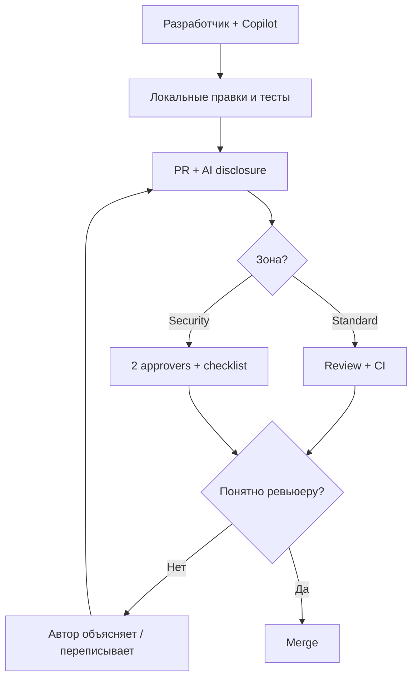

# ИИ и LLM в командной разработке

<div class="article-tags">
  <span class="tag tag-required">ОБЯЗАТЕЛЬНО</span>
  <span class="tag tag-beginner">ДЛЯ НОВИЧКОВ</span>
</div>

<span class="complexity-badge">Руководителю</span>
<span class="complexity-badge">Разработчику</span>

---

## ИИ уже в вашем процессе — нужны правила

> В России применяют по-разному - у кого-то Claude, у кого-то Cursor, у кого-то локальная LLM или даже отечественные YandexGPT и GigaChat.

Командная разработка — это процесс совместного создания программного обеспечения, при котором распределение задач, координация действий, интеграция результатов и управление конфигурацией осуществляются группой специалистов с различными ролями и уровнями ответственности в рамках единой методологии, инфраструктуры контроля версий и согласованных коммуникационных протоколов.

**LLM** (Large Language Model) — большая языковая модель: ChatGPT, Claude, Gemini, локальные Llama и др. **Copilot** и аналоги в IDE подсказывают код по контексту файла. Даже если команда "официально не использует ИИ", отдельные разработчики часто уже пробуют ассистентов.

Это класс нейросетевых моделей машинного обучения, архитектура которых основана на механизме трансформеров и позволяет обрабатывать, генерировать и предсказывать последовательности естественного языка или программного кода на основе статистических закономерностей, извлеченных из масштабных обучающих выборок с применением механизма внимания к контексту.

Без **письменной политики** в [wiki](/encyclopedia/7-project/7-09-bazy-znaniy-i-zadachniki/22) типичны проблемы:

- утечка **секретов** и [ПДн](/encyclopedia/8-infra-security/8-07-informatsionnaya-bezopasnost/intro) в облачный сервис;
- код с **сомнительной лицензией** в репозитории;
- [нейрослоп](/encyclopedia/6-ai/6-07-vayb-koding-i-neurokontent/2) — объёмный, но бессмысленный код без review;
- junior копирует решение, которое **не может объяснить** на созвоне;
- заказчик на аудите спрашивает про [IP](/encyclopedia/7-project/7-07-intellektualnye-prava/114) — ответа нет.

Политику (1–2 страницы) согласуют с ИБ и юристами. Технологии ИИ глубже — [раздел 6](/encyclopedia/6-ai/intro). Процесс review — [культура кода](/encyclopedia/7-project/7-10-kultura-koda/intro).

<div class="callout callout--tip">
  <div class="callout-title">Для junior</div>
  <div class="callout-body">
  Спрашивайте наставника <strong>до</strong> вставки большого куска от Copilot. Лучше 20 минут обсуждения, чем день переделки после review и урок "объясни каждую строку".
  </div>
</div>

---

## Одобренные инструменты

whitelist — набор явно разрешенных программных инструментов, библиотек, доменных имен или сетевых адресов, использование которых в рабочем процессе или инфраструктуре проекта санкционировано организационной политикой безопасности, тогда как все остальные элементы считаются заблокированными по умолчанию для минимизации поверхности атаки и предотвращения несанкционированных зависимостей.

Команда фиксирует **whitelist** — что разрешено на проекте:

| Категория | Пример | Условие |
|-----------|--------|---------|
| IDE Copilot (org) | GitHub Copilot Business | DPA, запрет обучения на вашем коде — по договору |
| IDE локально | Continue + локальная модель | Код не покидает контур |
| Чат для документации | Enterprise ChatGPT / Claude Team | Без секретов, audit log |
| Публичный бесплатный чат | ChatGPT free | Только обезличенные вопросы, **не** prod-код |
| Запрещено | Личный бот с загрузкой репо | Риск утечки |

Новый инструмент — через заявку к ИБ, не "поставил сам".

IDE Copilot (org) — корпоративная версия интеллектуального ассистента, интегрированного в среду разработки, которая обеспечивает централизованное управление лицензиями, изолирует данные организации от публичных обучающих наборов, применяет единые политики конфиденциальности и предоставляет административную панель для мониторинга активности разработчиков и аудита сгенерированного контента.

DPA — юридическое соглашение о обработке персональных данных, регламентирующее права и обязанности сторон относительно сбора, хранения, передачи и уничтожения конфиденциальной информации пользователей в соответствии с применимыми нормативными актами, стандартами защиты приватности и требованиями к трансграничной передаче данных.

Запрет обучения на вашем коде — это техническое и договорное ограничение, гарантирующее, что фрагменты исходного кода, промпты, метаданные или конфигурационные файлы, переданные в систему искусственного интеллекта, исключаются из процесса обновления весов модели и не используются для улучшения будущих версий сервиса, тем самым защищая интеллектуальную собственность организации.

Continue + локальная модель — это архитектурное решение, при котором расширение для среды разработки взаимодействует с нейросетевым движком, развернутым на локальной вычислительной инфраструктуре разработчика или корпоративном сервере, что обеспечивает полную изоляцию данных, отсутствие сетевых задержек при передаче конфиденциальных фрагментов и независимость от внешних API-провайдеров с сохранением полного контроля над циклом выполнения кода.

Enterprise ChatGPT / Claude Team — это коммерческие тарифные планы для корпоративного использования генеративных моделей, предоставляющие расширенные гарантии конфиденциальности, административный контроль над доступом, интеграцию с корпоративными системами аутентификации через протоколы SSO, расширенные контекстные окна и юридические обязательства по защите передаваемых данных от использования в публичных обучающих выборках.

Публичный бесплатный чат — это доступный широкой аудитории веб-интерфейс взаимодействия с языковой моделью, который функционирует на основе стандартных политик конфиденциальности, допускающих использование вводимых данных для улучшения алгоритмов, не предоставляет механизмов корпоративного управления доступом, изоляции сессий или гарантированного соответствия отраслевым стандартам защиты информации.

Личный бот с загрузкой репо — это конфигурация локального или частного AI-ассистента, которому предоставлен доступ к индексации исходного кода конкретного проекта, что позволяет системе учитывать архитектуру, соглашения об именовании, зависимости репозитория и исторические паттерны разработки при формировании рекомендаций, генерации кода и автоматическом заполнении контекста запросов.

---

## Что разрешить и что запретить

| Область | Рекомендация | Комментарий |
|---------|--------------|-------------|
| Бойлерплейт, DTO, маппинг | Можно с **обязательным** review | Проверить стиль проекта |
| Черновик unit-тестов | Можно | QA/dev проверяют границы и asserts |
| Рефакторинг rename/extract | Можно | Diff должен быть читаем |
| Auth, OAuth, JWT, сессии | Только с **усиленным** review | Security checklist, 2-й ревьюер |
| Платежи, PCI, billing | Только с усиленным review | Часто рукописно или pair |
| Криптография | **Не** генерировать целиком | Использовать проверенные библиотеки |
| ПДн, ключи API, пароли в промпт | **Запрещено** | Инцидент ИБ |
| Prod connection strings | **Запрещено** | Даже "для отладки" |
| Весь репозиторий в публичный чат | **Запрещено** | IP и утечка |
| Черновик ADR, release notes | Можно | **Факт-чек** человеком |
| User story, BPMN текстом | Можно | [BA](/encyclopedia/7-project/7-04-analitika/113) валидирует с заказчиком |

Давайте пробежимся по этим понятиям.

Бойлерплейт — это стандартизированные фрагменты кода, конфигурационные шаблоны или архитектурные каркасы, которые многократно воспроизводятся в различных частях проекта без существенных изменений и служат для обеспечения единообразной структуры, инициализации зависимостей, настройки маршрутизации или реализации базовых механизмов фреймворка, автоматизация создания которых часто делегируется генеративным инструментам.

DTO — это специализированный объект передачи данных, предназначенный исключительно для сериализации, десериализации и безопасной транспортировки информации между границами систем, слоями архитектуры или внешними клиентами без включения бизнес-логики, методов валидации или внутренних зависимостей доменного слоя.

Маппинг — это процесс установления соответствия между полями, структурами или форматами данных в разных слоях программного обеспечения или внешних системах, обеспечивающий автоматическую трансформацию информации при ее переходе из источника в целевой формат без потери семантической целостности, часто реализуемый с применением декларативных конфигураций или специализированных библиотек.

Review — это формализованная процедура проверки исходного кода коллегами или автоматизированными системами перед слиянием изменений в основную ветку репозитория, направленная на выявление архитектурных несоответствий, дефектов логики, нарушений стандартов оформления, потенциальных уязвимостей безопасности и оценку соответствия бизнес-требованиям.

Стиль проекта — это совокупность согласованных правил форматирования, именования, организации файловой структуры, комментирования и архитектурных паттернов, закрепленных в конфигурационных файлах линтеров, редакторов кода и внутренней документации для обеспечения единообразия кодовой базы, снижения когнитивной нагрузки при чтении и упрощения процедур автоматизированной проверки.

Unit-тест — это автоматизированная проверка минимально возможного фрагмента программного обеспечения, изолированного от внешних зависимостей, файловых операций и сетевых взаимодействий, предназначенная для верификации корректности выполнения конкретной функции или метода при заданных входных параметрах и гарантирующая стабильность базовых строительных блоков системы.

Asserts — это программные инструкции валидации, которые проверяют выполнение определенного логического условия во время выполнения кода и инициируют аварийное завершение теста или приложения при нарушении ожидаемого состояния, что обеспечивает раннее обнаружение дефектов в критических путях исполнения и защищает систему от перехода в неопределенное состояние.

Rename/extract — операции рефакторинга, обеспечивающие безопасное изменение идентификаторов переменных, методов или классов во всей кодовой базе без нарушения логики исполнения, а также выделение фрагментов кода в отдельные функции или модули для снижения цикломатической сложности, повышения модульности и устранения дублирования логики.

Auth — совокупность механизмов верификации идентичности субъекта, пытающегося получить доступ к защищенным ресурсам информационной системы, реализуемая через проверку учетных данных, токенов, сертификатов или биометрических показателей перед предоставлением прав доступа и формированием контекста авторизованной сессии.

OAuth — открытый протокол делегированного доступа, позволяющий сторонним приложениям получать ограниченные права на использование защищенных ресурсов пользователя без передачи основных учетных данных, за счет выдачи временных токенов доступа с четко определенными областями действия, механизмами отзыва и ротации.

JWT — компактный формат токена в формате JSON, содержащий закодированные утверждения о пользователе или сессии, цифровую подпись для проверки подлинности и метаданные, передаваемые между клиентом и сервером в заголовках HTTP-запросов для реализации stateless-аутентификации и распределенной проверки прав доступа без необходимости хранения состояния на сервере.

Сессии — это серверный или клиентский механизм хранения состояния взаимодействия пользователя с веб-приложением на протяжении определенного промежутка времени, реализуемый через уникальные идентификаторы, cookies или серверные хранилища для поддержания контекста авторизации, персональных настроек и последовательности выполненных операций.

PCI — это набор строгих отраслевых стандартов безопасности, регламентирующих технические и организационные требования к обработке, хранению и передаче данных платежных карт, включая шифрование каналов связи, сегментацию сетей, аудит доступа, управление уязвимостями и регулярное тестирование систем, обрабатывающих финансовую информацию.

Billing — это автоматизированная система учета потребления ресурсов, расчета стоимости услуг и выставления счетов пользователям или внутренним подразделениям на основе тарифных моделей, метрик использования и политик квотирования в облачных или SaaS-средах, обеспечивающая прозрачность финансовых операций и контроль бюджетных лимитов.

Криптография — это научная дисциплина и набор математических методов, обеспечивающих защиту информации от несанкционированного доступа, модификации или раскрытия посредством применения алгоритмов шифрования, хеширования, электронной подписи и протоколов безопасного обмена ключами для гарантии конфиденциальности, целостности и аутентичности передаваемых данных.

ПДн — это совокупность сведений, относящихся к конкретному идентифицируемому физическому лицу, обработка которых регулируется национальным и международным законодательством, требующим внедрения технических мер защиты, получения явного согласия субъектов, ограничения сроков хранения и обеспечения возможности удаления или модификации информации по запросу пользователя.

Prod connection strings — это конфиденциальные строки подключения, содержащие параметры аутентификации, адреса узлов и конфигурации сетей для промышленных баз данных и внешних сервисов, использование которых в промежуточных или тестовых средах строго регламентируется политиками информационной безопасности и реализуется через защищенные хранилища секретов.

ADR — это формализованный документ, фиксирующий принятое архитектурное решение, контекст его принятия, рассмотренные альтернативы, обоснование выбора и зафиксированные последствия, обеспечивающий сохранение исторической памяти проекта, предотвращающий повторное обсуждение уже решенных вопросов и ускоряющий процесс адаптации новых участников команды.

---

## Политика использования ИИ — структура документа

AI Policy — это внутренний нормативный документ, определяющий правила использования генеративных моделей и автоматизированных ассистентов в рабочем процессе, включая классификацию допустимых данных, ограничения на передачу кода во внешние системы, процедуры обязательной проверки сгенерированного контента, требования к маркировке изменений и распределение ответственности за корректность внедряемых решений.

Минимальные разделы wiki-страницы `AI Policy`:

1. **Scope** — на какие репозитории и среды распространяется. Четко определенный объем работ, функциональных требований, сроков и ресурсов, согласованный всеми заинтересованными сторонами на этапе инициации проекта и служащий базовой границей для планирования, мониторинга прогресса, управления изменениями и предотвращения неконтролируемого расширения задач.
2. **Approved tools** — таблица инструментов и запретов. Перечень программных продуктов, фреймворков, библиотек и сервисов, прошедших официальную проверку на соответствие корпоративным стандартам безопасности, лицензионной чистоты, совместимости с существующей инфраструктурой проекта и требованиям к обработке конфиденциальной информации.
3. **Data classification** — что нельзя в промпт (секреты, ПДн, NDA). Систематический процесс категоризации информационных активов по уровням конфиденциальности, критичности для бизнеса и требованиям регуляторов, определяющий соответствующие протоколы шифрования, контроля доступа, резервного копирования, мониторинга и утилизации для каждого класса данных.
4. **Development** — правила PR, review, high-risk зоны.
5. **QA / BA** — валидация артефактов от модели.
6. **Junior / onboarding** — ожидания от наставника. Структурированный процесс адаптации новых участников проекта, включающий предоставление доступа к репозиториям, ознакомление с архитектурными решениями, настройку локальной среды разработки, изучение политик безопасности, интеграцию в рабочие коммуникационные каналы и передачу исторического контекста проекта.
7. **Incidents** — куда сообщать о случайной утечке в промпт. Неожиданные события, приводящие к нарушению работоспособности сервисов, утечке данных, снижению производительности или отклонению от согласованных метрик качества, требующие оперативного реагирования, эскалации, документации хронологии событий и проведения анализа корневых причин для восстановления штатного режима функционирования.
8. **Review date** — дата пересмотра (раз в 6–12 месяцев).

Ссылка на политику — в [онбординг-пакете](/encyclopedia/7-project/7-09-bazy-znaniy-i-zadachniki/24) и README репозитория.

---

## Review кода от ИИ

Review кода от ИИ — это автоматизированный анализ исходного кода нейросетевой моделью, выполняющий статическую проверку на соответствие стандартам оформления, поиск потенциальных дефектов логики, выявление уязвимостей, предложение оптимизаций и генерацию поясняющих комментариев перед ручной проверкой разработчиком, что ускоряет начальный этап контроля качества.

Код от модели проходит **те же** правила, что и человеческий: [культура кода](/encyclopedia/7-project/7-10-kultura-koda/intro), CI, [DoD](/encyclopedia/7-project/7-25-dostavka-i-gotovnost/2).

### Обязательные правила автора PR

- **Понимание** — автор объясняет каждую значимую строку на review без "Copilot так написал".
- **Тесты** — покрывают реальное поведение; запрещены пустые `assert True` и тесты-копии реализации.
- **Зависимости** — нет лишних пакетов, которые модель "придумала".
- **API** — существуют ли методы и версии (модели **галлюцинируют** устаревшие API).
- **Прозрачность** — в описании PR указано использование ИИ (см. шаблон ниже).
- **Размер diff** — большие AI-генерации дробят на обозримые PR.

diff — это текстовое представление изменений между двумя версиями файла или коммита в системе контроля версий, демонстрирующее добавленные, удаленные и модифицированные строки с использованием специального синтаксиса маркировки для наглядного анализа внесенных правок, определения границ влияния изменений и автоматизированной проверки соответствия стандартам.

`assert True` — это утверждение в тестовом сценарии, которое проверяет выполнение заданного логического условия и подтверждает корректность работы тестируемого компонента при успешном прохождении проверки, либо инициирует исключение при нарушении ожидаемого поведения, тем самым гарантируя предсказуемость выполнения кода в контролируемой среде.

### Чек-лист ревьюера

- [ ] Логика соответствует тикету и AC.
- [ ] Нет hardcoded secrets, TODO с prod URL.
- [ ] Обработка ошибок и edge cases не вырезаны "для краткости".
- [ ] Стиль и паттерны **проекта**, не generic Stack Overflow.
- [ ] Лицензии новых зависимостей OK ([7.07](/encyclopedia/7-project/7-07-intellektualnye-prava/114)).
- [ ] Для auth/PII — пройден security checklist.

<div class="callout callout--caution">
  <div class="callout-title">Галлюцинации API</div>
  <div class="callout-body">
  Модель уверенно пишет вызовы несуществующих методов SDK. Всегда сверяйте с официальной документацией и компилятором/линтером — зелёный CI обязателен.
  </div>
</div>

hardcoded secrets — это практика непосредственного внедрения учетных данных, ключей API, токенов или паролей в исходный код приложения, что создает критическую уязвимость безопасности при компрометации репозитория, нарушает принципы безопасного управления конфигурацией и требует немедленного переноса конфиденциальных параметров в специализированные хранилища секретов.

edge cases — это редко возникающие или нестандартные сценарии использования программного обеспечения, которые находятся на границах допустимых значений входных параметров, в условиях ограниченных ресурсов или при необычных состояниях системы и требуют специальной обработки для предотвращения сбоев, зависаний или некорректной выдачи результатов.

auth/PII — это сочетание механизмов аутентификации и обработки персональных идентифицирующих данных, требующее строгого разделения каналов передачи, применения сквозного шифрования, минимизации собираемых атрибутов, внедрения процедур анонимизации и соблюдения регуляторных требований к защите приватности пользователей на всех этапах жизненного цикла информации.

security checklist — это стандартизированный перечень обязательных проверок, конфигурационных параметров и архитектурных требований, который используется на этапах проектирования, разработки и деплоя для систематического выявления и устранения потенциальных уязвимостей, контроля соответствия стандартам шифрования, управления правами доступа и верификации целостности зависимостей.

---

## Пример политики AI code review

Ниже — **фрагмент** регламента, который команда может адаптировать в wiki (вымышленный продукт `ShopFlow`, 12 разработчиков, Copilot Business + запрет публичного ChatGPT с кодом).

### 1. Маркировка PR

Маркировка PR — это процесс добавления специфических меток или флагов к запросу на слияние, указывающих на использование автоматизированных инструментов генерации кода, уровень проведенного тестирования, категорию изменений или необходимость дополнительной проверки со стороны специалистов по безопасности, что обеспечивает прозрачность процесса ревью и упрощает фильтрацию изменений по уровню риска.

В описании PR обязательный блок:

```markdown
## AI disclosure
- [ ] Код писался без ИИ
- [x] Использовался: GitHub Copilot (IDE)
- [ ] Использовался: ChatGPT / другое: ___

**Что сгенерировано:** черновик unit-тестов для OrderService.calculateTotal;
**Что переписано вручную:** логика скидок и граничные случаи.
```

### 2. Уровни review

| Уровень | Зоны | Требования |
|---------|------|------------|
| **Standard** | UI, утилиты, docs | 1 approve, CI green |
| **Elevated** | DB migrations, интеграции | 1 senior approve |
| **Security** | Auth, payments, PII | 2 approve + checklist ИБ |

AI-код **не понижает** уровень. Auth с Copilot = **Security**.

### 3. Запрещённые практики

- Вставка >100 строк от модели **без** пошагового разбора на review.
- Merge при комментарии "не разбирался, CI прошёл".
- Промпты с реальными email/телефонами из stage БД.

### 4. SLA и эскалация

- Ревьюер задаёт вопрос "объясни строки 45–60" — автор отвечает в тикете PR, не "перегенерировал".
- При подозрении на утечку секрета в промпт — немедленно [ИБ](/encyclopedia/8-infra-security/8-07-informatsionnaya-bezopasnost/intro), ротация ключей.

### 5. Метрики (опционально)

Тимлид раз в квартал смотрит: доля PR с AI disclosure, дефекты на prod из таких PR, время review. Не для наказания — для корректировки обучения.



---

## Промпты: что можно и нельзя

### Допустимо (при одобренном инструменте)

- "Напиши Jest-тест для функции X" + **сигнатура без бизнес-секретов**.
- "Переформулируй комментарий к PR".
- "Объясни паттерн Repository на примере псевдокода".
- Обезличенный snippet с заменой `ACME Corp` → `ExampleCorp`.

### Запрещено

- Файлы с `.env`, ключами, prod дампами.
- Списки пользователей с email/телефонами.
- Полный `application.yml` prod.
- Скриншоты внутренней админки с данными клиентов.

<div class="callout callout--info">
  <div class="callout-title">Enterprise и personal аккаунты</div>
  <div class="callout-body">
  Корпоративный Copilot/ChatGPT Team с DPA — другой риск-профиль, чем личный аккаунт. Политика должна различать их явно.
  </div>
</div>

---

## Лицензии и авторские права

Сгенерированный код может повторять фрагменты под **GPL**, AGPL или чужие сниппеты. Действия команды:

- проверка [лицензий зависимостей](/encyclopedia/7-project/7-07-intellektualnye-prava/114);
- SCA (Software Composition Analysis) в CI для новых пакетов;
- договор с заказчиком — **кому принадлежит** результат, можно ли использовать AI;
- при OSS-контрибуции — disclosure, что код частично AI (политика фонда/лицензии).

---

## ИИ в аналитике

- Черновики **user story**, job stories, BPMN-текст — [BA](/encyclopedia/7-project/7-04-analitika/113) **валидирует** с заказчиком; цифры и сроки — не от модели.
- Модель **не подписывает** [приёмку](/encyclopedia/7-project/7-04-analitika/116) и акт.
- Требования в [тикете](/encyclopedia/7-project/7-09-bazy-znaniy-i-zadachniki/21) — источник правды, не переписка с ChatGPT.

[Прототипирование](/encyclopedia/7-project/7-04-analitika/125) и макеты — человек; ИИ может набросать текст подсказок UI для review.

---

## ИИ в QA и тестировании

- Тест-кейсы от модели — [QA](/encyclopedia/7-project/7-05-testirovanie/100) проверяет **покрытие**, границы, негативные сценарии.
- Тестовые данные — **синтетические** или обезличенные; не prod dump в промпт.
- Автотесты от Copilot — code review как production-код.
- ИИ **не заменяет** exploratory testing и sign-off релиза.

См. [тестирование](/encyclopedia/7-project/7-05-testirovanie/intro), [DoD](/encyclopedia/7-project/7-25-dostavka-i-gotovnost/2).

---

## ИИ в документации и release notes

- Черновик [release notes](/encyclopedia/7-project/7-25-dostavka-i-gotovnost/2) — OK; факты версий и breaking changes проверяет dev/PO.
- [ADR](/encyclopedia/7-project/7-20-adr-i-arhitekturnaya-pamyat/1) — модель может структурировать, решение и trade-offs пишет architect/lead.
- [Техписьмо](/encyclopedia/7-project/7-08-tehnicheskoe-pismo/intro) — финальная редактура человеком.

---

## Обучение junior

ИИ — ускоритель, как IDE autocomplete или поиск документации:

1. **Сначала** попробовать самому 15–30 минут — потом спросить модель **узкий** вопрос.
2. **Объяснить** решение наставнику без открытого чата с моделью.
3. Не сдавать задачу, если не можете пройти "mock review" по строкам.
4. Лабораторные и собеседования — по правилам учебного заведения/компании (часто ИИ запрещён).

[Вайб-кодинг](/encyclopedia/6-ai/6-07-vayb-koding-i-neurokontent/1) · [советы для новичка](/encyclopedia/1-basics/1-035-bazovaya-informatika/intro).

---

## Удалённая команда и прозрачность

В [распределённой команде](/encyclopedia/7-project/7-23-udalennaya-komanda/1) политика ИИ **только в wiki** — не "мы в офисе договорились". PR с AI disclosure читают ревьюеры в другом TZ без созвона.

---

## Инцидент: секрет попал в промпт

1. Автор сообщает ИБ и тимлиду **сразу**.
2. Ротация скомпрометированного ключа/токена.
3. Запись в post-mortem (без публичных деталей секрета). post-mortem — это структурированный анализ завершенного инцидента или проекта, направленный на выявление корневых причин отклонений, документирование извлеченных уроков, разработку корректирующих мер, обновление процедур предотвращения повторения аналогичных ситуаций и формирование базы знаний для повышения устойчивости системы в будущем.
4. Обновление политики и напоминание команде.

См. [инциденты](/encyclopedia/7-project/7-21-incidenty-i-ekspluatatsiya/intro).

---

## Классификация данных для промптов

Согласуйте с [ИБ](/encyclopedia/8-infra-security/8-07-informatsionnaya-bezopasnost/intro) таблицу уровней:

| Уровень | Примеры | В публичный LLM | В enterprise LLM | Локально |
|---------|---------|-----------------|------------------|----------|
| **Public** | Документация OSS, общие паттерны | Да | Да | Да |
| **Internal** | Архитектура без секретов, обезличенный код | **Нет** | По политике DPA | Да |
| **Confidential** | Prod URLs, схемы БД с именами | **Нет** | **Нет** без исключения | По согласованию |
| **Restricted** | Ключи, ПДн, PCI | **Нет** | **Нет** | **Нет** в промпт |

Исключения — только **письменное** разрешение ИБ с timebox.

---

## Полный пример политики (сокращённый)

Ниже — skeleton wiki-страницы `AI-Policy-v1` для команды 15 человек (web + mobile).

```markdown
# AI Policy — ShopFlow Engineering

**Version:** 1.2 | **Owner:** @em | **Review:** 2026-12-01

## 1. Approved tools
- GitHub Copilot Business (org license) — IDE
- Claude Team — тексты, docs (no code paste >30 lines)
- FORBIDDEN: personal ChatGPT with repo content

## 2. Prompt rules
- NO secrets, PII, prod dumps
- Max 50 lines internal code per prompt unless ticket says spike-id

## 3. PR rules
- AI disclosure block required
- Security zones: auth/* payments/* — 2 approvers + checklist SEC-01

## 4. QA/BA
- AI test cases: QA sign-off on coverage matrix
- AI user stories: BA validates with PO

## 5. Incidents
- #security-ai Slack → rotate keys → post-mortem template PM-04

## 6. Training
- Junior: explain solution in 1:1 without IDE AI every other task
```

Адаптируйте под ваш контур и договор с заказчиком ([IP](/encyclopedia/7-project/7-07-intellektualnye-prava/114)).

---

## Copilot в CI/CD и инфраструктуре

| Область | Риск | Политика |
|---------|------|----------|
| **Dockerfile / K8s** | Небезопасные defaults | Review + [ИБ](/encyclopedia/8-infra-security/8-07-informatsionnaya-bezopasnost/intro) |
| **GitHub Actions** | Секреты в логах | Запрет paste workflow с prod secrets |
| **Terraform** | Открытые SG | Security review |
| **SQL migrations** | DROP без backup | DBA review, no AI-only |

[DevOps](/encyclopedia/8-infra-security/intro) · [change](/encyclopedia/7-project/7-22-upravlenie-izmeneniyami/1).

---

## Аудит и compliance

Для regulated / enterprise заказчиков:

- **Audit log** enterprise Copilot / Claude Team — кто, когда (без содержимого промпта по политике vendor).
- Ежеквартальный **sample review** PR с AI disclosure.
- Вопросник безопасности заказчика — ссылка на wiki policy.
- **SOC2 / ISO** — доказательство обучения команды (запись onboarding + quiz опционально).

---

## Сценарии code review с ИИ (разбор)

### Сценарий A — OK

Junior генерирует unit-тесты для `PriceCalculator`. Переписывает asserts под граничные случаи. PR: disclosure, 80 строк, 1 approve, CI green.

### Сценарий B — Отклонено

PR: 400 строк Copilot auth middleware. Автор не отвечает на комментарий про refresh rotation. **Request changes** → переписать с senior или pair.

### Сценарий C — Инцидент

Dev вставил `.env` snippet в ChatGPT. Действия: rotate keys, post-mortem, напоминание политики **в overlap all-hands** 10 мин.

---

## ИИ и [DoR/DoD](/encyclopedia/7-project/7-25-dostavka-i-gotovnost/intro)

**DoR:** spike на AI-feasibility — timebox 4 ч, критерий "понятно, human-in-the-loop".

**DoD:**

- AI disclosure в PR;
- нет restricted data в commit history;
- license check на AI-suggested packages.

---

## Типичные ошибки

| Ошибка | Риск | Что делать |
|--------|------|------------|
| "CI зелёный — merge" | Скрытые баги | Объяснимость кода |
| Нет политики | Хаос и утечки | Wiki + ИБ |
| Запрет без альтернативы | Теневое использование | Whitelist + обучение |
| AI для всего auth | Компрометация | Security review |
| Тесты от модели без QA | Ложное покрытие | Review кейсов |

---

## Связь с DoD

[Definition of Done](/encyclopedia/7-project/7-25-dostavka-i-gotovnost/2) может включать:

- PR содержит AI disclosure при использовании;
- high-risk зоны прошли elevated/security review;
- нет новых зависимостей без license check.

---

## Итоги и чек-лист

[Итоги](./998) · [Чек-лист](./999)

---
