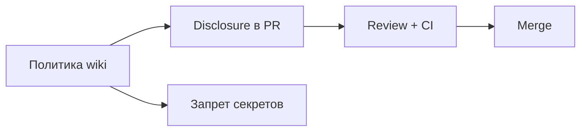

# ИИ в проекте — итоги

Раздел описал, как встроить **LLM и Copilot** в [проектный процесс](/encyclopedia/7-project/7-03-metodologiya-i-zhiznennyy-tsikl-po/intro) без утечек, [нейрослопа](/encyclopedia/6-ai/6-07-vayb-koding-i-neurokontent/2) и споров об [IP](/encyclopedia/7-project/7-07-intellektualnye-prava/114). Краткое резюме — ниже.

---

## Три опоры политики

| Опора | Суть |
|-------|------|
| **Письменная политика** | 1–2 страницы в [wiki](/encyclopedia/7-project/7-09-bazy-znaniy-i-zadachniki/22), согласована с [ИБ](/encyclopedia/8-infra-security/8-07-informatsionnaya-bezopasnost/intro) |
| **Review без исключений** | AI-код = обычный PR + disclosure + CI |
| **Запрет секретов в промпт** | Ключи, ПДн, prod-данные — вне облака без DPA |

Подробно — [основная статья](./1).

---

## Одобренные инструменты

- **Whitelist** — Copilot org, локальная модель, enterprise-чат; не "что угодно".
- **Публичный бесплатный чат** с prod-кодом — типичный антипаттерн.
- Новый инструмент — через ИБ.

---

## Таблица рисков (кратко)

| Зона | Подход |
|------|--------|
| Бойлерплейт, docs | Можно + review |
| Auth, payments, PII | Elevated/security review |
| Секреты в промпт | Запрещено |
| User story / тест-кейсы | Черновик от модели, **валидирует** человек |

---

## AI code review — ключевые правила

1. **AI disclosure** в описании PR.
2. Автор **понимает** каждую строку.
3. Ревьюер проверяет галлюцинации API и лишние зависимости.
4. High-risk — **два** approve и checklist.
5. Утечка в промпт — немедленно ИБ и ротация ключей.

Пример регламента — в [статье 1](./1).

---

## Роли

| Роль | Ответственность |
|------|-----------------|
| Dev | Disclosure, качество, объяснимость |
| Reviewer | Тот же барьер, что для ручного кода |
| BA / QA | Факт-чек артефактов от модели |
| ИБ | Классификация данных, инциденты |
| PO / юристы | IP в договоре |

[Аналитика](/encyclopedia/7-project/7-04-analitika/intro) · [Тестирование](/encyclopedia/7-project/7-05-testirovanie/intro).

---

## Junior

ИИ — инструмент, не замена обучения. Наставник проверяет **объяснение без модели**. См. [вайб-кодинг](/encyclopedia/6-ai/6-07-vayb-koding-i-neurokontent/1).

---

## Удалёнка

[Политика доступна всем TZ](/encyclopedia/7-project/7-23-udalennaya-komanda/1) — ссылка в [онбординге](/encyclopedia/7-project/7-09-bazy-znaniy-i-zadachniki/24).

---

## DoD

[Definition of Done](/encyclopedia/7-project/7-25-dostavka-i-gotovnost/2) может требовать disclosure и license check для PR с AI.

---

## Типичные ошибки

- Нет политики → теневое использование и утечки.
- Merge "CI зелёный" без понимания кода.
- Запрет Copilot без альтернатив → обход правил.
- Доверие тестам от модели без [QA](/encyclopedia/7-project/7-05-testirovanie/100).

---

## Следующий шаг

[Чек-лист](./999) на retro. Если политики нет — черновик из [статьи 1](./1) за 1 спринт: scope, tools, secrets, PR disclosure.

  
Пересмотр раз в год

  

  Инструменты ИИ меняются быстро. Укажите в политике дату review и владельца страницы wiki.
  

[Чек-лист](./999) · [О разделе](./intro)

---
