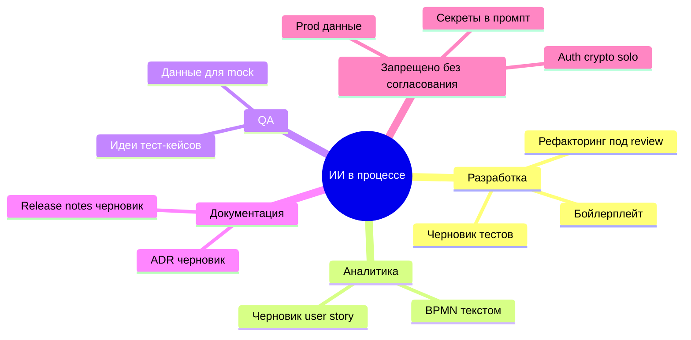

import DocCardList from '@theme/DocCardList';

# О разделе "ИИ в проектном процессе"

**Copilot, ChatGPT, Claude, Cursor** и локальные модели уже в IDE, браузере и иногда в трекерах. Раздел 7.24 — не про устройство нейросетей (это [раздел 6 — ИИ](/encyclopedia/6-ai/intro)), а про **процесс команды**: что можно генерировать, как ревьюить код от модели, куда **не** слать секреты и как не превратить junior в копировальщика [нейрослопа](/encyclopedia/6-ai/6-07-vayb-koding-i-neurokontent/2).

Без **письменной политики** в [wiki](/encyclopedia/7-project/7-09-bazy-znaniy-i-zadachniki/22) типичны утечки данных, споры об [IP](/encyclopedia/7-project/7-07-intellektualnye-prava/114) и PR, которые никто не может объяснить на review.

---

## Для кого раздел

| Роль | Что полезно |
|------|-------------|
| Разработчик | Границы промптов, как помечать AI-код в PR |
| Тимлид / EM | Шаблон политики, процесс review, метрики риска |
| QA / BA | Валидация тест-кейсов и user story от модели |
| PM / PO | Договор с заказчиком, прозрачность для аудита |
| ИБ | Запрет ПДн и секретов в облачных LLM |

  
ИИ ускоряет, ответственность не снимает

  

  Автор PR отвечает за каждую строку — как за свой рукописный код. Модель может ошибаться, галлюцинировать API и повторять чужие фрагменты под неподходящей лицензией.
  

---

## Что входит в раздел

| Материал | Содержание |
|----------|------------|
| [ИИ и LLM в командной разработке](./1) | Политика, таблицы разрешений, review, лицензии, пример политики AI code review |
| [Итоги](./998) | Резюме для wiki и onboarding |
| [Чек-лист](./999) | Есть ли зрелая политика LLM в проекте |

Смежные материалы:

- [Вайб-кодинг](/encyclopedia/6-ai/6-07-vayb-koding-i-neurokontent/intro) — риски слепого копирования
- [Культура кода и review](/encyclopedia/7-project/7-10-kultura-koda/intro)
- [Информационная безопасность](/encyclopedia/8-infra-security/8-07-informatsionnaya-bezopasnost/intro)
- [Удалённая команда](/encyclopedia/7-project/7-23-udalennaya-komanda/intro) — политика должна быть доступна всем TZ
- [Тестирование](/encyclopedia/7-project/7-05-testirovanie/intro) — проверка AI-тестов человеком

---

## Политика нужна, даже если все уже пользуются ИИ

Неформальное использование LLM создаёт **разные правила у разных людей**:

- один шлёт фрагменты prod-кода в публичный ChatGPT;
- другой генерирует auth без усиленного review;
- junior сдаёт задачу, не понимая diff;
- заказчик на аудите спрашивает, кому принадлежит сгенерированный код — ответа нет.

Политика на **1–2 страницы wiki** согласуется с [ИБ](/encyclopedia/8-infra-security/8-07-informatsionnaya-bezopasnost/intro) и юристами по [IP](/encyclopedia/7-project/7-07-intellektualnye-prava/114). Она отвечает на вопросы:

- какие **инструменты** одобрены (Copilot org, локальная модель, запрет облака);
- что **можно** и **нельзя** класть в промпт;
- как **помечать** AI-участие в PR;
- кто **усиленно** ревьюит auth, платежи, ПДн;
- как **обучать** junior работе с ассистентом.

---

## LLM и Copilot — термины

| Термин | Значение |
|--------|----------|
| **LLM** | Large Language Model — большая языковая модель (GPT, Claude, Llama и др.) |
| **Copilot** | AI-ассистент в IDE (GitHub Copilot, Cursor, JetBrains AI и аналоги) |
| **Промпт** | Текст запроса к модели |
| **Inference** | Запрос к модели и получение ответа (часто в облаке) |
| **Локальная модель** | Модель на машине или в контуре компании без отправки кода наружу |

Технические детали моделей — [введение в ИИ](/encyclopedia/6-ai/6-01-vvedenie-v-ii/intro), [модели и инструменты](/encyclopedia/6-ai/6-04-modeli-i-instrumenty/intro).

---

## Области применения в проектном процессе

В [основной статье](./1) — таблицы разрешений и **пример политики AI code review**.

---

## Review — центральное правило

Код от ИИ проходит **тот же** [code review](/encyclopedia/7-project/7-10-kultura-koda/intro), CI и [DoD](/encyclopedia/7-project/7-25-dostavka-i-gotovnost/2), что и рукописный:

- автор **понимает** каждую строку;
- тесты проверяют **поведение**, а не `assert True`;
- в описании PR указано использование ИИ (прозрачность);
- для auth/платежей — второй ревьюер или security checklist.

---

## Секреты, ПДн и compliance

**Запрещено** без явного исключения от ИБ:

- API-ключи, пароли, токены, connection strings;
- персональные данные клиентов и сотрудников;
- полный репозиторий или большие фрагменты проприетарного кода в **публичный** облачный чат;
- внутренние URL, архитектура под NDA в неодобренный сервис.

Допустимые альтернативы: **локальная** модель, enterprise-контур Copilot с DPA, обезличенные сниппеты.

---

## Лицензии и IP

Сгенерированный код может совпадать с фрагментами под **GPL** или чужими репозиториями. Команда проверяет:

- [лицензии зависимостей](/encyclopedia/7-project/7-07-intellektualnye-prava/114);
- SCA в CI при необходимости;
- договор с заказчиком — **кому принадлежит** результат с участием ИИ.

---

## Junior и обучение

ИИ — **инструмент**, как автодополнение или поиск, а не замена мышления. Наставник проверяет, что junior **объясняет решение** без подсказки модели. См. [вайб-кодинг](/encyclopedia/6-ai/6-07-vayb-koding-i-neurokontent/1) и [советы для новичка](/encyclopedia/1-basics/1-12-sovety-dlya-novichka/intro).

---

## Связь с удалёнкой и доставкой

В [удалённой команде](/encyclopedia/7-project/7-23-udalennaya-komanda/1) политика ИИ **обязательно в wiki** — не устная традиция одного офиса. [DoD](/encyclopedia/7-project/7-25-dostavka-i-gotovnost/2) может включать пункт: "PR с AI — пометка в описании, review пройден".

---

## Как читать раздел

1. [Основная статья](./1) — политика, review, пример регламента.
2. Согласуйте черновик с ИБ и PO.
3. Опубликуйте в wiki, добавьте ссылку в [онбординг](/encyclopedia/7-project/7-09-bazy-znaniy-i-zadachniki/24).
4. [Чек-лист](./999) — раз в полгода на retro.

<DocCardList />

---
