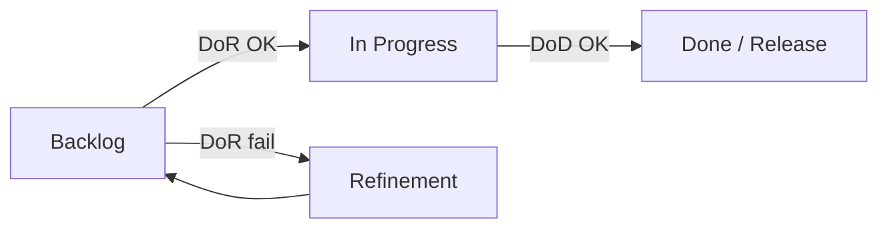

# Definition of Ready

<div class="article-tags">
  <span class="tag tag-required">ОБЯЗАТЕЛЬНО</span>
  <span class="tag tag-beginner">ДЛЯ НОВИЧКОВ</span>
</div>

<span class="complexity-badge">Аналитику</span>
<span class="complexity-badge">Разработчику</span>

---

## Что такое DoR

**Definition of Ready (DoR)** — соглашение команды: задача **достаточно подготовлена**, чтобы разработчик, QA или другой исполнитель **начали работу** без недель уточнений и созвонов "а что имелось в виду?".

DoR отвечает на вопрос: **можно ли взять задачу в работу прямо сейчас?**

Без DoR в спринт или колонку "In Progress" попадают **чёрные ящики**:

- неясные требования и противоречивые комментарии;
- отсутствующие макеты для UI;
- API партнёра "будет на следующей неделе";
- нет доступа к stage, но задача "срочная";
- оценка "на глаз", которую никто не принимал.

Последствия:

- срывается [инкремент спринта](/encyclopedia/7-project/7-14-scrum/5);
- **velocity** теряет смысл (половина спринта — уточнения);
- растёт переработка и конфликты с [аналитиком](/encyclopedia/7-project/7-04-analitika/113);
- в [удалёнке](/encyclopedia/7-project/7-23-udalennaya-komanda/1) async-команда простаивает в ожидании PO в другом TZ.

DoR задаёт **минимальный порог входа**. Он **не заменяет** аналитику — **дополняет** её чётким "стоп, пока не готово".

<div class="callout callout--tip">
  <div class="callout-title">Для junior</div>
  <div class="callout-body">
  Если задача без AC и макета — это не ваша "лень уточнить", а сигнал вернуть в backlog. Команда с зрелым DoR **поддержит** отказ взять не-ready work.
  </div>
</div>

---

## DoR и DoD — разница

| | **DoR** | **DoD** |
|---|---------|---------|
| Вопрос | Можно **начать**? | Можно **закрыть** / релизить? |
| Момент проверки | Перед "In Progress" / в спринт | Перед Done / merge / релиз |
| Типичный владелец проверки | PO, BA, команда на planning | Dev, QA, CI |
| Связь | [Глава 2 — DoD](./2) | [Scrum DoD](/encyclopedia/7-project/7-14-scrum/5) |



---

## Базовый чек-лист DoR

Перед стартом задачи команда проверяет (адаптируйте под [тип проекта](/encyclopedia/7-project/7-17-nachalo-raboty-na-proekte/1)):

- [ ] Описана **ценность** для пользователя или бизнеса (цель — одним абзацем).
- [ ] Есть **acceptance criteria (AC)** — проверяемые условия приёмки, не "сделать красиво".
- [ ] Известны **зависимости**: дизайн, API партнёра, доступы, другие команды.
- [ ] Есть **оценка** или согласованный размер (story points / t-shirt), если команда оценивает.
- [ ] Нет **внешних блокеров** без плана эскалации (кто, когда, тикет партнёра).
- [ ] Для **UI** — макет Figma или согласованный wireframe ([прототипирование](/encyclopedia/7-project/7-04-analitika/125)).
- [ ] Для **интеграций** — контракт API, mock или тестовая песочница ([API](/encyclopedia/2-system-network/2-09-osnovy-integratsionnogo-vzaimodeystviya/117)).
- [ ] Для **данных** — понятны источник, миграции, GDPR/ПДн если применимо.
- [ ] **Assignee** понимает scope или есть spike с timebox.

---

## Acceptance criteria — как писать

**AC** — список условий "готово, когда…". Хорошие AC:

- **Проверяемы** — QA может пройти по пунктам;
- **Независимы** от реализации ("кнопка синяя" vs "используем CSS token primary");
- **Включают негатив** — что при ошибке сети, пустом поле, 403.

Пример (задача: восстановление пароля):

```markdown
## AC
1. Пользователь с подтверждённым email запрашивает ссылку — письмо ≤ 2 мин (stage SMTP).
2. Ссылка одноразовая, TTL 24 ч — повторное использование показывает ошибку.
3. Новый пароль: мин. 8 символов, 1 цифра — валидация на клиенте и сервере.
4. После смены пароля старые refresh-токены инвалидируются.
5. Rate limit: не более 5 запросов / час / IP — 429 с понятным текстом.
```

Плохой AC: "Пароль восстанавливается удобно и безопасно."

[User story](/encyclopedia/7-project/7-04-analitika/113) · [приёмка](/encyclopedia/7-project/7-04-analitika/116).

---

## DoR по типам задач

| Тип | Дополнительные пункты DoR |
|-----|---------------------------|
| **Backend API** | OpenAPI draft, коды ошибок, auth scheme, лимиты |
| **Frontend** | Макет, states (loading/error/empty), i18n ключи |
| **Mobile** | Макет, версии OS, offline-поведение, store guidelines |
| **Bugfix** | Steps to reproduce, expected/actual, severity, версия |
| **Spike** | Вопрос, timebox, критерий "достаточно знаний" |
| **Tech debt** | Метрика успеха (время сборки −30%), не "прибраться" |
| **Infra** | Rollback plan, окно change, [CAB](/encyclopedia/7-project/7-22-upravlenie-izmeneniyami/1) если нужно |

---

## DoR в Scrum

На **refinement** и **planning** команда не берёт в спринт задачи без DoR:

1. PO/BA приносит backlog items с AC.
2. Команда задаёт вопросы **async до planning** ([удалёнка](/encyclopedia/7-project/7-23-udalennaya-komanda/1)).
3. На planning — только ready items + ёмкость спринта.
4. Если mid-sprint прилетает "срочно" без DoR — **swap**: что-то выносится, PO решает trade-off ([change](/encyclopedia/7-project/7-22-upravlenie-izmeneniyami/1)).

<div class="callout callout--caution">
  <div class="callout-title">Sprint Goal и не-ready work</div>
  <div class="callout-body">
  Добавление задачи без DoR в активный спринт ломает прогноз. Исключение — инцидент P1 по [runbook](/encyclopedia/7-project/7-21-incidenty-i-ekspluatatsiya/1), не "новая хотелка".
  </div>
</div>

[Спринт](/encyclopedia/7-project/7-14-scrum/4) · [planning](/encyclopedia/7-project/7-14-scrum/3).

---

## DoR в Kanban

В колонке **Ready** (или "Selected for Development") действует политика:

> Сюда попадают **только** карточки с выполненным DoR.

**WIP-лимит** на Ready ограничен — команда не копит неподготовленную работу ([WIP](/encyclopedia/7-project/7-18-kanban/2)). Pull: разработчик берёт верхнюю ready-карточку, не "удобную".

Если Ready пуст — refinement, а не "начну непонятное".

---

## Роли при проверке DoR

| Роль | Вклад |
|------|--------|
| **BA / PO** | Ясность AC, бизнес-правила, приоритет |
| **SA / Architect** | Техническая осуществимость, ADR если нужно |
| **Design** | Макет, UX states |
| **Dev / QA** | Вопросы на edge cases, тестируемость AC |
| **Команда** | Право **не брать** задачу без DoR на planning |

DoR — **командное** соглашение, не чек-лист только аналитика.

---

## DoR в трекере

DoR в Confluence без проверки в тикете — **мёртвая декларация**. Рабочие варианты:

- чек-лист DoR в **шаблоне задачи** [Jira/YouTrack](/encyclopedia/7-project/7-09-bazy-znaniy-i-zadachniki/21);
- custom field "DoR status: Ready / Not ready";
- workflow: переход в "In Progress" **блокируется**, пока обязательные поля пусты;
- label `not-ready` снят только PO или BA после review.

Пример полей шаблона:

| Поле | Обязательное |
|------|--------------|
| User value | Да |
| AC (checklist) | Да |
| Design link | Для UI |
| API contract link | Для интеграций |
| Dependencies | Да |

---

## Пример: задача не прошла DoR

**Тикет:** "Улучшить checkout."

| Проблема | Что нужно для DoR |
|----------|-------------------|
| Нет метрики успеха | "Конверсия checkout +2% или время −15 сек" |
| Нет макета нового шага | Ссылка Figma |
| Неясно: web only или mobile | Явный scope в AC |
| API доставки partner X не готов | Тикет партнёра + дата или mock |

Команда на planning: **не берём**, возвращаем в refinement с due date от PO.

---

## DoR и async-first

В [распределённой команде](/encyclopedia/7-project/7-23-udalennaya-komanda/1) DoR — условие **async-first**: задача с полным AC и макетом не требует созвона с PO для старта. Это снижает блокеры на сутки между MSK и EU.

---

## DoR и ИИ

[Copilot/LLM](/encyclopedia/7-project/7-24-ii-v-proektnom-protsesse/1) может **черновик** user story — [BA](/encyclopedia/7-project/7-04-analitika/113) **валидирует** AC с заказчиком. DoR не выполнен, пока человек не подтвердил критерии.

---

## Антипatterns

| Антиpattern | Почему плохо |
|-------------|--------------|
| DoR на 50 пунктов | Никогда не ready, paralysis |
| DoR "на словах" | Каждый понимает по-своему |
| PO обходит DoR "потому что срочно" | Ломает trust и velocity |
| AC только happy path | Баги на prod |
| Нет spike для неизвестности | Оценка фантазия |

Золотая середина: **8–12 пунктов** DoR на команду + доп. чек-листы по типу задачи.

---

## Метрики (лёгкие)

- % задач, **возвращённых** из In Progress за неделю (missing info).
- Среднее время от "New" до "Ready".
- Количество mid-sprint **добавлений** без swap.

Не для KPI наказания — для retro.

---

## Связь с DoD

- **DoR** — можно **начать** задачу ([эта глава](./1)).
- **DoD** — можно **закрыть** и считать готовой к релизу ([глава 2](./2)).

Не для KPI наказания — input для retro.

---

## INVEST и качество backlog item

DoR часто опирается на **INVEST** (критерии хорошей user story):

| Буква | Значение | Проверка DoR |
|-------|----------|--------------|
| **I** | Independent | Можно делать без блокировки другой story |
| **N** | Negotiable | Детали обсуждаемы, не жёсткий контракт |
| **V** | Valuable | Ценность пользователю/бизнесу ясна |
| **E** | Estimable | Команда может оценить |
| **S** | Small | Влезает в спринт или делится |
| **T** | Testable | AC проверяемы |

Story "улучшить performance" без метрики — **не Estimable**, не Ready.

---

## DoR на аутсорсе и fixed price

| Контекст | Особенность DoR |
|----------|-----------------|
| **Fixed price** | AC = контрактное приложение; change только через [CR](/encyclopedia/7-project/7-22-upravlenie-izmeneniyami/1) |
| **T&M** | DoR + прогноз часов в комментарии |
| **Продукт** | DoR легче, но AC всё равно обязательны |

Заказчик "хочет начать вчера" без AC — риск для обеих сторон. PO фиксирует: **start date после DoR**.

[Договор](/encyclopedia/7-project/7-01-obschee-o-biznese/3) · [начало на проекте](/encyclopedia/7-project/7-17-nachalo-raboty-na-proekte/intro).

---

## Workshop: согласование DoR за 90 минут

1. **10 мин** — brain dump текущих болей ("берём сырые задачи").
2. **20 мин** — draft 8–12 пунктов DoR на Miro.
3. **20 мин** — прогон 3 реальных тикетов: ready / not ready.
4. **20 мин** — как встроить в Jira (поля, workflow).
5. **10 мин** — owner wiki, дата retro через 6 недель.
6. **10 мин** — связь с [DoD](./2).

Результат — **одна wiki-страница**, не 40 слайдов.

---

## Splitting stories — когда DoR не проходит

Задача слишком большая — **делят**, не ослабляют DoR:

| Техника | Пример |
|---------|--------|
| **По workflow** | Checkout: оплата / доставка / подтверждение |
| **По CRUD** | Сначала read-only отчёт, потом export |
| **По interface** | API first, UI second |
| **Spike** | "Исследовать SDK партнёра" — 2 дня, отдельный тикет |

После split — каждая часть снова проходит DoR.

---

## DoR и [удалённая команда](/encyclopedia/7-project/7-23-udalennaya-komanda/1)

Checklist перед planning для distributed team:

- [ ] AC написаны так, что QA в Berlin **не звонит** PO в London;
- [ ] Макет с timezone-independent states;
- [ ] Зависимости содержат **ссылку на тикет**, не "Иван сделает";
- [ ] Дедлайн в UTC.

---

## FAQ по DoR

**Можно ли начать без оценки?**  
Если команда не оценивает спринты — DoR может не требовать points, но требует **t-shirt size** или явное "не оцениваем, spike first".

**PO давит "берите уже"**  
Тимлид фиксирует missing DoR в комментарии тикета. Риск срыва — на PO после explicit accept.

**Bugfix с prod — нужен DoR?**  
Упрощённый DoR: STR, severity, версия — 5 минут, не полный шаблон фичи.

**Spike готов, когда?**  
Есть ответ на вопрос spike, ADR или комментарий "не делаем / делаем так", оценка для follow-up story.

---

## Шаблон комментария "Not Ready"

```markdown
@po Задача **не проходит DoR** для sprint 24:
- [ ] Нет AC для error state оплаты
- [ ] Нет ссылки на макет Figma (поле coupon)

Готов взять после обновления тикета. Предлагаемый ETA DoR: 2026-06-18.
```

Тон — **факт**, не обвинение. Культура [командной работы](/encyclopedia/7-project/7-02-komanda-i-upravlenie/intro).

---

## DoR и автоматизация трекера

Примеры automation (Jira/YouTrack):

| Триггер | Действие |
|---------|----------|
| Transition → In Progress | Validator: AC field not empty |
| Label `needs-design` | Block until Figma link |
| Epic link missing | Warning на create |

Automation **не заменяет** judgment команды на planning — только ловит забытые поля.

---

## Связь DoR с [Definition of Done](./2)

DoR и DoD — **пара**:

| DoR гарантирует | DoD проверяет |
|-----------------|---------------|
| AC написаны | AC выполнены тестами |
| Макет есть | UI соответствует макету ± согласованные отличия |
| API контракт | Integration tests по контракту |
| Оценка | Нет скрытого scope creep |

Retro-вопрос: "Сколько задач вернули из QA из-за слабого DoR на входе?"

---

## Чек-лист DoR для copy-paste в wiki

```markdown
## Definition of Ready — Team Alpha

Обязательно для всех задач:
- [ ] Ценность для пользователя/бизнеса описана
- [ ] AC проверяемы (≥3 пункта для фичи)
- [ ] Зависимости перечислены с тикетами/датами
- [ ] Оценка или t-shirt size согласованы
- [ ] Нет блокеров без эскалации

UI: макет Figma + error/empty states
API: OpenAPI или контракт + sandbox/mock
Bug: STR, версия, severity

Не берём в спринт / In Progress без галочек обязательного блока.
```

---

## Итоги раздела

DoR защищает команду от старта **непонятной** работы. Запишите его, встройте в **трекер**, дайте право сказать "not ready" — и [DoD](./2) станет достижимым.

[Definition of Done](./2) · [Итоги раздела](./998) · [Чек-лист](./999)

---
