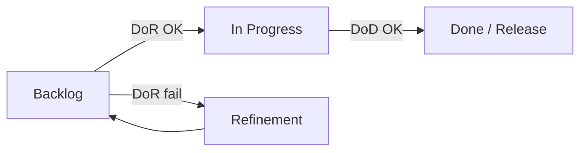

import ExternalPlayEmbed from '@site/src/components/ExternalPlayEmbed';

# Definition of Ready

<div class="article-tags">
  <span class="tag tag-required">ОБЯЗАТЕЛЬНО</span>
  <span class="tag tag-beginner">ДЛЯ НОВИЧКОВ</span>
</div>

<span class="complexity-badge">Аналитику</span>
<span class="complexity-badge">Разработчику</span>

---

## Что такое DoR

Definition of Ready — это согласованный набор критериев, которым должна соответствовать пользовательская история или задача перед тем, как команда возьмёт её в работу. DoR гарантирует, что задача достаточно проработана: у неё есть понятное описание, критерии приёмки, оценена сложность, определены зависимости и необходимые ресурсы. Наличие DoR снижает риск простоев, уточнений в процессе разработки и повышает предсказуемость спринта. Этот артефакт обычно формируется совместно командой разработки, аналитиком и владельцем продукта и пересматривается по мере изменения процессов.

Ready — это статус задачи, означающий, что она соответствует Definition of Ready и может быть взята в работу без дополнительных уточнений. Задача в статусе Ready имеет чёткое описание, критерии приёмки, оценку, назначенного исполнителя и все необходимые артефакты. Статус Ready визуализируется на канбан- или скрам-доске и служит сигналом для разработчиков о готовности к началу реализации. Поддержание потока задач в статусе Ready — ответственность владельца продукта и аналитиков.

**Definition of Ready (DoR)** — соглашение команды: задача **достаточно подготовлена**, чтобы разработчик, QA или другой исполнитель **начали работу** без недель уточнений и созвонов "а что имелось в виду?".

DoR отвечает на вопрос: **можно ли взять задачу в работу прямо сейчас?**

<ExternalPlayEmbed example="project/dor-dod-gate-play" title="DoR и DoD — проверка готовности" minHeight={500} />

Без DoR в спринт или колонку "In Progress" попадают **чёрные ящики**:

- неясные требования и противоречивые комментарии;
- отсутствующие макеты для UI;
- API партнёра "будет на следующей неделе";
- нет доступа к stage, но задача "срочная";
- оценка "на глаз", которую никто не принимал.

Последствия:

- срывается [инкремент спринта](/encyclopedia/7-project/7-14-scrum/5);
- **velocity** теряет смысл (половина спринта — уточнения);
- растёт переработка и конфликты с [аналитиком](/encyclopedia/7-project/7-04-analitika/113);
- в [удалёнке](/encyclopedia/7-project/7-23-udalennaya-komanda/1) async-команда простаивает в ожидании PO в другом TZ.

Velocity — это метрика, отражающая объём работы, которую команда стабильно выполняет за один спринт, обычно измеряемый в story points или количестве завершённых задач. Velocity не является показателем эффективности отдельных разработчиков, а служит инструментом прогнозирования для планирования будущих итераций. Значение velocity рассчитывается как сумма оценок полностью завершённых задач по DoD. Команда использует эту метрику для корректировки объёма бэклога, но не должна оптимизировать процессы ради искусственного роста velocity, так как это искажает планирование.

DoR задаёт **минимальный порог входа**. Он **не заменяет** аналитику — **дополняет** её чётким "стоп, пока не готово".

Порог входа — это минимальный набор требований, условий или компетенций, необходимых для начала работы над задачей, проектом или для присоединения к команде. В контексте разработки порог входа может включать наличие доступа к репозиторию, настроенное окружение, понимание архитектуры, проведённый онбординг или согласованные спецификации. Снижение порога входа ускоряет старт работы, но чрезмерное упрощение может привести к ошибкам. Команда балансирует между доступностью и качеством, документируя необходимые шаги для новых участников или задач.

<div class="callout callout--tip">
  <div class="callout-title">Для junior</div>
  <div class="callout-body">
  Если задача без AC и макета — это не ваша "лень уточнить", а сигнал вернуть в backlog. Команда с зрелым DoR **поддержит** отказ взять не-ready work.
  </div>
</div>

---

## DoR и DoD — разница

Definition of Done — это чётко зафиксированный перечень условий, при выполнении которых задача считается завершённой и готовой к передаче пользователю или в продакшн. DoD может включать написание кода, прохождение тестов, код-ревью, документирование, интеграцию, деплой на тестовое окружение и другие этапы, принятые в команде. В отличие от Acceptance Criteria, которые относятся к конкретной истории, DoD применяется ко всем задачам и обеспечивает единый стандарт качества. Соблюдение DoD предотвращает накопление скрытой работы и технического долга.

| | **DoR** | **DoD** |
|---|---------|---------|
| Вопрос | Можно **начать**? | Можно **закрыть** / релизить? |
| Момент проверки | Перед "In Progress" / в спринт | Перед Done / merge / релиз |
| Типичный владелец проверки | PO, BA, команда на planning | Dev, QA, CI |
| Связь | [Глава 2 — DoD](./2) | [Scrum DoD](/encyclopedia/7-project/7-14-scrum/5) |



---

## Базовый чек-лист DoR

Перед стартом задачи команда проверяет (адаптируйте под [тип проекта](/encyclopedia/7-project/7-17-nachalo-raboty-na-proekte/1)):

- [ ] Описана **ценность** для пользователя или бизнеса (цель — одним абзацем).
- [ ] Есть **acceptance criteria (AC)** — проверяемые условия приёмки, не "сделать красиво".
- [ ] Известны **зависимости**: дизайн, API партнёра, доступы, другие команды.
- [ ] Есть **оценка** или согласованный размер (story points / t-shirt), если команда оценивает.
- [ ] Нет **внешних блокеров** без плана эскалации (кто, когда, тикет партнёра).
- [ ] Для **UI** — макет Figma или согласованный wireframe ([прототипирование](/encyclopedia/7-project/7-04-analitika/125)).
- [ ] Для **интеграций** — контракт API, mock или тестовая песочница ([API](/encyclopedia/2-system-network/2-09-osnovy-integratsionnogo-vzaimodeystviya/117)).
- [ ] Для **данных** — понятны источник, миграции, GDPR/ПДн если применимо.
- [ ] **Assignee** понимает scope или есть spike с timebox.

Ценность в Agile-контексте — это измеримая польза, которую получает пользователь, бизнес или стейкхолдер от реализации функциональности. Ценность может выражаться в увеличении дохода, сокращении издержек, повышении удовлетворённости пользователей, снижении рисков или ускорении выхода на рынок. Приоритизация бэклога строится на оценке ценности относительно затрат. Команда и владелец продукта совместно определяют ценность через гипотезы, метрики и обратную связь, чтобы фокусироваться на том, что действительно важно, а не на том, что просто технически интересно.

Story points и T-shirt sizing — это методы относительной оценки сложности задач, а не затрат времени. Story points используют числовую шкалу (часто Фибоначчи), где каждая оценка отражает совокупность усилий, рисков и неопределённости. T-shirt sizing применяет категории XS, S, M, L, XL для грубой классификации. Оба подхода помогают команде обсуждать задачи, выявлять скрытые сложности и планировать спринт без давления точных временных оценок. Оценки калибруются на основе исторических данных и пересматриваются по мере накопления опыта.

Блокер — это любое препятствие, которое полностью останавливает или критически замедляет прогресс по задаче, спринту или проекту. Блокеры могут быть техническими (отсутствие доступа, баг в зависимости), организационными (ожидание согласования, отсутствие решения) или внешними (задержка поставки, изменение требований). В Agile-практиках блокеры визуализируются на доске, эскалируются на ежедневных стендапах и требуют оперативного устранения. Команда фиксирует причины блокеров для последующего анализа и предотвращения повторения.

Wireframe — это упрощённая схематичная визуализация интерфейса, показывающая структуру, расположение элементов и основные взаимодействия без детального дизайна, цветов или контента. Wireframes используются на ранних этапах проектирования для быстрого обсуждения логики интерфейса с командой и стейкхолдерами. Они помогают выявить проблемы юзабилити, согласовать поток пользователя и сократить количество итераций на этапе визуального дизайна. Wireframes могут быть низкоточными (наброски от руки) или интерактивными прототипами в специализированных инструментах.

Assignee — это участник команды, на которого назначена ответственность за выполнение конкретной задачи или тикета в трекере. Назначение assignee не означает, что только этот человек работает над задачей, но фиксирует точку контакта для координации, уточнений и отчётности. В самоорганизующихся командах assignee может меняться динамически в зависимости от загрузки и компетенций. Прозрачность назначений помогает избегать дублирования работы и обеспечивает accountability без микроменеджмента.

Spike — это исследовательская задача, цель которой — снизить неопределённость, протестировать гипотезу или изучить технологию перед принятием архитектурных или продуктовых решений. Spike всегда имеет timebox — жёсткое ограничение по времени (например, 4 часа или 1 день), чтобы исследование не переросло в бесконечный анализ. Результат spike — не готовый код, а выводы, прототип, документация или рекомендации для дальнейшей работы. Spike помогает команде принимать обоснованные решения и избегать дорогостоящих ошибок на поздних этапах.


---

## Acceptance criteria — как писать

Acceptance Criteria — это конкретные, проверяемые условия, которые должна удовлетворять пользовательская история, чтобы считаться принятой заказчиком или продуктовым владельцем. AC формулируются до начала разработки, часто в формате Given-When-Then, и служат основой для тестирования. Они уточняют границы функциональности, обрабатываемые сценарии и исключения. Чёткие AC снижают недопонимание между разработкой и бизнесом, позволяют автоматизировать проверку и обеспечивают прозрачность критериев успеха. AC являются частью Definition of Ready и проверяются при выполнении Definition of Done.

**AC** — список условий "готово, когда…". Хорошие AC:

- **Проверяемы** — QA может пройти по пунктам;
- **Независимы** от реализации ("кнопка синяя" vs "используем CSS token primary");
- **Включают негатив** — что при ошибке сети, пустом поле, 403.

Пример (задача: восстановление пароля):

```markdown
## AC
1. Пользователь с подтверждённым email запрашивает ссылку — письмо ≤ 2 мин (stage SMTP).
2. Ссылка одноразовая, TTL 24 ч — повторное использование показывает ошибку.
3. Новый пароль: мин. 8 символов, 1 цифра — валидация на клиенте и сервере.
4. После смены пароля старые refresh-токены инвалидируются.
5. Rate limit: не более 5 запросов / час / IP — 429 с понятным текстом.
```

Плохой AC: "Пароль восстанавливается удобно и безопасно."

[User story](/encyclopedia/7-project/7-04-analitika/113) · [приёмка](/encyclopedia/7-project/7-04-analitika/116).

---

## DoR по типам задач

| Тип | Дополнительные пункты DoR |
|-----|---------------------------|
| **Backend API** | OpenAPI draft, коды ошибок, auth scheme, лимиты |
| **Frontend** | Макет, states (loading/error/empty), i18n ключи |
| **Mobile** | Макет, версии OS, offline-поведение, store guidelines |
| **Bugfix** | Steps to reproduce, expected/actual, severity, версия |
| **Spike** | Вопрос, timebox, критерий "достаточно знаний" |
| **Tech debt** | Метрика успеха (время сборки −30%), не "прибраться" |
| **Infra** | Rollback plan, окно change, [CAB](/encyclopedia/7-project/7-22-upravlenie-izmeneniyami/1) если нужно |

Tech debt (технический долг) — это совокупность компромиссов в коде, архитектуре или процессах, принятых ради краткосрочной выгоды (скорости, дедлайна), но требующих дополнительных усилий в будущем для поддержки, рефакторинга или исправления. Технический долг может быть намеренным (осознанный выбор) или непреднамеренным (следствие недостатка знаний). Команда управляет техдолгом через регулярный рефакторинг, включение задач по его погашению в спринт и мониторинг метрик качества кода. Игнорирование техдолга снижает скорость разработки и увеличивает риск сбоев.

---

## DoR в Scrum

Refinement (или backlog refinement) — это непрерывный процесс уточнения, детализации и приоритизации элементов бэклога продукта. В ходе refinement команда совместно с владельцем продукта разбирает предстоящие задачи: формулирует acceptance criteria, оценивает сложность, выявляет зависимости и делит крупные истории на мелкие. Refinement проводится регулярно, но не привязан жёстко к границам спринта, что позволяет поддерживать бэклог в рабочем состоянии. Качественный refinement сокращает время на планирование и повышает точность оценок.

Planning (спринт-планирование) — это событие в начале спринта, на котором команда определяет, какие задачи из бэклога будут выполнены, и как именно будет организована работа. На планировании обсуждаются цели спринта, доступная ёмкость команды, зависимости и риски. Задачи декомпозируются, оцениваются и назначаются. Результат — согласованный план спринта с понятным объёмом работы и критериями успеха. Эффективное планирование балансирует амбиции с реалистичностью и оставляет резерв на непредвиденные обстоятельства.

На **refinement** и **planning** команда не берёт в спринт задачи без DoR:

1. PO/BA приносит backlog items с AC.
2. Команда задаёт вопросы **async до planning** ([удалёнка](/encyclopedia/7-project/7-23-udalennaya-komanda/1)).
3. На planning — только ready items + ёмкость спринта.
4. Если mid-sprint прилетает "срочно" без DoR — **swap**: что-то выносится, PO решает trade-off ([change](/encyclopedia/7-project/7-22-upravlenie-izmeneniyami/1)).

Swap в контексте Agile — это практика замены одной задачи на другую в рамках спринта при изменении приоритетов, возникновении блокеров или перераспределении ресурсов. Swap требует согласования с владельцем продукта и командой, чтобы не нарушить целостность спринта и не создать технический долг. Эта практика полезна для гибкого реагирования на изменения, но должна применяться осознанно: частые свопы могут указывать на проблемы в планировании или нестабильность требований.

<div class="callout callout--caution">
  <div class="callout-title">Sprint Goal и не-ready work</div>
  <div class="callout-body">
  Добавление задачи без DoR в активный спринт ломает прогноз. Исключение — инцидент P1 по [runbook](/encyclopedia/7-project/7-21-incidenty-i-ekspluatatsiya/1), не "новая хотелка".
  </div>
</div>

[Спринт](/encyclopedia/7-project/7-14-scrum/4) · [planning](/encyclopedia/7-project/7-14-scrum/3).

---

## DoR в Kanban

В колонке **Ready** (или "Selected for Development") действует политика:

> Сюда попадают **только** карточки с выполненным DoR.

**WIP-лимит** на Ready ограничен — команда не копит неподготовленную работу ([WIP](/encyclopedia/7-project/7-18-kanban/2)). Pull: разработчик берёт верхнюю ready-карточку, не "удобную".

WIP-лимит (Work In Progress limit) — это ограничение на максимальное количество задач, которые могут находиться в работе одновременно на определённом этапе потока. WIP-лимиты применяются в Kanban и других бережливых методологиях для снижения многозадачности, ускорения завершения задач и выявления узких мест. Превышение лимита сигнализирует о перегрузке и требует остановки взятия новых задач до разгрузки текущего этапа. Правильно настроенные WIP-лимиты повышают предсказуемость и качество доставки.

Если Ready пуст — refinement, а не "начну непонятное".

---

## Роли при проверке DoR

| Роль | Вклад |
|------|--------|
| **BA / PO** | Ясность AC, бизнес-правила, приоритет |
| **SA / Architect** | Техническая осуществимость, ADR если нужно |
| **Design** | Макет, UX states |
| **Dev / QA** | Вопросы на edge cases, тестируемость AC |
| **Команда** | Право **не брать** задачу без DoR на planning |

DoR — **командное** соглашение, не чек-лист только аналитика.

---

## DoR в трекере

Трекер (task tracker, issue tracker) — это программная система для регистрации, отслеживания и управления задачами, багами, запросами и другими единицами работы в проекте. Примеры: Jira, YouTrack, GitHub Issues, Trello. Трекер обеспечивает прозрачность, позволяет визуализировать поток работы, назначать исполнителей, фиксировать комментарии и историю изменений, интегрироваться с CI/CD и другими инструментами. Эффективное использование трекера требует согласованных процессов, а не только настройки полей, чтобы избежать бюрократии и поддерживать фокус на ценности.

Тикет — это атомарная единица работы в трекере, представляющая задачу, баг, запрос на улучшение или исследовательский вопрос. Тикет содержит описание, приоритет, статус, исполнителя, метки и связанные артефакты. Хороший тикет сформулирован так, чтобы быть понятным без дополнительных уточнений, иметь чёткие критерии завершения и быть реализуемым за разумный срок. Тикеты служат основой для планирования, отчётности и коммуникации в команде, но их количество и детализация должны соответствовать масштабу работы.


DoR в Confluence без проверки в тикете — **мёртвая декларация**. Рабочие варианты:

- чек-лист DoR в **шаблоне задачи** [Jira/YouTrack](/encyclopedia/7-project/7-09-bazy-znaniy-i-zadachniki/21);
- custom field "DoR status: Ready / Not ready";
- workflow: переход в "In Progress" **блокируется**, пока обязательные поля пусты;
- label `not-ready` снят только PO или BA после review.

Пример полей шаблона:

| Поле | Обязательное |
|------|--------------|
| User value | Да |
| AC (checklist) | Да |
| Design link | Для UI |
| API contract link | Для интеграций |
| Dependencies | Да |

---

## Пример: задача не прошла DoR

**Тикет:** "Улучшить checkout."

Checkout в контексте разработки — это операция получения актуальной версии кода из репозитория на локальную машину разработчика для начала работы над задачей. В системах контроля версий (Git, SVN) checkout включает переключение на нужную ветку и обновление файлов. В более широком смысле checkout может означать завершение задачи с фиксацией результата (например, отметка «готово» в трекере). Чёткое понимание контекста checkout важно для координации командной работы и избежания конфликтов в коде.

| Проблема | Что нужно для DoR |
|----------|-------------------|
| Нет метрики успеха | "Конверсия checkout +2% или время −15 сек" |
| Нет макета нового шага | Ссылка Figma |
| Неясно: web only или mobile | Явный scope в AC |
| API доставки partner X не готов | Тикет партнёра + дата или mock |

Команда на planning: **не берём**, возвращаем в refinement с due date от PO.

---

## DoR и async-first

Async-first — это подход к организации коммуникации, при котором приоритет отдаётся асинхронным каналам (документация, тикеты, комментарии, записи встреч) перед синхронными (звонки, митинги в реальном времени). Async-first позволяет участникам команды работать в удобном темпе, снижает прерывания, учитывает разные часовые пояса и создаёт письменную историю решений. Этот подход требует дисциплины в формулировках, своевременной реакции и культуры письменного общения, но повышает инклюзивность и глубину проработки вопросов.

В [распределённой команде](/encyclopedia/7-project/7-23-udalennaya-komanda/1) DoR — условие **async-first**: задача с полным AC и макетом не требует созвона с PO для старта. Это снижает блокеры на сутки между MSK и EU.

---

## DoR и ИИ

[Copilot/LLM](/encyclopedia/7-project/7-24-ii-v-proektnom-protsesse/1) может **черновик** user story — [BA](/encyclopedia/7-project/7-04-analitika/113) **валидирует** AC с заказчиком. DoR не выполнен, пока человек не подтвердил критерии.

---

## Антипatterns

| Антиpattern | Почему плохо |
|-------------|--------------|
| DoR на 50 пунктов | Никогда не ready, paralysis |
| DoR "на словах" | Каждый понимает по-своему |
| PO обходит DoR "потому что срочно" | Ломает trust и velocity |
| AC только happy path | Баги на prod |
| Нет spike для неизвестности | Оценка фантазия |

Золотая середина: **8–12 пунктов** DoR на команду + доп. чек-листы по типу задачи.

Happy path — это основной, идеализированный сценарий использования функциональности, при котором пользователь вводит корректные данные, система работает без ошибок, и цель достигается без исключений. Happy path используется при проектировании, тестировании и документировании как базовый случай, от которого отталкиваются при рассмотрении альтернативных потоков и обработок ошибок. Фокус на happy path помогает быстро доставить ценность, но команда должна также предусматривать edge cases, чтобы обеспечить надёжность в реальных условиях.

---

## Метрики (лёгкие)

- % задач, **возвращённых** из In Progress за неделю (missing info).
- Среднее время от "New" до "Ready".
- Количество mid-sprint **добавлений** без swap.

Не для KPI наказания — для retro.

---

## Связь с DoD

- **DoR** — можно **начать** задачу ([эта глава](./1)).
- **DoD** — можно **закрыть** и считать готовой к релизу ([глава 2](./2)).

Не для KPI наказания — input для retro.

---

## INVEST и качество backlog item

INVEST — это акроним-чеклист для оценки качества пользовательских историй: Independent (независимая), Negotiable (обсуждаемая), Valuable (ценная), Estimable (оцениваемая), Small (небольшая), Testable (проверяемая). Каждая буква отражает критерий, который помогает команде создавать истории, удобные для планирования, реализации и тестирования. INVEST не является жёстким правилом, а служит ориентиром для обсуждения и улучшения формулировок. Применение INVEST снижает риски недопонимания и повышает предсказуемость доставки.

DoR часто опирается на **INVEST** (критерии хорошей user story):

| Буква | Значение | Проверка DoR |
|-------|----------|--------------|
| **I** | Independent | Можно делать без блокировки другой story |
| **N** | Negotiable | Детали обсуждаемы, не жёсткий контракт |
| **V** | Valuable | Ценность пользователю/бизнесу ясна |
| **E** | Estimable | Команда может оценить |
| **S** | Small | Влезает в спринт или делится |
| **T** | Testable | AC проверяемы |

Story "улучшить performance" без метрики — **не Estimable**, не Ready.

---

## DoR на аутсорсе и fixed price

| Контекст | Особенность DoR |
|----------|-----------------|
| **Fixed price** | AC = контрактное приложение; change только через [CR](/encyclopedia/7-project/7-22-upravlenie-izmeneniyami/1) |
| **T&M** | DoR + прогноз часов в комментарии |
| **Продукт** | DoR легче, но AC всё равно обязательны |

Заказчик "хочет начать вчера" без AC — риск для обеих сторон. PO фиксирует: **start date после DoR**.

[Договор](/encyclopedia/7-project/7-01-obschee-o-biznese/3) · [начало на проекте](/encyclopedia/7-project/7-17-nachalo-raboty-na-proekte/intro).

---

## Workshop: согласование DoR за 90 минут

1. **10 мин** — brain dump текущих болей ("берём сырые задачи").
2. **20 мин** — draft 8–12 пунктов DoR на Miro.
3. **20 мин** — прогон 3 реальных тикетов: ready / not ready.
4. **20 мин** — как встроить в Jira (поля, workflow).
5. **10 мин** — owner wiki, дата retro через 6 недель.
6. **10 мин** — связь с [DoD](./2).

Результат — **одна wiki-страница**, не 40 слайдов.

---

## Splitting stories — когда DoR не проходит

Splitting stories — это практика декомпозиции крупных пользовательских историй на более мелкие, реализуемые за один спринт части. Декомпозиция может идти по сценариям использования, техническим слоям, правилам бизнес-логики или этапам доставки ценности. Цель splitting — сделать задачи управляемыми, снизить неопределённость и ускорить получение обратной связи. При разбиении важно сохранять ценность каждой подзадачи и избегать искусственного дробления, которое увеличивает накладные расходы на координацию.

Задача слишком большая — **делят**, не ослабляют DoR:

| Техника | Пример |
|---------|--------|
| **По workflow** | Checkout: оплата / доставка / подтверждение |
| **По CRUD** | Сначала read-only отчёт, потом export |
| **По interface** | API first, UI second |
| **Spike** | "Исследовать SDK партнёра" — 2 дня, отдельный тикет |

После split — каждая часть снова проходит DoR.

---

## DoR и [удалённая команда](/encyclopedia/7-project/7-23-udalennaya-komanda/1)

Checklist перед planning для distributed team:

- [ ] AC написаны так, что QA в Berlin **не звонит** PO в London;
- [ ] Макет с timezone-independent states;
- [ ] Зависимости содержат **ссылку на тикет**, не "Иван сделает";
- [ ] Дедлайн в UTC.

Timezone-independent states — это подход к проектированию состояний задач, событий или данных, при котором их интерпретация не зависит от часового пояса участника. Например, статус «задача завершена» фиксируется с привязкой к UTC, а отображение в локальном времени происходит на уровне интерфейса. Такой подход критичен для распределённых команд, чтобы избежать расхождений в отчётности, дедлайнах и координации. Реализация требует единого стандарта хранения времени и чётких правил конвертации для пользователей.

---

## FAQ по DoR

**Можно ли начать без оценки?**  
Если команда не оценивает спринты — DoR может не требовать points, но требует **t-shirt size** или явное "не оцениваем, spike first".

**PO давит "берите уже"**  
Тимлид фиксирует missing DoR в комментарии тикета. Риск срыва — на PO после explicit accept.

**Bugfix с prod — нужен DoR?**  
Упрощённый DoR: STR, severity, версия — 5 минут, не полный шаблон фичи.

**Spike готов, когда?**  
Есть ответ на вопрос spike, ADR или комментарий "не делаем / делаем так", оценка для follow-up story.

---

## Шаблон комментария "Not Ready"

```markdown
@po Задача **не проходит DoR** для sprint 24:
- [ ] Нет AC для error state оплаты
- [ ] Нет ссылки на макет Figma (поле coupon)

Готов взять после обновления тикета. Предлагаемый ETA DoR: 2026-06-18.
```

Тон — **факт**, не обвинение. Культура [командной работы](/encyclopedia/7-project/7-02-komanda-i-upravlenie/intro).

---

## DoR и автоматизация трекера

Примеры automation (Jira/YouTrack):

| Триггер | Действие |
|---------|----------|
| Transition → In Progress | Validator: AC field not empty |
| Label `needs-design` | Block until Figma link |
| Epic link missing | Warning на create |

Automation **не заменяет** judgment команды на planning — только ловит забытые поля.

---

## Связь DoR с [Definition of Done](./2)

DoR и DoD — **пара**:

| DoR гарантирует | DoD проверяет |
|-----------------|---------------|
| AC написаны | AC выполнены тестами |
| Макет есть | UI соответствует макету ± согласованные отличия |
| API контракт | Integration tests по контракту |
| Оценка | Нет скрытого scope creep |

Retro-вопрос: "Сколько задач вернули из QA из-за слабого DoR на входе?"

---

## Чек-лист DoR для copy-paste в wiki

```markdown
## Definition of Ready — Team Alpha

Обязательно для всех задач:
- [ ] Ценность для пользователя/бизнеса описана
- [ ] AC проверяемы (≥3 пункта для фичи)
- [ ] Зависимости перечислены с тикетами/датами
- [ ] Оценка или t-shirt size согласованы
- [ ] Нет блокеров без эскалации

UI: макет Figma + error/empty states
API: OpenAPI или контракт + sandbox/mock
Bug: STR, версия, severity

Не берём в спринт / In Progress без галочек обязательного блока.
```

---

## Итоги раздела

DoR защищает команду от старта **непонятной** работы. Запишите его, встройте в **трекер**, дайте право сказать "not ready" — и [DoD](./2) станет достижимым.

[Definition of Done](./2) · [Итоги раздела](./998) · [Чек-лист](./999)

---
